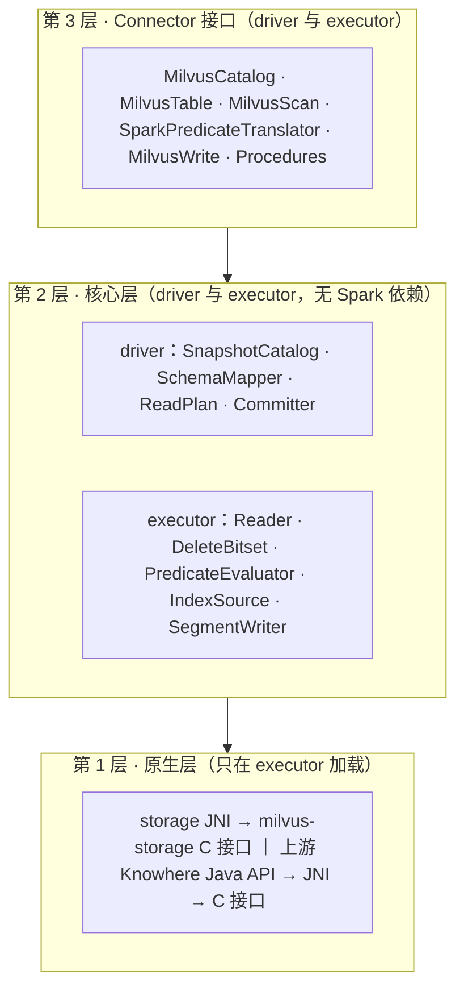
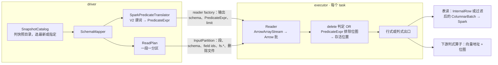

# spark-milvus 2.0 设计（工作稿）

本页保留总体设计、开放问题和决策日志，详细文档按主题分目录。[AGENTS.md](../../AGENTS.md) 说明项目原则与当前状态；进入设计后，按手头的问题选择阅读范围。

| 要解决的问题 | 位置 | 阅读入口 |
|---|---|---|
| 确认功能承诺、优先级和实现位置 | 顶层索引 | [能力规划](capabilities.md) |
| 理解总体结构、确定模块与包的归属 | architecture/ | [架构图解](architecture/overview.html)、[模块与迁移](architecture/modules.md) |
| 开发目录发现、三段表名、表 DDL 与快照时间旅行入口 | architecture/ | [Catalog](architecture/catalog.html) |
| 理解表版本：各种输入怎样描述成同一种表模型，又怎样交给读、搜索和建索引 | architecture/ | [表版本](architecture/table-version.html)（决策 25） |
| 开发向量搜索与建索引 | architecture/ | [向量搜索与建索引](architecture/vector-search.html)（单查询索引搜索已实现；查询集、exact 模式、建索引待实现） |
| 搜索路径怎样按机器和并发选块大小、常驻预算，索引载荷为何不设上限 | architecture/ | [搜索路径的资源自适应](architecture/search-resources.html) `[草稿]`（2026-09-21 实测：并发 × 块 ≤ L3 时 1.5 到 2.1 亿对/秒，越过掉到 1/5；2 GiB 常驻预算在 local[64] 下装不下一段；1 GiB 索引上限挡掉 Milvus 默认段的每一个 HNSW。提案：块与预算由机器算出，上限去掉改为元数据校验，内存归 executor） |
| 精确搜索为什么每核慢十倍、6.2 GB 的段为什么建不了索引，两条链路在代码里怎么走 | architecture/ | [精确搜索与大段建索引的代码级原理](architecture/exact-search-and-index-build-internals.html)（2026-09-23：按条拆任务与 faiss 的逐行路径、批量入口与单线程规则、建索引链路上的两处 int 与地址入口、内存的账、Cardinal 构建下 HNSW 的读回；数字来自 UAT 实测） |
| core 怎么访问对象存储、凭证怎么下发 | architecture/ | [存储访问层](architecture/storage-access.html)（未完待续） |
| 改动对象存储凭证、provider 链、按桶配置 | architecture/ | [对象存储认证](architecture/storage-auth.html) |
| backfill 怎么访问多个桶 | apps/ | [backfill 的多桶存储访问](apps/backfill-storage.html) |
| 了解原生依赖库、编译工具版本和取得原生包的方案 | engineering/ | [依赖库、编译前置条件与构建方案](engineering/build.html)，同内容 Markdown 版 [build.md](engineering/build.md)（原生库的三层：JNI 入口、两个引擎、共用依赖；Linux 与 macOS 的工具版本表；Docker 与本机两种构建方案，平台为 Linux/macOS × x86_64/aarch64，今天 linux-x86_64 与 darwin-aarch64 有 profile；native-build/、工作目录与 JAR 内部的目录设计）。构建阶段、打包与发布的执行细节在 [native-build/README.md](../../native-build/README.md) 与 [contributing.md](../contributing.md) |
| 一条命令配齐编译、打包、测试环境 | engineering/ | [开发容器](engineering/devcontainer.html)（2026-09-20 已实现：Dockerfile 拆出 toolchain 阶段供 Jenkins 与开发容器共用，本地构建不发布；缓存用命名卷，产物留在源码目录；Milvus standalone 与 MinIO 共享容器网络供 integration40；对照 Milvus 的 compose builder 取舍） |
| 实现 Knowhere 的 C ABI 与 Java JNI 绑定 | architecture/ | [Knowhere JNI 实现方案](architecture/knowhere-jni.html)：绑定接口、内存所有权、与核心和 Connector 的能力对照、线程模型；Cardinal Aquila 11 项暂缓 |

标记：`[草稿]` 未讨论，`[讨论中]` 有分歧，`[已定]` 结论已进第 6 节决策日志。

## 0 结论 `[草稿]`

spark-milvus 2.0 在 Spark 上读写 Milvus 数据、直接读开放格式，并在这些数据上做计算。Milvus 数据这一部分是读写 Milvus Storage 的 Spark Connector：一个 collection 在 Spark 里是一张表，读直接读对象存储上的快照，不经 Milvus 服务；写按 Milvus Storage 格式直接落对象存储，再由 Milvus 登记：已有段的新 Manifest 版本走 Milvus 现有的 BatchUpdateManifest 接口，新段的登记要 Milvus 新增接口（2.4）。代码分三层：Connector 接口层只做翻译，核心层做全部计算且不依赖 Spark，原生层封装 milvus-storage 和 knowhere 两个 C++ 库。1.x 在 tag v1.6.0 冻结，2.0 在分支 refactor/v2 上重写。

直接读开放格式（Parquet、Lance、Iceberg、Hudi，按各自格式的规则解释）和在任意输入上做的计算（K-means 这类）2026-09-17 纳入范围，两部分都还没有设计。一个任务由输入、计算、输出组合而成，每份输入和输出各自绑定位置、身份和格式，规则见 [AGENTS.md](../../AGENTS.md) 的组合原则。

名词：
1. Milvus Storage：Milvus 的表格式，当前版本 V3，上游代码里也叫 Loon。milvus-storage 是读写它的 C++ 库。
2. knowhere：Milvus 的向量索引库，负责建索引和检索。
3. 段：存储和加载的单位，sealed 段只读，落在对象存储。列组：段的列分成的几个 Parquet 文件。Storage V2 是 2.0 之前的段布局，多列合在一个 Parquet 文件里、没有 Manifest；Storage V3 每段带 Manifest。
4. 快照：etcd 里的段元数据落到对象存储的 JSON 加 Avro，由 Milvus 生成。
5. backfill：给已有 collection 的段补写新列组的作业，1.x 里是仓库自带的独立应用。
6. 下游列式算子：在同一个 Spark 作业里直接消费 Arrow 列批的向量算子（聚类、去重、相似度 join 一类）。这类计算 2026-09-17 纳入本项目范围，按组合原则接入，入口和实现待设计。Connector 交给它们的是列批加 knowhere 封装，向量和位图以地址交出。

## 1 1.x 的问题 `[草稿]`

1.x 的七条路径（gRPC 取段元数据和建快照、gRPC Insert 写、Storage V2 读、Storage V3 读、离线快照、backfill、backup）各自带一套入口、配置、凭证和类型处理，没有一层封装 Milvus Storage 的读写。

| 问题 | 事实 |
|---|---|
| 没有分层 | 41 个源文件里 33 个 import org.apache.spark，快照解析、删除日志解码、Manifest 读取、类型映射、路径解析都在 Spark 类里。后果是这些代码要跟着每条 Spark 线各编一次，而且测它们得先拉起 SparkSession |
| 一个文件承担三层 | MilvusDataSource.scala 2879 行：TableProvider、Table、ScanBuilder、Scan，四套读路径规划（live 快路径、legacy、离线快照、backup），Hadoop 配置，桶判定，快照的建和删 |
| 读入口是 option 开关 | `milvus.uri`、`milvus.snapshot.mode`、`milvus.backup.dir` 的有无决定走哪条规划；离线模式要用户把段列表 JSON 塞进 option；没有快照对象 |
| reader 是行式的 | 6 次拷贝，必要的只有 2 次：一个 FloatVector 值从对象存储到 Spark 算子。逐行把 Arrow 装箱成 InternalRow；谓词在 reader 里逐行求值；删除记录以 Map 序列化进每个分区 |
| 原生层是上游的 Java 绑定 | unmanaged jar 引入；Arrow 钉 17.0.0 而 Spark 4 用 18；批大小和线程池不受控 |
| 类型映射四份 | DataTypeUtil 的 Milvus 到 Arrow、Milvus 到 Spark，MilvusSnapshotReader 的快照类型码到 Spark，SchemaUtil 写路径的 Spark 到 Arrow |
| 写路径两套 | `format("milvus")` 到 gRPC Insert：job 级 commit 和 abort 为空，task 级 abort 反而把缓冲刷进 Milvus；按格式写列组的 Loon 写入器只有 backfill 调得到。写完没有提交协议，也没有登记 |
| backfill 是塞在库里的应用 | 近 4900 行，含 24 个 CLI flag、29 个配置参数、自己的凭证链、和云上约定的结果 JSON；靠私有 option 穿透 DataSource 内部 |
| 向量搜索三套 | DataFrame 级暴力搜索、6 个 SQL 距离函数、reader 内嵌的 `vector.search.*`；没有 planner 规则或策略，都不用索引；vector_knn 恒返回 null |
| Milvus 服务调用没有边界 | 读（建删快照、取段元数据）和写（DescribeCollection 加 Insert）两处直接调；backfill 的 client 模式和 import 写入器是无入口的死代码 |
| 配置和凭证各自为政 | 配置键 89 个（MilvusOption 70、Properties 21），`fs.*` 有 camelCase 18 个和 snake_case 21 个两族不互译；凭证三种路径（driver 侧 Hadoop s3a、executor 侧 native 的 fs.*、backfill 自己的 provider chain）；每个分区携带含密钥的完整 option |
| 单模块构建 | 分层没有构建约束 |

## 2 目标设计 `[草稿]`

### 2.1 分层与模块

1. 第 3 层实现 DataSource V2 要的 Catalog、Table、Scan、Write、Procedure，把 Spark 类型换成核心层类型，不做计算。
2. 三条构建约束：核心层源码不出现 org.apache.spark；C 接口头文件不出现 JNI 类型；原生层只在 executor 加载。
3. sbt 模块和目录见 2.8。依赖只能向下。
4. Milvus 服务只在三处被第 3 层调用：DDL、Delete、Procedure。读路径和写文件不经它；写路径的登记是一个 Procedure，调 2.4 说的登记接口。

### 2.2 核心层对象模型

读的唯一入口是 Snapshot（Milvus 快照；各种输入共用的表模型是由它演进的 TableVersion，见 [表版本](architecture/table-version.html)）：主路径从快照目录选一个快照，只认 Storage V3；1.x 的三条非标准入口作适配器产出同一个 Snapshot 或 SegmentReader（capabilities.md 的 K1 到 K3）。

| 类型 | 含义 | 来源 |
|---|---|---|
| Snapshot | 一次读的固定视图：schema、分区、段列表、索引定义、时间戳 | 快照目录的 JSON 加 Avro |
| Segment | 段 id、分区 id、行数、存储版本、Manifest 路径与版本、删除文件、索引文件 | 快照的段列表 |
| Manifest | 一个段的列组文件、删除文件、统计文件 | milvus-storage 的清单文件 |
| ColumnGroup | 一个列组文件及其字段 id 集合 | Manifest |
| DeleteBitset | 快照时间戳之前生效的删除，按行号置位 | 段目录的 `_delta/` 文件 |
| StoragePath | 桶内相对 key、标准 S3、Milvus 格式（`s3://<endpoint>/<bucket>/<key>`）三种形态到 (bucket, key) 的归一 | `core.path.StoragePath`，对象存储入口共用 |
| SchemaMapper | 字段 id、名字、Milvus 类型、Arrow 类型的唯一映射；Spark 类型的映射在 spark 层 | 快照 schema |
| 谓词表示 | R6 使用按字段 id 和类型绑定的 PredicateExpr；R7 保留按字段名求值的 Expr 与手写 PlanParser | R6 来自 spark.expr 的 SparkPredicateTranslator；R7 用于普通表的 `milvus.filter` 与 `MilvusSearch.filter` |

### 2.3 读路径

读不经 Milvus 服务：driver 从快照定分区和谓词，executor 用列式 reader 出批。快照由 Milvus 生成，2.0 用 CALL 建快照触发；Milvus 做了自动快照后不再需要触发（第 5 节）。

1. 统计剪枝是独立优化，不是 R6 的前提：R6 在已经读出的 Arrow 批上求值。R9 用主键 bloom filter 剪段，R10 用 min/max 剪 row group；R10 仍受第 5 节列出的仓库外缺口限制，目前 milvus-storage 的 Parquet 谓词下推是空实现。
2. 自实现的 ColumnVector 只持地址、length、offset，不搬字节；批用完再释放，处理期间 buffer 不动。
3. executor 对每个 Arrow 批合并删除判定与 `PredicateExpr` 排除位图，得到存活行位置；位图中 1 表示排除。
4. 决策 12 已定：行式出口跳过被排除的位置；列式出口用 `SelectedRowsColumn` 按存活位置映射，不复制整列。按行号取列仍由 R14 单独实现。
5. 拷贝次数：Parquet 解码 1 次，聚成 UnsafeRow 1 次；下游是列式算子时只有前一次。

### 2.4 写路径

写不经 Milvus 服务：executor 直接写段目录到暂存前缀，driver 提交作业清单，登记由 Milvus 的元数据接口完成。Milvus master（2026-09-10）里两种登记的现状不同：已有段的新 Manifest 版本有接口，新段没有。

1. 作业清单放 `staging/{job}/`，内容是本次作业全部段的路径、Manifest 版本和行数。提交前先写记作业 id 的标记文件；abort 或失败删暂存前缀。一个作业 id 只对应一次运行：df.write 每次新 id；backfill 不指定 id 时每次新 id，显式给出一个已提交过的 id 在写任何段之前报错（2026-09-16）。
2. commit 止于作业清单。登记由用户或云上作业发 `CALL milvus.system.register`（第 3 层 Procedure），核心层不调 Milvus。登记后在线可见；Connector 自己再读要先 CALL 建快照。Scala 入口是 `spark.procedure.Register.run`，同一过程也已接到四条 Spark 线共用的 SQL `CALL` 前端。
3. backfill 写模式：给已有段在它现有的 base_path 下追加列组文件，Manifest 出新版本（版本号严格大于当前）；登记走 Milvus 的 gRPC `BatchUpdateManifest`（或管理端口的 `CommitBackfillResult`），二者都只把该段 manifest_path 里的版本号前进，base_path 不变。前提：AddCollectionField 先于登记，否则 QueryNode 重开段时不加载新列；段必须是 Flushed；作业期间 schema 版本不能变。
4. append 写模式：写新段目录。Milvus 今天没有登记外部新段的接口；DataCoord 内部已有 `CommitSegmentManifest` 的 NewSegment 原语，缺的是 RPC、id 分配和 WAL 广播，见第 5 节。
5. 暂存位置要避开 GC：DataCoord 把 `insert_log/{coll}/{part}/{seg}` 下未登记的 V3 段目录在 `dataCoord.gc.missingTolerance`（默认 86400 秒）后回收；暂存前缀放在 `insert_log` 之外，登记时按最终路径写或移动。
6. 建索引是写之后的独立一步：`CALL milvus.system.build_index(...)` 另起 Spark 作业，每段一个任务回读向量列、用 knowhere 建索引、按 Milvus 的索引文件格式写出（2.5 第 6 条），索引记录进作业清单。交给 Milvus 有两条路：连接器把段和索引写成快照，由 Milvus 的外部快照恢复成新 collection（W8）；或登记进段的 Manifest，等 Milvus 认 Manifest 里的索引（第 5 节）。写段任务本身不建索引（决策日志 2026-09-17）。Global Index 的中心点到桶的映射同样写进 Milvus Storage。
7. append 不用 RequiresDistributionAndOrdering；backfill 写模式的按段分布和按行号排序见决策 10。
8. 入口、写的表从哪拿 schema、WriteBuilder 校验什么、选项去留，见 [write.html](architecture/write.html)。truncate 和 overwrite 不做（能力表第 10 节）。

### 2.5 原生层

1. storage 的 JNI、Java/Scala API 与加载器由 milvus-storage 子模块提供，`native-storage` 只编译和打包上游绑定，具体合同见 [storage-io 第六节](architecture/storage-io.html#upstream-jni)；Knowhere 的 C 接口、JNI、Java API 与加载器由 PR #1829 分支的根目录子模块提供，`native-vector` 接入并核验 C ABI，精确 revision 由 superproject gitlink 固定。固定来源和库加载契约见[向量搜索第 2.8 节](architecture/vector-search.html#library-loading)。内存 HNSW 的持久化加载与搜索已接入代码；旧 gitlink 组合的 Cardinal version 10 HNSW/COSINE 样本曾通过查询验收，当前 storage 与 Knowhere gitlink 更新后须重建复验。旧 Knowhere DiskANN 断言只作为 `9dc2b8ad` 的历史，当前分支已有新的测试合同。DiskANN 所需本地文件管理仍不在当前实现中。
2. 约定：只传地址和长度，Arrow 走 C Data Interface，配置用 JSON；谁分配谁释放，句柄配 destroy，Arrow 靠 release 回调，JVM 用 Cleaner 兜底；错误是返回码加消息。
3. JNI 不用 Panama（JDK 22 才正式的外部函数接口），因为 Spark 4 最低 Java 17。
4. 交给 native 的路径一律是桶内相对 key，桶来自 fs.bucket_name。
5. 索引加载：固定快照携带 `SegmentIndex` 描述，`SegmentIndexHandle` 校验覆盖与索引选择。`IndexFileCodec` 将 Milvus binlog/Parquet 封装（含 SLICE_META）或 Cardinal 原始 CARD 流恢复为 BinarySet，再按 payload 标识选引擎。对象只由 ObjectStore 读取，任务独占索引并关闭，无跨任务缓存。构建特性和实际格式都需验证，详见[向量查询实现](architecture/vector-search.html#native)。
6. 索引写出：knowhere 一次接收整段向量构建，serialize 出 BinarySet，core.codec 按目标 Milvus 格式的切片策略、事件和 payload 编码写出，发生切片时记录 SLICE_META；16 MiB 是可配置默认值，不是格式常量。索引版本和构建引擎需与加载端兼容，云上要用含 Cardinal 的构建。交付方式见 2.4 第 6 条，设计见[向量搜索第 2.7 节](architecture/vector-search.html#build)。
7. 当前只加载快照钉住的持久化索引；权威无索引可按显式选项执行原生暴力回退。精确搜索与索引搜索共用一个段内执行器，Knowhere 一次调用算整组查询（[向量搜索第一节](architecture/vector-search.html#overall)）。

### 2.6 接口层

| 槽位 | 2.0 |
|---|---|
| Catalog | database 是单层 namespace、collection 是 table；`SHOW NAMESPACES` 与 `SHOW TABLES` 走目录 RPC；三段名 `milvus.db.coll`；loadTable 的 version 和 timestamp 对应快照名和时间点；createTable、dropTable 走 gRPC |
| Table | schema 来自快照；元数据列 segment id、row offset、timestamp（名字见决策 5）；行数字节数来自快照；不实现 DeleteV2（能力表第 10 节） |
| ScanBuilder | 列裁剪、DataSource V2 谓词、Limit、RuntimeV2Filtering；不实现 V1 Filter |
| 旁路 | `CALL milvus.system.<name>(...)`，四条线同一个 SQL 语法扩展（[procedure.html](architecture/procedure.html)）；清单见 capabilities.md 第 4 节 |

### 2.7 产物与版本

1. 版本 `2.0.0-{branch}-{arch}-SNAPSHOT`，正式版 2.0.0。分支和架构后缀保留到 native jar 改成多平台单 jar 为止。
2. 每条维护中的 Spark 线各出一个 Connector jar 和一个 bundle（2.8）；native jar 跟 Milvus 小版本发布，与 Spark 版本无关。
3. 1.x 已有 linux-x86_64 和 linux-aarch64 的构建链和 `native/linux-{arch}/` 布局（未经 CI 验证）。2.0 新增：native jar 与 Connector jar 分离、macOS 开发用产物、GPU classifier。

### 2.8 目录与模块 `[讨论中]`

不分仓：场景代码、调试工具和遗留路径都留在本仓库，用 sbt 模块隔离，依赖规则保证核心层不被它们污染。与总设计冲突、暂时不好判断的非标准功能一律按这条处理：保留，隔离，不进核心层。模块、包、目录和 1.x 到 2.0 的迁移对照见 [modules.md](architecture/modules.md)；功能清单见 [capabilities.md](capabilities.md)。

## 3 重点与顺序 `[草稿]`

不做的功能见 capabilities.md 第 10 节。判据：先做让下游列式算子能接上的部分。读路径是一切的基础，写路径的 append 等 Milvus 侧的登记接口，搜索层依赖列式读。顺序只有依赖，没有日期。

| 级别 | 顺序 | 内容 | 理由 |
|---|---|---|---|
| P0 | 1 | sbt 拆 core、native、spark4，依赖规则进构建 | 不拆，后面每一项都在旧结构上打补丁 |
| P0 | 2 | 核心层对象模型与 SnapshotCatalog；SchemaMapper 合并四份映射；StoragePath | 读的唯一入口 |
| P0 | 3 | storage JNI、列式 reader、ColumnVector、DeleteBitset | 拷贝 6 次到 2 次；下游算子能拿到地址 |
| P0 | 3a | 读 external collection（R20） | 读路径的一部分：Milvus 3.0 起外表和普通 collection 一样是表，读不了外表就读不全一个实例；依赖列式读 |
| P1 | 4 | Catalog 目录、三段名与表 DDL，元数据列、统计、DataSource V2 谓词、Limit | 目录发现、建表删表、三段名和回表 |
| P1 | 5 | SparkPredicateTranslator、PredicateExpr、PredicateEvaluator | R6 对齐 Spark SQL；R7 对齐 Milvus 表达式语义 |
| P1 | 6 | SegmentWriter、Committer、register Procedure | backfill 登记走 BatchUpdateManifest 可先做；append 等第 5 节的 RPC |
| P2 | 7 | 接入上游 Knowhere Java/JNI 产物、索引加载、统一向量搜索入口（V5、V7）、建索引（W6）与快照交付（W8）；backfill 写模式 | 库加载可独立交付；索引执行依赖列式 reader，建索引依赖写路径 |
| P3 | 8 | native jar 打包、四条 Spark 线的子项目和 CI 矩阵、基准（读吞吐、拷贝次数、写端到端）；macOS 和 GPU 产物 | 打包工作，不影响设计 |
| P3 | 9 | 2.0.0 发布，云上作业切换 | |

## 4 待定决策 `[讨论中]`

只列未定的；定了的行删掉，结论进第 6 节。

| 编号 | 决策 | 选项 | 影响 |
|---|---|---|---|
| 10 | backfill 写模式的按段分布和按行号排序 | a. 实现 RequiresDistributionAndOrdering；b. 场景代码自己 shuffle 后再写 | 写路径接口 |
| 19 | 按分区报分区（capabilities R19）是否值得做 | a. 做，join 少一次 shuffle；b. 不做，段内主键无序，收益可能被 Milvus 的段分布抵消 | 需要实测 |
| 23 | R7 的 JSON、Array 与 `json_contains` 以哪一版 Milvus 语义为准 | a. 只实现 Milvus 2.6+ 稳定共同子集；b. 以明确版本为基线并按服务版本分派。还需钉死 JSON null 与缺失路径、异构/嵌套数组、数值转换、类型不匹配和畸形值的结果 | 不阻塞已交付的标量子集；阻塞 R7 的 JSON/Array 扩展 |
| 26 | 各开放格式的 `TableFormat` 用哪种读取实现 | a. milvus-storage 的格式读取器（经 JNI；Milvus 外表已在用；文件系统只有本地与云对象存储，没有 HDFS）；b. 该格式的 Java 库（如 iceberg-core）；c. 该格式的 Spark 数据源，只提供扫描，作为 DataFrame 输入 | 按格式逐个定，判据是该格式要提供的能力（固定版本、按地址取行、索引）和要覆盖的存储后端；[表版本](architecture/table-version.html) 第四节 |

## 5 需要 Milvus 侧提供的 `[草稿]`

| 事项 | 现状（master 13cd0e99f） | 缺口 | 影响的设计点 |
|---|---|---|---|
| 登记外部写入的新段 | 无接口 | 新增 RegisterSegments RPC：复用 DataCoord 的 CommitSegmentManifest NewSegment 原语，含段 id 分配、WAL 广播、行数和统计 | 2.4 append |
| 读段当前的 base_path 和 Manifest 版本 | 无公开 API 暴露 manifest_path，只能从快照 metadata 取 | GetPersistentSegmentInfo 或新 RPC 暴露 manifest_path | 2.4 backfill，否则每次 backfill 前都要先打快照 |
| backfill 期间冻结目标段 | 无 | 段级租约，或把 ack 接到 CommitSegmentManifests 的串行路径，使 backfill 与 compaction、stats、索引、schema 变更互斥 | 2.4 backfill |
| 登记时校验 Manifest 内容 | BatchUpdateManifest 不打开 Manifest 文件，不校验列和行数 | 登记时读 Manifest 校验列组、行数、schema 版本 | 2.4 |
| 列级 min/max 统计，row group 统计剪枝 | milvus-storage 的 Parquet 谓词下推是空实现 | 写统计文件，reader 用统计剪枝 | 2.3 下推两级 |
| Milvus 把索引文件写进段的 Manifest；加载 Connector 写回的索引 | milvus-storage 的 add_index_info 接口已有；已有 V3 实测的索引引用在快照段记录 index_files 中，数据 Manifest 的 indexes 为空 | Manifest 的双向登记与读取仍需核验服务版本；加载现有索引先保留快照段记录，不能把本项当成唯一来源；校验引擎与格式版本 | 2.5 索引加载与 W6 写出，来源细节见[向量查询方案](architecture/vector-search.html#metadata) |
| 索引格式与引擎兼容性 | 现有 core binlog/Parquet codec 复用，Cardinal 通过同一 Knowhere 提交的构建特性启用 | 新格式或加密支持需要对应引擎/格式契约及真实文件验证，不建立另一个文件访问路径 | issue #125，见[接口归属](architecture/vector-search.html#native-boundary) |
| 自动快照加保留策略；快照目录里加 catalog 文件；格式契约文档 | 快照由 CreateSnapshot 手动建 | | 2.3 读入口，决策 11 |
| 按 external_spec 拼外部文件系统属性 | `InjectExternalSpecProperties` 在 Milvus 核心库（`internal/core/src/storage/loon_ffi/util.cpp`），milvus-storage 没有 | milvus-storage 提供同一功能的 C 接口 | R20；连接器在 core.credential 的移植以此为终止条件 |
| `loon_reader_new` 接受空 schema | `cpp/src/ffi/reader_c.cpp` 的参数检查拒绝空 schema，随后 `arrow::ImportSchema`；Milvus 读 V3 段直接调 C++ `Reader::create` 传空 | schema 为空时跳过检查与导入，给 `Reader::create` 传 `nullptr`；JNI 原样透传，不用改 | R20 的空 schema 决定（第 6 节 2026-09-16）；上游合入前外表段打不开 |
| 上游 JNI 切片批只重写偏移和位图 | `reader_jni.cpp` 的逐批读取对带 offset 的列整列 `arrow::Concatenate` | 定长列移动数据缓冲区起点并重建位图，变长列只重写 offsets，数据缓冲区共享 | R20 性能第 1 项；普通 collection 同样受益 |
| 上游 JNI 绑定文件系统读取字节 | C 接口 `loon_filesystem_get_metrics` 自 #630 起已有，`filesystem_jni.cpp` 没有绑定 | Java 绑定可按文件系统取读取字节 | G5；R20 性能第 2 项 |
| 外表分片切点对齐 row group | DataNode 按固定行数切大文件（`SplitFileToFragments`），`loon_exttable_get_file_info` 只返回行数，拿不到 row group 边界；切点所在的 row group 被相邻两段各读一次再切片 | `loon_exttable_get_file_info` 返回 row group 边界，切点落在边界上 | R20 读取性能；先用 G5 读取字节量出浪费比例 |
| Knowhere 的 Java 接口开放 GPU 开关 | 暴力搜索、索引搜索、建索引都在 Knowhere 的进程级线程池里算。钉住的子模块 `knowhere/java/src/main/java/io/knowhere/Knowhere.java` 已提供 `resizeSearchThreadPool`、`searchThreadPoolSize`、`resizeBuildThreadPool`、`buildThreadPoolSize`（2026-09-20 核对，原「接口不开放这些池」的说法已过时）；连接器尚未调用，默认大小定义在 Knowhere 依赖的外部库里，未核对。Java API 没有 GPU 开关 | Java 接口开放 GPU 开关；线程池大小不再是上游缺口，接入归 G4 | V5、V7、W6、G4；Spark 按 executor 核数配置，避免与任务线程争核 |
| milvus-storage 的 Java 绑定开放外表展开接口 | C 接口 `loon_exttable_explore` 与各格式的 `Format::explore` 已有；PR #681 与 main 的 JNI 都没有绑定 | Java 能按格式、位置和版本拿到列组文件条目 | 决策 26 选用 milvus-storage 读开放格式时 |

## 6 决策日志

| 日期 | 决策 | 结论 |
|---|---|---|
| 2026-09-23 | darwin-x86_64 走统一原生构建：profile 补上，macOS 编译器下限定为 Apple clang 17，folly 单独用 macOS 14.5 SDK，`build.py` 不再把 `DYLD_LIBRARY_PATH` 带进构建环境 | 负责人要求在一台 macOS 15.0 的 Intel 机器上编通，上游 Milvus 文档写明支持 Intel Mac，但三个上游项目的 macOS CI 都只跑 Apple silicon。缺的有四处，都补在本次：(1) `CMakeLists.txt` 的平台白名单放开 macOS x86_64；`native-build/profiles/darwin-x86_64` 照 darwin-aarch64 写，`arch=x86_64`、`compiler.version=17`；`platforms.py` 记录编译器目标 CPU 的命令在 x86_64 上用 `-march=native`，clang 在 x86_64 上拒绝 `-mcpu`。(2) Knowhere 自 d48fda72（#1748）起用 `std::atomic_ref`，libc++ 19 才提供，Apple clang 16 编不过，所以 macOS 的编译器下限是 Apple clang 17（Xcode 或 Command Line Tools 16.3 起）。验收机装不了 CLT 16.3 及以后，用 CLT 16.4 安装包解开的工具链，SDK 路径写在那台机器的 Conan `global.conf`，不进仓库。(3) folly 的 CMake 在 x86_64 上给 `crypto/detail/MathOperation_Simple.cpp` 加 `-mno-sse2`，macOS 15 SDK 的 `math.h` 无条件声明 `_Float16` 函数，clang 在 SSE2 关闭时不接受这个类型；上游 main 到 2026-09-21 仍如此。选择：profile 里 `folly/*:os.sdk_version=14.5`，只有 folly 用 Command Line Tools 自带的 14.5 SDK；结束条件是 folly 不再对该文件关闭 SSE2。否决：导出替换 recipe 或给 folly 打补丁（仓库只用上游 recipe 原样），以及整张依赖图都用 14.5 SDK（其余包不需要）。(4) `build.py` 捕获 Conan 环境时带进了 `conanrun.sh` 导出的 `DYLD_LIBRARY_PATH`，与它注释里「只用 fallback 变量，打包的库不得遮住系统库」的约定相反；CMake 配置时启动的 cargo 因此加载 Conan 的 `libiconv.2.dylib`，拉第一个 git 依赖时中止。Cargo 缓存为空的 Mac 都会遇到，之前的 darwin-aarch64 构建因缓存里已有依赖而没暴露。平台适配器加 `library_override_variables`（Mach-O 为 `DYLD_LIBRARY_PATH` 与 `DYLD_FRAMEWORK_PATH`），`build.py` 捕获环境后删掉它们；ELF 的 fallback 变量就是 `LD_LIBRARY_PATH`，行为不变。`scripts/tests/test_make_native.py` 原来断言 linux-aarch64 与 darwin-x86_64 没有 profile，linux-aarch64 加 profile 后已有 2 项失败；改为把 `NATIVE_PROFILE` 指向不存在的路径来测只有 storage 的旧入口，7 项全过。验收：C API 测试 2/2，221 库 203 别名，逐库 Mach-O 诊断无失败，双向 JVM 加载退出 0，两条打包路径的 `verifyNativeBundle` 通过，`make test` 1,251/0/152，记录在 [build.html](engineering/build.html) 状态块 |
| 2026-09-23 | 查询集走广播时也在 executor 上拼字节，driver 只按分区接起来 | driver 原来 `collect` 整个查询集再单线程打包：每行一个 `Row`，向量是装箱的 `Seq[Float]`，25 万条 768 维查询要 1.92 亿次 `Float` 拆箱。这段时间落在 collect 作业结束之后、下一个 stage 提交之前，**没有任何作业时间覆盖它**，事件日志里只表现为一段空隙。P3（1 亿行、74 段、8 个 8 核 executor）上这段空隙实测 10–11 秒（其中广播约 2 秒、重打包约 8 秒）。取：`SearchQueries.packOnExecutors` 让每个分区在读到行的地方把自己那段拼成字节（`InternalRow.getArray` 取原始数组，每 2,048 条 flush 一次），driver 收到字节后按分区号 `arraycopy` 接起来，行 i 仍是查询 `ids(i)`，与 driver 打包逐字节相同。传输量几乎不变（UnsafeRow 约 770 MB 对打包字节 768 MB），省的是 driver 的 CPU 与串行度。舍：让第一阶段任务各自去读查询文件（那样每个任务都要读一遍查询集，且查询集不一定是文件）。实测（上游 `d372cd1` 基线，100 万条 × 4 块交替 A/B）：空隙 10/11/10/8 秒 → 3/3/3 秒，每块墙钟 179.4/180.6/190.6/191.6 秒 → 172.9/173.4/173.2 秒，搜索 stage 与召回不变。 |
| 2026-09-23 | 第一阶段的候选按查询打包成字节，合并改为 RDD shuffle，删除 `TopKAggregator`（在上游 `d372cd1` 上重做） | 实测（[报告](../reports/spark-milvus-candidate-materialization-2026-09-22/README.md)）P2 六段快照 10 万条查询 ef=100 时，搜索 stage 每任务 21.6 s 里约 10 s 与搜索无关：一条 24 字节的候选先在 `IndexProbe.collect` 变成 `Candidate` 对象、经 `groupBy` 与优先队列再排一遍、包成 `Row`（4 个字段各装箱）共约 5 趟遍历、每候选约 15 个对象；`functions.udaf` 包装的 `TopKAggregator` 又被规划成 partial + final 两个 `ObjectHashAggregate`，partial 与搜索同在一个任务里，10 万个 key 必然触发 `sortBased.fallbackThreshold`（默认 128），把该任务的 1000 万行排序后逐行重建堆，再用 `Encoders.javaSerialization` 把每查询的 `TopKMerger` 写成 6.15 KB。取：`TopKMerger.takePacked` 把每查询的前 K 条直接写成 `CandidateBytes`（段 id、行号、分数，24 字节一条，从好到差），并释放该查询的堆；任务输出 `(query_id, Array[Byte])`，每查询一条记录；合并用 `combineByKeyWithClassTag` + `HashPartitioner`，`mapSideCombine = false`（任务对每条查询只交一次，map 端合并只会把整个任务的输出攒到结束），reduce 端走两份有序列表取前 K；`IndexProbe` 先在原生缓冲上校验（复用一个 `Array[Long]` 排序查重，不再为每个 id 装箱进 `HashSet`）、确认不短后再物化，重试时什么都不必丢弃。舍：SQL 聚合与 `explode` 那条路（它多算一遍任务已经算好的 top-K），以及把候选做成 Arrow 列式批（收益相同但要引入一套批的生命周期，字节数组足够）。合并分区数取「任务槽数、第一阶段任务数、查询数 ÷ 4096」三者之大、以查询数为上限，因为 RDD shuffle 没有 AQE 合并分区，多 executor 时也要保证每个 executor 都分到活。`CandidateBytes` 用大端序，混合架构集群里一侧写另一侧读。原实现基于 `eba4061` 之前的 `SegmentSetSearch`；这次按上游的 `keepingQueries` / `runGroups` / `holdOrStream` 结构重写，`candidates` 从 `merger.candidates` 改为按查询 `takePacked`。 |
| 2026-09-23 | 决策 32：exact 的查询范围数不再受查询组数限制，每个范围至少 2,048 条查询 | 决策 28 的 R = min(查询组数, ⌈并发数 ÷ 段组数⌉) 让 exact 的并行度取决于 `group.max.bytes` 这个内存上限：默认 512 MiB 一组装 151,146 条 768 维查询（每条 3,072 字节向量加 top-10 候选 480 字节），1 GiB 查询集只切 3 组。UAT 上 34.95 万条查询对 perf_laion_31m 的 2 个段（约 12 GB，设计文档的 D10 规模），2 个 executor × 8 核：默认参数规划为 2 段组 × 3 范围 = 6 个任务，`group.max.bytes` 256 MiB 时 5 组、10 个任务、1,978.2 秒，64 MiB 时 19 组、16 个任务、1,764.9 秒；跑完的两次 Knowhere 计算量相同（17,122 与 17,343 任务秒）。做法：R = min(⌈并发数 ÷ 段组数⌉, ⌊查询数 ÷ 2,048⌋)，至少为 1；按字节切出的组少于 R 时，查询集按顺序均分成 R 组，每组都小于上限。2,048 来自读与算的平衡：float32 下一个任务读一行 4d 字节按 110 MB/s（决策 31），一条查询算这一行 2d 次浮点按每核 125 GFLOP/s（决策 27），约 2,300 条查询时两者相等，与维度无关；更小的范围等读，多切只多读一遍段组。运行时的量：D10 默认参数任务数 6 → 16；底库读取量乘 R（3 → 8，约 37 → 98 GB），每个任务读一个 6.2 GB 的段约 56 秒，被每任务约 1,080 秒的计算经预读盖住；查询集 shuffle 读取量（段组数 × 查询集字节）、候选数与合并量不变；每个任务保留的查询最多从 151,146 条降到 43,691 条。查询不足 4,096 条的搜索保持每段组一个范围；查询组本来就多于 R 时照旧按字节切、多组合成一个范围。这推翻了决策 28 否决的"把查询组切得比 group.max.bytes 更小"：当时没有数据，现在默认参数下 16 个核空 10 个。改后在同一配置（256 MiB）规划为 2 段组 × 8 范围 = 16 个任务，搜索 1,219.2 秒（原 1,978.2），输出与原运行逐行相同；默认参数也规划为 16 个任务。见 [vector-search.html 2.1](architecture/vector-search.html#execution)。 |
| 2026-09-23 | 索引载荷探测认出 Cardinal 经 BinarySet 交出的流，含 Cardinal 的构建上 `build_index` 建出的 HNSW 能被 index 模式读回 | 含 Cardinal 的 Knowhere 把 `HNSW` 注册给 Cardinal 引擎（faiss 的成为 `HNSW_DEPRECATED`），所以这种构建上 `build_index` 交出的 `HNSW` 载荷是 Cardinal 经 BinarySet 序列化的流：开头是 Cardinal 的头（版本、8 字节索引名 `unknown`、索引类型、数据类型、维度、行数、度量、长度），末尾是向量数据，没有 Milvus `_mem.index.bin` 末尾的 24 字节 CARD footer。`PayloadFormatProbe` 原来只认 faiss 家族魔数与 CARD footer，2026-09-22 UAT 上用含 Cardinal 的包对 perf_laion_31m 建成 16 段后 index 模式读回全部失败（`Persisted HNSW payload starts with …`）。做法：探测把头从 4 字节扩到 32 字节，faiss 魔数与 footer 两条规则都不中时，若声明类型是 HNSW 且偏移 16 处的 8 字节以 `HNSW` 开头（且不是 `HNSW_`），选 Cardinal 引擎 `HNSW`，流本身仍由 Knowhere 校验；不含 Cardinal 的构建报明确的 WITH_CARDINAL 错误；`????` 一类无家族的流照旧拒绝。否决：头不是 faiss 就当 Cardinal（会放过任何垃圾流，与现有「无家族即拒绝」的用例相悖）；在段记录里记引擎名（写侧与快照格式都要动，留作以后）。顺带更正 `loadCardinal` 里「Cardinal 对 FileManager 与 BinarySet 用同一条流」的注释：文件带 footer，BinarySet 流不带。 |
| 2026-09-23 | 决策 31：一块的读取按 8 个区间同时请求，Arrow IO 线程池扩到处理器数 × 8 | 单任务读底库只有 43–51 MB/s（issue 34），因为一块只有一个 GET 在途：milvus-storage 用 Arrow 默认的懒区间缓存（`lazy` = true、`prefetch_limit` = 0），一次读调用的区间按解码顺序逐个请求；区间合并上限默认 32 MiB，一块就是一个区间；原生包按 milvus-storage 默认 `WITH_CRT=OFF` 编译，S3 客户端是基于 libcurl 的 `S3Client`，一个 GET 占一条连接。UAT 上一条连接 32–95 MB/s，总吞吐随连接数增长（24 条 531 MB/s）；32 个行组从内存解码 10–18 毫秒，不是瓶颈。做法：milvus-storage 加读取器属性 `reader.parquet.prebuffer.lazy`（默认 true）与 `MilvusStorageRuntime.setArrowIoThreadPoolCapacity`（Arrow 自己安全增减，只增不减的策略在连接器一侧）（[milvus-storage PR #703](https://github.com/milvus-io/milvus-storage/pull/703)）；`SegmentReaderRegistry` 对每个读任务设 lazy = false、区间 = 块 ÷ 8 且不小于 4 MiB，打开段读取器时把进程级 Arrow IO 池扩到处理器数 × 8。实测：Arrow 层 4 个读取器同时读，总读速 124 → 555 MB/s；UAT 1k 条查询、1 个 4 核 executor，同时段两个作业对照，单任务 51.2 → 109.1 MB/s，搜索 539.2 → 260.5 秒，1 万条 top-10 逐条相同；8 CU（4 个 executor × 4 核）上 1k 条查询 211.6 → 91.6 秒，1 万条查询 321.5 → 306.3 秒（计算为主，读取本来就被预读盖住）。运行时代价：每任务在途字节不变，GET 次数乘 8，IO 线程最多处理器数 × 8，Arrow 有请求排队时才起线程。否决：只调小区间（懒缓存下变成依次发出的请求，单任务 28.5 MB/s）；懒缓存加 `prefetch_limit`（Arrow 在当前区间读完后才发预取，每块第一个区间仍单独读）；改用 CRT 客户端（只覆盖 AWS，一个带 Range 的 GET 先单独取第一片，UAT pod 上单个 32 MiB GET 42–88 MB/s，且换掉全部 S3 操作的实现）；让用户设 `ARROW_IO_THREADS`（Arrow 在进程里第一次用 IO 池时读它，Connector 无法替用户设）。见 [search-resources.html 3.6](architecture/search-resources.html#range-read)。 |
| 2026-09-23 | milvus-storage 子模块暂取自 `Thor-ChenBiao/milvus-storage` 的 `parquet-eager-prebuffer` | 决策 31 需要 milvus-storage 多一个读取器属性和一个 JNI 入口。提交在上游 main `1ff1682` 之上，带 C++ 与 Scala 测试，已提交为 [milvus-io/milvus-storage#703](https://github.com/milvus-io/milvus-storage/pull/703)。gitlink 指向上游没有的提交会让所有人的子模块检出失败，所以 `.gitmodules` 暂指向 fork。这是过渡状态，结束条件：上游合入后，`.gitmodules` 改回 `milvus-io/milvus-storage`，gitlink 改指向合入后的提交。拉取后需 `git submodule sync milvus-storage`。 |
| 2026-09-22 | 打包查询组不再按序号排序，每条查询按序号直接写进组内的位置 | 不设 `spark.task.cpus` 后，打包查询组的 stage 每个 executor 同时跑 4 个任务（按堆声明的每任务 2 核）。UAT 上 8.59 GB 查询集的作业（`chenbiao-qs2c-31m-8g-ef151-0`）在这个 stage 耗尽 4 GiB 的 executor 堆：每个任务先由 `repartitionAndSortWithinPartitions` 把本组的行全部缓冲下来排序（约 191 MB），再拷进 232 MB 的组数组，一组在堆上是两份。排序只为让组内的行按序号排列，而每条查询的序号已经确定它在组内的位置，所以改为 `partitionBy` 按组分区、归约端按序号直接写进组数组：任务只持有这一组的数组和手上的一条查询，也省去排序。 |
| 2026-09-22 | 更正：index 模式一个已加载的索引按快照记录字节的 2 倍计，加载中再加 1 倍 | 本日「第一阶段按真实并发数切段组」一行把已加载的索引按快照记录的 `serialized_size` 计 1 倍、加载时计 2 倍，与实测不符。UAT 上 8.59 GB 查询集的作业（`chenbiao-qs2-31m-8g-ef151-0`）按此规划为每个 executor 一个任务、各留 8 个索引，两个 executor 都在加载第 6 个索引时超过 32 GiB 容器上限被系统终止。实测每个已加载的 Cardinal 索引常驻 1.99 与 2.04 倍：Knowhere 的 C API `knowhere_index_deserialize` 先把整个 BinarySet 拷进 `IndexResource.deserialized_data`，这份拷贝与索引同寿命，再从它反序列化；连接器读入的 BinarySet 在加载结束时释放，所以加载中是 3 倍。现在 `SearchPlan.Footprint.index` 按 2 倍常驻、1 倍加载计，同一作业规划为 4 个任务、每组 4 段（22.9 GB，段额度 26 GiB）；1 GiB 查询集仍是查询留在内存、2 个任务。Milvus 自己加载同一类索引时，`VectorMemIndex::Load` 的 BinarySet 是局部变量，`Deserialize` 返回后即释放，说明索引不引用它；C API 保留的这份拷贝可以去掉，去掉后一个已加载索引回到 1 倍，这组倍数随之改回。见 [search-resources.html 3.3](architecture/search-resources.html#budget)。 |
| 2026-09-22 | 决策 30：exact 每个段提前读下一块，读取与计算重叠 | exact 原来读完一块再算，1 万条查询读 95.2 GB 用 2,153 任务秒（每任务 44 MB/s），1 GiB 查询集作业读取占任务时间 26%。`SegmentVectors` 每段一个读取线程提前读一块，每任务多占一块内存（32 MiB）；读取线程的异常在取下一块时抛出，关闭时先等在途读取。UAT：1 万条查询 442.7 → 321.4 秒，1k 条查询 190.4 秒，executor CPU 不变，结果逐条相同。否决：只把一轮读取拆成多个区间请求（`reader.parquet.prebuffer.range_size_limit` = 4 MiB），1k 条查询实测单任务读速从 44–51 降到 27 MB/s。当时写的理由"S3 客户端是 AWS CRT，单个 GET 已按分片并行"不成立：原生包不带 CRT，变慢是因为 Arrow 的懒缓存把区间变成依次发出的请求，原因与做法见决策 31。一个段读几遍由保留查询还是保留段组的选择决定（下一行），预读在每种读法下都生效。见 [search-resources.html 3.5](architecture/search-resources.html#base-read)。 |
| 2026-09-22 | 第一阶段按真实并发数切段组，按内存选择留查询还是留段组；搜索与建索引的 stage 自己声明每任务的核数 | 起因是 perf_laion_31m（3,100 万行 × 768 维，16 段）的 index 作业：规划器按总核数（2 executor × 8 = 16）切出 16 个一段一个的段组，而作业以 `spark.task.cpus = 8` 提交，同一时刻只有 2 个任务在跑。多切的 14 个段组不带来并行度，却让查询集多读、候选多交：8.59 GB 查询集的作业读了 121 GB 查询字节、交出 4.47 亿条候选，搜索任务里处理候选约 320 s（每个 executor）、合并 253 s；`task.cpus` 又对整个作业生效，打包、合并、写结果这些 stage 也只能每个 executor 一个任务。现在：(1) 并发数 = executor 数 × 每个 executor 同时运行的搜索任务数；index 模式的搜索与建索引 stage 用 Spark 的 `TaskResourceProfile` 声明每任务占 `spark.executor.cores` 个核，每个 executor 同时一个；打包查询组的 stage 按堆声明每任务核数，其余 stage 按默认的每任务一核并行。关闭动态分配时 Spark 让这类任务使用默认 executor（3.5.5 与 4.0.0 的 `ResourceProfileManager.canBeScheduled`），local 模式与开启动态分配时不声明。(2) 每个任务两块额度：堆上的查询额度（Spark 不管理的那部分堆 ÷ 并发任务数）与堆外的段额度（index：(内存上限 − 堆 − 2 GiB) ÷ 并发任务数；exact 沿用 × 0.5）。段的常驻字节 index 模式取快照记录的索引字节。(3) 先试查询留在内存：段组数 = min(段数, 并发数)，每个段只读一遍，新增 `SegmentSearch.runGroups`；放不下再让段组留在内存，段组数 = max(并发数, 装下所有段所需的组数)。(4) `milvus.search.vectors.max.bytes` 改名 `milvus.search.segments.max.bytes`，index 模式下它限的是索引字节。运行时的量（估算）：上述两个作业都从 16 个任务降到 2 个；1 GiB 查询集读取从 15.2 GB 降到 1.9 GB、候选从 5,592 万条降到 699 万条；8.59 GB 查询集读取从 121 GB 降到 15 GB、候选从 4.47 亿降到 5,592 万，作业从 1,674 s 降到约 1,150 s。否决：(1) 任务数取并发数的固定倍数（如 2 倍）换节点快慢的余量：两个 executor 时 2 倍只在一台慢一倍以上才起作用，代价是查询集多读一倍、候选多一倍；(2) 继续要求提交方对整个作业设 `spark.task.cpus`：其余 stage 被一起限成每个 executor 一个任务；(3) 两边都放不下时留查询、让段反复加载：加载一个段约 7.5 s，读一个查询组约 0.15 s，重读查询组便宜；(4) 保留旧选项名或留别名：名字不再说明它限的是什么，2.0 尚未发布。见 [vector-search.html 2.1](architecture/vector-search.html#execution)、[search-resources.html 3.3](architecture/search-resources.html#budget)。 |
| 2026-09-22 | 大查询集按组读取：打包结果写成每组一个分区的 shuffle 输出，任务逐组读 | 查询集超过 `milvus.search.queries.max.bytes` 时，此前打包后按查询范围合成分区，`persist(MEMORY_ONLY)` 存在算出它的 executor 上，每个任务读整个范围。块只在一个 executor 上，其他 executor 的每个任务远程取一次整块：perf_laion_31m（3,100 万行 × 768 维）、1 GiB 查询集（349,525 条）、2 个 executor 时，每个作业多传 8 × 1.08 GB = 8.6 GB，不持块的 executor 每任务多约 1.7 秒（issue 33）。一个查询范围还必须放得进一个 executor 的内存；index 模式只有一个范围，100 GB 的查询集跑不了。现在：打包结果以组号为键再做一次 shuffle，每组一个分区，写在打包它的 executor 本地盘上，各组的打包并行；第一阶段由 `SearchQueryRanges` 这个 RDD 组织，分区是（段组，查询范围），对打包结果是窄依赖，任务按组号顺序逐组读，交出一组时就为下一组创建 shuffle reader，远程读取在这一组的搜索期间进行，第一组的读取与加载段组同时进行。`CartesianRDD`、`coalesce` 与 `persist` 删除。运行时的量：一个任务同一时刻至多持有两组（一组在搜索，一组在读取；在读取的组不超过 `spark.network.maxRemoteBlockSizeFetchToMem`（默认 200 MB）时在内存，更大时写到本地盘），与查询集大小无关；executor 本地盘多一份查询集；搜索阶段读查询集合计「段组数 × 查询集字节」，上面那个作业预计经网络的仍约 8.6 GB，分到两个 executor 上并与搜索重叠；打包从一个任务串行打包 5 组变为 5 个任务并行。否决：(1) 存储副本数等于 executor 数的缓存：每个 executor 只取一次，但每个 executor 都要放得下整个查询集，100 GB 不成立；(2) 查询组写到对象存储的暂存目录：搜索是只读作业，要为它另绑一个可写位置和身份并负责清理，而 shuffle 文件由 Spark 管生命周期，丢失时按血缘重算；(3) `persist(DISK_ONLY)`：组由第一个用到它的搜索任务在任务内打包，没有独立的并行打包阶段，远程块同步读取，不能与搜索重叠；(4) 每个（段组，查询组）一个任务：index 模式每组要重新加载一遍段组的索引。广播路不变。见 [vector-search.html 2.1](architecture/vector-search.html#execution)。 |
| 2026-09-22 | knowhere 子模块改回 PR #1829 分支 | 上一行的结束条件已满足：LawrenceTL92/knowhere-contrib#1 于 09:06 UTC 合并，`codex/knowhere-jni-pr` 快进到 `b9497f4f`，与 gitlink 是同一个提交。`.gitmodules` 改回 `LawrenceTL92/knowhere-contrib` `codex/knowhere-jni-pr`，gitlink 不变，`Thor-ChenBiao/knowhere-contrib` 不再使用。拉取后需 `git submodule sync knowhere`。 |
| 2026-09-22 | knowhere 子模块暂取自 `Thor-ChenBiao/knowhere-contrib` 的 `spark-milvus/knowhere-jni-pr` | issue 25 与决策 27 需要 PR #1829 的绑定层多两个入口（`KnowhereIndex.build` 按原生地址与 64 位长度；C ABI `knowhere_bruteforce_batched` 及其 JNI、Java 封装），两个提交只新增、不改已有函数与核心库，附 C 与 JUnit 测试。PR 分支 `LawrenceTL92/knowhere-contrib` `codex/knowhere-jni-pr` 本仓库账号只有读权限，gitlink 指向那里没有的提交会让所有人的子模块检出失败，所以把这两个提交放在 fork 分支（PR 分支头 29210a33 之上）并提交为 LawrenceTL92/knowhere-contrib#1，`.gitmodules` 暂指向 fork。这是过渡状态，结束条件：PR 分支收下这两个提交后，`.gitmodules` 改回 `LawrenceTL92/knowhere-contrib` `codex/knowhere-jni-pr`，gitlink 改指向其中的对应提交。否决：在本仓库另写一套 JNI（与"Knowhere 的 C 接口、JNI、Java API 由子模块提供"相冲突）。拉取后需 `git submodule sync knowhere`。 |
| 2026-09-22 | 决策 28：exact 的第一阶段任务是（段组，查询范围），段组少于任务槽时切查询 | 决策 27 之后批量距离入口在任务线程上单线程执行，一次搜索的并行度只来自任务数；规划器按段组出任务（组数 = max(默认并行度, 预算所需) 且不超过段数），2 个段的搜索在 16 槽上只有 2 个任务、14 个核空闲，之前靠 Knowhere 按整机起的线程池掩盖。做法：`SearchPlan` 把查询组按顺序切成 R = min(查询组数, ⌈槽数 ÷ 段组数⌉) 个连续范围，任务数 = 段组数 × R；广播路按（段组，范围）并行化，shuffle 路把打包好的查询组按范围合成 R 个分区（连续合并，不再 `coalesce(1)`）再与段组交叉连接，任务号 = 段组号 × R + 范围号。运行时代价：底库读取乘 R，计算量与 shuffle 量不变；1 GiB 查询集对 2 个 6.2 GB 段在 16 槽上 R = 8，每任务读 6.2 GB（约 144 秒）、算约 2,100 秒，墙钟从单任务约 8,500 秒降到约 2,300 秒。index 模式 R = 1（切分等于重复加载 6.7 GB 的段索引）。否决：一个任务内开多线程 OpenBLAS（线程数是进程级一个值，并发任务之间只能靠在途计数维护；实测 4 线程只有单线程的 2.3 倍，N 个单线程任务是 N 倍）；把查询组切得比 `group.max.bytes` 更小（范围越小，重读占比越高，没有数据支持需要）。见 [vector-search.html 2.1](architecture/vector-search.html#execution)。 |
| 2026-09-22 | 决策 27：exact 走 Knowhere 自带 faiss 的批量距离入口，不用 `BruteForce::Search`，不自写内核 | 8 CU 基准上 exact 每核 7–13 GFLOP/s（AVX-512 峰值的 8–13%），1 GiB 查询集对 3100 万行要 24 小时。原因在 Knowhere `BruteForce::Search`（`brute_force.cc:690-702`）按单条查询切任务、以 nx = 1 调 faiss，faiss 的分流（`cppcontrib/knowhere/utils/distances.cpp:760`，阈值 16,384，有位图也走逐行）永远选逐行路径：一行 3 KB 向量只服务一条查询，8375C 上单核每行 125 纳秒里 89 纳秒在从 L3 搬行、24 纳秒在算。同一 `knn_L2sqr`、同一数据整批传走其 `exhaustive_L2sqr_blas`（SGEMM）：单核 8.1e7 对/秒 = 124.7 GFLOP/s，逐行的 9.9–19 倍，结果逐条一致。做法：子模块 C ABI 新增 `knowhere_bruteforce_batched`（float32；L2/IP/COSINE；无位图；调用线程单线程，OpenMP 线程数 1；调用在途期间把进程级的 `distance_compute_blas_threshold` 置为 faiss 上游默认 20、OpenBLAS 线程数置为 1——捆绑的 OpenBLAS 是 pthreads 版，线程数只有进程级一个值，连 `openblas_set_num_threads_local` 也写它——第一个在途调用保存并设置、最后一个结束时恢复，并发任务之间没有竞争，调用之外进程状态不变）与 JNI/Java 的 `bruteForceBatched`，与 `indexBuildAddress` 同为子模块内的附加改动，不改 Knowhere 已有入口的行为；`ExactScan` 对 float32 走它，有排除行的批先把可见行压紧并记映射，其他元素类型仍走 `bruteForce`；base 块改为常量 32 MiB，2026-09-21 的 L3 自适应公式撤销（它针对逐行内核；32 与 128 MiB 实测同速）。否决：调参 Knowhere 现有入口（块、批、线程、位图逐项实测都不改每核速率，结构性）；自写 SGEMM 内核（库里已有同一条路径且符号导出，留作内部符号依赖被否时的替代）；改上游 `BruteForce::Search`（不提上游需求）。代价：内部 C++ 符号不在 C ABI 上，子模块升级要对照；有删除行的批多一次可见行拷贝。数据与分层实测见 [search-resources.html 2.5](architecture/search-resources.html#batched)，契约见 [vector-search.html 2.2](architecture/vector-search.html#native)。 |
| 2026-09-22 | 索引对象并发读取，按 JVM 共用一个字节预算 | perf_laion_31m（31M × 768 维）上 Milvus 建的 16 段 Cardinal 索引共 40.0 GB，按 8 MiB 顺序读只有 47 MB/s（每请求 178 ms），1 GiB 查询集作业里 16 段加载累计 913 s、搜索 208 s；同一对象 32 个区间在途 1.1 GB/s。`core.io.ConcurrentRangeReads` 并发发出区间请求，按列表顺序把字节交回调用线程：原始流按 8 MiB 区间，Milvus 封装按切片对象；写入原生 BinarySet 仍只在任务线程上按偏移进行。同时在途最多 32 个请求；已请求、未消费的字节按 JVM 共用一个预算（最大堆的 1/16，64 到 256 MiB），调用方只在不持有任何区间时为下一个区间阻塞，共用预算的调用方不会互等。否决：整对象读进堆（每段 2.6 GB 的数组）；每任务自带线程池与预算（内存随槽位数成倍增长）；多线程写原生载荷（写是内存拷贝，串行几乎不花时间，也不必依赖 JNI 加载器的线程安全）。见[索引文件解码](architecture/vector-search.html#native-boundary)。 |
| 2026-09-21 | Cardinal 原始索引按载荷上限分块读取 | 百万行 UAT 快照的未切片 `_mem.index.bin` 为 408,806,363 字节，被普通 Milvus 封装对象的 256 MiB 限制拒绝。原始流沿用 BinarySet 的 1 GiB 载荷上限，先验证 footer，再经 ObjectStore 每次读取至多 8 MiB、以 1 MiB 块复制到原生载荷，保留短读失败与资源释放。普通封装对象仍限 256 MiB。否决全局放大对象上限：会增加所有封装对象的 JVM 整文件分配，却没有利用原始流无需解码封装的事实。见[索引文件解码](architecture/vector-search.html#native-boundary)。 |
| 2026-09-20 | Cardinal 版本只由 Knowhere gitlink 决定，`dependencies.json` 不再另写 | Knowhere 在 `cmake/libs/cardinal/v1/CMakeLists.txt` 与 `v2/CMakeLists.txt` 里以 `set(CARDINAL_VERSION <tag>)` 固定两代 Cardinal；Milvus 自身不固定 Cardinal，只经 Knowhere 的 `with_cardinal` 选项带入。本仓库此前在 `dependencies.json` 里另写 tag 与 commit，因为独立 CMake 不执行 Knowhere 的 CMake 文件；两处并存且没有一致性检查，Knowhere 前进时会静默漂移。用户决定以 Knowhere 为唯一来源：`build.py` 从 Knowhere 快照的两个 CMake 文件解析 tag，按 tag 克隆并把解析出的 commit 写进 `provenance/cardinal-source-identity.json` 与 bundle provenance，续跑时核对；`dependencies.json` 删除 `cardinal` 段。改动前后等价：当前 gitlink 的两个 tag 在授权 Cardinal 仓库解析出的提交与原 JSON 记录的 `1b38fec8`、`be4bf251` 相同。 |
| 2026-09-20 | 开发容器以 Dockerfile 的 toolchain 阶段为唯一镜像来源，镜像不发布，产物随源码目录留在宿主机 | 参考 Milvus 的 compose builder，写成 [devcontainer.html](engineering/devcontainer.html)。取：宿主 uid 映射、Conan/ccache 等缓存持久化、依赖服务随 compose 拉起。改：镜像不另写 Dockerfile，而是把根目录 Dockerfile 的工具链部分拆为 `toolchain` 阶段，Jenkins 的 builder 与开发容器 `FROM` 同一阶段，工具链只有一份定义；用 `devcontainer.json` 引用 compose 服务而不是 awk 改写 compose 文件；缓存用按架构命名的 Docker 卷而不是宿主目录，`target/` 不挂卷、随源码 bind mount 留在宿主机（用户决定：产出物要挂回代码目录）；本地服务只有 Milvus standalone 与 MinIO，`network_mode: service:dev` 让测试里写死的 localhost 直接可达。同日实现并在 x86_64 宿主验证：容器内 `sbt test` 与宿主一致；宿主机私有工具链编的包因要求 `GLIBC_2.38` 被容器（glibc 2.35）的加载检查拒绝，说明给 Spark 镜像用的包应在容器或 Docker 里编。不取：发布带日期版本的环境镜像（用户决定：Milvus 交付的是服务镜像，镜像仓库在其发布路径上；Spark-Milvus 交付的是进 Maven 的 JAR，Docker 只是构建环境，每台开发机本地 `docker build --target toolchain`，靠 Docker 层缓存，不新增镜像仓库、凭据与标签簿记）、多 OS Dockerfile 与 GPU 变体。 |
| 2026-09-20 | 原生构建与 sbt 两份工程文档合并为一份 | `engineering/native-libraries.html` 与 `engineering/sbt.html` 合并重写为 [build.html](engineering/build.html)，按用户要求先列依赖库及各自用途，再讲编译前置条件和取得原生包的四种方案，同日再按用户要求删去 Cardinal 内容、把依赖库收到 JNI 与引擎一层、前置条件只留版本表，并只保留这三章；构建、打包、发布、sbt 约定与验收记录三章删除，sbt 约定与各 gitlink 验收记录不再有独立文档，skill 改引用 modules.md 第 4 节与 build.sbt 注释。原因：两份文档各自重复了 bundle 选择、JVM 加载验收和历史验收结果，改一处必须同步另一处；读者要回答"怎样把它编出来并发布"需要在两页间来回。合并时删去已完成的迁移对照表、逐轮验证叙述和三处重复的验收数字，只保留各 gitlink 组合一张状态表；旧自有 recipe 方案的结果标为历史。所有入站链接同一提交内改到新文件；旧文件删除。 |
| 2026-09-18 | 受信 CI 用 BuildKit 构建并发布 Connector | 公共 Dockerfile 的 <code>RUN --mount</code> 是 BuildKit 合同，不再使用无法解析该语法的 Kaniko 构建 Connector。普通验证可使用按信任范围隔离的 BuildKit 缓存；Maven 发布仅允许受信的 <code>refactor/v2</code> 构建，每次用 <code>--no-cache</code> 重新执行发布步骤。凭据只以 <code>maven_credentials</code> secret mount 进入该步骤，不进入构建参数、上下文、镜像层或缓存；非发布构建不挂载 Secret。BuildKit 工作目录使用已验证的节点本地 hostPath，不把 EFS/NFS 当作 snapshotter/content store；节点变化只造成 cache miss。否决 Kaniko（构建语法不兼容）、在 Jenkins 中动态修改 Dockerfile（破坏精确 SHA 合同）、以 EFS 直接承载 BuildKit root（文件系统语义不满足 OCI worker）。 |
| 2026-09-17 | 原生库以实际 JVM 加载为验收条件 | 负责人明确要求先不以逐库审计阻断。统一目录分别在两个全新 JVM 中按 storage-first、Knowhere-first 调用 System.load；两次成功才允许提升候选目录、打包或通过 sbt 验证。三处共用一个检查实现，使用该 JRE 的 libjsig，清空额外库路径和 JVM 注入参数。来源、摘要、架构、别名和文件完整性检查继续生效；逐库 ldd、ELF 和 ctypes 检查结果只作诊断，原失败记录不能改写为通过。JVM 加载与实际 JNI 调用、Spark 查询分别验收，继续运行双向加载后的读写、向量搜索和真实 UAT。否决为满足单库独立加载而临时修改上游 recipe 或二进制。见[原生验收](engineering/build.html)。 |
| 2026-09-17 | Docker 原生构建依赖缓存独立于镜像层 | 实测 Conan 全部完成后，Rust bindgen 因缺少 libclang 失败，BuildKit 释放失败步骤的临时文件，已完成依赖随之丢失。Dockerfile 补齐 libclang-dev；Conan 包、Cargo 下载的源码及 ccache 改用带锁的 BuildKit cache mount，挂载后初始化 Conan 配置，空缓存仍可完整构建。否决只依赖成功镜像层保存缓存：后续失败会重复此前所有依赖构建；也不共享整份 native 工作目录，避免混入不同源码的配置与产物。见[原生构建依赖](engineering/build.html#libraries)。 |
| 2026-09-17 | 集成测试由 Helm 创建单个 Kubernetes Job | 现有 `integration-4.0` 明确使用 Spark `local[*]`，所以 Chart 创建普通 `batch/v1 Job`，不引入 Spark Operator，也不部署 Milvus、对象存储、namespace、Secret 或 RBAC。Milvus token 与对象存储 AK/SK 只引用目标 namespace 中已有的 Kubernetes Secret；测试镜像由 sha256 digest 固定。一次 release 对应一个 runId，Job 不自动重试，CI 在卸载前收集日志和 Events，清理失败也使 CI 失败。当前发布镜像没有测试入口、测试仍写死本地服务，因此 Chart 先确定部署合同，端到端运行以专用测试镜像和环境变量改造完成为前提。见 [集成测试 Helm 设计](engineering/integration-tests.html)。 |
| 2026-09-17 | 固定上游 Conan recipe revision，集成链接关系归独立 CMake | <code>native-build/dependencies.json</code> 固定统一图中每个直接依赖的完整上游 reference 与 recipe revision；<code>dependency_versions.py</code> 读取两个 gitlink 对应的上游 <code>conanfile.py</code>，冲突时要求选择两边上游声明中的较新版本，当前选择包括 fmt 12.1.0、milvus-common b589c5a、lz4 1.10.0。storage、Knowhere、DiskANN 与 Cardinal 所需的直接链接关系由 <code>native-build/cmake/*.cmake</code> 显式声明。仓库不导出、修补或在运行时生成依赖 recipe；Conan lock 固定全部直接与传递 revision。资源 JAR 的 provenance 只保存规范化的源码/package 标识和 lock、graph、构建输入摘要，不保存构建机绝对路径；完整 graph、编译命令和 CMake trace 留在外部 <code>NATIVE_WORK_DIR</code>。该决定取代同日「依赖链接修复改用完整自有 Conan recipe」方案，以及「独立构建复用 Conan」中维护四份自有 recipe 的部分；storage <code>5689301</code>、Knowhere <code>9dc2b8ad</code> 的自有 recipe 验收数字只保留为旧 gitlink、旧构建实现的历史。见[依赖选择](engineering/build.html#libraries)。 |
| 2026-09-17 | Knowhere 采用根目录 Git submodule | 用户要求像 milvus-storage 一样把 Knowhere 挂载到仓库，并暂时使用 PR #1829 的分支。新增 <code>knowhere</code> 子模块，URL 为 <code>LawrenceTL92/knowhere-contrib</code>，<code>.gitmodules</code> 记录 <code>codex/knowhere-jni-pr</code> 供显式远端更新，superproject gitlink 固定当前提交 <code>1fff20db5aa172ce8a9890fef9f9590920ac8f30</code>。sbt 从子模块编译 Java API，独立原生构建从同一 revision 创建隔离快照；不再以 <code>knowhere.properties</code> 的 revision、codeload URL 或归档摘要选择源码。分支继续前进不会改变普通 checkout，只有显式更新 gitlink 才改变构建输入。旧 native JAR 的 provenance 为 Knowhere <code>9dc2b8ad</code>，必须重建并重新执行原生、Connector 和真实数据验收。 |
| 2026-09-17 | milvus-storage 子模块跟随已合入 PR #690 的上游 main | milvus-storage 的默认分支是 <code>main</code>。PR #690 已 squash 合入提交 <code>7eb1357899a98c4875d51a55b135b7f8d79461ff</code>；它与原 PR 提交 <code>2ed8d933</code> 的 patch-id 相同，两份加载器及测试内容一致。根目录子模块与 superproject gitlink 固定到该上游提交，不继续依赖 fork 分支。现有统一 native JAR 的 provenance 仍记录 storage <code>5689301</code>，必须从 <code>7eb13578</code> 重建并重新执行原生、Connector 与真实数据验收，不能沿用旧结果。 |
| 2026-09-17 | 固定 Knowhere checkout 不应用测试补丁 | 删除唯一的 Knowhere DiskANN 测试补丁以及构建驱动中的补丁扫描、应用和 working-tree diff 证据。固定 Knowhere 提交必须保持原样；通用和并发 C API 测试继续直接编译上游源码。Cardinal 的默认量化会使上游 DiskANN 精确距离断言得到约 1.03 而不是 1.0，项目因此维护独立的 <code>knowhere_c_api_diskann_acceptance</code> fixture，在构建参数中明确指定 <code>refine_quant_type=NONE</code>，保留 build、serialize、缺文件失败、deserialize、位图过滤、精确距离与关闭句柄断言。该 fixture 属于本项目的交付输入并进入构建源码摘要，不冒充上游测试结果，也不改变生产搜索默认参数。见[原生构建设计](engineering/build.html)。 |
| 2026-09-17 | 旧 gitlink、旧自有 Conan recipe 实现的验收基线 | storage <code>5689301</code>、Knowhere <code>9dc2b8ad</code> 的 Cardinal 构建以 <code>phase=complete</code>、退出码 0 完成。Folly、gRPC、milvus-common、OpenTelemetry 的旧导出 recipe revision 分别为 <code>f7176a1c2054469eeded4721ebe0a1e2</code>、<code>74cdd5d8cb864e5ff3fa1fe203c261b1</code>、<code>a4e6285bda6453a9eae862df86944e84</code>、<code>44723315499eb4caf5a87164960e46f4</code>；lock SHA-256 为 <code>26f8477d6a2010806e430f8794ddfbdb14eeee0f8d8936603f08419c87616b5f</code>。原生辅助测试 63/63、C API 3/3、164/164 库审计和 5 个立即加载入口通过；统一 JAR 含 164 个库、173 个别名，三种 JVM 加载顺序从同一目录完成。根测试 1,025 项通过、66 项因相应环境或数据缺失取消，失败和中止为 0；最终 assembly 通过。真实 UAT 1/1 通过，十万行的三次 Cardinal HNSW version 10 查询各反序列化和搜索一次，排除 0/80,000/90,000 行，精确召回率为 1，行号和分数与 JNI 直调一致，metric 不匹配被拒绝，没有 Connector 暴力回退。该结果只说明旧 gitlink 与已被取代的自有 recipe 实现，不能覆盖当前组合或当前依赖机制。详见[原生构建验收](engineering/build.html)。 |
| 2026-09-17 | 旧方案：依赖链接修复改用完整自有 Conan recipe（已取代） | 该方案曾让 common、Folly、gRPC 与 OpenTelemetry 使用仓库内可直接导出的完整 recipe，并记录自有 recipe 摘要、导出 revision 和完整 lock；它产生了 storage <code>5689301</code>、Knowhere <code>9dc2b8ad</code> 的历史验收结果。当前仓库不再包含或导出这些 recipe；同日「固定上游 Conan recipe revision，集成链接关系归独立 CMake」决定已经取代该方案。该方案中曾决定保留的 Knowhere DiskANN 测试补丁也由同日“固定 Knowhere checkout 不应用测试补丁”决定取代。 |
| 2026-09-17 | assembly 流式合并原生资源 | 新包的完整 UT 通过后，4 GB 堆的 assembly 在 sbt-assembly 2.1.1 `deduplicate` 读取约 478 MB storage 库时耗尽内存。类路径只有一份原生包，根因是通用策略对单一来源也整文件读取。原生路径使用固定缓冲区：单一来源直接保留输入流，重复来源按 SHA-256 与长度比对，冲突继续失败；不通过提高堆大小代替修复整文件缓冲。验证包含受限堆的大流回归和相同 4 GB 堆的实际 assembly。 |
| 2026-09-17 | 修复独立原生构建的重试、来源校验和加载状态 | 候选库审计和 C API 测试通过后才替换 bundle，失败候选与旧成功产物均保留；支持复用完整 Conan lock，打包严格核对库与 provenance。Knowhere 路径只在受锁保护的初始化期间设置，随后恢复；sbt 共用一次统一包验证。其他平台在未指定统一包时保留原 storage 构建，Linux x86_64 验证不代表其他平台已支持。当前构建证据记录固定上游 recipe reference、完整 lock 和解析 graph，G5 指标保持现有实现。见[原生构建设计](engineering/build.html)。 |
| 2026-09-17 | 独立构建复用 Conan，冲突依赖采用较新版本 | 本项目定义两个引擎和已有 JNI 的目标，集中维护链接、符号导出与安装规则；比较固定上游输入中的版本，统一到 fmt 12.1.0、common b589c5a、lz4 1.10.0，不自动追随远程最新版本。较新版本仍须重新编译和验证，不静默降级。共享解压器及 storage Java 加载扩展保留；拒绝分别解析依赖后按文件名覆盖，也不把统一版本或合并 JAR 当作符号隔离。当前的 recipe 固定与链接归属由同日「固定上游 Conan recipe revision，集成链接关系归独立 CMake」决定取代本行原有的自有 recipe 部分。见[方案原因与收益](engineering/build.html#libraries)。 |
| 2026-09-17 | 独立 CMake 构建先形成方案 | 用户提出直接使用源码、自行编写 CMake 并合入一个 JAR，随后要求先写方案。方案列明目标、生成步骤、公共动态依赖、Java 加载接入、现有修改迁移与验收；方案阶段的统一依赖测试不能证明独立构建通过。当时尚未确定的 Conan 复用与冲突版本选择，已由同日「独立构建复用 Conan，冲突依赖采用较新版本」决定。 |
| 2026-09-17 | 原生依赖统一动态构建，保留 JAR 交付并只解压一次 | 用户选择随 JAR 交付。父级统一 common、Folly、OpenBLAS、gRPC 等版本和 shared 配置；平台资源包保存两个 JNI 与一套依赖。第 1 层增加不依赖 JNI API 的 native-runtime，由 storage SPI 和向量适配器共同取库，两个原生模块不互依；上游 JNI 方法保持原归属。Rust OpenSSL 绑定同图动态库，内部静态 archive 的符号在 JNI 构建中隐藏，避免其 LZ4 等定义参与跨库解析；不隐藏公开 loon 对象。拒绝只搬目录、覆盖同名库或依赖加载顺序。来源、摘要、立即重定位、两加载顺序及真实 UAT 均需验收；旧产物记录不用于新包。旧 gitlink Cardinal 组合曾按已经取代的自有 recipe 实现完成这些验收，开源变体没有在该历史批次重跑，见[统一构建与加载](engineering/build.html)。 |
| 2026-09-16 | G2/G3 资源 option 以类型化任务合同交付 | 正整数、正 Long 与 Boolean 用户值在 `spark.options.OptionParsing` 统一严格解析，大小写不敏感的键保留，显式空白、零、负数、非十进制与溢出都带键和值失败。读取用 `milvus.read.batch.max.rows`（8192）、`milvus.read.batch.max.bytes`（32 MiB，最大 4 GiB）和 `milvus.read.arrow.max.bytes`（默认 `Long.MaxValue`）；driver 组成 `ReadLimits` 放进每个 `SegmentReadTask`，executor 将前两项映射为上游 `reader.record_batch_max_rows` / `reader.record_batch_max_size`，最后一项限制 task 独占的 Arrow child allocator。row、columnar、暴力搜索和索引回表共用该 child；最终基础 PartitionReader 负责幂等关闭，构造失败由 factory 关闭，`SegmentReader` 不关闭调用方 allocator，全局 root 不随 task 关闭。写入用 `milvus.write.file.rolling.bytes`（默认 2 GiB）统一映射 V2/V3 writer 的 `writer.file_rolling.size`，不传给 ObjectStore。拒绝把这些值留在 raw `fs.*` bag（会绕过校验并在每个 executor 重复失败），也拒绝用 batch bytes 充当预取或 native 内存限额；上游目前没有后两者的 per-reader API。设计见 [spark-interface.html](architecture/spark-interface.html)、[read.html 5.4](architecture/read.html#resource-limits) 与 [write.html 第四节](architecture/write.html#exec)。 |
| 2026-09-16 | Catalog C2 的建表属性与非事务语义 | 本决定取代同日「只读目录合同」中拒绝 table create/drop 的部分，目录和 namespace 合同不变。`CREATE TABLE` 以 Spark schema 为字段清单：Boolean、Byte、Short、Int、Long、Float、Double 可直接映射，String、Array、Binary、Map 必须用 `milvus.field.<field>.data_type` 消除歧义；`milvus.primary.key` 必须指向非空 Int64 或 VarChar 字段，VarChar、Array、稠密向量分别要求 `max_length`、`max_capacity`、`dim`，每个向量字段还必须提供 `milvus.index.<field>` JSON。标量 Array 支持 Boolean、Short、Int、Long、Float、Double、String 元素；`Array<Byte>` 因现有读链把 Milvus Int8 Array 呈现为 `Array<Short>` 而拒绝，避免快照出现后 schema 改型。Spark SQL 无法可靠表达元素级 NOT NULL，故 Catalog 接受 Array/Map 默认的元素 nullable schema 标记，但这不承诺后续写入支持 null 元素；字段 nullable 仍保留并约束主键。所有 schema、属性、列特性和分区变换先在 driver 完整校验，再预检 database 存在且 collection 不存在，随后创建 collection 并逐个创建索引；这些远端阶段没有事务，索引失败时已经创建的 collection 保留并把原错误报给用户。成功建表返回的不是可读 Table，因为 Catalog 不能伪造在线侧负责产生的快照；读仍从已有快照开始。`DROP TABLE` 预检 database 与 collection，任一确认不存在返回 `false`，否则才调用删除；检查和变更之间仍有条件 DDL 竞态。CTAS 当前不能完成：collection 创建后没有可供 Spark 写入的 Connector 快照，失败可能留下需要显式删除的空 collection；即使以后接通，collection 创建、Spark 写段和段登记也没有共同事务。拒绝把字段规则塞进另一个 JSON：按字段命名的表属性能在发 RPC 前精确定位错误，也避免再造一套 schema。namespace 变更以及 table alter/rename 继续不支持。详见 [catalog.html](architecture/catalog.html)。 |
| 2026-09-16 | 决策 20：Spark 谓词下推只实现 DataSource V2 | `MilvusScanBuilder` 改为只实现 `SupportsPushDownV2Filters`，不同时保留 V1 `SupportsPushDownFilters`：Spark 的下推规则会优先选择 V1，两者并存会使 V2 实现不可达。Spark 3.5、4.0、4.1 的 V2 主接口相同，4.2 只新增有默认实现的迭代下推开关，因此 `spark-base` 共用一份实现。V2 `Predicate` 能表达 R6 承诺的比较、IN、空值判断、字符串前后缀与 AND/OR/NOT；每个顶层谓词完整翻译才接受，任一后代不支持就整棵作为 residual 交还 Spark。普通扫描翻成按字段 id 和类型绑定的 `PredicateExpr`，由 `PredicateEvaluator` 在 Arrow 列批上求值；带 `vector.search.*` 的读取不接受 Spark 谓词，整棵留给 Spark 在 TopK 后求值。R7 已有的 `MilvusSearch.filter` / `vector.search.filter` 继续由手写 `PlanParser` 产生 `Expr`，并由既有 `Evaluator` 在索引搜索前执行，不随本决定重写；表读取的 `milvus.filter` option 仍不在本次范围。设计见 [expressions.html](architecture/expressions.html)。 |
| 2026-09-16 | Catalog 的只读目录合同 | C1 与 R1 保持两条路径：`ListDatabases` 把 Milvus database 原样映射成唯一一层 Spark namespace，`ShowCollections(database)` 把该库的全部 collection 映射成 table；目录不读快照或对象存储，collection 没有可读快照时仍可列出。根目录列 database，已存在的 database 没有子 namespace；`SHOW TABLES` 必须显式给一段 database，不设隐式 default，也不跨库摊平。Catalog 不缓存目录，顺序不作合同；成功的空响应是空结果，只有确认不存在才转 `NoSuchNamespaceException` / `false`，认证、网络、限流等故障保留。本行原先拒绝所有 table mutation；create/drop 部分现由同日 C2 决定取代，namespace mutation 与 table alter/rename 仍拒绝。主体与四条线共用，设计见 [catalog.html](architecture/catalog.html)。 |
| 2026-09-16 | Storage JNI 统一使用上游绑定 | 用户要求移除 Connector 自有 JNI。缺失的 filesystem、批统计、take 结果所有权、manifest 释放和写出列组接口补到 milvus-storage，已创建上游 [PR #681](https://github.com/milvus-io/milvus-storage/pull/681)，Connector 固定公开提交 `514bb49`；core 直接调用上游对象，不保留 StorageNative 转发类。`native-storage` 按 Scala 2.12/2.13 从子模块源码编译绑定，Arrow 仍跟随 Spark 线；只打包上游 libmilvus-storage-jni。原生资源继续使用已验收 v4 组合，源码 pin 不等于原生产物已重建；设计及分版本验收见 [storage-io 第六、七节](architecture/storage-io.html#upstream-jni)。 |
| 2026-09-16 | issue #135 的只读 Catalog 边界 | R1 的已知三段名加载与 C1 的目录枚举解耦：`loadTable` 只用现有 `getCollectionInfo` 取得 collection id，不新增 ListDatabases/ShowCollections。三个 loadTable 重载共享 [catalog.html](architecture/catalog.html) 的一条路径，分别选最新、快照名和时间点；Spark Unix 微秒在 catalog 边界转换成该物理毫秒的最大 Milvus HybridTS，core 继续保存和比较原始 `create_ts`。该项只交付 R1，SupportsNamespaces、列表与 DDL 均不在该项范围；C1 后续按上一行的独立目录合同接入。主体在 spark-base，按线只保留公开类和 createTable 签名适配。 |
| 2026-09-16 | 暴力搜索核心保留原生分数，旧入口独立转换 L2 | core.index.BruteForceSearch 保留 Knowhere 的 Float32 平方 L2；Spark 旧逐段入口仅在输出时取平方根，索引模式的显式无索引回退原样输出平方分数。拒绝先开方再平方，因为原始 2.0 会变成 2.0000000000000004，破坏混合索引/无索引段的同分排序。验收覆盖 L2=2 和混合段全局决胜规则；见 [分数契约](architecture/vector-search.html#semantics)。 |
| 2026-09-16 | 合并 G5 后索引查询汇总内部 reader 指标 | 上游读取指标从普通 SegmentReader 获取，而本地索引查询在过滤和回表时独立打开 reader；只保留默认值会把实际 JNI、批数和拷贝报告为零。内部 reader 关闭时把最终 ReadMetrics 传回分区 reader，累计量求和、allocator 高水位取最大值，显式无索引回退复用同一规则。见 [storage-io 第 5.4 节](architecture/storage-io.html#metrics)。 |
| 2026-09-16 | 代码通过 import 引用类型与对象 | 用户要求调用处使用简名，完整包名统一放在 import；Scala 同名冲突使用有含义的导入别名。规则写入 [开发规范](../contributing.md#imports)，AGENTS.md 作为入口，现有两处 PlanParser 调用随本次修正。 |
| 2026-09-16 | 原生兼容验收同时要求完整重定位和实际运行 | 旧 Arrow 的 9 个 AWS CRT 引用未导出，Knowhere Folly 的 4 个 libaio 引用未声明依赖；此前延迟绑定下的功能测试没有暴露全部错误。重新构建固定版本 storage 并修正依赖链接，打包前检查原始与合并目录的两个入口库，拒绝未解析符号。兼容记录增加全部 storage 原生资源清单摘要；登记前独立 RTLD_NOW 加载、两种 JVM 加载顺序和真实实例测试均须通过，不靠额外预加载绕过。见 [sbt 验收规则](engineering/build.html)。 |
| 2026-09-16 | 读取构建分支名的 Git 子进程清空预加载环境 | 带 JRE libjsig 预加载的 sbt 启动 Git 时，Git 会把信号 API 弃用警告写入标准输出，原先整段输出被当作分支名拼入版本号和 assembly 文件名。仅在该 Git 子进程中清空 LD_PRELOAD，保留 sbt 与测试 JVM 的预加载；不通过过滤警告或强制 GIT_BRANCH 掩盖问题。版本格式、显式分支覆盖和模块依赖保持原契约，见 [sbt 交付职责](engineering/build.html)。 |
| 2026-09-16 | Cardinal 依赖共存与真实 HNSW 验收按精确产物记录，上游失败独立保留 | storage 与 Cardinal 平台产物按 SHA-256 匹配共同依赖记录，两种加载顺序均经文件读写和实际搜索验证；真实 UAT 十万行 HNSW/COSINE 在 Spark 与原始 JNI 对照及三种过滤下通过。上游 DiskANN v1 的 C/Java 精确距离断言仍失败，诊断产物保留 build.validated=false，不修改断言或排除测试取得绿色状态。该专项结果不推广到其他索引类型、CPU 或分发许可，细节见 [向量查询第 6.4 节](architecture/vector-search.html#interop)。 |
| 2026-09-16 | 保留量化索引分数，分别验证调用结果和搜索质量 | 真实 CARD metadata 为 RBQ3 搜索 / RBQ8 重排，Cardinal v3.0.8 的最高精度数据集仍是 RBQ8，HasRawData=false；FloatVector 字段不代表索引保留原始 Float32，量化容差参数也不是分数误差界。Connector 保留 Knowhere 分数，不扫描原始向量重算。真实验收用同一文件的上游 Java/JNI 直接调用核对命中行号和分数，再用真实 Float32 独立全量参考报告 ID/边界召回率及分数误差；不把任意固定分数误差或召回阈值当作该索引已有保证。详见 [分数契约](architecture/vector-search.html#semantics)。 |
| 2026-09-16 | issue #125 持久化索引执行契约 | 用户要求完成使用索引的开发。MilvusSearch.search 复用现有 DataSource V2 的 Snapshot/ReadPlan/reader，添加全局排序及 limit；core.index 负责加载和搜索、SegmentReader.take 回取命中行，L2 score 返回平方距离。非 nullable FloatVector/HNSW 为首个范围，bitmap 在搜索前排除删除和显式过滤，未知/损坏/不兼容均失败，仅权威无索引允许显式回退。格式归属更正：固定存储库无 index decoder，而 DeltaLogReader 已有同一 binlog/Parquet 解析；提取共同 core.codec.BinlogCodec 给删除和索引使用，文件仍只经 ObjectStore。任务独占索引并关闭，缓存单独落地。R7 字符串过滤可使用共同 core.expr，不依赖 R6 的 Spark V2 谓词翻译接口，因此决策 20 只阻塞 R6。 |
| 2026-09-16 | 真实云端 HNSW 采用 Cardinal 原始索引流 | 从目标 UAT 的快照路径经 NativeObjectStore 读到真实 `_mem.index.bin`，其末尾为 Cardinal CARD footer，不能交给只有开源 Faiss HNSW 的 Knowhere。固定 PR 的 WITH_CARDINAL 构建使用其钉住的 Cardinal v2.5.112/v3.0.8，不新增 connector JNI。Cardinal `Serialize` 对 FileManager 和 BinarySet 使用相同的 `Index::Save` 流；严格验证 footer 后将完整字节传给 BinarySet[HNSW]，是对应引擎已有接口的恢复方式。运行时从校验过的平台产物 provenance 获取 `with_cardinal`，缺少能力提前拒绝；Faiss IHNf/IHN9 与 CARD 按 payload 标识选择引擎，含 Cardinal 时 Faiss 使用上游 HNSW_DEPRECATED factory 名，BinarySet key 仍为 HNSW。Milvus event/Parquet 与 CARD 两种格式都归 core.index，存储访问继续统一 ObjectStore；真实实例索引与真实数据独立全量参考是验收条件，不能用新建的本地索引替代。详见 [vector-search.html](architecture/vector-search.html#native-boundary)。 |
| 2026-09-16 | 现有逐段向量查询改用 Knowhere BruteForce | 用户明确要求替换当前实现。保留 vector.search.* 和段内 TopK 语义；spark.read 适配行与向量，core.index 管理缓冲、排除位图和 TopK，native-vector 委托上游 Knowhere.bruteForce。不建立临时 FLAT，不保留 JVM 距离计算兜底；原生 L2 取平方根以保留已有欧氏距离返回值。null 与删除在搜索前排除，维度错误和非有限值报错。持久化索引文件与集合级 TopK 尚未接入。机制见[原生暴力搜索](architecture/vector-search.html#exact)。 |
| 2026-09-16 | Knowhere 库加载采用 PR #1829 的上游 Java/JNI 产物 | 用户指定 `LawrenceTL92/knowhere-contrib` 的 `codex/knowhere-jni-pr` 分支，当时构建固定提交 `9dc2b8ad537502d408bc33af05727453295d6622`。C 接口、JNI、Java API 与执行 <code>System.load</code> 的加载操作都由上游维护；Connector 的 `NativeVectorLibrary` 调用 `io.knowhere.Knowhere.cAbiVersion()` 触发加载，校验 C ABI=1 并提供版本信息，失败直接传播。替换本仓库自行实现 `mv_*` shim/JNI 的计划，避免重复维护绑定；更正 modules.md 原先「Knowhere 没有 C 接口和 Python 绑定」的说法。Java API 基线为 11，不引入 Arrow/Spark，JRE `libjsig` 在 JVM 启动前预加载。本行当时还由上游产物单独选择平台、校验和临时解压；2026-09-17 的统一平台包已经取代这部分交付，由 native-runtime 校验两个绑定并只解压一次，上游加载器接收共享目录中的 JNI 路径。源码选择机制与 revision 随后由同日「Knowhere 采用根目录 Git submodule」取代，接口归属不变。当前契约见[第 2.8 节](architecture/vector-search.html#library-loading)。 |
| 2026-09-15 | issue #125 开发方案与索引格式说明 | 新增 [vector-search.html](architecture/vector-search.html) 草稿，以 refactor/v2 a070569 为基线；查询入口、V7 能力和回退范围保留在开放决策 16、21，尚未批准或实现。修正原加载描述：需要解析事件与 payload 编码，SLICE_META 只在切片时存在，16 MiB 不是解码常量；快照段 index_files 与 V3 数据 Manifest 的索引登记是不同来源。决策 16 的 JVM 对拍文字按 2026-09-14 已定政策纠正；snapshot.html 的索引能力编号由 R7 改为 V2。 |
| 2026-09-09 | 版本号与分支 | 2.0.0，refactor/v2 |
| 2026-09-09 | 谓词求值位置 | 核心层 |
| 2026-09-09 | Spark 用 knowhere 建的索引是否写回对象存储、按 Milvus 的索引文件格式登记进段清单，让 Milvus 在线也能加载 | 2.0 首版只做反方向（加载 Milvus 建的索引到 knowhere）和任务内即时建索引；写回随 Global Index（底库按中心点重分布、每桶建索引、映射写进格式）一起做，因为它是唯一需要写回的场景 |
| 2026-09-10 | 1.x 冻结点 | tag v1.6.0，main 只收 1.x 修复 |
| 2026-09-10 | backfill 的模块归属 | 不分仓；仓库内用 sbt 模块隔离，场景与遗留代码进 apps 模块，依赖只能向下。同一政策适用于调试工具、JVM 向量搜索、backup 入口、gRPC Insert |
| 2026-09-10 | 支持的 Spark 版本 | 跟 lance-spark 一样：每条维护中的 Spark 线一个子项目、一份源码、各自钉 Spark 和 Arrow、各出产物；首发覆盖 3.5、4.0、4.1、4.2 |
| 2026-09-10 | 索引写回 | 推翻 09-09 那条：Spark 建的索引按 Milvus 索引文件格式写回并登记进 Manifest，是 2.0 的功能之一，与加载链和 Global Index 映射一起做。2.0 是完整设计，不按场景裁剪 |
| 2026-09-10 | 暴力搜索能力 | 保留。1.x 的 JVM 实现先留在 apps/search；正式形态（入口、原生层 BruteForce、归属）在能力规划时一起设计 |
| 2026-09-10 | Scala 版本 | 跟 lance-spark 一样：3.5 线出 2.12 和 2.13，4.x 线只出 2.13；交叉编译范围见 modules.md 第 1 节 |
| 2026-09-10 | 非标准功能的处理原则 | 与总设计冲突、暂时不好判断的功能一律保留并用模块隔离，不进核心层。据此：Storage V2 packed 读、离线 option 塞段列表、backup 三个入口进 compat 模块，作 Snapshot 或 Reader 的适配器；gRPC Insert 进 apps/legacy 作小批量兜底 |
| 2026-09-10 | 写路径的登记接口 | 读 Milvus master 得出：backfill 走现有的 BatchUpdateManifest / CommitBackfillResult（只前进已有段的 Manifest 版本）；append 要 Milvus 新增 RegisterSegments RPC。之前写的「登记走 External Collection refresh」是误判，已从设计里删除。分析见 spark-milvus-design-docs/milvus-registration-analysis-2026-09-10.md |
| 2026-09-10 | 第 4 层的模块名 | 从 ops 改成 apps：内部已有一个叫 OPS 的系统，容易混。四个包都是对外的入口，apps 名副其实 |
| 2026-09-10 | 集成测试模块名 | 从 it 改成 integration：it 来自 sbt 内置的 IntegrationTest 配置，而它 sbt 1.9 起废弃、sbt 2 已删除，2.0 用独立 project 不再依赖它 |
| 2026-09-10 | project 数量 | 21 砍到 11。只有 spark 必须按线拆；fat jar 是 spark-<line> 上的 assembly 任务，不单独成 bundle 模块（那是 Maven 的限制）；apps 和 integration 各只建一个，加线是加一行配置 |
| 2026-09-10 | Spark 与 Arrow 的版本钉法 | Spark 取每条线最低的维护 patch（编译版本就是兼容下限），Arrow 与本线 Spark 自带的对齐；4.2 线的 Arrow 从 18.3.0 改成 19.0.0 |
| 2026-09-10 | CALL 的实现方式 | 走自己的 SQL 语法扩展加逻辑节点加 planner 策略，不用 Spark 4.0 才有的 ProcedureCatalog：后者要为 3.5 再写一套函数入口，同一批动作两份实现 |
| 2026-09-10 | 决策 17 antlr | SQL 扩展的语法放共享目录、每条线各生成一份、运行时用 Spark 自带的；core 里的 Milvus 表达式解析器不用 antlr（core 是跨线单产物，生成码不通用），改手写 |
| 2026-09-10 | catalog 的按线拆分（由 2026-09-16 issue #135 决策细化） | 主体进 spark-base；按线只留公开 Catalog 类及该 Spark 线要求的 createTable 签名适配 |
| 2026-09-11 | 目录与命名 | 目录全部平铺，不设分组目录（分组目录不是 sbt 模块，在 IDE 里与真模块混同）；模块显示名跟目录一致，发布坐标另设 moduleName；只有一个消费者的共享源码目录不设（apps 与 integration 的 base 删掉），spark-base 有四个消费者保留 |
| 2026-09-11 | 共享源码不做成 project | IDE 里那个合成的 spark-base-sources 模块来自「多个项目声明同一个源码根」，把 spark-base 做成 project 去不掉它，只多一个模块和一次编译；最低线的 API 约束由 spark-3.5 本来就提供 |
| 2026-09-11 | 核心层无 Spark 依赖的理由 | 更正：不是为了给 Ray 复用（Ray 是 Python，依赖不了 JVM 的 jar，它共用的是第 1 层的 C 接口）。理由是四条 Spark 线共用一个产物、测试不拉 SparkSession、边界有编译期检查 |
| 2026-09-11 | core 怎么读对象存储 | core 定一个五方法的 `ObjectStore` 接口，唯一实现走 Hadoop FileSystem 并放在 core 里，`hadoop-common` 标 provided；原生云 SDK 不进 2.0 首版。定接口只有一条理由立得住：换实现时不改 core 的公开签名，而 1.x 已经踩过 Hadoop 的 URI 与 endpoint 坑（#110 的 OSS 路径、`MilvusOption` 里绕开 FileSystem 缓存的补丁）。Iceberg、Trino、Hudi 立同类接口的三条动因在我们身上都不成立：我们只有一个引擎，1.x 早已把 `MilvusOption` 而不是 `Configuration` 放进 InputPartition，Hadoop 的依赖树本来就由 Spark 提供。接口按对象存储描，不照 Hadoop FileSystem 描——Hudi 的 HoodieStorage 照着描，24 个抽象方法里漏出 `getDefaultBlockSize` 这类 HDFS 概念，至今在改 |
| 2026-09-11 | 存量代码的归属 | 先归属后重构：41 个 1.x 源文件按目标模块搬完，src/ 清空，这一轮不改语义。挡路的 6 处反向引用全部是文件放错位置，逐个纠正后归属分组与文档有三处出入：Properties 产出上游 Java 绑定的类型留在第 3 层，暴力搜索在读路径上不是 app，format("milvus") 整条写链要等 W7 的注册表才能下放 apps。明细见 modules.md 第 5 节 |
| 2026-09-11 | 第 2 层的日志 | core 自带 slf4j 的 Logging 门面，不用 Spark 的。六个待迁文件只因为 Spark 的 Logging 才算 Spark 代码，全仓实际日志调用只有 7 处 |
| 2026-09-11 | 存量 Spark 代码放 spark-base 还是单条线 | 放 spark-base。1.x 的 main 与 test 在 3.5.5、4.0.0、4.2.0 上都编得过，四条线各编一遍没有兼容风险，而单条线会让另外三条线一直是空的 |
| 2026-09-11 | 代码与文档的语言 | 代码、注释、构建脚本、README 一律英文；docs/design 的设计文档保持中文 |
| 2026-09-11 | 仓库的入口文档 | 仓库根的 AGENTS.md 是唯一入口，只做路由不放内容。CLAUDE.md 是它的软链，Codex 原生读 AGENTS.md，一份内容两个工具都认。不放 .claude/skills：那个目录在 .gitignore 里，而且只有 Claude 认得 |
| 2026-09-11 | CI 的覆盖面 | 触发分支加上 refactor/v2；CI 跑格式检查、十个模块的编译、integration-4.0 的单独编译、core/compat/client 的 2.12 交叉编译、以及排除两个原生用例后的全部单测。集成测试编译但不跑，它要真的 Milvus 和 MinIO |
| 2026-09-11 | integration-4.0 不进 root 的 aggregate | 迁移后它的用例变成普通 Test 配置，`sbt test` 会把它带上并失败。1.x 里它们在 `it` 配置下不会被带上，移出 aggregate 恢复这个行为；CI 用 integration40/Test/compile 显式编译 |
| 2026-09-11 | 原生库的位置 | 从 `src/main/resources/native` 移到 `native-storage/src/main/resources/native`。Dockerfile、Makefile、两个 demo 脚本、.gitignore、测试的 java.library.path 一起改。fat jar 的 30516 个条目前后零差异 |
| 2026-09-11 | 3.5 线的 Scala 2.12 产物 | 暂时出不来。上游 milvus-storage 的 Java 绑定只发 2.13，3.5 线还依赖它，交叉编译会因为 Scala 签名版本不符而失败。native-storage 替换掉绑定之后解除。core、compat、client 的 2.12 交叉编译已在 CI 里 |
| 2026-09-11 | spark-mllib 的版本 | 按线取，不用 1.x 的默认值。spark-mllib_2.12 在 Spark 4 不存在，3.5 线沿用 4.0.0 会解析失败；而在 2.13 上它会静默地把 Spark 4.0 的 MLlib 拉进 3.5 线 |
| 2026-09-11 | 索引靠什么保持为真 | 能力编号是脊柱：capabilities.md 的行指向包，包的 package.scala 反过来声明编号。新增 `sbt checkCapabilityIndex` 挂进 CI，抓三类漂移：有行没人认领、包声明了不存在的编号、实现位置指向不存在的包。尚未落地的能力写进 capabilities.md 第 11 节，脚本读它，不自己维护名单 |
| 2026-09-11 | AGENTS.md 的分级 | 第一级要披露本级该披露的东西，不是只做目录。补上四层模型（规则一和规则三引用它，缺了就没法执行）、能力编号这条脊柱、工作现在到哪了、明确不做的事，以及维护契约。删掉原来那句「本页不放内容」 |
| 2026-09-11 | 迁移期根产物的 POM | 继续只发布根 assembly；POM 按组织和带 Scala 后缀的产物名移除已打包的 spark40、apps40 内部依赖，保留外部依赖与构建时的模块依赖。仅替换 packageBin 不会改 POM，直接沿用会让消费者解析未发布的模块；暂不为此新增发布 project |
| 2026-09-11 | 构建入口的集成测试任务 | Dockerfile 和 Makefile 与 CI 一致，改用 integration40/Test/compile；旧 IntegrationTest 配置已删除，继续调用会在 assembly 和发布前失败 |
| 2026-09-11 | 3.5 线的 Arrow 基线纠正 | Spark 3.5.5 的官方 POM 指定 12.0.1，原先的 15.0.2 不符合按 Spark 自带版本对齐的约束；修改 Versions.scala、模块约束、可视化与 Lance 对照文档。采用发行版基线，不覆盖 Spark 自带 Arrow；这次修正本身不代表已完成运行兼容验证 |
| 2026-09-11 | sbt 的可维护性 | 保留现有文件、显式 project 声明和按线工厂，不新增 Packaging.scala 或通用构建框架。build.sbt 依次放公共设置、模块、根产物打包发布；库版本集中 Versions，依赖组合放 Dependencies，公共 settings 放 Modules。复用现有 jacksonPin 并集中临时 JNI 路径，模块特有配置仍就近声明；保留现有版本与作用域，根产物沿用的 Arrow 17 明确标为 legacyRootArrow，历史理由留在本日志 |
| 2026-09-11 | 设计原则写进 AGENTS.md | 五条判断力原则排在四条机械约束前面：整体自洽优先于完成任务；从根因解决禁止外围兜底；禁止烟囱式开发；需要重构就重构且永远不评估工时；删除是设计工作但禁止静默删除，必须先说明依据和风险并等人确认。推迟只有三个合法理由——决策没定、依赖没建好、事实没查清；「工作量大」「这是重构不是本次范围」都不算 |
| 2026-09-11 | 设计先行进原则 | 任何能力开工前必须确认四件事：capabilities.md 里有行、它依赖的决策都已出第 4 节、落点包存在且 package.scala 写明职责、governing 的设计已经成文。少一样，那一样就是当前的工作。子系统的设计说不进「能力行 + README 的分层」时，才在 docs/design 下单开一份文件，并挂进 AGENTS.md 的路由表。文档分级本身是为了减少每次会话的预加载：每条事实只写在需要它的那一级，其余级别只链接 |
| 2026-09-11 | sbt 原则与实践成文 | sbt.html（2026-09-20 并入 [build.html](engineering/build.html) 第 5 节）统一维护构建约定，仓库内 skill 引用并执行，AGENTS.md 提供入口。以维护者能否就近看懂配置判断抽象：四条 Spark 线保留工厂，单实例 apps/integration 直接声明；发布开关写在模块处，公共设置名称说明其效果；root 的运行、assembly、发布细节在同一文件按职责命名。不以行数、固定文件数或消除全部重复为目标，保留现有依赖与交付契约 |
| 2026-09-11 | 文档用什么格式写 | 子系统的详细设计写 HTML，不写 md。md 是写起来方便，但现在文档是 agent 写的，方便写不是约束，方便人读才是；HTML 能带图、带撑得住的表格、带锚点互链。md 留在三处：AGENTS.md 这一级、构建会解析的文件（capabilities.md 被 checkCapabilityIndex 读）、以及靠 diff 评审的追加型内容（决策日志）。同一份内容不许两种格式并存 |
| 2026-09-11 | 设计文档按主题分目录 | 详细设计不再平铺在 docs/design 顶层；顶层保留总体入口、决策日志和能力索引，架构与模块边界归 architecture/，构建与开发规范归 engineering/，外部方案对比归 research/。其他主题按实际内容增加，不预建空分类、不逐篇套目录。入口说明各主题的阅读时机，详细规则只维护一份；新增或移动文档同步更新入口、链接及 skill/构建引用。规则见 [docs/writing.md](../writing.md#design-document-layout)，用于降低查找成本并支持按任务逐层阅读 |
| 2026-09-11 | 存量设计文档目录整理 | 五份专题文档移入 architecture/、engineering/、research/；顶层只保留 README.md 和 capabilities.md。总体入口按阅读目的链接到专题，现有文档内容保留，移动后的相对链接、AGENTS.md、skill 和源码中的文档路径同步更新；能力索引路径与解析表格保持不变 |
| 2026-09-11 | 技术解释禁止类比与黑话 | 回答技术问题只描述机制：打开哪个文件、读哪个字段、失败长什么样。类比要求读者再翻译一次，误解就从翻译里进来；临时造的简称同理，它逼读者记一个仓库里不存在的定义。本次会话的实例：解释存储访问层时用了「取字节 / 解释字节」这对当场造的词，问了三遍才给出具体答案——读一张表要物理打开五种文件，JVM 开四种、原生库开第五种。规则适用于解释、代码注释和命名，不限于文档 |
| 2026-09-11 | 存储访问层的方案被推翻 | 原方案是在 Scala 里定 ObjectStore、用 Hadoop FileSystem 实现，前提是「原生层只打开数据文件」。读 milvus-storage 的 C 头文件发现前提不成立：`loon_filesystem_*` 已是一整套文件系统 API（read_file_all、open_reader 加 readat、list_dir、get_file_info、open_writer、create_dir、delete_file、指标），凭证包在 properties 里，后端有 s3/gcp/azure/local；`loon_exttable_read_manifest` 直接返回解析好的列组、删除日志与统计；`loon_transaction_*` 覆盖写侧提交。在它旁边再建一条 Scala 通路是烟囱。路线级决定（统一走 C 的 filesystem 还是保留 JVM 通路）待查清四件事后再定：小文件跨 JNI 开销、无 HDFS 实现的影响、平台注入的 s3a 配置是否被依赖、OSS 走 S3 兼容端点的行为差异。进度记在 [storage-access.html](architecture/storage-access.html)，先做认证 |
| 2026-09-11 | 对象存储认证的机制与取舍 | 先查后定。Hadoop 兼容文件系统屏蔽的是文件访问 API 差异不是认证差异——按 scheme 分发、每个文件系统一个键命名空间、按桶/按账号覆盖、Spark 用 spark.hadoop.* 透传。由此定五条原则：不构造凭证、只写按桶键、不覆盖已设的 provider、不内置默认值、不重复。据此判定现有 provider 链逻辑保留：跨账号双桶（backfill 同时读源桶写 Milvus 桶）、平台已选的 AssumeRole 不可替换、静态密钥要钉住 provider 防遮蔽，三者都是真实场景；显式 IRSA 链是规避 SDK v1 默认链在 EKS 上会拿到节点角色的缺陷。要治的只有六处复制和写死的 a-bucket/localhost:9000/minioadmin。实测：hadoop-aws 3.4.1 的 v1→v2 映射表只有五条，WebIdentityTokenCredentialsProvider 不在其中，靠我们自带的 aws-java-sdk-core 1.12.780 经 AwsV1BindingSupport 实例化才工作——删掉这个依赖会在连接时失败而非编译期。另测得 Milvus 的 storageType 只有 local/remote，本层永不碰 HDFS。见 [storage-auth.html](architecture/storage-auth.html) 与仓库内 skill |
| 2026-09-11 | AWS SDK v1 升 v2 | 必须升，理由是供应链不是技术：v1 已于 2025-12-31 结束支持，不再有安全补丁。全仓对 com.amazonaws 的引用只有五处且全是配置里的类名字符串，没有一处 import，所以不涉及代码迁移。顺序不可颠倒——先换类名、在真实 EKS 上验证、再删 aws-java-sdk-core 依赖；先删依赖会在建 FileSystem 那一刻失败而非编译期。不选 fs.s3a.aws.credentials.provider.mapping，那是给改不了代码的人用的逃生口。顺带发现 MilvusOption.getConf 用的正是 backfill 注释指名在 EKS 上会拿到节点角色的 DefaultAWSCredentialsProviderChain，读路径踩着 backfill 刻意避开的缺陷，要一并改 |
| 2026-09-11 | 多云覆盖的缺口 | Milvus 支持 aws/gcp/gcpnative/azure/aliyun/tencent 六种后端，我们 JVM 侧只有 hadoop-aws 与 hadoop-aliyun，代码只认 s3/s3a/oss/file 四种 scheme。客户的 Milvus 建在 Azure 或 GCS 上时连快照都打不开，读在第一步失败，而原生层有 azure 与 gcp 实现。补齐有两条路：JVM 侧加 hadoop-azure 与 GCS connector 各配一套认证键，或统一走 C 的 filesystem 顺带关掉缺口。这是路线决定多出来的一条理由 |
| 2026-09-11 | 多云的解法已经在 C 层 | milvus-storage 的文件系统建在 arrow::fs::FileSystem 上，cloud_provider 认识七个：aws、aliyun、azure、gcp、huawei、tencent、local。s3/provider/ 下有 AliyunRAMSTSClient、AliyunOIDCAssumeRoleChainProvider（ACK 上对应 IRSA 的那套）、TencentCloudSTSClient、HuaweiCloudSTSClient；azure 有 azurefs.cc 与 SAS 令牌策略，gcp 有独立凭证 provider。我们 JVM 侧只有 S3 与 OSS。在 JVM 侧补齐等于用 Scala 重写这几家的 STS 客户端，是烟囱。这条基本定死了统一走 C filesystem 的路线，剩下的只有性能与部署依赖的核实 |
| 2026-09-11 | 依赖按需声明 | legacyDeps 原本把 17 项一并发给四条 spark 线和 apps-4.0，其中五项那两层没有任何模块 import：parquet-hadoop、avro、grpc-netty、scalapb-runtime-grpc、hadoop-aliyun；而 core、compat、client 各自已经就近声明了自己要的那份。删掉多余的一份。区分两种作用域：provided 的删了不影响产物，只影响编译期可见性与测试 classpath；compile 的会进 fat jar，其中三个 aws sdk 没人 import 但运行时给 provider 类名兜底，删了会在建 FileSystem 那一刻失败，所以不动，绑在 SDK v2 那件事上。改完 fat jar 30516 个条目零差异。过程中编译器抓到一处 grep 漏掉的用法：apps-4.0 的一个测试用全限定名引用 org.apache.hadoop.fs.aliyun.oss.AliyunOSSUtils，所以 hadoop-aliyun 改为只发给 apps-4.0 |
| 2026-09-11 | connector 不再自造 Configuration | 删掉 MilvusOption 的 getConf 与 getFileSystem。前者自己 new 一个 Configuration 从零配 fs.s3a.*，后者自己 new 一个 S3AFileSystem 绕开 FileSystem 缓存，两个方法都没有生产调用方，只有一个测试在断言 getConf 的产物，随之删除。删完 spark-base 对 hadoop-aws 的编译期依赖归零，hadoop-aws 因此也移出 legacyDeps。连接器从此只继承 Spark 给的 Configuration |
| 2026-09-11 | 我们这边的 v1 类名换成 v2 | backfill、ListV2SegmentsApp 与对应测试断言里的 WebIdentityTokenCredentialsProvider 与 EnvironmentVariableCredentialsProvider 换成 software.amazon.awssdk 的对应类；仓库里已无 v1 类名。aws-java-sdk-core 依赖暂不删：删它的前置是查清运行时由谁提供 v1 实现类。已核实的是——云上 SparkCspRuntimeSupport 第 51 行注入 v1 的 DefaultAWSCredentialsProviderChain 作为 assumed.role.credentials.provider，而同仓库的 spark-data-service/pom.xml 自己带 aws-java-sdk-bundle 1.12.262 并用 shade 打包；未核实的是 shade 是否 relocate、两份 v1 谁胜出、开源用户 classpath 上有没有。这件事从构建文件看不出来，要在真实部署上看。见 [storage-auth.html](architecture/storage-auth.html#platform-blocker) |
| 2026-09-11 | sbt 项目声明采用惯用 DSL | 变量名与项目 ID 相同的普通模块使用 project.in(file(...))，root 也统一点号写法；原生模块的带连字符 ID 和 Spark 工厂的动态 ID 保留 Project(id, base)。保持 ID、目录及所有 settings 不变，消除可以简写的显式构造与对应 IDE 提示；规则与示例同步到 [sbt 规范](engineering/build.html) |
| 2026-09-11 | sbt 声明的阅读顺序 | 基础默认值与 root 在前，模块按层排列，运行、打包、发布实现随后展开；发布段集中为元数据、仓库策略、root 发布实现三组，共享输入靠近使用处。只移动现有声明并补充分组注释，保持设置值、作用域及模块关系；不增加文件或 helper，避免增加阅读跳转。顺序写入 [sbt 规范](engineering/build.html) |
| 2026-09-11 | v2 的 WebIdentity provider 要带 sts 模块 | 换类名时差点引入它本来要防的 bug。v2 的 WebIdentityTokenFileCredentialsProvider 要找 WebIdentityTokenCredentialsProviderFactory 的实现，它在 software.amazon.awssdk:sts 里。缺了它 provider 构造不报错（类里有 loadException 字段存住失败），取凭证时才抛；而在 provider 链里一个抛了就换下一个，落到 IAMInstanceCredentialsProvider 拿到节点角色。改之前我们 jar 里 sts 是 0 个类——hadoopAws 排除了 awssdk:bundle，我们只单加了 s3 与 s3-transfer-manager。已加 sts，验证 StsWebIdentityCredentialsProviderFactory 进了 jar。顺带发现 v1 也一样需要 STS 而我们 jar 里同样没有，它一直靠云上 spark-data-service 带的 aws-java-sdk-bundle：我们的 fat jar 从来不是自足的，开源部署要单独验 |
| 2026-09-11 | backfill 写 provider 链的真实原因 | 不是认证，是一个作业要用不同身份访问多个桶，而 Spark 会话级配置只能表达一套。S3 有按桶覆盖（hadoop-aws 的 propagateBucketOptions 与 fs.s3a.bucket. 前缀），用它是对的；hadoop-aliyun 3.4.1 的 jar 里这两样一处都没有，OSS 只能备份八个全局键、改写、还原，并设 fs.oss.impl.disable.cache=true 防缓存住旧凭证。那是绕过 hadoop-aliyun 的能力缺失，不是设计。另查明：那条显式 provider 链只在 use_iam 为真且该桶没有已配 AssumeRole 时才设，而平台会全局设 AssumedRole provider，所以在云上根本不执行，只在开源部署生效。内容按层拆到 [apps/backfill-storage.html](apps/backfill-storage.html)，architecture 那份只留通用机制与原则 |
| 2026-09-11 | 存储访问层的路线 | 打开文件全部经 milvus-storage 的 C filesystem，JVM 侧走 native-storage 的 JNI，不保留 Hadoop 通路。理由是格式实现与 Milvus 天然一致，milvus-storage 升级时不需要两边再对一遍。由此推翻前一条日志里「平台要为我们接一套显式临时凭证」的判断：查 SparkCspRuntimeSupport.dataRoleConf 得知平台注入的是角色 ARN、会话名和 provider 类名，没有 access key、secret 或 session token；机器身份是 pod 里 IRSA/RRSA 投影的 web identity token。C 层读同一批环境变量、做同样的两步（机器身份换临时凭证，再 AssumeRole 换成客户角色），值因此是可复用的。但可复用说的是值，不是说 core 该去读它们：core 只认一套 fs.*，不认识云也不认识 scheme，按云分派是 C 层的 fs.cloud_provider，aws/aliyun/tencent/huawei/gcp/azure/local 七家一视同仁，支持新的云 core 一行不改；Hadoop 键的翻译（fs.s3a.assumed.role.arn→fs.role_arn 等，全表见设计 3.3）落在产出配置的一方（平台直接注入 fs.*）或第 3 层一个带退出条件的垫片上，都在 core 之外。把翻译放进 core 等于把 Hadoop 按 scheme 分派本来替我们做的事捡回来，还是按云做的。据此「平台侧零改动」作废：存量部署要多一套配置，托管平台那边要排期，这是离开 Hadoop 的真实代价。另外，平台今天只发 aws 和 alicloud 两种 CSP（SparkCspRuntimeSupport 其余一律抛 Unsupported），但那是现状不是设计输入——connector 要支持的是全部七家。另查到 extfs.<名字>.* 是一等的多文件系统注册机制，按 address+bucket 匹配，直接取代 backfill 备份改写还原八个 fs.oss.* 全局键那套。三处对不上：没有 fs.session_token 属性（S3Options::ConfigureAccessKey 第三个参数没人喂），阿里云 STS 端点写死 https://sts.aliyuncs.com/ 且 fs.iam_endpoint 标为 Deprecated 无人使用，阿里云会话时长不可配。AWS C++ SDK 默认链把 web identity 排在实例元数据之前，Java v1 上那个会拿到节点角色的顺序问题在这条路上不存在。决策 20（属性包由谁产出）与 22（身份进不进工厂签名）随之消失：只有一份属性包，身份就在里面；决策 21 不受影响。长作业不会掉凭证：hadoop-aws 的 AssumedRoleCredentialProvider、C 层 AWS 的 STSAssumeRoleCredentialsProvider、C 层阿里云的 AliyunOIDCAssumeRoleChainProvider 都是每个进程各持一个自我刷新的 provider，阿里云那条每次刷新重新读 ALIBABA_CLOUD_OIDC_TOKEN_FILE，kubelet 轮换投影 token 也跟得上；会过期的是 driver 换一次再分发临时凭证那种做法（云上 Lance 那条路），我们不走。没有待定的设计项；要实跑确认的三条在 [storage-access.html](architecture/storage-access.html) 第八节。技能 [spark-milvus-storage-access](../../.agents/skills/spark-milvus-storage-access/SKILL.md) |
| 2026-09-11 | 决策 21：写死的开发默认值 | 删掉，缺一项就启动报错。生产路径上两处：loon/Properties.scala 的 fs.address 缺省 localhost:9000、fs.bucket_name 缺省 a-bucket、两个密钥缺省 minioadmin；write/MilvusLoonWriter.scala 的 generateBasePath 桶名缺省 a-bucket，会把段写到读侧不会去找的路径上。这是对外可见的行为变化：今天漏配一项会连上开发用的 MinIO 并在请求时失败，改完是启动即报错。MilvusOption.scala 的 MilvusS3Option.apply 有同一批默认值，但该类在生产代码里零引用、只被自己的四个测试用，整类删除另提。落点见 [storage-access.html](architecture/storage-access.html) 第六节第 4 条 |
| 2026-09-11 | manifest 由谁解析 | C 层。判断依据统一成一条：格式属于 milvus-storage 就由 C 解析，属于 Milvus 的元数据才由 JVM 解析。milvus-storage 是 Milvus 原生实现，格式以它为准；JVM 侧再写一份等于同一格式两份实现，版本一升要对两遍。据此划线：快照 JSON 归 JVM（它装的是 collection schema、字段类型、段列表、base_path，是 Milvus 的元数据，C 侧只有 iceberg/paimon 的 snapshot id，没有 Milvus 的）；V3 段 manifest、V2 段 manifest、删除文件内容、V2 packed 的 parquet footer 字段 id、列组数据、索引文件全归 C。C 今天缺三项，作为需求提给 milvus-storage 而不是在 Scala 里重写：读 V2 段 manifest（manifest_list 列的是裸 avro 无 OCF 头，现有 BuildLoonColumnGroups 只是 builder 不读文件）、读 V2 packed 的 parquet footer 取字段 id、解析删除文件内容（格式本身是决策 13）。三项落地前 JVM 侧那几份解析器还在跑，退出条件就是这三项。落点见 [storage-access.html](architecture/storage-access.html) 第五节 |
| 2026-09-11 | 三层衔接与 connector 接口对齐 | 四个边界各只许过一种东西：Spark↔第3层 过可序列化的 InputPartition 与 ColumnarBatch；第3层↔core 过 (bucket,key)、fs.* 的 Map、Arrow 批；core↔JNI 过 Map[String,String]、路径、ArrowArray/ArrowSchema；JNI↔C 过 const char* 数组、进程内 handle、ArrowArrayStream。handle 是进程内指针不可序列化，因此 InputPartition 里只装描述（段路径、manifest 版本、列名、fs.* 的 map），executor 上现开现关。逐条对完 Spark DSv2 要的能力，一条要给上游提修复：(1) parquet 列组上的谓词下推尚未实现——FormatReader::set_predicate 的基类实现返回 OK 但不使用参数，只有 VortexFormatReader 覆写，而 Vortex 在 capabilities 第 10 节明确不做。两个动作：向 milvus-storage 提议基类返回 NotImplemented，使未实现可被调用方发现；core.io 根本不暴露 get_filtered_stream，不是记得别调。但修不修都不改设计：R6/R7 在 JVM 侧算是 2026-09-09 定的，理由与空实现无关——R7 要按 Milvus 的 Plan.g4 逐条复刻 JSON/Array/json_contains 语义，C 层没有这套；真正省 I/O 的是 R10 那条统计剪枝。R10 对得上但依赖仓库外的两件事，而且不是新发现：本节第 5 节早有对应行「列级 min/max 统计，row group 统计剪枝」。关键在于 JVM 侧做不了——FFI 里没有任何 row group 入参，loon_segment_reader_open 只收 segment_path/version/schema/needed_columns/config/properties，JVM 读了 footer 算出该跳哪些 row group 也递不进去，剪枝必须发生在读的那一侧。要 Milvus 写统计文件并登记进 manifest 的 stats（那个 map 的键形如 "bloom_filter.100"，值是 {paths, metadata}，R9 的段级布隆过滤器走同一条路），再要 milvus-storage 的 reader 用它剪 row group。另更正：R13 要的是行数和字节数不是列级 min/max，行数从 ColumnGroupFile 的 end_index-start_index 求和或 loon_exttable_get_file_info，字节数从 loon_filesystem_get_file_info 的 size，R13 不缺东西。manifest 里几个易误认的字段：Manifest.stats 是辅助统计文件的路径表不是 min/max；ColumnGroupFile 只有 path/start_index/end_index 加自由 properties；LoonChunkMetadata 只有 number_of_rows 和 estimated_memsz。对得上的：R16 靠 loon_exttable_read_manifest；R4/R17 靠 loon_segment_reader_get_stream 出 ArrowArrayStream 零拷贝；R5 靠 loon_segment_reader_open 的 needed_columns；R14 靠 loon_segment_reader_take；写侧 loon_segment_writer_* 出 LoonSegmentWriteOutput，提交走 loon_transaction_*。C 取凭证只有两条通道——属性包与进程环境，真正的凭证不走属性包（静态密钥例外）；六朵云的托管 K8s 都是投影 web identity token 文件加环境变量指路；fs.storage_type 只有 local/remote，没有 HDFS。全部落在 [storage-access.html](architecture/storage-access.html) 第三、四节，含一张边界图 |
| 2026-09-11 | V2 段格式保留，不做只支持 V3 | 查 Milvus master：存储版本升级 compaction 的目标版本是 targetVersion := storage.StorageV2，只有 common.storage.useLoonFFI 为真才改成 V3，而这个开关 2.6.7 引入、默认 false，云上部署配置里也没有显式打开。所以默认部署的 Milvus 新段写 V2、compaction 也升到 V2，V3 是要显式开的。V2 不是老版本而是当前默认，只支持 V3 等于在默认配置的 Milvus 上一个段都读不了；K1「Storage V2 packed 段」在 capabilities.md 里是 P0。由此保留 V2，对 milvus-storage 的需求里「读 V2 段 manifest」「读 V2 packed 的 parquet footer 取字段 id」两项照提；它们会随 useLoonFFI 默认打开而自然失效，但那个时间点不由我们控制，按要做的排。另外把散在四处的上游需求合并成一张表，放在 [storage-access.html](architecture/storage-access.html) 第七节，共七项；row group 统计剪枝不在其中，它要 Milvus 与 milvus-storage 各做一件事，已在本文件第 5 节 |
| 2026-09-11 | 段 manifest 归属更正，上游需求砍到六项 | 撤回「让 C 读 V2 段 manifest」这项需求：查 Milvus 的 internal/snapshotio/snapshot.go，段 manifest 是 Milvus 自己的格式——用 github.com/hamba/avro/v2 解，内嵌 manifestSchemaV1..V4 四个 schema，SnapshotFormatVersion = 4，milvus-storage 完全不认识它。按「格式属于 milvus-storage 才由 C 解析」这条规则，它归 JVM；让下层去认识上层的元数据格式方向是反的。storage-access.html 第五节那张表相应更正：段 manifest 归 JVM，C 只解 V3 段的 _metadata/manifest-N.avro。剩六项：V2 packed footer 取 field id 的 FFI 出口（C++ 侧 FieldIDList::Make 与 GetFieldIDMapping 已有，只缺出口，50-100 行）、解析删除文件内容（待决策 13 定归属）、set_predicate 基类返回 NotImplemented（1 行，风险在影响面不在代码）、三个 fs.* 属性（session_token 约 20 行、iam_endpoint 约 30 行、阿里云 load_frequency 约 40 行；加一个属性固定碰六处）。提 PR 可行但瓶颈是 review：milvus-io/milvus-storage 最近 80 个提交 jiaqizho 占 58，单一主力维护者，我们 spark 侧零提交记录，六条 CI 含 error-handling-ratchet，229 源文件配 67 测试文件，不带测试过不了。顺序：先提 set_predicate（形态是帮对方发现静默失效，最容易过），再把三个属性打一个 PR，FFI 那项最后。评估写在 [storage-access.html](architecture/storage-access.html) 第六节 |
| 2026-09-11 | 认证文档按「信息—提取—传递」重组，补 local/remote 模式 | storage-auth.html 原来整篇围绕 Hadoop 通路写，重写成一条链三段：Spark 配置里带的是取凭证的参数（角色 ARN、会话名、provider 类名，没有密钥），第 3 层提取并翻成 fs.*，core.credential 校验后原样交给 C。明确那段翻译是垫片不是长期形态，退出条件是平台直接产出 fs.*。查出两个坑：(1) 用户选项有两套键名且只差大小写——MilvusOption 声明了 18 个 camelCase 的 fs.* 常量（fs.bucketName/fs.cloudProvider/fs.useIam…），而 loon/Properties 读的、reference-cn.md 写的、C 认的都是 snake_case，18 个里 17 个零引用，用户照着配不生效也不报错；唯一例外是桶名，MilvusDataSource.connectorS3BucketOption 依次试三个拼法。清这批常量属于删除，要先确认。(2) 同一段提取逻辑五份，core.credential 是空包。新增第四节讲 local 与 remote：--master local[*] 是 Spark 部署模式，fs.storage_type=local 是 C 层存储后端，两者正交，最容易混；三种组合 A（Spark local + storage_type local，不碰认证）、B（Spark local + MinIO，只走静态密钥分支）、C（真集群，AssumeRole 与 token 轮换只能在这里验）。本地环境三个缺口：仓库里没有起 MinIO 的东西（无 docker-compose，端点凭证写死在用例里）、组合 A 没有任何 Spark 用例走过（fs.storage_type=local 只出现在两个本地跑不了的原生用例里）、组合 B 配置不可换。随 core.credential 一起做 |
| 2026-09-12 | macOS 上构建原生库：是我们的 Makefile 有问题，不是平台不支持 | 更正 contributing.md 里「libmilvus-storage-jni 在 Docker 镜像里构建，开发机上没有」这句话——它把一个本地故障写成了既定事实。milvus-storage 支持 macOS 并有 cpp-mac-ci.yml 在 macos-26 上构建（conan 2.25.1、CMake 3.31.10、brew 的 LLVM 18）。从源码读出三处问题，全在本仓库的顶层 Makefile，milvus-storage 那边是对的：(1) MILVUS_STORAGE_BUILD 写死 cpp/build/Release/lib，而填充这个目录的 POST_BUILD 在 cpp/CMakeLists.txt 的 if(NOT APPLE) 里，mac 上不执行，产物在 cpp/build/Release；(2) 存在性检查找 libmilvus-storage.so，而 add_library(... SHARED) 没设 SUFFIX，CMake 在 Apple 上出 .dylib；(3) copy-native-libs 用 cp *.so* 拷到 resources/native/ 根下，既漏 .dylib，又不满足 NativeLibraryLoader.stripPlatformPrefix 要求的 native/<platform>/ 层级——平铺的条目会被整个跳过。另有一处在仓库外：conan profile 的 tools.cmake:cmake_program 指向 /tmp/cmake3venv（CMake 4 被依赖链里的包拒绝，所以要钉 3.x），/tmp 清空后构建在编译任何东西之前就失败。已重建到 ~/.local/cmake3venv 并更新 profile，原 profile 备份为 default.before-cmake3-fix。已修 Makefile：按 uname 推导后缀、构建输出目录和 native/<platform>/ 资源子目录，build-milvus-storage 与 status 的检查一并改掉。实测 macOS 上从零构建成功（EXIT=0，产物 libmilvus-storage-jni.dylib 177K、libmilvus-storage.dylib 481M），make copy-native-libs 放进 native/darwin-aarch64/ 后两个原生用例本地通过，全量单测 263 个全绿（此前排除那两个是 261）。contributing.md 那一节重写为「Building the native library」，不再把本地故障写成平台属性 |
| 2026-09-12 | 原生库尺寸是第 1 层的一个约束 | 当时实测 libmilvus-storage.dylib 481 MB，JNI 桥只有 177 KB，两个都要进产物。__TEXT 288 MB（arrow 27.8 万符号、rust bridge 4.6 万、parquet 2.9 万、AWS 1.4 万、Azure 0.6 万，整个依赖树静态链入），__LINKEDIT 162 MB（102 万符号，strip -x 后整库降到 315 MB）。静态链接是有意的——JNI 库要能独立加载，otool -L 只剩 folly/glog/protobuf/grpc 是动态依赖。当时三条后果此前设计里一个字都没提：没有 strip 白背 166 MB；独立 NativeLibraryLoader 每次启动会把近 500 MB 写入自己的临时目录；多平台 fat jar 按平台各一份。2026-09-17 的统一平台包已取代第二条现状：native-runtime 为 storage 和 Knowhere 校验并只解压一个目录，当前 Cardinal JAR 为 279,399,197 字节；这不改变其他平台仍需各自产物。资源目录在 .gitignore 里，产物不会被提交。写在 [storage-access.html](architecture/storage-access.html) 4.2 |
| 2026-09-12 | JNI 在真实环境验过：能读出真实 Milvus 数据 | UAT aws-usw2 取一实例的段 binlog（4133761 字节），本地后端（fs.storage_type=local，文件下载到磁盘）与 AWS S3 后端各读一遍，字节 sha256 完全一致。凭证走 pod 的 IRSA web identity token 从本机 assume-role-with-web-identity 换来（本人 IAM 用户跨账号 assume 不了，也无桶权限，走 pod token 这条）。手工入口 core 的 StorageNativeUatTest，全部环境变量驱动，无凭证时 cancel，不进 CI（CI 无 .so 无凭证）。实证 fs.session_token 缺口（设计 3.7、第七节第 4 项）是真挡路：属性包传 access_key_id+value 无 session token 位置 → HeadObject ACCESS_DENIED；aws cli 同凭证带 token 能读、去 token 403，两相对照坐实 token 被 C 层丢弃；改 fs.use_iam=true 让默认链读环境变量 AWS_SESSION_TOKEN 读通。结论：executor 用临时凭证走 S3 今天只能 use_iam + 环境变量，属性包这条等上游加 fs.session_token。这一实例 useLoonFFI=false。此前据 insert_log 路径推断它写 V1 段是错的：该文件 4133761 字节，偏移 0 与末尾都是 PAR1，中间没有 Milvus event 头，是一个 V2 列组的纯 parquet；insert_log/{coll}/{part}/{seg} 是 Milvus 放段数据的目录，与 storage_version 无关，V3 的 manifest basePath 也在这个目录下 |
| 2026-09-12 | Hadoop 键透传垫片写掉 | spark-base 新增 HadoopStorageConfig：把 spark.hadoop.fs.s3a.* / fs.oss.* 按设计 3.3 的映射表翻成 core.credential 认的 fs.*，纯键名翻译不构造凭证。cloud_provider 从出现键的命名空间推（s3a→aws、oss→aliyun；Hadoop 按 scheme 分文件系统，没有统一的 provider 键），两个命名空间都有则留空让 C 层校验报错。7 个单测含一条端到端（垫片输出直接喂 StorageProperties.from 得到完整 fs.*）。这是迁移期垫片，退出条件是平台直接产出 fs.*。尚未接进 MilvusDataSource 的读取入口——那一步要挑调用点并和 apps 层已有的按桶翻译（BackfillConfig）对齐，避免两套并存 |
| 2026-09-12 | 完整链在真实数据上跑通 | Hadoop 配置 → HadoopStorageConfig 翻译成 fs.* → StorageProperties.from 校验补默认 → JNI → C 库读 UAT 桶真实对象，4133761 字节 sha256 与本地下载一致。中间无一处手写 map，全是代码产出。手工入口 spark-4.0 的 StorageFullChainUatTest，环境变量驱动，无凭证 cancel，不进 CI。临时凭证走 use_iam + 环境变量 AWS_*（本机无 IRSA），pod 上是 IRSA、属性图一样。这证明的是「配置透传到读字节」这条链；格式解析、列组数据读取（仍在上游绑定）、写路径尚未验 |
| 2026-09-12 | 读路径是两条不是三条，executor 侧一步都还没迁 | 照代码核实后写成 [read.html](architecture/read.html)（当时分作 read-path.html 与 read-exec.html 两篇，后合并），并更正本页与设计稿里三处凭空的说法：不存在 MilvusReaderFactoryRouter（分发是 MilvusPartitionReaderFactory.createReader 按 InputPartition 类型模式匹配）；不存在 MilvusBinlogCodec / ParquetPayloadReader / PayloadDecoder，core.codec 下只有 FloatConverter 和 SparseFloatVectorConverter；没有读 V1 逐字段 binlog 的线，storage_version 0/1 在三处被挡（legacy client 的 filter(_.storageVersion >= 2)、按 segment 精确查的报错、工厂的 case _）。实际是两条：MilvusStorageV3InputPartition → MilvusLoonPartitionReader、MilvusPackedV2InputPartition → MilvusPackedV2PartitionReader，两者最后都调同一个上游 io.milvus.storage.MilvusStorageReader.create + openRecordBatchReaderScala，唯一差别是列组清单来源（V3 由原生库读 manifest 得 columnGroupsPtr，V2 由 JVM 用 parquet footer 恢复的字段 id、文件、行数经 MilvusStorageColumnGroups.createFromGroups 拼出）。因此 ObjectStore 迁移的真实进度是：driver 侧四类文件（快照 manifest、V2 段 manifest 与 footer、删除日志、备份元数据）已经走 ObjectStore，但注入点 MilvusScan.storeFor 写死 new HadoopObjectStore(conf, bucket, "s3a")；executor 侧取字节、凭证、Arrow 仍全在上游绑定内，NativeObjectStore 与 HadoopStorageConfig 至今没有生产调用方。带 Milvus event 头的 binlog 只剩删除日志一处，解析在 core.delete.MilvusDeltaLogReader，driver 侧跑，两条线共用 |
| 2026-09-12 | driver 侧统一走 C，core.io.hadoop 删除 | 生产只剩一个 ObjectStore 实现：NativeObjectStore。删掉的是 core 的整个 io.hadoop 包（HadoopObjectStore 与 HadoopIO）——外部对 HadoopObjectStore 的 10 处引用全是构造函数，没有一个方法是它独有的，HadoopObjectStore.Factory 声明了但全仓没人用；HadoopIO 只剩 HadoopObjectStore 和一个测试两个调用方，随之一起删，它那三个自测（URI 包装、致命错误不吞、FileSystem 关闭）测的是被删的类，跟着删。生产注入点换成 NativeObjectStore：spark-base 的 MilvusScan.storeFor（13 个调用点都走它）加 apps 三处（ListV2SegmentsApp、ReadSourceOnlyApp、MilvusBackfill）。storeFor 的属性由两个来源合并，显式优先：连接器自己的 fs.* 选项盖过从 fs.s3a.*/fs.oss.* 翻译出来的键——只靠 Hadoop 配置会缺 fs.address，AWS 上通常不设 fs.s3a.endpoint 而 StorageProperties 对 remote 强制要求它。桶为空时用 fs.storage_type=local，这是 backup 目录那几处的形态。HadoopStorageConfig 补了 IAM 回落：既无静态密钥也无 role_arn 时补 fs.use_iam=true，否则 IRSA/RRSA 部署会卡在 fs.access_key_id must be set——Hadoop 用「没有 access.key」表达用实例角色，C 层要显式的 fs.use_iam 才会走 provider 链。BackupMetaReader 改用桶内相对 key（readMeta 经 StoragePath.parse；footer 读取从 hadoopPaths 换成 nativePaths，两份路径清单合成一份），qualifiedInsertLogPath 因此在生产侧没有调用方，已删除（连同测试里那两条断言）；qualifiedDeltaLogPath 留着，删除日志仍按完整 URI 交给 MilvusDeltaLogReader，由它按桶解析成 key。代价两条：driver 从此要能加载 libmilvus-storage；CI 不建原生库，所以 driver 这条路径在 CI 上没有端到端覆盖。测试改用 core 测试源码里的 LocalObjectStore（java.nio，不需要 .so），compat 因此加了 core % "test->test"。core 的 hadoop-common 依赖保留但换了理由：试删后 clean 构建报 ParquetReader.Builder 里的 org.apache.hadoop.fs.Path 找不到——是 parquet-mr 的签名要它，不是我们的代码。全量 605 个单测通过，3 个 cancel（原生/UAT 门控），integration-4.0 编译通过 |
| 2026-09-12 | 决策 12 原来的问法是错的，重写 | 原文「表读出口是否压缩掉被过滤的行：a 压缩、b 交位图给 Spark 逐行跳过」。三处与代码不符。其一，删除不是行号：MilvusDeletePlan 的接口是 containsLongPk(pk, rowTs) / containsStringPk(pk, rowTs)，按主键加时间戳查，没有现成位图可交；要判断一行删没删，必须读出该行的 PK 列与 timestamp 列（field id 1）再查表，MilvusPackedV2PartitionReader 就是只要 applyDeletes 且计划非空就把 pkFieldId、tsFieldId 强行并入 neededColumnFieldIds，用户一列没选也照读。这份代价 a、b 都要付，所以原文写的「拷贝账」不是主要成本，多读两列加一次 O(行数) 的 JVM 查表才是。其二，b 不存在：Spark 的 ColumnarBatch 没有任何表达行有效性的成员，3.5.5 与 4.1.3 两个版本 javap 过，只有 setNumRows（砍尾部的前缀计数）、numRows、column、getRow，markFiltered 是 Spark 2.x 的 API 早已删除，两个 jar 里也搜不到任何 selection/deletion vector 的类。看似等价的变体——scan 原样交批、靠上面挂一个 Spark Filter 跳行——死于结构原因：DSv2 不允许 Scan 往自己上面插算子，只能靠用户自己写 WHERE，那等于把「删除是否生效」挂在用户写不写过滤条件上。其三，12 不是独立决策而是 R4 的后果：今天两条读线都是行式 PartitionReader[InternalRow]，next() 里 currentRowIndex += 1 跳过删除行即可，不出 ColumnarBatch 就没有这个问题。重写后的问题是「R4 在删除生效时还成不成立」，仍然 open，因为缺的是实测数据不是推理：无删除的段批可原样包成 ColumnarBatch、零拷贝成立，有删除的段被迫多读两列、全行扫描、再物化存活行，零拷贝归零；两条路各占多大比例要测 |
| 2026-09-12 | 读的设计文档按层重切，存储通路单独成篇 | 原来两篇（read-path 现状、read-exec 设计）合并成 architecture/read.html，并把「C 与 JVM 之间怎么交接」抽成 architecture/storage-io.html。按「现状 / 设计」切的问题是读者要同时开两篇互相对照，两篇之间交叉引用 6 次就是证据；按层切之后，storage-io 是第 1 层与第 2 层的契约，read 是第 3 层现状加第 2 层要填的东西。抽出 storage-io 的另一个理由是写也要用它——两个 writer 与两个 reader 共用凭证、加载器和 Arrow 结构体那套代码，留在「读」里面，写侧要么抄一遍要么链到读文档的中间一节。storage-io 立的观点是：跨 JNI 边界的只有小块元数据的字节和大块列数据的地址，列数据本身从不进 JVM；由此第 1 层有两个面，交字节的（loon_filesystem_*，对应 core.io.ObjectStore，readAll 返回 Array[Byte]，driver 上跑）和交地址的（reader/writer，Arrow C Data Interface，executor 上跑）。这条性质也解释了决策 12——物化存活行就是把 C 的内存拷进 JVM。顺带查出 native-storage 的 jni/storage/arrow/package-info.java 写着要封装 ArrowArrayStream，而按 milvus-storage#493 我们一处都不用它，这一句要删 |
| 2026-09-12 | 决策 12 定了：做 R4，列式出口 | 选 a。有删除的批物化存活行，无删除的批零拷贝直通。理由是减少拷贝，而有删除的段在多数情况下是少数，原先要的那个占比实测因此不做了。代价明确写在这里：有删除的段比今天更慢——多读 pk 与 timestamp 两列、全行扫描、再物化存活行，比今天的行式多一次拷贝；换来的是无删除的段整批直通，省掉逐行 arrowToInternalRow。物化这一步无法回避，因为 Spark 的 ColumnarBatch 没有表达行有效性的成员（3.5.5 与 4.1.3 都只有 setNumRows、numRows、column、getRow）。ColumnBatch 的定义据此可以定型，core.read.exec 解除阻塞。见 [storage-io.html](architecture/storage-io.html#cost) |
| 2026-09-12 | 决策 14 定了：writer 的 C 入口我们自己封 | 选 b。决定性的是上游 milvus-storage/java 绑定是 Scala 写的，产物带 _2.13 后缀且只有这一个版本：第 1 层按设计是纯 Java 不带 Scala 版本号（Modules.javaOnly），挂一个 _2.13 的 jar 进去就把第 1 层钉死在一个 Scala 版本上，3.5 线因此出不了 Scala 2.12 产物。这是产品能不能发的问题，不是工程口味。附带三条同向的：它是 unmanaged jar，路径写死在 milvus-storage/java/target/ 下，构建前要先在那个子目录跑 sbt package，CI 里专门有一步；我们自己的 NativeStorageLibrary 第 26 行调 io.milvus.storage.NativeLibraryLoader，第 1 层反过来依赖了要被替换的东西；fat jar 里压着两套 JNI 和两个加载器。代价数清楚了：写侧比读侧多三十来个 C 入口（loon_writer_* 对 MilvusStorageWriter 13 个方法、loon_transaction_* 对 MilvusStorageTransaction 20 个、packed writer 对 MilvusPackedWriter 9 个），按已封的 filesystem 那组 11 个方法 341 行的密度算是千行量级的 C 加对应 Java 层与测试，一次性。维护方向与直觉相反：继续用上游绑定意味着要新入口得等上游发版或去它的子目录改 Scala，自己封则直接对 ffi_c.h 的 extern "C"，那层本来就是给外部调的，比 Scala 封装稳。结论：读写两侧的 C 入口一次封完，封完删掉上游绑定与 legacyJni 四处 |
| 2026-09-12 | 决策 6 定了：向量列默认转成 Spark 原生类型，另给一个不转的读选项 | 先纠正这一行原来的问法：「透传还是转换」里的「透传」不存在。Milvus 把所有向量类型都存成 Arrow 的 FixedSizeBinary（ArrowTypes.scala：FloatVector 是 FixedSizeBinary(dim*4)、Float16/BFloat16 是 dim*2、Int8Vector 是 dim、BinaryVector 是 (dim+7)/8），而 Spark 的 ArrowColumnVector 认的 Arrow 向量类里没有 FixedSizeBinaryVector 也没有 FixedSizeListVector——4.1.3 的 initAccessor 只认 BigInt、Bit、DateDay、Decimal、Duration、Int、IntervalMonthDayNano、IntervalYear、LargeVarBinary、LargeVarChar、Null、SmallInt、TimeNano、TimeStampMicro、TinyInt、VarBinary、VarChar 加 List/Map/Struct。原样塞进去会在 initAccessor 抛不支持的类型，所以容器必然要换，真正要选的是换完是字节还是数值数组。默认选转（FloatVector/Float16/BFloat16 → ArrayType(Float)，Int8Vector → ArrayType(Short)，SparseFloatVector → MapType(Long,Float)，BinaryVector → BinaryType，与 1.x 的 DataTypeUtil 一致）：破坏 1.x 用户的 schema 是产品决定，不该由一个类型映射的技术取舍顺手做掉。代价写清楚——向量列的零拷贝因此不成立（逐元素解），fp16/bf16 内存翻倍（dim=1024 存储里 2KB、Spark 侧 4KB），而 Milvus 表的字节绝大部分是向量，所以决策 12 定下的零拷贝在默认路径上只落在标量列。出口是一个读选项 milvus.read.vector.raw：打开后向量列出 BinaryType，字节不动，零拷贝成立。它服务的是我们自己的批量作业——backfill 与暴力搜索本来就是把字节喂给 knowhere，转成 Array[Float] 再转回字节是纯浪费。两条出口路径各自要测 |
| 2026-09-12 | 上游 milvus-storage Java 绑定从构建中移除，Scala 2.12 解锁 | 四个调用点全切到 native-storage 的 JNI：MilvusPackedV2PartitionReader、MilvusLoonPartitionReader、MilvusV2BinlogWriter、MilvusLoonWriter。凭证四处统一 StorageProperties.from(milvusOption.options)，Properties.fromMilvusOption 删除（FsConfig 那些键名常量保留，它们只是 core.credential 的别名）。分配器新增 spark.serde.ArrowAllocator——Spark 自己的 sql.util.ArrowUtils.rootAllocator 是 private[sql]，用不了。顺带补封三组之前没有的：manifestOpen/manifestDestroy（读 manifest 是 begin→get_read_version→get_manifest→destroy，manifest 本身活下来）、readerNewNative（收 C 分配的 LoonColumnGroups，manifest 与 writer 输出都是这种）、packedWriter*（loon_packed_writer_* 在 ffi_internal 下但是 FFI_EXPORT）、transactionAddColumnGroups。C 侧重复的 helper 抽成 jni_common.h。修掉一个存量漏：MilvusLoonPartitionReader 拿到的 columnGroupsPtr 其实是 LoonManifest*，旧代码从不释放，每个分区漏一个。两个回归测试从上游绑定移植到我们的路径上，都不是形式上的移植——(1) 切片回归（milvus-storage#493）：round-trip 原本只写 5000 行，而 reader.record_batch_max_rows 默认 8192，所以那段 offset 物化代码一次都没跑过；改成 20480 行后跑到了，并且把 C 里的 offset 处理临时关掉验证测试会红（报 0 was not equal to 57344，正是第二批从行 0 重读的症状）。(2) 多文件列组回归（milvus-storage#657）：新增用例当场抓到我自己的 bug——LoonColumnGroupFile 的 start_index/end_index 是每个文件自己的零基范围，不是跨文件累加，我按累加写的，导致 9000 行只读出 3000；packed reader 拿累加值去和每个文件自己的 row group 求交，第二个文件之后交集为空，行静默丢失。结果：legacyJni 四处全摘、project/Modules.scala 里的定义删除、CI 去掉那一步 sbt package 与两个套件的名字过滤，MilvusStorageFFITest 与 MilvusStorageMultiFileGroupTest 随绑定删除。实测 ++2.12.20 下 core、compat、client、spark35 的 main 与 test 全部编过——3.5 线出不了 2.12 产物这件事到此解决。全量 607 个测试通过 |
| 2026-09-12 | core.read.plan 落地：InputSpec、SegmentLayout、DeleteSource、ReadPlan | 第 2 层在读这条路上第一个有实现的包。三个形状上的判断：(1) 段布局的两种来源做成 SegmentLayout 的两个 case（V3 的 manifest 路径加 readVersion、V2 已在 driver 物化的列组），因为那是两条读线唯一的实质差别，其余字段对两者相同，平铺在 InputSpec 里。(2) 删除来源单独建模成 DeleteSource 三个 case：None、Materialized（driver 把主键 map 序列化进每个分区，就是今天的做法，也是 README 第 1 节列的 1.x 代价之一）、Files（只给 delta log 路径与条数，读留给 executor，是要去的方向）。两个都可表达，迁移是换 planner 产出哪一种，不改这个类型；只留 Materialized 等于把今天的妥协固化成唯一形状。(3) expectedRows 与 ReadPlan.totalRows 返回 Option 而不是 0：manifest 布局在 driver 上不开 manifest 就不知道行数，而 expectedRows 是 reader 的短读护栏（读少了必须报错不能返回短 DataFrame），报 0 会把「不知道」变成「空」；同理任一分区说不出行数时整个 plan 的 totalRows 就是 None，部分和会被优化器当成表的大小。Partitioner 暂不写：一段一分区之外没有第二种切法，按分区报分区的价值是决策 19（未定）、段选择是 R16，一个只有单实现且无第二调用方的 trait 是猜。11 个用例，主体是序列化往返——这个类存在的全部理由就是从 driver 发到 executor，带不过去的字段是缺陷。顺带：package.scala 里提 R19 会让 checkCapabilityIndex 判定它已被承载（它在 capabilities 第 11 节声明为未落地），改成指决策 19 的正文位置 |
| 2026-09-12 | 两个 InputPartition 改为携带 InputSpec，存储配置的校验从 executor 移到规划期 | MilvusStorageV3InputPartition 从 12 个字段降到 7 个、MilvusPackedV2InputPartition 从 9 个降到 3 个：段路径、readVersion、列组、schemaBytes、neededColumnFieldIds、applyDeletes、deletePlan、segmentID、partitionID 全部进 spec，留在分区上的只有 spark 侧和向量检索特有的（partitionName 用于元数据列、milvusOption 供非存储选项、topK/queryVector/metricType/vectorColumn、inheritedDeletePlanPartitionId 因为继承计划只能在 executor 侧的 context 里解析）。两个 reader 的构造签名跟着换成收 spec。**行为变化，产品可见**：StorageProperties.from 原来在每个 task 的 reader 构造里跑，现在在 buildSnapshotPartitions 里跑一次，所以存储配置不全的读现在在规划期就失败，而不是每个 task 各失败一次。判断是这样更对——一个读不了的 scan 应该在出分区之前被拒绝，用户拿到一条清晰的错而不是 N 个 task 失败；代价是 8 个只测规划、从不执行的用例原先不配存储也能过，现在要配，scanWithOptions 统一补上 bucket/address/use_iam（调用方自带静态密钥时不补 use_iam，否则 S3A 映射会选错 provider，这一条是被那个 Hadoop 映射用例抓出来的）。顺带去掉三处重复：两个 reader 和工厂原先各自写了一遍「从 DeleteSource 取出计划」，改成 DeleteSource.materializedPlan——Files 这一支在那里抛异常而不是返回空计划，返回空会让读不了 delta log 的 reader 把已删除的行照常返回，不报错不告警，正是删除路径已经犯过一次的错。全量 619 个测试通过 |
| 2026-09-12 | core.read.exec 落地：SegmentReader 与 SegmentReaderRegistry | 打开原生 reader、逐批取 Arrow、按顺序释放句柄这一整套从两个 spark reader 的构造块搬进 core，两处各写一遍变成一处。registry 按 SegmentLayout 分发，取代工厂里那两个 case 分支。三条所有权规则（句柄不跨序列化、构造抛异常要自己回滚、close 幂等）由 NativeSegmentReader 一处保证。列名解析没有内聚进来而是做成 columnNameFor: Long => Option[String] 参数，因为两条线真的不同：manifest 按字段 id 匹配列、schema 里字段名就是 id，列组布局用字段自己的名字——这不是 core 能替调用方决定的事。ColumnBatch 与 take 仍不写：决策 12 定了要做列式出口、决策 6 定了向量列怎么定型，但那一半是 Spark 类型，归第 3 层；进 core 的仍然是 VectorSchemaRoot。覆盖：WriterRoundTripTest 的读回改成走 registry，所以 20480 行的切片回归现在跑在这条新路上，而不是只跑在裸 StorageNative 上。全量 619 个测试通过 |
| 2026-09-13 | 向量列的 Spark 表示写完：spark.types.MilvusVectorColumn | 决策 6 的列式那一半。Milvus 把所有向量类型都存成 Arrow FixedSizeBinary，而 Spark 的 ArrowColumnVector 没有这个类型的 accessor，所以原样透传从来就不是选项——列必须被呈现成 Spark 类型系统里有的东西。三个类：MilvusVectorArrayColumn 把一列看成数组列，getArray(i) 返回元素列上 [i*dim, i*dim+dim) 的窗口；MilvusVectorElementColumn 是所有向量的元素首尾相接，索引直接落在 Arrow buffer 里已有的位置；MilvusBinaryColumn 给 BinaryVector 和 raw 模式。一个比决策 6 当初估的好的地方：半精度不是物化整列再放大，而是在 getFloat 里逐元素解码，所以 fp16 列在下游真正物化之前不多占内存——决策 6 当时写的「内存翻倍」只在下游物化时才发生。为此把 FloatConverter 的 fromFloat16Bytes/fromBFloat16Bytes 拆出 float16BitsToFloat/bfloat16BitsToFloat 两个按位版本，字节版委托过去，热路径不再每元素分配一个 Seq[Byte]。维度与存储宽度对不上时拒绝而不是照读：那意味着 schema 和数据描述的不是同一列，读下去会交出静默错误的向量。10 个用例全部拿 FloatConverter 自己对照，所以行式与列式两条路不会漂。还没做：SparseFloatVector 的 MapType 呈现，以及把列式 reader 接到 PartitionReaderFactory.createColumnarReader 上——有删除的批要物化存活行也在那一步。全量 628 个测试通过 |
| 2026-09-13 | 列式出口的构件全部写完，接线还差一步 | 六件里做了五件。(1) milvus.read.vector.raw 接通：MilvusOption 加解析、DataTypeUtil.toDataType 加 rawVectors 重载、MilvusTable 与 inferSchema 两处 schema 都按它走——此前只有文档和 MilvusVectorColumn 认识这个选项，用户设了没反应。(2) SparseFloatVector 的 MapType 列：稀疏是变宽 binary、每条 8 字节（uint32 下标 + float32 值），Arrow 把各行首尾相接，所以第 e 条固定在 e*8，键和值是同一 buffer 上的两个视图；下标按无符号读，当成有符号 Int 会变负数导致条目丢失。(3) 元数据列的 ColumnVector：_partition 与 _segment_id 在一个分区内是常量，存一个值而不是一 buffer 的副本；_row_offset 是 base + rowId。(4) 列式 PartitionReader：标量列走 Spark 自己的 ArrowColumnVector 不拷贝，向量列走上面那两个。(5) 决策 12 的机制落地：ColumnarBatch 只有行数、没有任何标记行无效的办法，所以有删除的批交出去的是存活行构成的新批；实现是 SelectedRowsColumn 做下标重映射而不是拷 buffer，代价是每个存活行一个 int，与列里装什么无关——直接拷的话向量列要整列复制。无删除的批返回 null 选择数组而不是恒等数组，那是常见情况，应该零成本。没做的第 6 件是把列式 reader 接到 PartitionReaderFactory.createColumnarReader 与 Scan.columnarSupportMode 上：两条线各自的「列名推导」（V2 的 resolveNeededColumns、V3 的 getColumnNames）现在长在各自的 reader 里，工厂要开 SegmentReader 就得把这段抽出来共用，否则就是第三处复制。那是两个 400–750 行文件的重构，单独一步做。覆盖：MilvusVectorColumn 10 例、MilvusSparseVectorColumn 6 例都拿 core 的解码器自己对照，保证行式列式两条路不漂；列式 reader 6 例用假 SegmentReader 驱动，所以批的整形与 C 无关地被验证。全量 640 个测试通过 |
| 2026-09-13 | 抽出 SegmentReadSetup，列式出口接线完成，这一块六件做完 | 抽象的理由是复制份数：「读哪些列、列叫什么、怎么判断一行删没删」原来长在两个 row reader 里各一份，列式 reader 要用就会变成第三、第四份。抽出来之后两条线的差别只剩命名——manifest 按字段 id 匹配列（schema 里字段名就是 id、主键列叫 "100"），列组布局用字段自己的名字——其余包括删除判断全部共用，两个 isDeleted 因此合成一个。落地形式是 sealed trait SegmentReadSetup 加 PackedV2ReadSetup / LoonReadSetup，两个 InputPartition 提取出公共父类型 MilvusInputPartition 供分发。接线：PartitionReaderFactory 加 supportColumnarReads 与 createColumnarReader，Scan 加 columnarSupportMode（3.5 与 4.1 都有这个接口，四条线一致）。默认关：新增 milvus.read.columnar，不开就返回 UNSUPPORTED 走行式。这样定是因为行式是所有存量作业跑的路，两条路要先在真实数据上被证明一致，默认才该动——不是因为列式没写完。工厂里 effectiveSpecOf 把继承删除计划折进 spec，那件事只有列组线有，且只能在 executor 侧的 context 里解析。覆盖 6 例，钉住两条线命名的差异、删除会把主键与时间戳拉进必读列（这正是删除让列裁剪失效的原因）、以及无删除时 isDeleted 不查任何列也不抛异常。全量 646 个测试通过 |
| 2026-09-13 | 抽出 MetadataColumns，元数据列的三份实现合成一份 | 元数据三列（_partition、_segment_id、_row_offset）描述的是行从哪来不是行装什么，数据里没有，所以每个 reader 都要把它们补进去——工厂里按线各有一份包装器，列式 reader 里又有一份，三处各自知道这三个名字是什么意思。合成 MetadataColumns 一处：columnFor 给列式用、wrapRows 给行式用，形状不同的只有形状，含义只写一遍。为此给两个 row reader 提了个 RowOffsetReader trait——_row_offset 是「批的起始偏移加行在批内的下标」，只有 reader 自己记着这两个数。wrapRows 在 schema 没要任何元数据列时原样返回底层 reader：那是常见情况，不该多一层间接。工厂因此从 298 行降到 224 行，净删 60 行。全量 646 个测试通过，行为未变 |
| 2026-09-14 | 第 1 层删掉 `jni.storage.arrow` 包，加载器归位 `jni.storage.loader` | 设计给 arrow 包的职责是 ArrowArray/ArrowSchema/ArrowArrayStream 三个 C 结构体的分配与 release；实现直接用 Arrow Java 自带的 `org.apache.arrow.c.ArrowArray/ArrowSchema`，那三件事没有一件需要自己写。包只剩 package-info.java，删除并从 modules.md 2.3 去掉那一行。NativeStorageLibrary 从 `jni.storage` 挪进 `jni.storage.loader`，与设计一致；因为跨包调用改为 public |
| 2026-09-14 | 能力索引检查改严 | 原检查只看「实现位置」的目录是否存在，`spark.catalog`、`spark.procedure` 这类只有 package.scala 的空壳能通过。现在：编号只从 `Capabilities:` 那一句读，正文的「Storage V2」不算；空目录的 package.scala 不能认领编号。17 个空包的认领被去掉，12 个由此无人认领的编号写进 capabilities 第 11 节（A2–A5、K2、R1、R6、R7、V1、V2、V4、W7）。这条检查仍只到「包里有代码」的粒度，包里有代码但功能未完成的它看不出来 |
| 2026-09-14 | 第 3 层根目录与 `read` 包归位 | MilvusOption→spark.options，DataTypeUtil 与 MilvusSchemaUtil→spark.types，`read` 包的八个文件→spark.read（MetadataColumns 在内，R12 的拼接半边），SnapshotSparkSchema→spark.table。纯搬运，661 个用例不变。MilvusFieldData 留在根目录等 W7 的注册表，文件名改成对象名 |
| 2026-09-14 | 端到端在 UAT 真实快照上跑通，修掉两处路径缺陷 | 在 UAT3 建了一个 3.0.1 实例（in01-c48b088d035ecd5，1 CU standalone），用 client.api 建 collection、插 3000 行、flush、CreateSnapshot；然后 `format("milvus")` 加 `milvus.snapshot.path` 不经服务读回：SnapshotCatalog（native store，凭证是实例 pod 的 IRSA 角色）→ Avro 段清单 → parquet footer → 规划 → executor 上 JNI 读，行式 3000 行，列式 3000 行。两处缺陷：(1) Milvus 的 `s3_location` 是 `https://<endpoint>/<bucket>/<key>`，StoragePath 把 endpoint 当成桶，原注释说这种三段式「不会出现」是错的，已改为 http/https 下首段是桶；(2) 列组文件路径以 `s3a://bucket/key` 全 URI 进到原生 reader，C 库按三段式解析后找 `extfs.*` 配置失败——删除日志那一侧会解析回 key，列组这一侧没有人做。归一放在 `SnapshotCatalog.fromLists`：`Segment` 里的路径一律是相对 `bucket` 的 key，跨桶报错。GetPersistentSegmentInfo 在 Zilliz Cloud 是 hook 拒绝的 API，造数据时不能靠它等 flush。用例 638→641 |
| 2026-09-14 | 快照实体类落地：core.snapshot 的 Snapshot、Segment、SnapshotCatalog | 工作单 #03。`Snapshot`（name、collectionId、createdAt、schema、partitionIds、segments、origin）与 `Segment`（id、partitionId、storageVersion、rows、layout、deletes）按 snapshot.html 第一节；`SegmentLayout` 从 core.read.plan 搬到 core.snapshot；删除文件四态 `DeleteFiles`。`SnapshotCatalog` 经 `core.io.ObjectStore` 读快照 JSON，列 `{root}/snapshots/{coll}/metadata/`，按名、按时间点、取最新三种选法；V2 段的物化经 `V2SegmentResolver` 由 spark.options 注入 compat 的实现，core 不依赖 compat。使用点全部切换：ClientSnapshotPlanner 不再建快照，改为 DescribeCollection 取 id 后经 catalog 读已有快照（`milvus.client.snapshot.name` 或最新），partition/segment 选择器在 `Snapshot.segments` 上过滤（R16）；OptionSnapshotPlanner、BackupPlanner 产出 `Snapshot`；`SnapshotPartitions.build` 与 `DeletePlanning` 只认 `Snapshot`，三份重复的「delete-only 段 → 继承删除计划」合成 `loadInheritedDeletePlans` 一份；`LegacyClientPlanner`、`ClientReadSnapshot` 删除。新 option `milvus.snapshot.path`：不经服务直接读一个快照 JSON（R3），MilvusTable 与 inferSchema 从它取 schema 与 collection id。用例 648→638（删 18 条 client 快照建删的用例，加 8 条 SnapshotCatalogTest），含 core 的 SnapshotCatalogTest 与一条端到端 UAT 套件 SnapshotReadUatTest（无环境变量时 cancel） |
| 2026-09-14 | 2.0 不兼容 1.x 连接器的接口 | 一条原则定八件事：只为 1.x 连接器自己发明的接口存在的需求，2.0 一律不支持；Milvus 侧老数据格式（Storage V2 段、旧编码删除文件、backup 导出）不在此列，那是现网数据，保留。删掉的：K2 离线 option 塞段列表（`compat.offline` 不建，工作单 #05 取消；backfill 读原表今天走它，先切到 SnapshotCatalog 再删代码）、K4 1.x option 名映射、W7 gRPC Insert 写路径（`apps.legacy` 不建，`MilvusWriteBuilder`、`MilvusBatchWriter`、`MilvusDataWriterFactory`、`MilvusInsertDataWriter` 删除，MilvusTable 不再 SupportsWrite；W1 落地前 `df.write` 没有路径）、O2 调试工具（`apps.tools` 删除）、决策 5 关闭为 `_` 前缀且不留 `partition` 列、R8 的 `milvus.read.apply.deletes` 不再是用户 option（键暂留作 backfill 按物理行读的内部信号，W2 定义 raw 读法后删）、O1 backfill 的 24 个 flag 不再照收而按 W2 重定、V5 不再留 1.x 的 JVM 暴力搜索作对拍。理由：改作业就能迁的兼容不值得背，读不出数据的兼容才必须背 |
| 2026-09-14 | 决策 11 关闭：快照由在线侧建，离线侧只读已有快照 | 连接器和离线计算的起点是存储格式；有格式就有快照，快照的键是在线的（Milvus 建），离线侧默认它已经建好。所以「谁建快照、建前是否 Flush」不是连接器的决策。后果：1.x 靠 gRPC GetPersistentSegmentInfo 列段的 legacy 读入口退役，partition/segment 选择器改在 Snapshot 的段列表上过滤（R16）；A1 的 CALL 只是转发；A6「读时自动建快照」（1.x live 快路径的等价物，只有 1.x 用它）随之删除，capabilities 的行已删。设计见 [snapshot.html](architecture/snapshot.html) |
| 2026-09-14 | 决策 13 撤销：`_delta/` 两种编码都认 | 两列 Parquet 与旧 binlog 容器并存是现网事实，解析器按文件头识别两种，不是二选一 |
| 2026-09-14 | 第 3 层读侧改名 `spark.read`，规划逻辑进 `read.plan` 过渡包 | 原包名 `scan` 取自 Spark 的 ScanBuilder/Scan；改成 `read` 之后两层各自对称：`spark.read`/`spark.write`、`core.read`/`core.write`，而且过渡包 `spark.read.plan` 与它的终点 `core.read.plan` 同名。类名 MilvusScan、MilvusScanBuilder 保留 Spark 接口的叫法。`read` 本身只剩 Spark 接口对接和 executor 侧读写器，与 `write` 的五个阶段一一对应；driver 侧规划的 8 个文件进 `read.plan`，包文档写明它靠 Spark 类型进不了第 2 层、#03–#05 每换一个入口删一个、最后一个 planner 没了包就没了。否决的做法：把 read、write 放进 `io` 一类分组目录——Spark 自己的 connector.read/connector.write 就是兄弟包，第 3 层每个包都是 Spark 对接，分组目录说不出更多信息，只换来一轮全量改名 |
| 2026-09-14 | 第 3 层设计外的目录归位：`loon`、`serde`、根目录 | 对照 modules.md 2.6 的包表，spark-base 里设计外的是 `loon`、`serde`、根目录的 MilvusFieldData 和 `filter`。MilvusFieldData→spark.write（唯一调用方是 MilvusInsertDataWriter）；HadoopStorageConfig→spark.options（和 StorageOptions 是 `fs.*` 翻译的两半，`loon` 是 C 库的名字，第 3 层不该有）；ArrowConverter 与 ArrowAllocator→spark.types（Arrow 值与 InternalRow 的转换就是 types 的职责，它将来被 ColumnVector 与 core.write.exec 取代不改变现在的归属）。`loon/Properties.FsConfig` 的常量全是 StorageProperties 的别名，调用方直接改用 StorageProperties，主代码唯一用到的非别名键 `fs.use_virtual_host` 补进 StorageProperties；Properties 与 PropertiesTest 随后删除，PropertiesTest 里三条「MilvusOption 的 map 到达 StorageProperties.from」的用例并入 MilvusOptionTest，`loon` 包不再存在；MilvusLoonWriterMinioIT 从 loon 归到 write。`filter/VectorBruteForceSearch` 不动，归属是决策 16。测试随代码走：SchemaUtilTest 原来的包声明是裸的 `package serde`，一并归位 |
| 2026-09-14 | MilvusDataSource.scala 按职责拆成 14 个文件，加 ReadMode | 3111 行拆成：`sources` 只留 TableProvider（FQN 不动，apps 与用户作业按字符串引用），MilvusTable→`spark.table`，ScanBuilder 与 Scan→`spark.read`。四条规划路径各成一个 PartitionPlanner（ClientSnapshotPlanner、LegacyClientPlanner、OptionSnapshotPlanner、BackupPlanner），共用 ScanContext；段列表变分区的公共尾巴是 SnapshotPartitions.build，删除计划是 DeletePlanning，client 快照的建删是 ClientReadSnapshot。桶判定、Hadoop 配置翻译、storeFor 放 `spark.options.StorageOptions`，不放 scan：MilvusTable 也用，放 scan 会让 table 依赖 scan；将来下沉 core.credential 时整文件搬。备份集合选取同理放 `spark.options.BackupSelection`。`ReadMode`（Snapshot / Backup / Client）在 MilvusOption 算一次，Table 的 initInfo、Scan 的分派、createReaderFactory 三处共用；MilvusScanBuilder.pushFilters 的判断比 snapshot 模式窄（只看 SnapshotV2Segments 与 backup），保持原样。拆前拆后逻辑一行未改，671 用例不变。这么拆的理由：#03/#04/#05 各把一个入口换成 SnapshotSource，四个入口分文件后可以并行做，做完删掉对应 planner。拒绝的做法：照原工作单只把 Scan 整体搬到 scan/，那样 scan/MilvusScan.scala 仍是 2100 行 |
| 2026-09-15 | 类型命名规则：两条存储线只叫 V2/V3，空后缀与 core 里的 Milvus 前缀去掉 | 起因是 `InputSpec`：名字取自 Spark 的 InputPartition，core 不知道 Spark，「Input」在 core 里没有参照物，「Spec」不说明内容。通盘看四个模块 130 多个类型名，问题分五类：Spark 词汇进 core（只此一处）；同一对存储线三套叫法（Loon/Packed、StorageV3/PackedV2、Manifest/ColumnGroups——Loon 是 C 库的符号前缀，Packed 是 milvus-storage 的写入模式名，读者要自己在三个词之间建等号）；空后缀 Spec/DTO/Util/Setup/Context/Config/Planning/Selection；`Milvus` 前缀在 core 里有的带有的不带，包名已是 `com.zilliz.milvus`，前缀没有信息；同一件事两个名（V2SegmentLoader 与 V2SegmentResolver）。规则写进 docs/writing.md 的 Names 一节：用被建模之物自己的词——存储线按快照的 `storage_version` 叫 V2/V3，实现 Spark 接口的类型带 `Milvus` 前缀（照 Iceberg 的 SparkTable/SparkScan），C 库的名字只留在 native-storage；core/compat/client 不带 `Milvus` 前缀；不用空后缀，client 里照 proto 的 `*Info` 除外。改名：InputSpec→SegmentReadTask（字段 spec→task），MilvusLoonPartitionReader/MilvusPackedV2PartitionReader→MilvusV3PartitionReader/MilvusV2PartitionReader，MilvusStorageV3InputPartition/MilvusPackedV2InputPartition→MilvusV3InputPartition/MilvusV2InputPartition，SegmentReadSetup 一族→ColumnBinding/V3ColumnBinding/V2ColumnBinding（它做的是 Spark 列名到 Arrow 列名的绑定），MilvusLoon* 写入八个类→MilvusV3*，MilvusV2BinlogWriter→MilvusV2Writer，MilvusStorageV3ManifestReader→V3ManifestReader，compat.v2packed.V2SegmentLoader→compat.v2.FooterV2SegmentResolver，MilvusPackedV2DeleteContext→V2InheritedDeletes，core 的 MilvusDeletePlan/MilvusDeltaLogReader/MilvusSegmentManifestReader/MilvusParquetFooterReader 去前缀，DataTypeUtil→SparkTypes（对照 core 的 ArrowTypes），MilvusSchemaUtil→SparkSchemaMapper（对照 core 的 SchemaMapper），VectorSearchConfig→VectorSearch，HadoopStorageConfig→HadoopStorageKeys（它把 Hadoop 的 `fs.s3a.*` 键翻成 `fs.*`，不产 Hadoop Configuration）。文件名和测试类随之改。不改的：`spark.read.plan` 的 planner、DeletePlanning、SnapshotPartitions、ScanContext——过渡态，终点是沉到 core.read.plan 变成一个 ReadPlanner，先改名是做两遍；`MilvusTypes` 保留，那里的 Milvus 是类型系统的名字，和 ArrowTypes 对称；MilvusOption/StorageOptions/StorageProperties 三个名字分不开是职责重叠，先决定 option 解析与存储访问怎么分再命名，待决；`spark.filter` 装的不是 filter，随决策 16 处理。JSON 形状类（Collection、Field、CollectionSchema、V2*DTO、SnapshotSegmentInfo 等）移入 core.snapshot.json 是下一个提交。纯改名，用例 641 不变 |
| 2026-09-15 | 快照 JSON 的形状类进 `core.snapshot.json`，一个 JSON 对象一个类型 | 原 MilvusSnapshotReader.scala 一个文件 1100 行装了三种东西：快照文件的 JSON 形状（Collection、Field、CollectionSchema、SnapshotInfo、SnapshotMetadata、SnapshotSegmentInfo、StorageV2ManifestItem…）、option 串里段列表的编码（V2*DTO 与 serialize/deserialize）、和 V2 段的运行时描述（V2SegmentInfo、V2ColumnGroup、V2DeltaLogFile）。形状类用了最泛的名字，和 protobuf 的 CollectionSchema 撞名到要起 ProtoSchema 别名，和实体 Snapshot、Segment 同包并存。现在：JSON 形状进子包 `core.snapshot.json`，按 JSON 对象命名并带 `Json` 后缀（SnapshotJson、SnapshotInfoJson、CollectionJson、CollectionSchemaJson、FieldJson、KeyValueJson、SegmentJson、FieldBinlogJson、BinlogJson、ManifestItemJson、ManifestContentJson），TypeParam 与 Property 是同一个 `{key, value}`，合成 KeyValueJson；解析入口是 `SnapshotJson.parse`，schema 到 protobuf 是 `CollectionSchemaJson.toProtobufBytes`，manifest 串是 `ManifestContentJson.parse`；option 串的段列表编码是 `SegmentListJson`（encode/decode），包文档写明它随 1.x option 读法一起删。V2SegmentInfo 一族留在 `core.snapshot`（它们不是 JSON 的形状，是 V2 段在变成 Segment 之前的描述），V2DeltaLogFile 改 DeltaLogFile——V3 段的删除文件也用它，V2 是错的。删掉的：transformManifestColumnsToNames（全仓无引用，含测试和文档）、readSnapshotMetadataFromFile/getPkNameFromFile/getSchemaFromFile/getStorageV2ManifestMap/getPkName/getFieldIdMap/getFieldNameToIdMap（只有测试用，读本地文件；测试改为自己读文件再 parse，字段映射变成 CollectionSchemaJson 的 fieldNamesById/fieldIdsByName/primaryKey）。测试跟着走：MilvusSnapshotReaderTest 拆成 core 的 SnapshotJsonTest（25 条）和 spark-4.0 的 SnapshotSparkSchemaTest（5 条，用到 Spark 类型的那些），sample_snapshot.json 搬到 core/src/test/data。没做的：V2SegmentInfo 与 Segment 是同一件事的两个类型，V2SegmentResolver、SegmentManifestReader、BackupMetaReader 直接产 Segment 就能删掉 V2SegmentInfo 和 DeletePlanning.asV2Info，这改的是接口，单独一项。用例 641 不变 |
| 2026-09-15 | `V2SegmentInfo` 并入 `Segment` | 同一件事两个类型：V2SegmentInfo（segmentId、partitionId、numOfRows、storageVersion、columnGroups、deltaLogs）和 Segment（id、partitionId、storageVersion、rows、layout、deletes）字段一一对应，前者只是后者在变成实体之前的样子，每个消费者要么自己转（SnapshotCatalog.fromV2），要么反向转回去（DeletePlanning.asV2Info）。现在三个来源直接产 Segment：SegmentManifestReader.toSegment（原 toV2SegmentInfo）、FooterV2SegmentResolver.segmentFromEntry（原 buildV2SegmentInfoFromEntry）、BackupMetaReader.toV2Segments 与 deleteOnlySegments、SegmentListJson.decodeV2Segments；V2SegmentResolver 的返回类型是 Seq[Segment]；DeltaLogReader 的三个入口收 Seq[Segment]。Segment 得到 `Segment.v2(id, partitionId, rows, columnGroups, deltaLogs)` 构造、`columnGroups`/`deltaLogs` 取值（V3 段为空）和 `dedupColumnGroupsBySlot`（V3 段原样返回）；SnapshotCatalog.fromV2 改成 normalizeV2，只做去重和路径归一；DeletePlanning.asV2Info 删除。V2ColumnGroup、DeltaLogFile 留在 core.snapshot 的 V2ColumnGroup.scala。纯类型合并，用例 641 不变 |
| 2026-09-15 | #04：SnapshotSource 接口落地，Snapshot 由 getTable 解析一次、Table 持有、Scan 取用 | 接口是 `core.snapshot.SnapshotSource { def snapshot(): Either[Throwable, Snapshot] }`，定位信息是各实现的构造参数：`SnapshotCatalog.at/latestOf/named`（core）、`BackupSnapshotSource`（compat.backup，原 BackupPlanner.snapshotFor，`BackupSelection` 随之搬进 compat 成 `selectCollection`）、`ClientSnapshotSource` 与过渡的 `OptionStringsSnapshotSource`（spark.options，前者要 client 模块，后者是 1.x option 串）。`spark.options.SnapshotSources.forRead(milvusOption, withSegments)` 按 ReadMode 构造一个；`MilvusDataSource.getTable` 调一次，`MilvusTable(snapshot, milvusOption, sparkSchema)` 持有，经 `MilvusScanBuilder` 到 `MilvusScan`，schema、分区规划、reader factory 的继承删除计划都从这一个对象取；`inferSchema` 自己再解析一次但只要 schema（V2 不读 footer）。原来四个地方各读一遍快照（inferSchema、Table 构造、planner、createReaderFactory）变成两遍。删掉的：`BackupPlanner`、`ClientSnapshotPlanner`、`OptionSnapshotPlanner`、`PartitionPlanner`（ScanContext 单独成文件），`MilvusTable` 的三个 `initFrom*`、三个 `var`、`MilvusCollectionInfo` 依赖和 1.x 的 schema option 解析（移进 OptionStringsSnapshotSource），`SnapshotPartitions.build` 的 `forceCanonicalBucket`（桶进了 `Snapshot.bucket`）和 `inlineInheritedDeletePlans`（三种模式统一为分区带标记、factory 从 Snapshot 算继承计划，client 模式原先内联）。R16 的过滤成了 `Snapshot.narrow(partitionId, segmentId)`。否决的做法：原设计的 `SnapshotSourceRegistry` 按 `ReadMode` 查——`ReadMode` 是第 3 层类型 core 引用不了，且 compat 只有 backup 一个实现，与 V2SegmentResolver 一样由第 3 层构造传入即可。行为变化：backup 模式 `inferSchema` 现在从 meta 推导 schema（原来返回空要求 `.schema()`），meta 读不到一律报错（原来给了 `.schema()` 只 warning，collection id 变 0 继续跑）；`MilvusTable` 不再向 option 注入 `milvus.partition.id`（快照模式下没人读，client 模式由来源自己解析）。文档：snapshot.html 第二节改写并加 `bucket` 字段，read.html 第二节改写。用例 641→642 |
| 2026-09-15 | #07：段写出进 core.write.exec | `SegmentWriter` 收 Arrow 批：`V3SegmentWriter`（`writerNew/write/flush`，`finish()` 返回 `WrittenColumnGroups`），`V2SegmentWriter`（packed writer，一个列组一个文件，路径由调用方给）；`ManifestTransaction.commit(basePath, props, groups, AppendFiles | ReplaceColumns(columns))` 把列组记进 V3 段清单，返回版本；`StagingLayout(root, job)` 定 `{root}/staging/{job}/{partition}/task_{p}_{t}`，在 `insert_log` 之外（README 2.4 第 5 条）。规则和 reader 一样：句柄不过序列化、构造抛异常就释放、close 幂等；writer 独有的一条：交给 `write` 的批被 C++ 引用到 flush 为止，调用方一批一个新 root。spark.write 的 `MilvusV3PartitionWriter`、`MilvusV2Writer` 只剩行到 Arrow 批、批大小、option 解析和 Spark 接口，native 调用全部委托；`MilvusV3BatchWrite` 生成 job id，没有 `milvus.writer.customPath` 时写到 staging 前缀。改掉的 1.x 遗留：默认路径原来是 `{bucket}/{root}/spark_write/...`，把桶名拼进了 key——milvus-storage 的文件系统以 `fs.bucket_name` 为根、无 scheme 的路径整个当 key（fs.cpp `StorageUri::Parse`），拼桶名会得到 `bucket/bucket/...`；V2 writer 早就按 key 传，两个 writer 原本互相矛盾。`V2SegmentWriter` 构造时检查每个字段有 `PARQUET:field_id`，缺了在 JVM 侧报字段名，不等 C 层报一句无主的错。core 测试 SegmentWriterTest：V3 写两批、提交清单、经 SegmentReaderRegistry 读回 5000 行；V2 写一批读回 1000 行；close 幂等；StagingLayout。用例 643→647 |
| 2026-09-15 | UAT 上验 R8：删 10 行再建快照，暴露并修掉两个读侧缺陷 | 在 in01-c48b088d035ecd5 的 spark_uat_e2e 删 id 0–9、flush、CreateSnapshot，再用 `milvus.snapshot.path` 读。第一次读回 3000 行：新快照的 manifest_list 里多了一个 L0 删除段（469079649353143012），Milvus 给 L0 段写的 storage_version 是 0、partition 是 -1，`FooterV2SegmentResolver` 先查 storage_version 再判 L0，把它整段跳过，删除文件无声丢失——backup 那条路径早就按「L0 先于版本判断」处理，快照这条没有。改为 L0 先判：applyDeletes 关则跳过，开则产出无列组、带删除文件的 Segment；补单测。第二次读回 2990 行但 `id in (0..9)` 过滤返回全部行：`MilvusScanBuilder.pushFilters` 按 1.x 的 `milvus.snapshot.v2.segments` 选项判断「有 V2 段就不下推」，按路径或经服务读快照时这个选项不存在，filter 被声明为已下推，而 V2 reader 不执行任何 filter，Spark 也不再过滤——结果错而无告警。改为按 `Snapshot.v2Segments.exists(_.hasData)` 判断，Table 持有 Snapshot 之后 ScanBuilder 拿得到它；补单测。第三次读回 2990 行、被删 id 一个不在。这个实例写的是 storage_version 2 的段，之前「UAT 是 V3 段」的说法是错的。用例 647→649 |
| 2026-09-15 | UAT 上验 V3 线：打开 useLoonFFI 后新 collection 写 V3 段，删 10 行再读 2990 行 | 实例 in01-c48b088d035ecd5 的 Milvus 3.0.1 默认写 storage_version 2；给它加 `common.storage.useLoonFFI: true`（这个键 refreshable，Milvus 从文件事件里就接了）后新建 collection spark_uat_v3、插 3000 行、flush，段是 storage_version 3。快照 1：一个 V3 段，`deletes = InManifest`，读回 3000 行。删 id 0–9、flush、快照 2：V3 数据段 + 一个 L0 删除段（Avro 里 storage_version 0、partition -1、10 条删除），读回 2990 行，被删 id 一个不在，行式列式一致。这条链走的是 L0 段 → 按分区的继承删除计划 → V3 分区带标记 → reader factory 合并，第一次在真实数据上验。至此 UAT 两条存储线都有带删除的快照可回归。用例数不变（649），只加了 UAT 套件的两个环境变量 MILVUS_UAT_DELETE_IDS、MILVUS_UAT_DELETED_IDS |
| 2026-09-15 | UAT 加三个场景：client 模式与 R16 选择器、列裁剪与元数据列、全类型回读；修掉 Array 列读不出的缺陷 | 造了两个 collection：spark_uat_parts（三个分区，p1 两个段，3500 行）和 spark_uat_types（13 种列，100 行，值由 id 推导）。client 模式（`milvus.uri` + DescribeCollection 取 id + 目录取最新）读 3500 行，按分区名 1000/1500/1000，按段 id 逐段读之和等于全表，错的分区名和段 id 报错；`select("id","name")`、向量列投影、`partition`/`$segment_id`/`$row_offset` 元数据列按段核对 row_offset 从 0 连续到 n-1，列式投影行数一致。第一次跑 client 模式失败：`ClientSnapshotSource` 找快照目录用的根路径默认 `files`（Milvus 默认 `minio.rootPath`），Zilliz Cloud 的根路径是实例 id，用户必须传 `fs.root_path`；错误信息改为说明这一点，reference 文档 `milvus.uri` 一行补上要求。全类型回读第一次失败：Milvus 把 Array 字段存成 Arrow Binary，每行一段序列化的 protobuf `ScalarField`（payload_writer.go 的 AddOneArrayToPayload），ArrowTypes 也一直这么定义，但 `ArrowConverter.decodeListArray` 只认 Arrow ListVector，列式 reader 更没有对应的列——Array 类型在真实数据上从来没读通过，单测用的是 Arrow list 造的假数据。加 `core.codec.ArrayCodec`（解 ScalarField，按元素类型取值），行式在 `ArrowConverter.decodeStoredArray` 转成 ArrayData，列式加 `spark.types.MilvusArrayColumn`（每批解一次进 OnHeapColumnVector，getArray 给 ColumnarArray）；单测 MilvusArrayColumnTest 四条。修后 13 种列全部回读正确，含可空列的 null 和 BinaryVector 的字节。客户端补了 `createPartition`。用例 649→653 |
| 2026-09-15 | 纯连接器往返在 UAT 桶上跑通：DataFrame 经连接器写两个 V3 段，再经连接器读回，不经 Milvus | `ConnectorWriteReadUatTest`：`spark.range(3000)` 两个分区，`MilvusV3Writer.writeDataFrame` 每个 task 一个 `V3SegmentWriter` 写到 `spark-uat-write/staging/{job}/{p}/task_{p}_{t}/`（`_data/*.parquet` + `_metadata/manifest-1.avro`），`ManifestTransaction` 提交版本 1；读侧用 `milvus.snapshot.manifests` 指向这两个 base_path，schema 以 protobuf 字节给，`format("milvus")` 读回 3000 行逐值一致，列式一致。这是设计说的形状：读写都直接对存储格式，服务不在链路上。顺手发现 #07 那次给 `MilvusV3BatchWrite` 加 job id 的改动没有生效（替换没命中，没有断言），所有作业都写到 `staging/job/` 下；这次改对，每个作业一个 UUID。缺的仍是登记（A4，等 Milvus 的 RegisterSegments）和 `df.write` 入口（W1） |
| 2026-09-15 | 连接器写出的段用独立工具核对，并与 Milvus 自己写的 V3 段对照 | 用 pyarrow 和 fastavro（不是我们的代码）读回桶里连接器写的两个段：parquet 列名是字段 id，每列带 `PARQUET:field_id`，文件 kv 元数据 `row_group_metadata`、`storage_version=1.0.0`，1500 + 1500 行，id、name、向量逐值与写入一致；清单是 `milvus_storage.Manifest`，列组、文件、行区间、大小都对。和 spark_uat_v3 的 Milvus 段对照，格式同源（同一个 milvus-storage 库写的），差三样：Milvus 的段有 RowID（0）、Timestamp（1）两个系统字段，我们没写；Milvus 有主键 bloom filter（`_stats/bloom_filter.100`）并登记进清单 stats，我们没有；Milvus 按策略切三个列组（[100,0,1]、[101]、[102]），我们一个列组装全部列。前两样是 Milvus 加载段的前提，写进 W1 的前提列；第三样是 milvus-storage 的列组策略属性，等 W1 定。顺便看到 Milvus 已把那 10 条删除从 L0 折进 V3 段清单（manifest-2 的 delta_logs），可以验 `DeleteFiles.InManifest` 那条读法 |
| 2026-09-15 | 删除折进 V3 段清单之后的读法在 UAT 验过，修掉两处 | Milvus 把 L0 的 10 条删除做 compaction 折进 V3 段：段清单出 manifest-2，`delta_logs` 记 `_delta/<log id>`；快照 Avro 里这个段的 `deltalog_files` 也列了这条，但 `log_path` 是空的（文件在段自己的清单里）。缺陷一：`FooterV2SegmentResolver` 先把 Avro 里所有路径过一遍 `StoragePath.parse` 再判断段是不是 V2，空路径直接抛"path must not be blank"，整个快照读不了；改为先判 L0 和 storage_version，只对留下的条目解析路径。缺陷二：`_delta/` 里的文件是裸 parquet（`PAR1` 头，主键列和时间戳列，`group_field_id_list=0,1`），`DeltaLogReader` 只认 1.x 的 binlog 事件容器（magic 0xfffabc）——决策 13 说的"两种编码按文件头识别"只做了一半；现在看头四个字节，parquet 直接按 pk、ts 两列解。这两列在文件里没有名字，parquet-mr 按名字路径认列，两列同一路径只读得出一列（记录组装报 `[] -(0)-> 1`，列读取器拿到空页）；读之前把 footer 里空名的列改成 `column_<i>`，数据页不动，再走列读取器，不走记录组装，也就不再需要 hadoop-mapreduce。那个真实文件进了 core 的测试数据。修后快照读回 2990 行，被删 id 不在，这是 `DeleteFiles.InManifest` 这条读法第一次在真实数据上验 |
| 2026-09-14 | R11 Limit 与 R13 表统计落地 | `SupportsPushDownLimit`：按分区截断，报 partial 让 Spark 保留全局 Limit；行式 reader 数返回行，列式 reader 用 `setNumRows` 截最后一批。`SupportsReportStatistics`：行数是分区 expectedRows 之和，任一未知则整体未知（少报比未知更坏，Spark 会把不小的表当小表广播）；字节数按向量 dim×元素宽度估，Spark 的 defaultSize 会把 768 维列算成 4 字节 |
| 2026-09-15 | 提交前格式化与检查 | 每次提交前运行格式化及检查，包括只改文档的提交；由仓库 sbt skill 执行，命令维护在 contributing.md。四条 Spark 线共享 spark-base，单次 sbt 会话追加 Tags.limitAll(1) 串行执行格式化，并禁止多个格式化进程同时写同一 checkout；本次无约束的聚合格式化曾将 Utf8FromBinaryColumn.scala 清空，已恢复，格式检查本身识别不了空文件，因此提交前必须审查差异。integration 项目和构建文件按修改范围补充格式检查。不采用只检查本次改动文件的规则，因为只改文档也触发 CI 的全聚合检查；当时未要求本地编译测试，后由同日的完整单测要求替代。 |
| 2026-09-15 | 提交前完整单元测试必须通过 | 每次提交在格式化及检查之后，使用 Java 21 运行根项目完整单元测试，包括只改文档的提交；测试任务所需编译一并执行。开发时的 testOnly 不能替代完整运行，失败、套件中止或未完成均不能提交，修复原因后重跑。不得新增排除、过滤、忽略或取消条件来获得通过；既有原生库和 UAT 取消按实际数量及原因报告，不计为通过。替代原先日常修改交给 CI 编译测试的规则，防止未经完整测试的改动进入提交。integration40 仍在根聚合之外；额外交叉版本检查、集成测试、原生库构建和发布按任务范围执行。规范由 sbt skill 和 sbt.html 维护，命令只在 contributing.md 维护。 |
| 2026-09-15 | 备份元数据读取失败的单测复用 core 存储测试实现 | 保留 Spark 4.0 的两个备份失败测试，直接构造 BackupSnapshotSource 并传入 core 测试源码的 FailingObjectStore，使读取失败及其异常断言不依赖原生库是否安装：读取失败保留元数据路径和原始 IOException，非法 URI 在读取前失败。spark40 在自己的声明处增加 core 的 test→test 依赖，生产依赖和其他 Spark 线不变。复用已有存储测试实现，沿用 compat 的测试依赖方式；不为测试改变生产存储访问路径，不以取消用例掩盖原生库加载导致的失败。同次更正 modules.md 的两处旧说法：原生测试按条件取消，CI 不构建原生库；driver 的 core.io 也会加载 JNI，原生库并非只在 executor 使用。 |
| 2026-09-15 | core.write.commit 落地：作业清单、标记文件、幂等与 abort | `Committer.commit` 先写 `staging/{job}/manifest.json`（`job_id`、`created_at`、`segments[]`，每段 `partition_id`、`base_path`、`manifest_version`、`row_count`，就是 task 的 commit message 加作业信息），再写 `staging/{job}/_committed`（内容是 job id）。标记文件是"提交完成"的信号：先清单后标记，不会出现有标记没清单的窗口；重跑同一作业看到标记就整个 no-op，不按段合并——Spark 的 `BatchWrite.commit` 带全量 message 只调一次，"部分 task 已提交"的状态不存在，按作业判比按段判少一个分支。标记里的 job id 对不上就抛异常，不静默跳过。`abort` 列出前缀下全部文件逐个删；目录条目删不掉：loon 的 C API 只有 `delete_file`，对目录返回 "Path is not a file"，没有目录删除，所以 S3 上 milvus-storage 写段时建的零字节目录标记（`…/_data/`、`…/_metadata/`）会留下，本地文件系统留空目录。等 milvus-storage 加目录删除再收，A7 清理暂存同样受此限。`MilvusV3BatchWrite.commit/abort` 改调 `Committer`，driver 用和 task 相同的 `fs.*` 开 `NativeObjectStore`。在 UAT 桶上验过：写→读→abort，清单和标记落在段旁边，abort 删掉 6 个文件。core.write.commit 不调 Milvus；登记（A4）还没有 CALL |
| 2026-09-15 | 写路径成文：write.html | 新增 [write.html](architecture/write.html)，对照代码写。三个事实定了形状：(1) Spark 4.0 对 `supportsExternalMetadata=true` 的 TableProvider，`df.write.save()` 把 DataFrame 自己的 schema 传给 `getTable`、不调 `inferSchema`，`AppendData.byName` 对的是这份 schema，所以对照 collection schema 的校验只能由 WriteBuilder 做；(2) `format("milvus")` 返回的 `MilvusTable` 只声明 `BATCH_READ`，带 `BATCH_WRITE` 的 `MilvusV3WriteTable` 无人构造，Spark 退回 V1 写法而我们没有，这就是用户今天写不了的原因；(3) 四个 SaveMode 只有 append 走这条链，overwrite 要 `SupportsTruncate`（W4），另两个 Spark 自己不支持。定下的：写的表和读的表是同一个 Snapshot（三条来源，backup 拒写，`withSegments=false`）；字段 id 和向量维度从 schema 取，`milvus.writer.fieldIds` 与 `vector.<f>.dim` 提议删除待确认；校验规则一张表（同名、同类型不隐式转换、缺列看 nullable/默认值、autoID 拒写、function output 拒写、partition key 首版不做）；W2、W4 只在 WriteBuilder 上分支不另开链。登记前段还缺三样（系统字段、pk bloom filter、列组切分），系统字段来源开成决策 22。入口的实现是工作单 #11 |
| 2026-09-15 | #11：`df.write.format("milvus")` 接到 MilvusTable，两个写选项删除 | `MilvusTable` 实现 `SupportsWrite`，非 backup 来源声明 `BATCH_WRITE`，`newWriteBuilder` 把 Spark 传来的 DataFrame schema 和快照的 collection schema 交给 `MilvusV3WriteBuilder`；`build()` 里 `WriteSchema.resolve` 做 write.html 第三节那张表的校验，产出带 Milvus 类型、字段 id（新元数据键 `milvus.field_id`）、维度的写 schema，task writer 只看这份元数据。经负责人同意删掉 `milvus.writer.fieldIds`、`vector.<f>.dim` 和无人构造的 `MilvusV3WriteTable`；backfill 原来把快照 schema 抄成字段 id 字符串，现在直接交 schema，`Mode.Columns` 只查给出的列。两处和 write.html 初稿不同：`getTable` 保持解析带段的 Snapshot（`withSegments=false` 只跳过 V2 footer，段列表照旧，getTable 又分不出读写）；缺列一律报错而不自动补 null（补值要 writer 给不在行里的列造值，另做）。`milvus.snapshot.mode=true` 加 `milvus.snapshot.schema.bytes`、没有段列表，现在是合法组合：一个没有段的快照，读为空、写用 schema。UAT 桶上 `ConnectorWriteReadUatTest` 走 `df.write`：overwrite 被 Spark 以缺 truncate 拒绝，缺列被 WriteSchema 拒绝，append 写两段、作业清单、读回 3000 行、abort。client 模式的写没在 UAT 跑，暂存会落进实例根路径，等 A4 一起 |
| 2026-09-15 | #12：Snapshot → ReadPlan 的规划进 core.read.plan，纯搬 | `ReadPlan.of(snapshot, properties, applyDeletes, deletes, readVersions)` 取代 spark 层的 `SnapshotPartitions.build`：V3 段一个 manifest 任务（readVersion 可覆盖，删除 = 分区继承的 L0 ∪ 自己的），有数据的 V2 段一个列组任务（只带自己的删除，L0 标记留给 spark 层），delete-only 段跳过，布局和 storage_version 不符抛异常。`properties` 是按 storage_version 取 `fs.*` 的函数、每种版本只求一次：backup 读没有 `fs.bucket_name`、只出 V2 任务，不能被迫校验 V3 那份配置，这是原代码两个 lazy 的由来。`MilvusScan.inputPartitions` 只做包装；`ScanContext` 删掉，Hadoop conf 回到 `MilvusScan`。`spark.read.plan` 只剩 `DeletePlanning`，包的结束条件改成删除读取下沉 executor（#13）。行为不变的证据：`MilvusScanClientSnapshotTest` 50 个用例只改了调用点、断言不动；core 新增 `ReadPlanTest` 8 个。`Partitioner` 接口不加：一段一分区是唯一策略，第二种（决策 19、R16）定了再按两种实现定接口 |
| 2026-09-15 | #14：列组切分按 Milvus 的规则，更正早先的说法 | 查 Milvus `internal/storagecommon/split_policy.go` 和参数默认值得出实际规则：系统字段（id<100）加主键、partition key、clustering key 一组（`common.storage.stv2.splitSystemColumn.*` 默认全开）；平均每值 ≥1024 字节的字段各一组（`splitByAvgSize.threshold`）；向量和 Text 字段各一组；其余标量一组。09-15 上午对照 UAT 段写的「其余每字段一组」不对，那个 collection 只有一个标量字段看不出区别。实现：`core.write.exec.ColumnGroupSplit` 出 milvus-storage `schema_based` 策略的正则（列名是字段 id，`^(0|1|100)$` 这样），`V3SegmentWriter` 收 patterns 参数加进 writer 属性（`StorageProperties.from` 只放行 `fs.*`，所以在 writer 里合并，不走 option）；主键等三个标记进 `SparkTypes.metadata`；task writer 改为第一批 flush 时开原生 writer，用这批 Arrow buffer 大小除以行数估平均每值字节，没数据的 task 在 commit 时按 schema 开。不做 `local_format` 那条策略。真写验证：core 用本机原生库写一段两个 pattern 出两个列组；UAT 上连接器写的段清单是 `[100]`、`[102]`、`[101]` 三组（fastavro 读的 manifest-1），和 Milvus 对同一 schema 的切法一致（Milvus 那份多两个系统字段在第一组） |
| 2026-09-15 | #13：删除文件在 executor 上读，driver 只列不读 | `core.read.plan.DeleteFileListing.of`：V2 段的删除文件从快照取，V3 段先解析 manifest 版本再打开 manifest 列 delta logs（只读清单不读删除文件），L0 段的文件按分区归类；`ReadPlan.of` 给每个任务装 `DeleteSource.Files`（全 collection 的 L0、本分区的 L0、自己的，按此顺序），`applyDeletes=false` 或 schema 无主键时不开任何文件。executor 上 `core.read.exec.DeletePlans.of(task, pk)` 用任务的 `fs.*` 开 store 读文件成 plan，`ColumnBinding.deletePlan` 变 lazy val 调它；读不到抛 `IllegalStateException` 让 task 失败，绝不退成空 plan（snapshot.html 第三节那条原则）。删掉：`spark.read.plan` 包（`DeletePlanning`）、`MilvusV2InputPartition` 的 L0 标记、`V2InheritedDeletes`、reader factory 里的继承 plan 合并。行为变化两处：driver 不再持有任何主键 map，也不再把它序列化进每个分区；L0 文件每个 task 各读一遍（原来 driver 读一次），先不做 executor 级缓存，等量。`DeleteSource.Files` 改成直接装 `DeltaLogFile`（原来是 paths 和 entryCounts 两条平行序列）。UAT 三个带删除的快照（V2 加 L0、V3 加 L0、V3 折进清单）都读回 2990 行、被删 id 不在。`DeltaLogReader` 里 driver 侧的五个合并/标记函数（`loadDeletePlansBySegment` 等）没有调用方了，只剩它们自己的单测在用；删除待确认 |
| 2026-09-15 | #15：主键 bloom filter 随段写出并登记，格式照 Milvus 逐字节 | 先查格式：文件 `_stats/bloom_filter.<pk>/<log id>` 是纯 JSON 的 `PrimaryKeyStats`（Milvus `internal/storage/stats.go`）：`fieldID`、`max`/`min`（Int64 遗留字段，写 0）、`bfType` 4 = BlockedBloomFilter（`common.bloomFilterType` 默认）、`bf` = `{"k":K,"b":[每块 64 字节 base64url]}`（`milvus-io/blobloom` fork 加的 JSON 形式，块是 16 个 little-endian uint32）、`pkType`、`maxPk`、`minPk`。键的哈希是 xxh3（Int64 取 8 字节 little-endian，VarChar 取 UTF-8 字节，`stats.Update`），容量按行数、误判率 `common.maxBloomFalsePositive` 默认 0.001 走 blobloom 的 `Optimize`；blobloom 的 `Optimize` 把 floor/ceil 两个变量名写反了，按它实际的行为移植（取整数 k 时误判率低的那个的对侧），对 UAT 那个文件逐字节相同证明移植对。Milvus 加载时 `StatsResolver.BloomFilterPaths` 优先取 basename 为 "1" 的 compound 文件，否则取列出的全部文件，我们写一个 per-batch 文件、id 用毫秒时间戳（不会是 1）。落地：`core.stats.BlockedBloomFilter`、`PrimaryKeyStats`（收集主键、最后按数量建过滤器）；JNI 加 `transactionUpdateStat`（`loon_transaction_update_stat`，replace 语义），`ManifestTransaction.commit` 收 `Stat` 列表；task writer 在 flush 时收集主键列，commit 时写文件、登记 key `bloom_filter.<id>`、metadata `memory_size`；backfill 没有主键列就不写。xxh3 用 `net.openhft:zero-allocation-hashing` 0.16，进 core 的依赖和 assembly。验证：core 单测重建 Milvus 的 3000 键文件逐字节相同；本机原生库真提交，manifest 的 stats 项路径相对 `_stats/`；UAT 写两段，各 1500 键 4646 字节 50 块，manifest 登记正确，读回 3000 行。sbt 一个坑：core 加依赖后各 Spark 线的 `update` 缓存不刷新，executor 上 `NoClassDefFoundError`，删 `<line>/target/scala-2.13/update` 才重解析 |
| 2026-09-15 | #16：backfill 的登记走通，写 → 登记 → 在线可见第一次跑通 | 事实：`BatchUpdateManifest(db_name, collection_name, field_names 提示, items[segment_id, manifest_version])` 从 milvus-proto v3.0.0 起在公开的 MilvusService 上（2.6 没有），UAT 的 3.0.1 有；DataCoord 侧不打开 manifest，只把版本广播出去（`internal/datacoord/services.go`）。仓库的 milvus-proto 子模块钉在 2.6.12 的 CP 提交，没有这个 RPC，升到 v3.0.1（149 个 rpc），client 重新生成后照常编译。落地：`client.api` 加 `batchUpdateManifest`、`addCollectionField`、`query`、`createIndex`、`loadCollection`、`getLoadState`；`CommittedSegment` 加可选 `segment_id`（写进已有段时才有）；`core.write.commit.Registration.backfillItems` 出 (段 id, 版本)，有新建段的作业整单拒绝——RegisterSegments 还没有；`Committer.markRegistered` 写 `_registered`，第二次登记 no-op；`spark.procedure.Register.run(options, stagingPrefix)` 是过程体。apps 的 backfill 现在也经 `Committer` 写作业清单（`stagingRoot`、`jobId` 两个新配置），`BackfillResult.stagingPrefix` 带回来；顺手把它读快照 JSON 和 V2 段 Avro 的两处从 Hadoop/S3A 改成经原生 store（AGENTS.md 早就写着 driver 侧读全走那一个 store，这两处漏了，IAM 下 S3A 那条路拿不到凭证）。SQL 的 `CALL milvus.system.register` 前端没做：仓库里 SQL 扩展的基础设施（antlr 语法、逻辑节点、planner 策略，09-10 定的路线）是零，它服务 A2/A3/A5 全部 CALL，单开 #17；#16 交付的是 Scala 入口。UAT：`spark_uat_v3` 加 nullable Int64 字段 `score`（id 103）、建快照，backfill 写 `score = id*2` 到段 469093182140257752（manifest 3、4），`Register.run` 登记成功，建索引、load、`query id in [10,11,12]` 返回 20/22/24。 |
| 2026-09-15 | #06：两个行式 reader 合成一个 | `MilvusV3PartitionReader` 与 `MilvusV2PartitionReader` 的主循环是同一件事写了两遍，差别只在列名规则、V2 才有的总行数自查和 V3 才有的向量检索与谓词求值。合成 `MilvusRowPartitionReader`：主循环一份；列名规则和需要哪些列归各自的 `ColumnBinding`（原来是两个 reader 的伴生对象）；总行数自查按 `SegmentReadTask.expectedRows`，两条布局都受益；向量检索拆成 `SegmentVectorSearch`、谓词求值拆成 `RowFilters`，纯函数，由 reader 按选项开关。分发不再按 `InputPartition` 类型，factory 只选行式或列式出口。K1 行改成实际做法：core.read.exec 统一开段，compat.v2 只做布局恢复。拒绝的做法：保留两个 reader、抽一个共同基类——基类只会把差别藏进钩子，主循环仍是两份。 |
| 2026-09-15 | 固定快照读取契约收口（#132） | 四个来源先各自完整物化一个 `Snapshot`，`SnapshotSources` 在同一出口应用 `milvus.partitions` 与 `milvus.segments`，不存在的数值 id 报错、两个选择器同时给时取交集，并保留适用于所选数据段的分区 L0 与全 collection L0；driver 为快照元数据打开的 `ObjectStore` 由该出口管理，成功、解析失败与并发 footer 失败都在工作结束后关闭。路径解析拆成两个边界：用户传入的标准 S3 URI 始终把 authority 当桶；只有 Milvus 产生的元数据在 authority 带端口或等于 `fs.address` 时按 `s3://endpoint/bucket/key` 解析，快照 JSON、Avro、footer、数据与删除文件统一成桶内 key。Table 的字段 id、类型、nullable、键标记与向量维度只取快照 schema，不按 ordinal 猜；支持类型是一份封闭清单，未支持类型与丢失列直接失败。读取元数据列只留 `_segment_id`、`_row_offset`、`_timestamp`，前两列由任务和 reader 位置产生，`_timestamp` 读取存储字段 id 1。布尔 option 只认 true/false，字段、分区与段选择列表只认无空项的非负整数，快照大小上限和 `topK` 只认正整数，`vector.search.query` / `topK` 缺一项或有非数值都报错。行式、列式共用 `SegmentReaderRegistry` 的 EOF 行数核对，已知行数不符时两条出口都拒绝返回短结果；Limit 提前关闭不触发 EOF 核对。旧文档中「删除文件在 driver 解码」「没有列式输出」「只有 V2 做短读校验」三处描述随此项更正 |
| 2026-09-15 | 删除过滤保留公开的显式退出选项（#132） | 固定快照读取需要同时覆盖「应用删除」和「按物理行读」两种确定语义，因此 `milvus.read.apply.deletes` 保留为公开读 option，默认 true，只有显式 false 才关闭。它不是 backfill 专用的内部信号；这更正了 2026-09-14 「2.0 不兼容 1.x 连接器的接口」日志中关于 R8 开关的结论 |
| 2026-09-16 | W4 truncate 与 overwrite 不接，移入能力表第 10 节 | 能力本身就是让 collection 的全部旧数据不可见，实现方式（发全表 Delete，或登记不含旧段的 manifest）只决定不可见怎么发生，消不掉误用：`mode("overwrite")` 是 Spark ETL 模板的常见写法，改个表名就清掉生产 collection，Milvus 没有回滚。不接的代价：全量刷新要在 Milvus 侧 drop/recreate 或 SDK 全表 delete 后再 append，多一步，但那一步是在 Milvus 里显式做的。1.x 没有表级 overwrite（v1.6.0 的 `overwrite` 是 backfill 的列合并模式），不接不是退化。能力只加不减：发布后再加不破坏任何人，再拿掉是破坏性变更。工作单 #09 取消，`spark.write` 不再认领 W4。 |
| 2026-09-16 | W5 DELETE 不接，移入能力表第 10 节 | `DELETE FROM … WHERE …` 是把谓词翻成 Milvus 表达式后调 Milvus 的 Delete RPC，删的是生产 collection 的在线数据，谓词写宽了没有回滚。Milvus SDK 已经用同一套表达式提供 delete，连接器接进来只是把同一个删除动作换到 Spark 作业里发：多一个出错的地方，不多一种能力。连接器的职责是读写存储格式的文件，在线数据的删除留给 Milvus 自己的入口。不接的代价为零。随之 `core.expr` 去掉 ExprPrinter（中间表示打印回 Milvus 语法，只有 W5 用）；`spark.table`、`client.api`、`client.grpc` 不再认领 W5，client 的 `delete` 方法留给测试和造数据的作业。 |
| 2026-09-16 | G5 指标落地：句柄自己记数，经 DataSource V2 CustomMetric 上报，不设开关 | 设计在 storage-io.html 第五节。谁持有句柄谁记数：C 侧 `RecordBatchReaderHolder` 记批数、`Concatenate` 拷贝次数和字节，`recordBatchReaderStats` 取回；JVM 侧 `NativeSegmentReader` / 两个 `SegmentWriter` 记 JNI 调用次数与耗时、过界的 Arrow 批数与字节、allocator 峰值；`spark.metrics` 一处翻成 `CustomMetric`，读七个数、写四个数，四条 Spark 线接口一致。不设开关：每批一次 `nanoTime` 和一次加法，一批几千行，量不出代价；能力表 G5 行原写的「会话配置开关」是设计前的设想，那时担心的是按分配钩内存池、按值记拷贝，两个数都换成了不进循环的口径。两处量不到写在设计里：段数据从对象存储读的字节数（在 libmilvus-storage 内部），native 内存总量（其内存池不可见）。拒绝的做法：全局计数器加锁（一个句柄一个任务，不需要）、Prometheus 导出（Spark 已聚到 SQL 页和事件日志，第二条路）。顺带改正一处文档：storage-io 第四节和 read.html 第六节说有删除的批「物化存活行」，代码是 `SelectedRowsColumn` 按下标映射，不拷贝。首次实测：本地 20480 行的 V2 段读回，`copies` > 0，证实 2.5 节那个过渡实现今天确实在拷。 |
| 2026-09-16 | #10：Spark 侧类型映射以 (Arrow 类型, Milvus 逻辑类型) 为键，Milvus 到 Spark 的直连表删除 | `SparkTypes.toDataType` 原来是一张 Milvus → Spark 的表，27 个分支，和 core 的 `ArrowTypes`（Milvus → Arrow）平行，README 第 1 节「类型映射四份」剩下的这一份。现在 `toDataType` = `ArrowTypes.toArrowType` 再 `SparkTypes.fromArrow`，R15 行写的分工（core.schema 定 Milvus↔Arrow，spark.types 定 Arrow↔Spark）成为事实。`fromArrow` 的键是 Arrow 类型加 Milvus 逻辑类型，第二个键省不掉：Milvus 把 JSON、Array、Geometry、稀疏向量都存成 Arrow Binary，所有稠密向量都存成 FixedSizeBinary，只看 Arrow 分不出 JSON 字符串和稀疏向量、float 向量和 float16 向量。稠密向量那几行委托给 `MilvusVectorColumn.sparkType`，向量的 Spark 形状只在那一处；表 schema 里 `containsNull = true` 照旧，列自己说 false（存储的向量没有空元素），`WriteSchema` 比较时忽略可空性。保留的两处历史：Array 的 Int8 元素仍是 ShortType；dim 缺失时按宽度 0 建 Arrow 类型，类型判断只看 Arrow 的种类。行为变化只有一处，是补齐不是改动：Text 字段原来抛 Unsupported，现在经 Utf8 得到 StringType。旧的 22 个用例一个断言没改。 |
| 2026-09-16 | `milvus.read.columnar` 默认改为 true | 列式出口是 2.0 读路径的目的（第 3 节 P0：拷贝 6 次到 2 次），默认 false 是列式落地那天留的保守值，条件是「两条出口在真实数据上一致」。条件已满足：UAT 上 V2、V3 段，三种删除状态，全类型 13 列逐值核对，行式与列式一致。翻过来之后默认读的拷贝次数从 6 降到 2（无删除的批）；`false` 留给行式。带 `vector.search.*` 的读仍走行式：`SegmentVectorSearch` 逐行算距离，归属是决策 16，定了之后这个回落一起消。普通扫描的 R6 谓词由 core.expr 出位图，列式 reader 按位图映射，不需要行式。 |
| 2026-09-16 | #19：Hadoop 与 Netty 按 Spark 线钉，整条 classpath 用 dependencyOverrides 压住 | #18 的场景套件在 3.5 线跑不起来：Arrow 12（Spark 3.5 自带）的 Netty 分配器读 `PoolArena` 从 `SizeClasses` 继承的 `chunkSize`，Netty 4.1.118 起 `PoolArena` 不再继承它，第一次分配就 `NoSuchFieldError`。4.1.118 来自全仓共用的 hadoop-common 3.4.1（经 curator、zookeeper）和 AWS SDK 2.30 的 netty-nio-client，Spark 3.5.5 自带的是 Hadoop 3.3.4、Netty 4.1.96，那一对能用（4.1.96 到 4.1.100 的 `PoolArena` 还继承 `SizeClasses`，javap 验过）。做法：`SparkLine` 加 `hadoop`、`netty` 两个字段，四条线各写自己发行版的值（3.5：3.3.4 / 4.1.96；4.0：3.4.1 / 4.1.118；4.1：3.4.2 / 4.2.7；4.2：3.5.0 / 4.2.13），`Dependencies.lineOverrides` 把 Arrow、Netty 全家族、Hadoop 五个 artifact 压到线的版本。拒绝的做法：只换 Hadoop 版本（AWS SDK 照样把 Netty 抬上去）、给 3.5 线换 `arrow-memory-unsafe` 分配器（和真集群上 Spark 自带的 netty 分配器不一致，测的就不是运行的）。顺带更正一个误判：#19 开单时说 3.5 线上同时有 Arrow 18，那是把 4.0 线的 classpath 混进了同一份输出，3.5 线只有 Arrow 12。另一处一起修的是 `SnapshotCatalog.read`：2026-09-16 的「fail closed」提交改用只认标准形式的 `StoragePath.parse`，Milvus CreateSnapshot 返回的 `https://<endpoint>/bucket/key` 被当成桶名不符而拒绝；改回 `parseMilvus`，host 等于配置的 endpoint 时按 Milvus 形式解析。 |
| 2026-09-16 | #17：CALL 的 SQL 前端落地，三处设计选择定案 | 设计在 procedure.html。定案：(1) 连接与存储选项走命名参数，反引号包住的选项名就是 `.option()` 的键（`\`milvus.uri\` => '...'`），不另开会话配置命名空间——今天没有 catalog 替 SQL 用户保存连接，一条语句要自足；R1 落地后 catalog 给默认值。(2) 3.5 线走同一个语法扩展，`spark.functions` 包删除；能力表第 4 节「3.5 同名函数」的说法随之删除。(3) register 的结果表四列：job_id、segment_id、manifest_version、status。实现形状：文法只有常量，不依赖 Spark 表达式文法，一份文法四条线用；解析期就查过程、对参数、定输出列，所以不需要分析器规则；`CallProcedure` 是 `LeafCommand`，Spark 按命令急切执行，`CallProcedureExec`（`LeafExecNode`）在 driver 上跑一次过程体。按线各一份的只有 antlr 生成物和 `ParserInterface` 适配器（4.0 起多 `parseRoutineParam`）。不以 `CALL milvus.` 开头的语句全部交还 Spark，Spark 4 自己的 CALL 不碰。拒绝的做法：`ProcedureCatalog`（2026-09-10 已否）；把值做成 Spark 表达式（要嵌整套表达式文法，四条线不通用）；把选项做成 JSON 字符串或 map 参数（多一层编码，键的拼写就有了第二套）。UAT：apps40 的 `BackfillRegisterUatTest` 改为先走 `spark.sql("CALL ...")` 登记、再用 Scala 入口验证幂等。 |
| 2026-09-16 | #141：A1/A2/A3/A5 的管理 CALL 在一个过程注册表中落地 | 过程契约在 procedure.html。每次普通管理 CALL 在 driver 上创建一个 client，成功失败都关闭；collection 统一接受 `db.collection` 或 `collection`。create index、load、compact 默认只提交，只有 `wait => true` 才按明确终态轮询，默认 600 秒且 timeout 不能在未等待时静默失效。snapshot 的四个动作、index create/drop、load/release/flush/compact、describe 一次补齐；describe 按 schema 字段输出真实服务元数据，段数只计段，不推算可见行数。明确不纳入：append 的 RegisterSegments（服务端 API 未提供）和 cleanup_staging（缺 collection 所有权、保留期与活跃作业安全契约）。 |
| 2026-09-16 | 写、读、backfill 与 Hadoop 键的 12 处缺陷全部修掉 | 每处先写单测复现再修。写：没有写分支的 Spark 类型抛错，不再记日志后提交 null；写侧 schema 映射对非向量字段忽略 Milvus 类型，Array 与 JSON 因此没有按 Milvus 的 Binary 写（serde.go byteEntry），映射对带 Milvus 类型的 Array、JSON 改走 core 的 ArrowTypes，Geometry、ArrayOfVector 写入直接拒绝；写侧存储属性在 driver 的 `build()` 里解析一次（在 schema 校验之后），task writer 与 committer 用同一份；VarChar 主键的上下界与 Bloom 哈希按 UTF-8 无符号字节序（Go 字符串序）。读：Array 的 Binary 与 List 两种物理布局都接，且在向量分支之前按 Milvus 类型解码；按字段 id 判断系统列后，fieldIDs 同时选中系统 Timestamp 与用户 timestamp 会得到只差大小写的两列，改为报错并指向 `_timestamp` 元数据列，按名字认系统列的 `SchemaMapper.systemFieldNameAliases` 因此没有调用方，2026-09-17 经负责人同意删除；快照选择读每个候选的 JSON，只物化选中的一个。Hadoop 键：除按有效 provider 取舍角色与静态密钥外，`fs.use_iam=true` 不再把会话里的 AssumedRole provider 换成默认链（fs.use_iam 只是 AssumeRole 的源凭证），backfill 的 provider 判断改走同一个 `HadoopStorageKeys.effectiveProvider`；Hadoop 自带的 core-default.xml 已给出 ssl、path style 与 provider 链的默认值，只有提供了端点、角色或密钥的命名空间才参与翻译，path style 只翻译部署显式设置的值。另两处随 2f93c9e（改用 milvus-storage 上游 JNI）解决：上游绑定的 `exists` 只把 `loon_errcode_file_not_found` 当不存在、其余抛 `MilvusStorageException`，单测改接上游绑定；连接器自己的 JNI 与 CMake 文件已删，Makefile 从 `cpp/build/Release` 取引擎、JNI 与 `libs/` 下的依赖。backfill 作业 id 与 TLS 默认值的取舍各记一行。 |
| 2026-09-16 | backfill：一个作业 id 只对应一次运行，显式重用已提交的 id 报错 | 负责人选的是「每次新 UUID，显式重用=报错」。备选：显式重用=跳过（幂等键，README 2.4 原文的「重跑跳过」），或 applicationId 加序号（保 YARN 重试幂等）。代价：backfill 失败后重跑会写新的 manifest 版本，上一次未登记的版本留在存储上，靠清理暂存（A7）回收；调用方要幂等就自己记 id 并先查。检查放在写第一个段之前，提交时再遇到已提交的清单只能是并发的另一次运行，报错而不是返回对方的前缀。README 2.4 第 1 条随之改写。 |
| 2026-09-16 | 只用 Hadoop 键配存储时，TLS 跟 Hadoop 的默认走 | 负责人选的是「跟 Hadoop 默认走 HTTPS」。`fs.s3a[.bucket.b].connection.ssl.enabled`、`fs.oss.connection.secure.enabled` 翻成 `fs.use_ssl`；没设时取 Hadoop 的值（core-default 为 true，没加载默认值时也按 true），端点自带 http:// 或 https:// 时以端点为准；显式 `fs.use_ssl` 选项优先。备选是只翻译显式设置的键（没设就走原生默认 HTTP）。代价：原来经原生层用 HTTP 碰巧跑通的 Hadoop-only 部署改走 HTTPS。垫片因此多了一条「照 Hadoop 默认」的规则，和 iamFallback 同性质，随垫片一起退出。 |
| 2026-09-16 | 会话 Hadoop 键里的临时凭证：来自本进程环境变量时交给原生默认链，其他报错 | UAT 上的 Spark 作业发现：Spark 把 driver 的 `AWS_ACCESS_KEY_ID`、`AWS_SECRET_ACCESS_KEY`、`AWS_SESSION_TOKEN` 抄进 `fs.s3a.access.key`、`secret.key`、`session.token`，翻译只带走密钥对，原生层没有 session token 属性（storage-access.html 3.7），读报 ACCESS_DENIED，写报 INVALID_ACCESS_KEY_ID。负责人的取向：让 UAT 照常跑通，以云上需求为准。云上是 IRSA 加平台注入的 AssumedRole，没有 AWS 密钥环境变量，不受影响。定案：链会用到 token（没设、或含 Temporary；OSS 是 AliyunCredentialsProvider）且三个值等于本进程环境变量时，密钥不下传，记 warning，原生默认链读同一组变量；其他临时凭证报错，指向 `fs.use_iam` 或长期密钥。备选：一律报错（本地用 STS 环境变量跑的人都要加 `fs.use_iam`）；一律丢密钥走 IAM 兜底（显式配置的临时凭证会在 executor 上悄悄换成别的身份）。退出条件：上游加 `fs.session_token` 后连 token 一起翻。 |
| 2026-09-16 | UAT Spark 作业查出的另三处：指标类要无参构造，快照位置按存储实际用的端点识别，binlog 事件的 next position 可以是 -1 | (1) G5 的 `SumMetric`、`MaxBytesMetric` 带构造参数，driver 的 SQL 监听器按类名新建实例聚合任务值时报错，SQL 页没有这些数；改为每个指标一个无参类。(2) 快照目录、选项清单、删除文件清单识别 Milvus 形式的 `https://<endpoint>/<bucket>/<key>` 时只看用户选项里的端点，端点只来自 Hadoop 键时（#09 的场景）把 host 当桶名报错；改为取打开存储的同一个属性包里的 `fs.address`，与 #10 同一个原因：同一份存储配置在两处各自解析。(3) 变基到 2f93c9e 后，3cf533c 新写的 `BinlogCodec` 要求事件头的 next position 为 0 或事件末尾；Milvus 的 serde 写入（`internal/storage/serde_delta.go`、`serde_events.go`）从不设这个字段，留着 `newEventHeader` 的 -1，Milvus 的读取也不看它，于是 UAT 上新集合的 L0 删除 binlog 一律被判为坏文件（#06 的作业）；改为 -1 也接受，设了值仍须等于事件末尾。另：场景套件 S10 假定暂存前缀下只有自己的作业，backfill 套件也往那里提交，改为找本次写入新增的作业。 |
| 2026-09-16 | A7 先交付可证明安全的文件清理，完整前缀删除等 milvus-storage | 新 append 作业在 executor 启动前写不可变 `owner.json`（版本、job id、database、collection、write mode、创建时间），driver 每 60 秒刷新 `_heartbeat`，commit/abort 停止；第二版 JobManifest 重复所有权，旧清单仍可登记但清理不猜。`cleanup_staging` 默认 dry-run、保留 7 天且下限 5 分钟，只处理 collection 精确匹配、明确 append、未登记、心跳过期的 job；未 commit 的 kill 残留同样是候选，存在 manifest/marker 时逐项校验，backfill 永远保留。删除前再检查所有文件的 `modifiedNanos` 与完整 fingerprint，任一未知、越界或变化按 job 报 `preserved`，不阻断其它 job。job id 是单一白名单 key 组件，列出的待删路径必须仍在初次枚举的精确 job 目录。固定的 milvus-storage Java/JNI 只有 `deleteFile`；Arrow filesystem 的 `DeleteDir`/`DeleteDirContents` 未出 C FFI/JNI，所以当前逐文件删除并返回残留目录、`prefix_deleted=false`，不经 Hadoop、`java.io` 或本地特例绕过。拒绝的做法：用目录 mtime 或创建时间猜作业死亡；自动删 backfill；把留下空目录/目录标记说成完整 A7。 |
| 2026-09-16 | R9 与 R18 只在固定快照的普通扫描做段级主键 Bloom 剪枝 | V2 从 segment Avro 的 `statslog_files` 取路径，V3 从钉住版本 Manifest 的 `stats["bloom_filter.<field id>"]` 取路径；Milvus 的单 object 和 compound array 两种 JSON 都解析，basename `1` 按 StatsResolver 规则优先。剪段的证明条件是所有相关文件都可读、每个统计的字段和类型都匹配、所有候选值在全部 Bloom 中都不存在；任一缺失、损坏、不支持或跨 bucket 都保留段。`SupportsRuntimeV2Filtering` 只公布主键，多次调用在已有候选集上继续取交集，统计文件每段只读一次；剪后保留命中分区和全 collection 的 L0 删除源。向量 TopK 不公布 runtime filter，避免把 join 条件提前到 TopK 候选集之前。R10 没有借此落地：row-group min/max 仍缺 milvus-storage 统计与 reader 入口，能力索引明确列为尚未实现。 |
| 2026-09-16 | R20 读 external collection：设计与范围 | 新增外表设计文档（2026-09-17 拆入 [snapshot.html](architecture/snapshot.html#external) 等，见当日记录），能力行 R20（P0）。按 milvus master 836aa60f28、3.0 c58e1296df、milvus-storage 7f8e0b9 源码核对。结论：external collection 的段是 V3 段，沿用快照目录、`SegmentReadTask`、`manifestOpen` 这条读链，改清单列名、客户桶凭证、源类型、合成系统字段四处，全部照 Milvus 的读法。五种格式一起覆盖；只读；backup 与 option 串来源不接。原则由负责人给出：Milvus 怎么写，连接器就怎么读。 |
| 2026-09-16 | R20：拼 `extfs.<collectionID>.*` 放在连接器 JVM | 负责人选「先在 `core.credential` 移植 Milvus 的 `InjectExternalSpecProperties`（`internal/core/src/storage/loon_ffi/util.cpp`），以后再向上游提需求」，理由是进度。否决的是下沉到 milvus-storage 后再做（等上游）。这是记录在案的过渡实现：终止条件是 milvus-storage 提供同一功能的 C 接口，届时删掉移植；移植的每一层注明对应 util.cpp 的哪段。与 09-11「格式归 C 层」的判断不一致，差异由这个终止条件收回。 |
| 2026-09-16 | R20：源类型直接转 Spark 类型，规则照抄 Milvus | 负责人选「连接器从源 Arrow 类型直接转 Spark 类型，合法性规则照抄 `NormalizeExternalArrow`（`internal/core/src/storage/Util.cpp`）」。否决的是等格式规范（spec.md）写出后各自按规范实现，理由是规范短期出不来。不经过 Milvus 内部表示：连接器的目标是 Spark 类型，源类型更接近它。 |
| 2026-09-16 | R20：快照里的 `external_spec` 原样使用 | Milvus 写快照不脱敏，`external_spec` 连同 extfs 密钥原样进快照 JSON（`marshalSnapshotMetadata`）。负责人定：Milvus 怎么写连接器就怎么读，凭证照快照原样使用，不另设凭证入口，也不替 Milvus 处理脱敏。连接器只保证快照 JSON 不写进日志。 |
| 2026-09-16 | 对齐基线：Milvus master | 负责人选 master。连接器认快照 format_version 1 到 5（master 自 #53048 起写 5，段记录 Avro 在 `commit_timestamp` 后加 `manifest_has_index`；3.0 与 v3.0.1 写 4），milvus-storage 子模块跟 main；远端 2f93c9e 暂钉 milvus-storage PR #681 尚未合并的提交 514bb49，PR 合入后改钉 main。否决的是以 3.0 线为基线、子模块改钉 milvus-storage 3.0 分支。回归数据用 v3.0.1 实例写出的段。 |
| 2026-09-16 | R20：外表只经 milvus-storage 读，不用各格式的 Spark 原生读取器 | 负责人定。Spark 自带 Parquet reader、iceberg-spark、lance-spark 单看读数据更快（row group 统计跳块、按 row group 切片、无 JNI），但对上 Milvus 视图要从清单取文件与版本、由文件内行位置换算虚拟主键（iceberg `_pos`、lance `_rowaddr` 是物理位置，还要扣删除）、再 join 回 function 输出列，并重新引入 Hadoop 凭证链、每种格式多一条读取路径。性能差距交给上游：Parquet 谓词下推、分片切点对齐 row group（README 第 5 节）。只需要源数据、不需要 Milvus 行身份的读，直接用那些读取器读源表，连接器不参与。 |
| 2026-09-16 | R20 设计修订：四条规则统一，普通 collection 是其中一种情况 | 外表设计文档重写。列名：`V3ColumnBinding` 改用 Milvus 的 `ManifestStoredColumnName` 规则，不新增 external 绑定线。读取 schema：V2、V3、外表的段都用空 schema 打开（见下一行）。类型：一张转换表覆盖所有合法源类型，照抄 `NormalizeExternalArrow`；向量列全部由 `MilvusVectorColumn` 呈现，增加 list、fixed_size_list 两种布局，不交给 `ArrowColumnVector`。系统字段：规划时给每段标明「从文件读」或「读时合成」。更正同日早些时候的判断：普通 collection 的向量列不预先拷贝，外表的 list 向量在这方面并无优势。新增性能一节：切片批改为只重写偏移和位图、G5 接入 `loon_filesystem_get_metrics`（C 接口自 milvus-storage #630 起已导出，此前「没有读取字节出口」的判断有误；上游 JNI 还没有绑定）。切片处理与读取字节两项自 2f93c9e 起都改在上游 JNI。 |
| 2026-09-16 | R20：段一律用空 schema 打开，依赖 milvus-storage 的 `loon_reader_new` 接受空 schema | 负责人认可。Milvus 打开 V3 段就是传空 schema，各格式用文件自身 schema；给 milvus-storage 的 Reader 非空 schema 时，它用该 schema 声明输出类型而数组仍按文件类型读出，不做转换（`cpp/src/reader.cpp` 的 `out_schema_`），所以只有空 schema 对五种外表格式都成立。连接器自 2f93c9e 起经上游绑定 `io.milvus.storage.MilvusStorageReader.create` 读段，JNI 把 schema 指针原样交给 C 接口 `loon_reader_new`（`cpp/src/ffi/reader_c.cpp`），后者拒绝空 schema。需要上游改这一个函数：去掉 schema 的非空检查，空时给 `Reader::create` 传 `nullptr`；JNI 与 Scala 绑定不用改。连接器侧只改传入的指针，V2、V3、外表的段共用这一条打开路径。上游合入前外表段打不开，这是 R20 读取的前置依赖。否决：在 native-storage 重建自有 JNI（与 2f93c9e 相反）；经 C 接口传零字段 schema（Reader 取列名下标得到 −1，lance reader 原样使用空 schema）；JVM 按字段类型推测源类型（同一字段有多种合法源类型，猜错时产出声明类型与数组不符的批且不报错）。 |
| 2026-09-17 | #151：普通表的 `milvus.filter` 复用 R7 标量表达式链路 | option 在 driver 严格解析并按固定 Snapshot schema 校验，字段引用并入 native 读取投影但不进入输出 schema；可序列化 `Expr` 到 executor 后由同一个 `Evaluator` 同时服务行式和列式 reader。R6 的 `PredicateExpr` 与 R7 的 `Expr` 保持独立，两个排除位图和删除位图取 OR，Limit 只统计最终存活行。普通表 option 与任何 `vector.search.*` 组合直接失败，向量查询使用 `vector.search.filter`，避免在 TopK 前后产生两个含义。拒绝调用已知忽略谓词的 native filtered stream，也不把 Milvus 表达式转成 Spark 表达式。JSON、Array 与 `json_contains` 未伪装成完成：仓库公开支持 Milvus 2.6+，但多个 Milvus 版本的语法和求值实现不同，精确兼容基线及 null/missing/coercion/error 合同进入开放决策 23。设计见 [expressions.html](architecture/expressions.html)。 |
| 2026-09-17 | 写入检查 Int8、Int16 数组元素的范围，写 schema 带上元素类型 | Int8、Int16、Int32 数组元素在 Spark 里都是整数，在段文件里都是 `IntData`；写 schema 原来不带元素类型，`Array<Int8>` 列里的 128 照样写进段，而 Milvus proxy 的 insert 会拒绝它（`validate_util.go` 的 `verifyOverflowByRange`）。做法：`SparkTypes.metadata` 给 Array 列加元素类型键（`core.schema.FieldMetadata.MilvusElementTypeMetadataKey`），`ArrowConverter` 按它编码，范围检查在 `core.codec.ArrayCodec.encode`；按 Spark 元素类型推 Milvus 元素类型的 `ArrowConverter.arrayElementType` 删除。今天能让坏值进入在线集合的只有 backfill，append 的新段还不能登记。proxy 同一次 insert 还查 `max_capacity` 与 `max_length`，这两项暂不查：两者可以在建表后改（`schema_evolution.go` 的 `validateNumericBoundsEvolution`），而写 schema 取自快照（client 模式也是，DescribeCollection 只取 collection id），拿快照里的旧值查会误拒调大后合法的值；要等写入按集合当前的 schema 校验。 |
| 2026-09-17 | Hadoop 凭证链按顺序解释，原生层表达不了的链报错 | 负责人选报错。Hadoop 按顺序试 provider，用第一个拿到凭证的；连接器原来只看链里有没有某个类，`Simple,AssumedRole` 与 `AssumedRole,Simple` 都翻成角色。原生层每个桶只有三种身份：静态密钥、默认链（`fs.use_iam`）、用默认链换来的角色。现在按顺序走链：已设的静态密钥排在前就用密钥，环境类来源排在前就交给默认链，整条链只有 AssumedRole 才用角色。报错的形状：角色与其他来源混用；环境类来源排在已设的静态密钥之前（用哪个取决于机器）；AssumeRole 由静态密钥签名（`assumed.role.credentials.provider` 默认是 Simple，原生层只能用默认链签）；不认识的 provider 类；OSS 的 provider 写成列表；没配 provider 时角色与密钥同时出现。报错可以用选项绕开：选项给了静态密钥或 `fs.role_arn` 时身份由选项定，不判断链；`fs.use_iam=true` 只保留只有 AssumedRole 的会话链，其余换成默认链；读另一种云的桶时，没有端点、角色或密钥的命名空间跳过；与本进程 `AWS_*` 相同的静态密钥可以签 AssumeRole，原生默认链读的是同一组变量。backfill 判断是否走角色改用同一套规则（`HadoopStorageKeys.s3aAssumesRole`、`ossRoleTaken`）。云上注入的是单个 AssumedRole 加 `DefaultAWSCredentialsProviderChain` 签名，OSS 是单个角色类，不受影响（zilliz-cloud 的 `SparkCspRuntimeSupport`、`SparkTemplateService`）。否决：按顺序取第一个能在配置里判定的 provider（排在前面的环境类来源判定不了）；只记 warning（身份照样悄悄变）。 |
| 2026-09-17 | Milvus 客户端的重试移到调用封装：读 RPC 在一次调用的总期限内重发，写 RPC 只发一次 | 负责人选封装层，同意删除 `GrpcRetryInterceptor`、`DisableRetries` 和它们的测试。拦截器失败后先把失败交给调用方，再重启同一个已结束的调用，gRPC 报 "Already started" 并被吞进日志，结果从未重发，只多等 500 ms；通道上的 `maxRetryAttempts` 没有服务配置也不起作用，一并去掉，`enableRetry` 留着管服务端没开始处理的流。现在 `client.grpc.RpcRetry` 每次重发都新建调用，所有尝试共用一次调用的总期限（默认 10 秒，过程轮询传剩余时间），重发条件是 gRPC UNAVAILABLE 或响应里的 Milvus 限流。走重试的读 RPC：listDatabases、showCollections、describeCollection、describeIndex、getLoadState、getCompactionState、query、getImportState、listSnapshots、describeSnapshot、getPersistentSegmentInfo、showPartitions。写 RPC（insert、delete、import、建删库表和分区、建删索引、load、release、flush、compact、快照、登记）只发一次：响应丢了时服务端可能已经执行。否决：gRPC 自带的按方法重试策略（1.37 里是实验接口，按字符串配方法，查不到响应体里的限流）；修拦截器（等于重写 gRPC 的 RetriableStream）。 |
| 2026-09-17 | 范围扩到开放格式直接读和计算，组合原则写进 AGENTS.md | 负责人定。一个任务由输入、计算、输出组合而成：每份输入和输出各自绑定位置、身份和格式，任务选一种计算；换其中一项，其余两项不改，不为某个组合单独写入口，例如客户桶里的查询集查我们桶里的 collection，就是普通搜索接两份输入。AGENTS.md 的 Principles 加五条：任务是独立选择的组合，访问、格式、计算各管一件事；身份绑定到输入或输出，同桶同 endpoint 的两份输入可以用不同身份，按桶配置的 Hadoop 键只在输入没给身份时用来推导；格式由读取规则决定，同一批 Parquet 或 Lance 文件注册成 Milvus 外表是 Milvus 数据，直接读是开放格式，两条路径互不依赖、不共用行身份；读格式、用索引、按地址取行是三种能力，计算声明所需、输入声明所供，对不上在规划时报错；先定目标组合再拆实现，`Snapshot` 继续演进，不另加表模型。范围：直接读 Parquet、Lance、Iceberg、Hudi 和 K-means 这类计算纳入本项目，第 0 节和名词 6 随之改写；两部分尚未设计，能力行在设计时补。否决：为某个场景组合单独写入口（每加一种组合就多一条路径）；身份跟会话走（一个作业只能有一套身份，多桶作业只能改共享配置顺序切换）。后续按这组原则对照现有设计和代码，逐项修订不符合的地方。 |
| 2026-09-17 | 决策 16 定：向量搜索只有一个入口，精确与索引是段内的两种策略 | 负责人认可整体设计（[vector-search.html 第 0 节](architecture/vector-search.html#overall)）。`MilvusSearch.search` 接收查询集（DataFrame，每行 query_id 和向量）和 `mode`（exact 或 index），每行结果是 query_id、rank、`_score`、`_segment_id`、`_row_offset` 与输出列；外表的 `__virtual_pk__` 按系统字段来源规则当普通列输出。core.index 一个段内执行器接口，精确扫描与索引探查两种实现，输入查询矩阵、K、metric 与排除位图，输出每条查询的候选；Knowhere 一次调用算一批向量对整组查询；Spark 按 query_id 有界聚合，全局合并后再按 (段 id, 行号) 回表。否决的是保留逐段入口、另加一个多查询入口：两条平行路径。优先级不变，向量能力仍整组排 P2；项目按自身的依赖顺序排期，不按单个客户的时间线 |
| 2026-09-17 | 删除两条旧暴力搜索路径 | 负责人同意删除：`vector.search.*` 读选项的逐段 TopK（`spark.read.SegmentVectorSearch` 及其选项、测试、中英文 reference 条目），以及 spark-base `filter` 包的 JVM 暴力搜索 `VectorBruteForceSearch`（连同 apps-4.0 的 `VectorBruteForceSearchTest`）。依据：统一入口的 exact 模式覆盖前者并给出全局结果；后者的距离算法与 Knowhere 不同，2026-09-14 已定不留作对拍。删除时机是 exact 模式落地的同一变更，届时先核对云上作业（zilliz-cloud spark-data-service）是否引用这些选项和类。SQL 向量函数（V8）不在此列，其中 `vector_knn` 的去留另见决策 24 |
| 2026-09-17 | W6 建索引的入口是过程，不是写 option | 负责人选过程：`CALL milvus.system.build_index(...)` 在 driver 上另起 Spark 作业，每段一个任务，回读向量列交给 Knowhere 构建，编码索引文件后写出，返回索引记录。否决的是写 option `milvus.index.<field>` 在写段任务里直接建：写入和建索引的失败连在一起，也不能给已有的段补建；在 DataSource 的 BatchWrite.commit 里起作业同样否决。Knowhere 构建接口要求一次传入整段向量并自行复制，每个任务的内存至少是两份原始向量加图结构 |
| 2026-09-17 | 写快照是核心能力（W8），归 core.write.commit | 负责人认可。Milvus master 的 RestoreSnapshot 支持 external：从任意 S3 位置读快照，目标 collection 必须不存在，恢复时复制段文件与各类索引文件并重新分配 build id（`internal/datacoord/snapshot_manager.go`、`copy_segment_task.go`；3.0.x 是否包含未核对）。连接器写出快照 JSON 与段 Avro 清单即可让 Spark 写的段与索引整体上线。core.snapshot 只读，写出放 core.write.commit，与 backfill 登记同属“交付给 Milvus”，JSON 形状复用 core.snapshot.json。否决的是让 core.snapshot 同时负责读写 |
| 2026-09-17 | 外表类型规则下沉到第 2 层 | 外表设计原把源类型的转换表只放在 spark.types。暴力搜索和建索引在 core 里就要把 Arrow 数据缓冲交给 Knowhere，同样要认 list、fixed_size_list、fixed_size_binary 等布局。改为：合法性规则（照抄 `NormalizeExternalArrow`）和每种向量布局的描述（元素类型、维度、数据缓冲）放 core.schema，spark.types 与 core.index 共用；数据仍从源类型直接转成目标表示，不经 Milvus 内部表示，2026-09-16 的决定不变 |
| 2026-09-17 | 决策 25 定：表描述中间层沿用 `Snapshot` 演进 | 负责人选沿用。读、写、搜索、建索引交接所依据的内部结构（只作内部接口）以 `Snapshot` 为表一级，单元布局统一成 milvus-storage 的列组（列、格式、带行范围与格式属性的文件），删除拆成两类：单元内按位置删除与按键合并留给格式读取器，跨单元按键删除（键列加排序依据：Milvus 比行时间戳，Iceberg 比文件序号）由 core.delete 执行；行身份显式声明，位置地址必有，键列与稳定 id 可选。依据是对 Milvus、Iceberg v3、Delta、Hudi、Lance、Paimon、Parquet 目录与 XTable、milvus-storage、lance-spark 的调研：结构上各格式都是「版本下的 schema 加一组由文件组成的单元」，`Snapshot` 已是这个形状，milvus-storage 的列组已与格式无关并被 Milvus 外表用来包装 Parquet、Vortex、Iceberg、Lance。否决的是全新设计一套模型（与 `Snapshot`、milvus-storage 清单并存三套），以及照 XTable 做语义翻译（其公共模型不含删除，官方说明只同步写时复制视图）。设计见 [table-version.html](architecture/table-version.html)（原 table-description.html，同日按修订改名），形态表里的各项在实现前逐项细化；开放格式与用户声明 schema 的接入另列能力行 |
| 2026-09-17 | 外表设计不单独成文，拆入各自的主题文档 | 负责人同意删除 `external-collection.html`。决策 25 之后 external collection 是一种数据源，它的读取规则对所有段适用，按主题归位：四条读取规则进 [read.html 1.1](architecture/read.html#rules)，源类型对照表进 [read.html 6.4](architecture/read.html#types)，外表快照、存储布局、五种源格式、系统字段合成与快照格式 5 进 [snapshot.html 3.1](architecture/snapshot.html#external)，客户桶凭证的四层规则进 [storage-auth.html 3.4](architecture/storage-auth.html#external)，切片批与读取字节两项上游改进进 [storage-io.html 第五节](architecture/storage-io.html#metrics)；被否决的方案已在本节，上游需求在第 5 节，开发顺序与实跑确认项进内部任务。只与 Milvus 自身运维有关的内容（GC、索引检查、统计任务、compaction）不再记录 |
| 2026-09-17 | 向量搜索设计重写，定下查询集入口的实现 | 负责人同意重写 [vector-search.html](architecture/vector-search.html)：只保留结论、原理与好处，issue #125 的实测结果、产物摘要与环境记录移到内部验收记录。查询集入口定为：`MilvusSearch.search` 接收 `queries`（`query_id` 加向量）与 `mode`；driver 收集查询矩阵并广播，受 `milvus.search.queries.max.bytes` 约束；第一阶段 `parallelize` 段任务，每段由 core.index 的 `SegmentSearch` 按组执行查询（每组受 `milvus.search.group.max.bytes` 约束），只输出查询序号、段 id、行号与分数；按查询以 `functions.udaf` 包装的有界 TopK 聚合合并；第二阶段按段重新分区后 `take` 输出列，经 `createDataFrame` 组成结果；指标走 `milvus.search.*` 累加器；搜索与建索引作业以 `spark.task.cpus` 等于 executor 核数提交。exact 模式覆盖五种稠密向量类型，由 Knowhere 按原生类型计算。否决的是继续用 DataSource V2 扫描承载搜索：选项只能是字符串，查询矩阵无法随任务下发，合并后的回表也不能在同一次扫描里完成；以及每段先回表再合并：回表量随段数成倍增长 |
| 2026-09-17 | 不做跨任务索引缓存 | 负责人同意删除。一个任务对应一个段，只加载本段的索引一次，所有查询组共用，任务结束时关闭，一次计算内没有重复加载。缓存来自更早的 kNN join 设计：广播小底库时，按查询分区切出的多个任务要用同一份底库索引。按段切任务后这个场景不存在；底库小时应广播原始向量做暴力搜索，也不需要索引。跨任务缓存还要自管原生内存、executor 生命周期和任务落点，Spark 都不感知，一次性批作业结束即失效。V4 去掉缓存，G4 去掉缓存上限，决策 21 只留兼容范围 |
| 2026-09-17 | 精确扫描有多组查询时，段只读一次 | 负责人同意。查询集超过 `milvus.search.group.max.bytes` 分成多组时，任务读一遍整段并保留各批的向量缓冲与排除位图，各组依次在这些批上调用 Knowhere。内存多占一段向量列，计入任务的 allocator 上限；Milvus 的段默认不超过 1 GB。否决的做法：每组重读一遍段（同一次计算里重复读取），以及每批一次算完所有组（所有组的 TopK 同时驻留，内存随查询数乘 K 增长）。设计见 [vector-search.html 2.3](architecture/vector-search.html#exact) |
| 2026-09-17 | 删除能力 V4 | 负责人同意整行删除。去掉缓存后 V4 只剩三种索引来源：Milvus 建的由 V2 加载，Spark 写回的由 W6、W8 交付后同样经快照段记录由 V2 加载，任务内即时建与设计冲突（快照确认未建索引的段报错，或在 `allowUnindexed` 打开时改用精确扫描）。README 2.5 第 7 条的「任务内建临时索引（V4）」一并删除。编号 V4 不再复用 |
| 2026-09-17 | 向量搜索第一阶段按（段组，查询组）划分任务；K 的范围、搜索指标与成本写进设计 | 负责人同意。原设计每段一个任务，合并阶段的 shuffle 是「段数 × 查询数 × K × 24 字节」，K 到万级时压过其他成本。现在段按向量列字节均衡分成与 executor 数相同的段组，查询集按 `milvus.search.group.max.bytes` 分组，每个（段组，查询组）是一个任务；任务逐段执行本组查询、在任务内合并，shuffle 降到「段组数 × 查询数 × K × 24 字节」。搜索任务本来每个 executor 同时只跑一个，并行度不变；代价是任务失败时要重做的段更多。一个任务只有一组查询，任务内存是一批向量（或一个段的索引）加本组 TopK，每个段在任务内只读一次、索引只加载一次，同日「精确扫描多组时保留各批缓冲」一条由此作废：在多段任务里保留缓冲会让内存随段组大小增长。否决的做法：每段一个任务（shuffle 随段数增长）；多段任务里多组共用（要么保留全部段的数据，要么所有组的 TopK 同时驻留）。K 为正整数，K × 28 字节不超过 group 上限，不跟随 Milvus 在线服务的 topK 上限 16384。累加器名单与两种模式的成本写进 [vector-search.html 1.3、1.4](architecture/vector-search.html#cost) |
| 2026-09-17 | 决策 25 修订：表模型改名 `TableVersion`，按组合原则分成公共部分与各格式的私有部分 | 负责人定名字并要求按 AGENTS.md 的组合原则修订。`TableVersion` 由今天的 `Snapshot` 演进，是所有输入共用的表模型：公共部分是版本、schema（每列一个 `ColumnId`、Arrow 类型、可空性，向量列带 `VectorLayout`）、单元（`DataUnit`：id、行数、字节数、位置引用、地址种类）和能力声明（扫描、按地址取行、各向量列的索引、统计）；私有部分只由该格式的 `TableFormat` 解释，Milvus 的 collection id、分区、storage_version、protobuf schema、L0 删除和索引元数据都在这里。`TableFormat` 负责描述、规划和打开单元；删除、合并、系统字段、类型规则都在它内部，`core.delete` 只服务 Milvus，Iceberg 的 equality delete 按 Iceberg 规则另行执行。身份不进表模型：每份输入、每份输出一个 `StorageBinding`，生成 `UnitReadTask` 时按单元的位置取属性包。行地址按单元声明种类，索引按列声明 label 对应的地址，各格式不共用地址编码。计算只接收格式中立的列批、向量缓冲、排除位图、地址列和索引句柄；输入是表输入或只能扫描的 DataFrame 输入，能力在 driver 规划时核对。`Snapshot`、`Segment`、`SegmentLayout`、`SegmentReadTask` 只指 Milvus 对象，中立的名字是 `TableVersion`、`DataUnit`、`TableFormat`、`UnitReadTask`、`UnitReader`、`StorageBinding`、`ColumnId`、`VectorLayout`；代码改名随模型拆分一起做，不留类型别名，拆分前 backfill 先改为经 `SnapshotCatalog` 取快照。`table-description.html` 改名为 `table-version.html`；modules.md 约束 15、context.md、writing.md 的命名规则、snapshot.html 随之修订。否决：原形态（公共 schema 用 Milvus 类型与字段 id，所有单元交给 milvus-storage 列组，跨格式共用删除规则与 `(单元编号 << 32) | 行号` 地址编码，凭证放进表模型）：直接读的开放格式要带上 Milvus 语义，读取实现在目标组合定下前被选定，计算拿到凭证；`Snapshot` 保持 Milvus 专用、开放格式只走 DataFrame：开放格式需要固定版本、按地址取行或索引时还要再建模型。各开放格式的读取实现见决策 26 |
| 2026-09-15 | 上游维护 JNI，原生依赖发布与 Connector 构建分离 | 用户确定三个交付物：Knowhere JNI PR、构建并向内部 Nexus 发布 Storage/Knowhere 完整产物的 GitHub Actions、消费最新完整产物组构建 Connector 的 GitHub Actions。按独立工作拆为 [Knowhere JNI 实现方案](architecture/knowhere-jni.html)和[独立 CMake 构建方案](engineering/build.html)，上游绑定不依赖内部发布设施完成，通过构建输出契约衔接。相同版本与平台复用产物；调用迁移并验收后清理本仓 Storage JNI、旧构建步骤及 milvus-storage 子模块。当前上游 Storage Java 绑定还需兼容迁移，不能仅上传旧 JAR 后删除本地实现。接口与发布契约分别评审；发布契约后由独立 CMake 构建方案（现为 engineering/build.html）承接。 |
| 2026-09-15 | Knowhere JNI 先在私仓开发，合入上游前由私仓供应构建 | 上游 PR 合入时间不确定，不能阻塞依赖与 Connector 流水线。Knowhere 使用保留上游历史的独立私有副本；JNI 验收通过后，以私仓的确定 SHA 构建并向内部 Nexus 发布正式产物。来源仓库与 SHA 纳入构建标识和锁文件。上游主分支包含所需修改后，通过配置变更切换来源并重新验收；保留私仓版本供回退。开发与贡献路径见 [JNI 方案](architecture/knowhere-jni.html#repository)，构建和切换规则见 [独立 CMake 构建方案](engineering/build.html)。 |
| 2026-09-15 | Knowhere JNI 功能完整度对齐 Cardinal Aquila | 用户指定以 Cardinal `aquila/include` 为参考。固定基线 `19f2a027cb12dd5cf3d7c493940df15120a64c66` 中 11 个 JNI 入口覆盖聚类 5 项、去重 1 项、Isolation Forest 4 项和 Parquet 转换 1 项。保留原 Knowhere 索引能力，补齐全部参考功能并逐项验收。源码核对表明 WITH_CARDINAL 只接入 Knowhere adapter，未构建 Aquila JNI；当前 Knowhere 锁定的 Cardinal 版本也不同于参考。接口存在不等于功能或产物完成，私仓向上游切换须保持全部能力。映射与语义见 [JNI 方案](architecture/knowhere-jni.html#cardinal-reference)，后端接入和公开贡献范围随独立 CMake 构建方案（现为 engineering/build.html）处理。 |
| 2026-09-15 | Knowhere JNI 首期暂缓 Cardinal Aquila 11 项扩展 | 用户与 Knowhere 负责人确认，这 11 项不是 spark-milvus 当前必需能力，可以先不做。本决定取代此前“首期完整对齐 Cardinal Aquila”的交付要求：首期保留通用索引创建/释放、构建、加载、序列化、BinarySet、搜索、BF、按索引类型需要的 DiskANN 文件适配及共用资源管理；11 项仅保留为暂缓参考，不进入实现任务、必需 features、验收、Nexus 发布或私仓切上游条件。Cardinal 索引后端是否启用仍由索引支持矩阵决定，暂缓 Aquila 不等于禁用该后端。两条 GitHub Actions 与私仓过渡方向不变。 |
| 2026-09-15 | 先完成 Knowhere JNI，再推进发布与 Connector 流水线 | 用户确认施工顺序。JNI 在 LawrenceTL92/knowhere 私仓、codex/knowhere-jni 分支先实现并独立验收；首期 C ABI 使用显式地址/容量的批次结构、64 位资源句柄、状态码及线程本地错误消息，Java 使用 direct ByteBuffer，支持矩阵以真实测试确认。发布契约后由独立 CMake 构建方案（现为 engineering/build.html）承接；第二部分流水线等 JNI 验收通过后实施。 |
| 2026-09-15 | DiskANN 文件构建与内存向量构建分开 | 核对当前上游后确认 DiskANN Build 读取 data_path，Serialize 不包含本地索引文件。JNI 提供 buildFromFile，C ABI 仅对 DiskANN 允许空 vectors；普通索引继续使用显式向量 buffer。DiskANN 通过 index_prefix 加载，生成的文件保留至索引关闭；不将空 BinarySet 当作完整可搬迁索引。 |
| 2026-09-15 | Knowhere JNI 的 JVM 信号契约 | Linux 实测与 macOS 日志复核发现固定 Folly 共享库的静态初始化覆盖 SIGPIPE；采用 HotSpot 官方 libjsig 信号链，在 JVM 启动前预加载同一 JRE 的库，保留 JVM 处理器。运行与干净 JRE 验收都执行该契约，不屏蔽 -Xcheck:jni 警告，也不在 JNI 中事后重置信号。具体环境与测试见 [knowhere-jni.html](architecture/knowhere-jni.html#signal-chaining)。 |
| 2026-09-15 | Knowhere 平台包一次加载 JNI 根库 | Linux 独立产物验证发现 milvus-common.so 引用由 libknowhere.so 导出的 grpc::Status::OK；逐个 System.load 依赖会提前触发缺符号。加载器校验并提取全部库后只加载 manifest 的 entryLibrary，让 ELF 动态链接器在完整加载组中解析符号；保留每个库的 $ORIGIN 和摘要。 |
| 2026-09-17 | `vector.search.*` 的暴力搜索在 V2 段上也执行 | 搜索参数原来只抄进 `MilvusV3InputPartition` 的四个字段，V2 分区没有，行式 reader 把 V2 段当普通扫描整段返回；快照里 V2、V3 段混合时，结果是 V3 段的 TopK 加上 V2 段的全部行，不报错。改为两种分区都从 `milvusOption.vectorSearch` 取请求（`MilvusPartitionReaderFactory.searchFor`），删掉 V3 分区上的四个副本字段，带搜索的分区一律不走列式。`SegmentVectorSearch` 按 `ColumnBinding` 给的列名取向量列，两条存储线都适用。否决：规划时拒绝含 V2 段的暴力搜索。这条路径会随统一搜索入口删除，但删除之前，对 V2 段的请求仍应得到正确结果 |
| 2026-09-17 | index 模式的索引可用性在规划时逐段核对 | 每段的索引状态（Available、Unindexed、Unknown）和索引的段 id、metric、行数都在 driver 已解析的快照里，原来却只在 executor 的 `SegmentIndexQuery.run` 里核对：对 backup 快照（索引状态为 Unknown）做 index 模式搜索，作业先启动所有任务，再在每个任务里分别失败。现在 `SegmentIndexQuery.selectIndex` 承载这组检查，`MilvusScan` 规划时经 `checkPlan` 对每个任务调用它，一次报出所有不满足的段；executor 上的 `run` 调用同一个函数。索引文件格式和引擎要读文件才知道，仍在任务加载时报错。否决：只在 executor 上检查（错误分散在各任务日志里，作业要先占满资源）；在规划时读取索引文件头判断引擎（规划期要打开每个段的索引文件） |
| 2026-09-17 | 快照位置写了桶，就必须由绑定该桶的存储去读 | `milvus.snapshot.path = gs://b/snap.json` 且没设 `fs.bucket_name` 时，`StorageOptions.snapshotBucket` 把 s3、s3a 以外的协议当成没有桶，属性包因此落到本地后端；`SnapshotCatalog` 又只在自己有桶时才比对位置里的桶，于是去本地根目录读 `snap.json`，报错指向本地文件，或者读到另一个文件。现在 `snapshotBucket` 从 `s3`、`s3a`、`gs`、`oss` 的 authority 取桶，`file`、`http(s)`（Milvus 带 endpoint 的写法，桶按配置的 endpoint 和 `fs.bucket_name` 解析）和相对 key 不取，其他协议报错；`SnapshotCatalog` 对快照位置的比对不再以自己有桶为前提，桶为空时位置写了桶也报错。段文件路径的比对不变：把 Milvus 的桶下载到本地、用本地后端读，是正常用法，快照里的段路径带着原来的桶名。按输入绑定位置的完整做法随 `StorageBinding` 落地，见 [表版本](architecture/table-version.html)。否决：只让未知协议报错、`gs://` 仍按无桶处理（位置写着桶，却读别处） |
| 2026-09-17 | backfill 的各段写入挂在运行级作业下，不再各开作业 | 每个段原来在 executor 上新建一个 `MilvusV3BatchWrite`：写选项里 `milvus.collection.name` 填的是 `segment_<段 id>_backfill`，于是在实例根目录的 `staging/<随机 uuid>/` 下写出以这个假 collection 为 owner 的 `owner.json`、心跳、作业清单和提交标记；失败时只中止 DataWriter，作业级 abort 从不调用。backfill 作业永远不进入自动清理，所以每个段、每次任务重试都留下一个目录（UAT 实例上三次运行留下三个）。这些作业与 driver 写的运行级清单重复，列组本来就写进段自己的目录。现在各段经 `MilvusBackfill.segmentWriter` 直接从写入器工厂取写入器，用本次运行的作业 id，不做作业级提交；写选项不再带 collection 名。write.html 第七节原说 backfill 直接用 `writeDataFrame`，与代码不符，已更正。否决：保留每段的作业、补上 abort 与清理（仍是运行级清单之外的第二份作业记录） |
| 2026-09-17 | 向量搜索按表版本拆开计算与格式；能力在规划时核对；搜索规划归第 2 层；backfill 的全局 Hadoop 改写记为过渡状态 | 负责人同意按设计原则核对的结果修改。(1) 计算与格式分开：打开段、排除位图、索引文件的读取与解码、按地址取行归 Milvus 的 `TableFormat` 一侧（core.read.exec、core.delete、core.expr、core.codec），`IndexFileCodec`、`MilvusIndexFileDecoder` 从 core.index 移入 core.codec；core.index 只留计算，`ExactScan` 在向量批上、`IndexProbe` 在索引句柄上求 TopK。入口的底库是一份表输入，`options` 是 Milvus 输入的版本选择与 `StorageBinding`；其他格式和只能扫描的 DataFrame 输入以后接入同一入口，DataFrame 输入只接受 exact 且不回表。入口的完整输入绑定形态等开放格式设计后再定。(2) 能力在 driver 规划时核对：exact 要求能扫描且 `VectorLayout` 受支持，index 要求每段声明可加载的索引，回表要求按地址取行。索引的引擎与版本由 `TableFormat` 在描述快照时读每个索引对象的头尾若干字节得出，executor 解码后只核对一致；否决的是在 executor 上按载荷选引擎、执行时才报错。(3) 段组与查询组的划分由 core.index 的 `SearchPlan` 完成，Spark 层只传入 executor 数并包装分区，符合「第 3 层只做翻译」。(4) backfill 读写 OSS 时改写再还原会话共享的 Hadoop 键，不能把身份绑定到输入；[backfill-storage.html](apps/backfill-storage.html#open) 写成过渡状态，退出条件是源数据经源格式的 `TableFormat` 按源输入的 `StorageBinding` 读取、Milvus 桶按输出绑定读写，在此之前 driver 单线程执行。另把「段组」「查询组」的定义挪到首次出现处。设计见 [vector-search.html](architecture/vector-search.html#api) |
| 2026-09-18 | 决策 24 定：删除 SQL 函数 `vector_knn` | 负责人选删除。它的 `eval` 无条件返回 null（`VectorExpressions.scala` 的 `VectorKNNExpression`），注册了、文档示例里有，调用永远得到 NULL 且不报错，属于把可见的问题变成不可见。核对过：中英文 reference 没有它的条目，仓库里没有测试，zilliz-cloud 里没有引用。删除 `VectorKNNExpression`、`VectorKNNFunction` 与它的注册，V8 只留五个距离函数。否决的是保留：要保留就得先把它实现出来，而它在 JVM 里对数组排 TopK，与 V5 的精确搜索是同一类计算的第二条路径；以后真要对 DataFrame 里的数组求 TopK，按组合原则走 DataFrame 输入的计算（[table-version.html](architecture/table-version.html) 第三节），不再注册 SQL 函数 |
| 2026-09-18 | 大查询集不再报错：查询集按需改走数据下发，底库只读一遍 | 负责人指出「超过上限就报错」等于不支持大规模查询。改两处。(1) 下发：查询集字节数不超过 `milvus.search.queries.max.bytes` 时仍由 driver 收集、查 `query_id` 唯一并广播；超过时按查询组重分区、每组聚成一行（唯一性在这次聚合里查），与段组交叉连接随 shuffle 送到任务，不经 driver。两条路的任务形态和结果相同，自动选择，不加开关：结果不受影响的选择不该变成用户要理解的键；选哪条路、查询组数与段组数写进 driver 日志和累加器。(2) 读取：任务读段时把批留在内存，本任务的每个查询组依次在留下的批上算，留够 `milvus.search.vectors.max.bytes`（默认 2 GiB，覆盖 Milvus 1 GB 与 DiskANN 2 GB 两种段上限）就交出候选并释放。底库因此只读一遍，代价是多组时候选按保留窗口发出，合并阶段的数据量从「段组数 × Q × K」变成「窗口数 × Q × K」。否决的是每组重读一遍底库：1000 万条查询、768 维、K=10、默认组上限时是 63 组，31 GB 的底库要读 1.95 TB，而合并数据量与按窗口发出相同。这与 Spark 自己的做法一致：`UnsafeCartesianRDD` 把一侧物化在任务里（放不下才溢写本地盘），`cache` 与 `ReusedExchange` 都是为了不重读重算；不同的是我们留的是 Arrow 堆外内存，Spark 的内存管理器看不到，所以上限要自己定并计入 executor 预留。组大小相应改为按「维度 × 元素宽度 + K × 28 字节」算，查询矩阵也占任务内存。设计见 [vector-search.html 2.1、2.3](architecture/vector-search.html#execution) |
| 2026-09-18 | 段组按字节上限划分，一个任务在自己的段组上答完全部查询组 | 负责人选按字节上限划分。查询集随 shuffle 下发时查询组是流过来的，只能过一遍，而「底库只读一遍」要求同一份向量上把每个查询组都算完；段组原来按 executor 数划分，一组可能有几十 GB，任务留不下，只能每个查询组重读一遍底库。现在 `SearchPlan.segmentSets` 按 `milvus.search.vectors.max.bytes` 装箱：一组的向量不超过这个上限，组数不少于 Spark 的默认并行度。任务把自己的段组读进内存（`SegmentSearch.hold`），流过来的查询组一个接一个在这份数据上算，每组算完交出候选并释放这组的堆；只有一个查询组时不保留，逐批算完即释放，内存里只有一批向量。第一阶段任务因此是「一个段组」，2026-09-17「按（段组，查询组）划分任务」一行的划分口径作废，`SearchPlan.of` 返回段组与查询组两份列表；shuffle 量仍是「段组数 × 查询数 × K × 24 字节」。代价是任务数随底库字节数增长，一个任务最多留 `vectors.max.bytes` 的向量。否决：段组仍按 executor 数划分（大查询集下底库读查询组数遍）；任务把收到的查询组全部留在内存（等于把整个查询集放进一个任务，`group.max.bytes` 就不再是任务内存上限）。设计见 [vector-search.html 2.1、2.3](architecture/vector-search.html#execution) |
| 2026-09-18 | 删除两条旧向量搜索路径 | 负责人确认完整清单后删除。统一入口落地后，`vector.search.*` 逐段扫描（`SegmentVectorSearch`、`SegmentIndexSearch`、扫描与 reader 里的搜索分支、9 个选项常量与 `VectorSearch`）和 spark-base `filter` 包的 JVM 暴力搜索 `VectorBruteForceSearch` 都没有调用方；core 的 `SegmentIndexQuery`（只被 `SegmentIndexSearch` 调用）、`BruteForceSearch`（只被 `SegmentVectorSearch` 调用）、`PersistedIndexSearch`（单查询版，已被 `IndexProbe` 取代）随之删除，`searchEf` 搬进 `IndexProbe`。核对过 zilliz-cloud：`spark-data-service` 只用 `MilvusDataSource` 与 backfill 入口，没有这些类和选项的引用。保留覆盖：索引选择与规划报错的用例移到 `SegmentIndexHandleTest`，ef 规则移到 `IndexProbeTest`，删除与过滤的排除位图移到新的 `RowExclusionsTest`，回表失败时释放任务 allocator 的用例改为直接测 `closeAfterFailure`。一并删除的测试：`SegmentVectorSearchTest`、`SegmentVectorSearchSmoke`、`SegmentIndexSearchPlanningTest`、`BruteForceSearchTest`、`BruteForceSearchSmoke`、`SegmentIndexQueryTest`、`VectorBruteForceSearchTest`，以及 `MilvusOptionTest`、`MilvusScanClientSnapshotTest`、`MilvusPartitionReaderFactoryTest` 里针对旧选项的用例。`SegmentIndexSearchSmoke` 的投影检查改用新入口的 `outputColumns`，其中 V2 段的投影覆盖移交 UAT。否决：保留旧入口做兼容（同一类计算的第二条路径，正是决策 16 要消除的） |
| 2026-09-18 | 随 shuffle 下发的查询组合成一个分区，交叉连接才是一个段组一个任务 | 负责人在两种改法里选了合并分区。`packedGroups` 原来按 `plan.groups.size` 分区，`setsRdd.cartesian(delivered)` 于是产生「段组数 × 查询组数」个分区，每个分区里只有一对；而 `SegmentSetSearch.run` 收到的 `groupCount` 是全局组数，走 `SegmentSearch.hold` 把整个段组读进内存，只为一个查询组服务。结果是底库被读了查询组数遍、`hold` 的驻留内存没有复用对象，与上一条决策和 `vector-search.html` 2.1「两条下发路都只读一遍底库」不符。现在 `packedGroups` 末尾 `coalesce(1)`，交叉连接产生段组数个分区，一个任务拿到全部查询组，`hold` 名副其实。代价是 shuffle 读与打包压进一个任务，并被交叉连接按段组数重复；两者都是对查询字节的顺序遍历，而查询字节本来就要按段组数复制过网络，分区数决定的是底库读几遍。否决了按段组 id 显式 shuffle 的写法：它避免了这个串行点，但要多付一次落盘（段组数 × 查询集字节的写加读），而串行点只在查询组多到几十组时才显现，那要查询集十几 GB |
| 2026-09-18 | 原生构建改成平台无关的内核加一层适配，覆盖 linux-x86_64、darwin-aarch64、linux-aarch64 | 负责人选了「构建链平台无关」，否决了只为本机实验编一份库、以及只把 macOS 做成开发用途两种更小的范围。起因是本机想用正式 Knowhere 跑实验时发现 `scripts/build-knowhere.sh:75` 拒绝非 Linux；核对上游后确认 Knowhere 自己支持 macOS（`conanfile.py` 有 Macos 分支，`java/CMakeLists.txt:17` 给 APPLE 设 `INSTALL_RPATH "@loader_path"`），拒绝来自我们的打包环节（`knowhere/java/scripts/bundle_native.py:523` 只认 ELF）。(1) 内核平台无关：源码固定、Conan 锁定、provenance、资源布局 `native/<引擎>/1/<平台>/`、解压与摘要校验、结构性校验都只处理文件与文本，`NativeLibraries.platform()` 本来就返回 darwin 与 windows，上游 `io.milvus.storage.NativeLibraryLoader` 三个操作系统族都解析，native-storage 今天已经在 macOS 上跑通。(2) 适配层只有六项：二进制格式检视、运行时路径改写、库名与版本位置、系统库集合、JVM 信号链接管、工具链。(3) 三条格式专属规则声明为平台专属而不翻译：排除系统 zlib 的前提是 ELF 的符号版本化，GNU_STACK 与 IFUNC 只在 ELF 上有定义，`ldd -r` 在 macOS 上没有等价物。(4) 跨平台的共同验收是「两个全新 JVM 双向 `System.load`，再在真实数据上读写与搜索」，各平台的格式检查降为自己的附加诊断。(5) 平台间功能差异写在 `manifest.properties` 的功能开关里，`capabilities.md` 保持单一表述，不动 `checkCapabilityIndex`；DiskANN 只有基于 libaio/io_uring 的实现，macOS 构建要关掉它，而当前声明的 R4、V1、V5 都不依赖它。windows-x86_64 只保证加载器不拒绝，不承诺构建 |
| 2026-09-18 | 决策 21 定：索引兼容范围扩到 HNSW 家族、IVF 家族与两个 FLAT，含 nullable 向量 | 负责人选「连 IVF 家族一并做」，并定「格式不受支持不降级，报错」。事实：开源 Milvus master 的 CPU 默认 AUTOINDEX 是 `HNSW_SQ`（`sq_type=SQ4U`、`refine=true`、`refine_type=FP16`），我们原来只认 `index_type == HNSW`、载荷名 `HNSW`、magic `IHNf`/`IHN9`、`DType.FLOAT32`，所以开源实例建的索引一份都读不了；二值向量的默认是 `BIN_IVF_FLAT`，大 topK 场景 2.6.14 起默认 `IVF_SQ8`。改动：第 1 层 `NativeVectorIndex.Loader.load(engineType, dataType)` 不再写死引擎名与元素类型；`core.codec` 按快照声明的 `index_type` 取载荷（Knowhere 的 `Serialize` 用索引类型命名载荷，IVF 另兼容 `IVF`、`BinaryIVF` 两个 1.x 旧名），格式标记核对到家族（`IH*`、`Iw*`、`IB*`、Cardinal 的 `CARD`）而不是逐个枚举——同一个索引类型会写多个标记，HNSW_SQ 在 COSINE 加 SQ4U 下是 `IHNa`；`SegmentIndexHandle` 接受 HNSW、HNSW_SQ、HNSW_PQ、HNSW_PRQ、IVF_FLAT、IVF_SQ8、IVF_PQ、BIN_IVF_FLAT、FLAT、BIN_FLAT，metric 按元素类型核对（二值走 HAMMING、JACCARD），规划时逐段核对索引类型；`IndexProbe` 的搜索参数按家族给（HNSW 用 `ef`，IVF 用 `nprobe` 默认 16，FLAT 无参数），重试也放大各自的参数。nullable 向量：Milvus 只对有值的行建索引并另写 `valid_data` 位图（最低位优先），新增 `IndexRowMapping` 用位图加分段前缀和做双向换算——label 换段内行号、要排除的行换成要屏蔽的 label，内存是每 64 行 8 字节。暂不做：DiskANN（要把索引文件落到 executor 本地盘）、加密索引（密钥来源未定）、稀疏索引（还没有稀疏向量类型）、GPU 索引。否决的做法：格式不受支持时在 `allowUnindexed` 打开的情况下降级为精确扫描——`allowUnindexed` 的含义是「快照确认该段没有索引」，把「格式读不了」也归进去会让耗时数量级变化而只在日志里出现。设计见 [vector-search.html 1.1、2.4、2.5](architecture/vector-search.html#api) |
| 2026-09-18 | 决策 22 定：连接器写的段用占位的 RowID 与 Timestamp | 负责人选 c，并说明后面会有 catalog service，届时再讨论。连接器写段时拿不到 Milvus 的全局 id 分配器和 TSO：a（写时向 Milvus 要 AllocID/AllocTimestamp）要活的 Milvus，纯连接器模式做不到；b（登记时由 Milvus 补）取决于还不存在的 `RegisterSegments`，且要和 Milvus 侧一起定文件能否回写。现在写占位值：RowID 用段内行号，Timestamp 用作业时间，一个作业一个值。先例是 Milvus 自己的 import 段用段级 commit timestamp，External Collection 加载的文件两列都没有；Milvus 加载段时丢弃 RowID，Timestamp 参与删除与 MVCC 的可见性判断，所以占位的 Timestamp 必须早于任何后续删除，作业时间满足这一点。只影响连接器新写的段，backfill 往已有段补列不加这两列。W1 的第三项前提由此解除；`RegisterSegments` 出来后按 b 收敛，catalog service 落地时一并复核。设计见 [write.html 第六节](architecture/write.html#missing) |
| 2026-09-18 | 删除 O3：精确 KNN 基准与召回评测作业不归连接器 | 负责人判断这是业务代码，确认后删除。召回率是两次 `MilvusSearch.search` 结果的一个 join：同一查询集分别以 `mode = exact` 与 `mode = index` 跑，结果里的 `_segment_id` 与 `_row_offset` 就是行身份，left_semi join 后除以基准行数，十行 DataFrame 代码，没有一行需要连接器内部的东西。连接器该给的是两个 mode 和结果里的行身份，V5 已经给了；收进仓库等于替调用方维护他的评测脚本，还要为它定一套 flag 和一种输出格式，而能力、包与选项的总数应当随功能落地持平或下降。删掉 capabilities 第 7 节的行与第 11 节的行，写进第 10 节「不做」；`apps.search` 只留 V8 的五个 SQL 向量函数。同时修正两处过期说法：W6 已实现，从第 11 节移出并由 `spark.procedure`、`core.index`、`core.codec`、`core.write.commit` 四个包声明；W8 的前提里删掉已定的决策 22 |
| 2026-09-19 | 存储的键统一相对于 bucket，由 `ObjectStore` 吸收后端差异；JNI 入口名由包的清单声明 | 负责人选在 `ObjectStore` 里收掉，不等上游改。`CommittedSegment` 早已写明「键相对于 bucket」，所以键里带 `fs.root_path`；但 milvus-storage 的 `fs.cpp` 对远端后端把文件系统的根放在 bucket（第 207 行），对本地放在 `root_path`（第 171 行），深一层，于是同一个键在两个后端指向不同位置，本地写入还会把 `root_path` 算两次。`NativeObjectStore` 现在在进 C 层时摘掉这一段、出来时补回去，读写列删全部经过它；写入前建父目录，因为对象存储没有目录而文件系统有，背后是哪一种不该由调用方操心。连接器一行未改——它那条「路径带 `root_path`」的规则本来就对，现在在所有后端都成立。否决了在写入器里按后端分支：那会把一个可见的问题摊成分散在调用点上的特例。同时，`NativeStorageLibrary` 和 `NativeVectorLibrary` 不再写死 `.so`，改为 `Bundle.entry(base)`：调用方给平台无关的基名，入口叫什么由包的 `load.entries` 回答。曾按 `System.mapLibraryName` 猜名字，这会改变那两个加载器测试的语义——它们的夹具是本机用不了的 linux 包，故意如此——已撤回 |
| 2026-09-20 | W8 拆成两步：先写出快照文件，恢复另起一个过程 | 负责人定「只要能写出文件先就行」，因为恢复那一步有上下游依赖。`write_snapshot` 读 `build_index` 的作业清单，按 option 选中的快照描述段，写出每段一份 Avro 清单和一份快照 JSON；以后的 `restore_snapshot` 复用同一个 `SnapshotWriter`，再加一次 Milvus 调用。否决了「build_index 顺手写快照」：那样 W6 同时干了 W8 的前半，而且只覆盖「已有快照的段 + 新索引」一种组合，新写的段要交付时还得另找入口。写侧不从读侧实体猜缺失的信息：段必须是 storage version 3、带行数，段级别由「有没有数据」得出，V2 段报错。索引记录里的 `num_rows` 写段行数而不是建索引的行数——读侧核对这两个数，nullable 列没有值的行由索引文件里的 `valid_data` 位图表达。验证：`SnapshotWriteTest` 写出后用 `SnapshotCatalog` 读回，段、行数、索引记录、索引定义与 schema 逐项相等 |
| 2026-09-20 | 写出的快照声明为「仅连接器自读」 | 负责人问这是不是烟囱开发，核对后定：结构上复用读侧的形状（同一份 `SnapshotJson`、同一份 Avro schema 资源、读回走唯一的 `SnapshotCatalog`），没有第二套表模型或第二条读路径，这部分保留；但证据薄——快照是写给 Milvus 外部快照恢复的，那个消费者还不存在，`channel_name`、两个 position、`is_sorted`、`commit_timestamp`、`segment_level`、`binlog_files`、`index_id` 与省略的 `state` 共八处按假设填写，一处都没对着真实 Milvus 核对，而验收用的读侧恰好不读其中多数。选择是留下代码并把话说清楚：capabilities、两份 reference、设计 2.7 和两个写类的注释都声明「只验到连接器自读，Milvus 是否认未核对」，并列出这八个字段。否决了「先回退」：结构没问题，回退再写一遍只是重复劳动；也否决了「就这么算交付」：没核对过的字段当成事实会在恢复那一步变成看不见的错。恢复落地时逐项核对再定 |
| 2026-09-20 | 决策 16 修订：向量搜索的入口是 DataFrame 与 SQL 计划里的算子，不是静态方法 | 负责人要求在 DataFrame 调用链里直接使用 Knowhere 的搜索能力，`MilvusSearch.search` 不满足：它是计划之外的静态 Scala 方法，PySpark 与 SQL 没有入口，不能与 `where`、`select`、`join` 组成一个计划，快照解析与过滤也是扫描之外的第二条路。2026-09-10 提出决策 16 时列过「DataFrame 方法、SQL 函数、读选项」三个入口候选，2026-09-17 定案选静态方法时没有记录否决前两个的理由。现定：单条查询写成 `orderBy(距离函数).limit(k)`，由 `MilvusScanBuilder` 实现 `SupportsPushDownTopN` 接管，距离函数是 Milvus catalog `system` 命名空间的 `ScalarFunction`（会话扩展同名再注册一遍，供无 catalog 的会话），Spark 3.5 到 4.2 均有这些接口；查询集写成与 Milvus 表以 `knn(vec, q, k, metric)` 为条件的 inner join，由注入的规划策略替换成 `VectorSearchExec`，与 `CALL` 同一种接法。两个前门共用今天的 `SearchPlan`、`SegmentSetSearch`、`TopKMerger`、`SearchTake`，core 不改。`pushTopN` 在 index 模式缺索引时抛错而不返回 false，优化后的检查规则把「距离函数排序压在未接管的 Milvus 扫描上」报成错误，两处都是为了不让索引查询安静地退成全表扫描加 JVM 排序。否决的：读 option 传查询向量（表达不了查询集，而且就是 2026-09-18 删掉的逐段路径）；`injectTableFunction` 的表值函数（Scala 注册的表值函数在四条线上都接不到 TABLE 参数）；保留静态方法（理由见前）。过渡：`MilvusSearch.search` 与 apps 的 V8 表达式保留到两个前门落地，删除另提清单；第 10 节「TopN 下推不做」改为只限标量排序。设计见 [vector-search.html 1.1](architecture/vector-search.html#api) |
| 2026-09-20 | DataFrame 与 SQL 计划里的搜索入口列为长期优化，现有 `MilvusSearch.search` 保留 | 负责人定：先保留现状的实现，DataFrame 支持作为长期要做的优化。理由是现有入口已在 UAT 验过并覆盖查询集、两种模式、合并与回表，改入口不增加能力，只改调用形态；而落地要补的差距不小（`RowExclusions` 不接受 Spark 下推谓词、`pushTopN` 时没有读任务、累加器只能在 driver 创建等）。DataFrame 入口的设计、Spark 3.5 与 4.2 的接口核对、现有代码差距、三步开发提纲与待定点写在 [vector-search.html 2.10](architecture/vector-search.html#rollout)；动手时再修订决策 16。已写的第一步代码（`RowExclusions` 的谓词参数、`PredicateExpr.fieldIds`、搜索 option、`functions` 包）留在 git stash，未提交 |
| 2026-09-20 | `milvus.search.vectors.max.bytes` 的语义从「每个任务」改为「每个 executor」，规划时除以并发槽位 | 负责人选 A（改语义并除开），否决了「保持每任务语义、规划时核对总量」（拿不到跨部署形态可靠的堆外预算）和「只补文档」（把责任推给用户）。起因：这三个上限都是 per-task，而内存是一个 executor 的所有任务共享的，代码里没有任何地方做这个除法；`local[6]` 下底库留存的预算是 6 × 2 GiB = 12 GiB，而 Arrow 走堆外，`-Xmx` 拦不住。现在 `MilvusSearch.taskSlotsPerExecutor` 取 `spark.executor.cores`，local master 取 `defaultParallelism`（n 个任务共享一个 JVM），设置缺失的集群取 1（Spark 自己的默认，宁可每任务额度偏大也不偏小）；除出来的 `vectorsPerTask` **同时**交给 `SearchPlan.of` 和 `SegmentSetSearch.Spec`，否则规划按一个数算、`SegmentSearch.hold` 的 `require` 按另一个数拦，会出现「按规划切好的段集合在运行时被拒绝」。代价是已有调优失效：设 2 GiB 的人改完每任务只剩 2/n GiB，段集合切得更多、shuffle 相应变大。`milvus.search.group.max.bytes` 保持每任务语义不变，因为它同时决定查询组的个数，那是规划的形状而不只是内存；一个任务的峰值因此是「executor 额度 ÷ 并发数 + 一个查询组」。两份 reference 同日改写。另记一处未修的相邻缺陷：`SearchPlan.segmentBytes` 在段行数未知时按 0 字节计（`snapshotRows.getOrElse(0L)`），使段集合数退化成 executor 数；行数在 V3 manifest 的 `column_groups[].files[].end_index - start_index` 里有，但 `SnapshotCatalog` 对 manifest 选项那条路不读 manifest 文件（第 546 行 `rows = None`），真实快照那条路从 snapshot Avro 取得到（第 489 行），所以只影响 `milvus.snapshot.manifests` 形式的读 |
| 2026-09-20 | `restore_snapshot` 落地；bundle 根的检查前移到 `write_snapshot` 的规划期 | 交接清单里「恢复靠手工调 gRPC」与「无法恢复的前缀照样写成功」两条一起做：恢复成为连接器的过程（`RestoreExternalSnapshot` + 可选轮询 `GetRestoreSnapshotState`），而它调 Milvus 之前该做的检查——快照文档 key 推出的根必须覆盖所有段、删除、统计与索引文件路径——收进 `core.write.commit.SnapshotBundle`，`write_snapshot` 默认（`restorable => true`）在写任何字节前用同一条规则拒绝，`restorable => false` 保留 2026-09-20「仅连接器自读」的写法。否决了「只在恢复时检查」：那正是仓库反对的可在规划期发现却推迟到运行期的一类。URI 默认 `s3://<bucket>/<key>`、`external_spec` 原样透传，两者都可显式覆盖，因为对真实实例的恢复尚未从连接器跑过。 |
| 2026-09-20 | 否决「把读取批合并到配置的批大小再交给 Knowhere」，实测吞吐掉到四成 | 做过并撤回（`8a0bb12`、`e965b70` 被本次 revert）。起因：milvus-storage 在 `cpp/include/milvus-storage/common/config.h:22` 把 Parquet 的 row group 上限写成 `constexpr DEFAULT_MAX_ROW_GROUP_SIZE = 1 MiB`（不是 property），而 `cpp/src/reader.cpp:294` 取「配置值与各列组实际批的最小值」，所以 1024 维 float 向量恒定按 **256 行**一批交出，`milvus.read.batch.max.rows`（8192）与 `.max.bytes`（32 MiB）都够不着。推断是每次距离计算的 GEMM 只有 `[122,685 × 1024] × [1024 × 256]`，502 MB 的查询矩阵只换来 256 列结果，算术强度太低。于是让 `SegmentVectors` 把读取批合并到 `milvus.read.batch.max.bytes` 再交出去（排除位图按行偏移搬移，源批拷完即关）。**实测否决**：同一份 1 GiB 底库、800 MiB 查询集、`local[6]`、堆 8 GiB，每 Knowhere 秒算的对数从 **9,558,014 降到 3,780,697（四成）**，调用数 2,052 → 72，每次 3,140 万对 → 7.46 亿对。中间一版还带一个自己引入的缺陷（合并后仍持有源 Arrow root，留存翻倍而 `hold` 只计一半），修掉后吞吐没有回升（4,348,189 → 3,780,697），所以慢与那个缺陷无关，是大批本身慢。最可能的机制是工作集超缓存：256 行是 1 MiB，8192 行是 32 MiB，而 faiss 的 BLAS 路径本来就按缓存大小内部分块，喂大块只是让它在更差的局部性下重分一遍。结论：**256 行不是缺陷，在这个维度下接近最优**，那个 1 MiB 常量碰巧落在好位置。代价换算的口径见 AGENTS.md 的 "Cost is what a change costs at run time."。未做的后续：窗口取 4 MiB（1024 行）看吞吐是单调下降还是中间有峰值——若有峰值，则值得重新引入一个可调窗口 |
| 2026-09-20 | V3 段的行数从删除文件那一次 manifest 读里取出；行数仍未知时段按上限计，不按 0 计 | 起因：`SearchPlan.segmentBytes` 写的是 `task.snapshotRows.getOrElse(0L) * rowBytes`，而 `SnapshotCatalog` 第 551 行对 `milvus.snapshot.manifests` 那条路造的段是 `rows = None`（真实快照那条路第 489 行从 snapshot Avro 取得到）。行数未知 ⇒ 每段算 0 字节 ⇒ 总量 0 ⇒ 需要的段集合数算成 1 ⇒ 只剩 executor 数这一个下限，段集合偏少、每个任务塞的段偏多，最后在 `SegmentSearch.hold` 的 `require` 上失败，而那句报错让人「调大 `milvus.search.vectors.max.bytes` 或减少查询」，方向正好相反——该做的是多切一组。取行数的地方选在删除文件那一次 manifest 读里：`listDeleteFiles = applyDeletes && 有主键`，搜索默认满足，所以**零额外 I/O**；`V3ManifestReader.parse` 一次解析同时产出 delta logs 与行数（`column_groups[].files[].end_index - start_index`，各列组覆盖同样的行，取第一组即可），经 `DeleteFileListing.v3Rows` 到 `ReadPlan` 的 `seg.rows.orElse(...)`。否决过两个更贵的位置：在 `SnapshotCatalog` 解析快照时逐段读 manifest（每次读都付，而普通扫描不需要行数），以及在 `MilvusSearch` 里单独补读（同样是额外一轮 I/O）。不列删除文件时行数仍然未知，此时 `segmentBytes` 按 `vectorsMaxBytes` 计——一个这样的段独占一组，方向安全且读者看得懂，代价是段集合可能切得比必要的多。另修一个会打挂所有读的缺陷：Avro 对写入方 schema 里不存在的字段是抛异常而不是返回 null，所以老 manifest 读 `column_groups` 会炸，改为先查 `getSchema.getField`，并留了一个用旧 schema 写出的 manifest 的测试钉住 |
| 2026-09-20 | macOS 的默认原生产物是 storage 加 Knowhere 的统一包，Make 的平台选择只看 profile 在不在 | 负责人要求 macOS 不能只有 storage，Knowhere 也要支持，方案参考 Milvus 现有设计。核对后发现内核、`profiles/darwin-aarch64`、Mach-O 适配和 `Knowhere.cmake` 的 aarch64 分支都已具备，缺的是构建入口：Makefile 把统一包写死给 `linux-x86_64`，macOS 落到 storage-only 的 `copy-native-libs`，而显式指定 `NATIVE_BUNDLE` 时还额外断言 `uname -s = Linux`。现在 `NATIVE_PREREQUISITE` 由 `native-build/profiles/$(NATIVE_PLATFORM)` 是否存在决定，加一个平台等于加一份 profile 和一份适配，不改 Make；预置包的 Linux 断言删除，平台是否匹配由 sbt `verifyNativeBundle` 按清单核对，那条断言本来就是它之外的重复，而且对 macOS 是错的。同时把 JVM 信号链的 preload 变量收进适配层（`Format.preload_variable`：Linux `LD_PRELOAD`、macOS `DYLD_INSERT_LIBRARIES`）：`jvm_load.py` 原来写死 `LD_PRELOAD`，在 macOS 上等于没有信号链，而固定版本 Folly 的静态初始化会把 SIGPIPE 设为忽略。DiskANN 由推断改为声明：适配层回答 `builds_diskann()`，provenance 与 `manifest.properties` 带 `with_diskann`，必需的 C API 测试集跟着这个开关，此前 provenance 在没有 DiskANN 源码的平台上记的是 `with_diskann: true`。工具链按 Milvus 上游 macOS 的做法取：faiss 用 Accelerate 而不是 OpenBLAS，OpenMP 用 Homebrew 的 libomp，DiskANN 关掉。实测见 [build.html](engineering/build.html) 的状态块。否决：在 Makefile 里再加一条 macOS 分支（同一规则的第二处表述），以及继续把 macOS 当 storage-only 的开发平台（2026-09-18 那条决策已经否决这个范围）。负责人另定：mac 本机只测 storage 与开源 Knowhere——Knowhere 钉的 Cardinal 两个 tag 在 darwin-aarch64 上编不过（上游源码未适配 Darwin，见 build.html 状态块），修源码不在本仓库，Cardinal 的验证留在 Linux；按 Cardinal 自己的 `know/libcardinal.cmake` 写的 `Cardinal.cmake` Apple 分支因此不进本次改动。顺带修正 `74c3abd`：它把 Cardinal 代次的键从 `v1`/`v2` 改成 `1`/`2`，clone 目录变成 `thirdparty/cardinal1`，而 Knowhere 自己、`Cardinal.cmake`、`Sources.cmake` 与 `stage.py` 的许可证收集都叫 `cardinalv1`，Linux 上带 Cardinal 的构建在 configure 就失败；键改回 Knowhere 的目录名 |
| 2026-09-21 | exact 搜索一次引擎调用扫的 base 块不再是常量，由 executor 按本机 L3、CPU 配额与任务槽位算出 | 2026-09-20 至 21 实测：并发任务数 × 块 ≤ L3（本机 64 MiB 可用）时 1.5 到 2.1 亿对/秒，越过掉到 1/5 以下，默认 32 MiB 只在单任务时成立；Knowhere 暴力搜索逐条 query 扫整个块，块留不住 L3 就退化到内存带宽。定：块 = clamp(L3 × 配额 × 0.6 ÷ 槽位, 1 MiB, 32 MiB) 取 2 的幂，读不到 L3 取 4 MiB，`milvus.read.batch.max.bytes` 显式设置时原样使用；探测在 executor 上做（`MachineResources`），驱动器不替 executor 猜机器。否决了"改默认常量为 4 MiB"：它对 4 到 64 并发都能用，但单任务时比 32 MiB 慢 30%，且换 L3 更小的机器边界会移动。见 [search-resources.html](architecture/search-resources.html#block)。 |
| 2026-09-21 | 任务常驻的向量预算不再是常量 2 GiB，由 executor 的内存上限、堆与槽位算出：(上限 − 堆 − 1 GiB) × 0.5 ÷ 槽位，不低于 64 MiB；段组超预算时任务改为逐查询组重读，不再失败 | 预算绑的是 executor 堆外内存，用户配的 executor 内存才是事实，local 模式读 cgroup，集群模式取 Spark 申请的容器；行数未知的 V3 段此前按 0 计，规划切出的段组在运行期被拒（`fills more than … bytes`），2026-09-21 在 2 GiB × 256 MiB 上复现。现在未知段先取索引记录的行数，再按预算一半估，超出的段组以 I/O × 组数为代价跑完（同一用例 16 MiB 预算、3 个查询组、32 个段组全部重读，结果与持有路径一致）。见 [search-resources.html](architecture/search-resources.html#budget)。 |
| 2026-09-21 | 索引载荷不再设字节上限（1 GiB，过渡期 8 GiB）；SLICE_META 的 `total_len` 在分配原生内存前与切片对象在存储上的大小之和核对，超出即拒绝 | 上限没有记录理由，却拒绝了 Milvus 默认 1 GiB 段的 HNSW 索引（实测 1,111,588,231 字节）；它真正防的是伪造的 `total_len` 撑大原生分配，而分配量以存储上真实存在的字节为界即可做到。内存够不够由用户按「并发 × 索引 × 2」配 executor，规划期 `Search index memory` 一行算给用户看，超过堆外可用以 WARN 提示，不拒绝。同日 #162 引入的 Cardinal 原始流按同一规则：分配量就是对象在存储上的大小，不再受 1 GiB 约束。见 [search-resources.html](architecture/search-resources.html#cap)。 |
| 2026-09-21 | 读取批合并回到搜索路径，窗口不再是常量而由 executor 按 L3 与并发算出，推翻 2026-09-20「否决合并」的结论 | 2026-09-20 的否决在 `local[6]` 用 32 MiB 窗口测得吞吐掉到四成，并留下「窗口取 4 MiB 看是否有峰值」这一项未测。2026-09-20 至 21 在 2 GiB × 256 MiB 上补测（[search-resources.html 2.1](architecture/search-resources.html#spark-matrix)）：16 任务时 512 KiB / 1 MiB / 2 MiB / 4 MiB / 32 MiB 分别 235 / 259 / 204 / 233 / 943 s，峰值在 2 MiB；4 任务时 4 MiB 最快，1 任务时 32 MiB 比 4 MiB 快 30%。机制是并发任务数 × 窗口 ≤ L3：`local[6]` × 32 MiB = 192 MiB 远超 96 MiB 的 L3，慢的是这一组合，不是合并本身；1 MiB（不合并）在 16 任务时比最优慢 27%。故 `SegmentVectors.join` 与 `KnowhereBuffers.joined` 恢复，窗口按 [3.2](architecture/search-resources.html#block) 的公式在 executor 上选（本机 16 槽位得 2 MiB，6 槽位得 8 MiB），`milvus.read.batch.max.bytes` 显式设置时仍原样使用。 |
| 2026-09-21 | linux-aarch64 走统一原生构建：profile 补上，Cardinal 按架构选源，ELF 适配器两处 x86 写死改掉 | 负责人要求测 ARM 支持，在 UAT `aws-milvus` 集群的 Graviton4 pod 里编。核对后 2026-09-18 那条决策已让内核与 `Knowhere.cmake` 的 aarch64 分支就位，缺的有四处，都补在本次：(1) `native-build/profiles/linux-aarch64`，与 x86_64 只差 `arch=armv8`，Conan 图 68 个包在 aarch64 上原样编过、无 recipe 改动。(2) `Cardinal.cmake` 与 `cardinal/Sources.cmake` 原来是纯 x86_64 写法（全局 `-mprefer-vector-width=512`、只列 `smalltopk/x86`、AVX-512 逐文件 flag），而 Cardinal 两个 tag 自己的 `CMakeLists.txt` 有 arm 分支（SVE 内核、`smalltopk/arm`、`FOLLY_ARM_FEATURE_CRC32=0`）。选择：源码清单拆成公共列表加 x86_64、aarch64 各一份，`Cardinal.cmake` 按 `CMAKE_SYSTEM_PROCESSOR` 选并照上游给 SVE 内核逐文件 `-march=native -mtune=native -ffast-math`；x86_64 两份列表的并集与改前逐项相同。rabitq 的 AVX-512 与 SVE 文件两边都编，它们靠 `platform.h` 自选。否决：为 aarch64 另写一份 `Cardinal-aarch64.cmake`（同一目标两份定义），以及执行上游 CMake（违反独立构建的边界）。(3) `stage.py` 找系统 libaio 与 libz 用 `ldconfig -p` 时写死 `x86-64` 标签，aarch64 的标签是 `AArch64`，多架构主机同名条目靠这个标签区分；查表移进 `platforms.Elf.system_library_path`，按 `platform.machine()` 选标签，macOS 不实现。(4) f077561 把 staging 收集入口库的通配从 `libknowhere*.so*` 改成 `library_glob("libknowhere")` 即 `libknowhere.so*`，`libknowhere_c.so.1`、`libknowhere_jni.so`、`libmilvus-storage-jni.so` 都匹配不到，staging 在任何 Linux 上都会报「未产出全部入口库」；此前 linux-x86_64 的验收用的是重构前的 `stage.py`，所以没暴露。改成 `stem*.so*`，与 Mach-O 的 `stem*.dylib` 同义，加了单元测试。验收：C API 测试 3/3，164 库 173 别名，双向 JVM 加载退出 0，`verifyNativeBundle`、`knowhereSmoke`、`sbt test` 1,206/0/153 通过，记录在 [build.html](engineering/build.html) 状态块。另定：Knowhere 在 linux-aarch64 上仍只编 NEON（`KNOWHERE_USE_SVE` 未定义），与 darwin 分支相同，SVE 内核（上游 `sindi_simd_sve.cc`、`distances_sve.cc` 的 `-march=armv8-a+sve`）留作待办；Cardinal 用 `-march=native`，该包要求 SVE2 主机，与 x86_64 的「不是 ISA 基线」同一条规则。linux-x86_64 需用当前适配层代码重跑一次 |
| 2026-09-23 | UAT 可变资源按运行和 case 隔离，完整测试入口要求全部 PASS | 修复写入后断言失败留下的提交记录影响重跑、共享目录差集受并发写入干扰、固定前缀 collection 清理误删其他运行，以及 SKIP/空集合返回成功。测试公共资源作用域使用 CI_RUN_ID 与 UUID，清理放入 finally 且只作用于自有文件或确切 collection 名称；未知选择直接失败，结果必须覆盖所有选中 case 且全部 PASS。拒绝以清空公共前缀或忽略异常保证重跑。设计与真实服务验收边界见 [integration-tests.html](engineering/integration-tests.html#isolation)。 |
