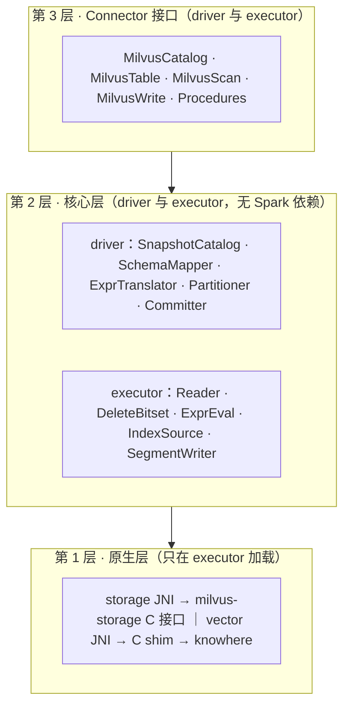
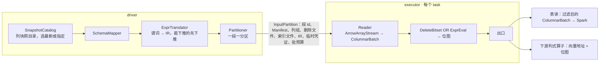

# spark-milvus 2.0 设计（工作稿）

本页保留总体设计、开放问题和决策日志，详细文档按主题分目录。[AGENTS.md](../../AGENTS.md) 说明项目原则与当前状态；进入设计后，按手头的问题选择阅读范围。

| 要解决的问题 | 位置 | 阅读入口 |
|---|---|---|
| 确认功能承诺、优先级和实现位置 | 顶层索引 | [能力规划](capabilities.md) |
| 理解总体结构、确定模块与包的归属 | architecture/ | [架构图解](architecture/overview.html)、[模块与迁移](architecture/modules.md) |
| core 怎么访问对象存储、凭证怎么下发 | architecture/ | [存储访问层](architecture/storage-access.html)（未完待续） |
| 改动对象存储凭证、provider 链、按桶配置 | architecture/ | [对象存储认证](architecture/storage-auth.html) |
| 审查或修改构建、打包与发布配置 | engineering/ | [sbt 原则与实践](engineering/sbt.html) |
| 对比外部方案、核对设计依据 | research/ | [Lance 分析](research/lance-spark.md)、[对比图解](research/lance-spark.html) |

标记：`[草稿]` 未讨论，`[讨论中]` 有分歧，`[已定]` 结论已进第 6 节决策日志。

## 0 结论 `[草稿]`

spark-milvus 2.0 是读写 Milvus Storage 的 Spark Connector：一个 collection 在 Spark 里是一张表，读直接读对象存储上的快照，不经 Milvus 服务；写按 Milvus Storage 格式直接落对象存储，再由 Milvus 登记：已有段的新 Manifest 版本走 Milvus 现有的 BatchUpdateManifest 接口，新段的登记要 Milvus 新增接口（2.4）。代码分三层：Connector 接口层只做翻译，核心层做全部计算且不依赖 Spark，原生层封装 milvus-storage 和 knowhere 两个 C++ 库。1.x 在 tag v1.6.0 冻结，2.0 在分支 refactor/v2 上重写。

名词：
1. Milvus Storage：Milvus 的表格式，当前版本 V3，上游代码里也叫 Loon。milvus-storage 是读写它的 C++ 库。
2. knowhere：Milvus 的向量索引库，负责建索引和检索。
3. 段：存储和加载的单位，sealed 段只读，落在对象存储。列组：段的列分成的几个 Parquet 文件。Storage V2 是 2.0 之前的段布局，多列合在一个 Parquet 文件里、没有 Manifest；Storage V3 每段带 Manifest。
4. 快照：etcd 里的段元数据落到对象存储的 JSON 加 Avro，由 Milvus 生成。
5. backfill：给已有 collection 的段补写新列组的作业，1.x 里是仓库自带的独立应用。
6. 下游列式算子：在同一个 Spark 作业里直接消费 Arrow 列批的向量算子（聚类、去重、相似度 join 一类），不在本仓库。Connector 交给它们的是列批加 knowhere 封装，向量和位图以地址交出。

## 1 1.x 的问题 `[草稿]`

1.x 的七条路径（gRPC 取段元数据和建快照、gRPC Insert 写、Storage V2 读、Storage V3 读、离线快照、backfill、backup）各自带一套入口、配置、凭证和类型处理，没有一层封装 Milvus Storage 的读写。

| 问题 | 事实 |
|---|---|
| 没有分层 | 41 个源文件里 33 个 import org.apache.spark，快照解析、删除日志解码、Manifest 读取、类型映射、路径解析都在 Spark 类里。后果是这些代码要跟着每条 Spark 线各编一次，而且测它们得先拉起 SparkSession |
| 一个文件承担三层 | MilvusDataSource.scala 2879 行：TableProvider、Table、ScanBuilder、Scan，四套读路径规划（live 快路径、legacy、离线快照、backup），Hadoop 配置，桶判定，快照的建和删 |
| 读入口是 option 开关 | `milvus.uri`、`milvus.snapshot.mode`、`milvus.backup.dir` 的有无决定走哪条规划；离线模式要用户把段列表 JSON 塞进 option；没有快照对象 |
| reader 是行式的 | 6 次拷贝，必要的只有 2 次：一个 FloatVector 值从对象存储到 Spark 算子。逐行把 Arrow 装箱成 InternalRow；谓词在 reader 里逐行求值；删除记录以 Map 序列化进每个分区 |
| 原生层是上游的 Java 绑定 | unmanaged jar 引入；Arrow 钉 17.0.0 而 Spark 4 用 18；批大小和线程池不受控 |
| 类型映射四份 | DataTypeUtil 的 Milvus 到 Arrow、Milvus 到 Spark，MilvusSnapshotReader 的快照类型码到 Spark，SchemaUtil 写路径的 Spark 到 Arrow |
| 写路径两套 | `format("milvus")` 到 gRPC Insert：job 级 commit 和 abort 为空，task 级 abort 反而把缓冲刷进 Milvus；按格式写列组的 Loon 写入器只有 backfill 调得到。写完没有提交协议，也没有登记 |
| backfill 是塞在库里的应用 | 近 4900 行，含 24 个 CLI flag、29 个配置参数、自己的凭证链、和云上约定的结果 JSON；靠私有 option 穿透 DataSource 内部 |
| 向量搜索三套 | DataFrame 级暴力搜索、6 个 SQL 距离函数、reader 内嵌的 `vector.search.*`；没有 planner 规则或策略，都不用索引；vector_knn 恒返回 null |
| Milvus 服务调用没有边界 | 读（建删快照、取段元数据）和写（DescribeCollection 加 Insert）两处直接调；backfill 的 client 模式和 import 写入器是无入口的死代码 |
| 配置和凭证各自为政 | 配置键 89 个（MilvusOption 70、Properties 21），`fs.*` 有 camelCase 18 个和 snake_case 21 个两族不互译；凭证三种路径（driver 侧 Hadoop s3a、executor 侧 native 的 fs.*、backfill 自己的 provider chain）；每个分区携带含密钥的完整 option |
| 单模块构建 | 分层没有构建约束 |

## 2 目标设计 `[草稿]`

### 2.1 分层与模块

1. 第 3 层实现 DataSource V2 要的 Catalog、Table、Scan、Write、Procedure，把 Spark 类型换成核心层类型，不做计算。
2. 三条构建约束：核心层源码不出现 org.apache.spark；C 接口头文件不出现 JNI 类型；原生层只在 executor 加载。
3. sbt 模块和目录见 2.8。依赖只能向下。
4. Milvus 服务只在三处被第 3 层调用：DDL、Delete、Procedure。读路径和写文件不经它；写路径的登记是一个 Procedure，调 2.4 说的登记接口。

### 2.2 核心层对象模型

读的唯一入口是 Snapshot：主路径从快照目录选一个快照，只认 Storage V3；1.x 的三条非标准入口作适配器产出同一个 Snapshot 或 SegmentReader（capabilities.md 的 K1 到 K3）。

| 类型 | 含义 | 来源 |
|---|---|---|
| Snapshot | 一次读的固定视图：schema、分区、段列表、索引定义、时间戳 | 快照目录的 JSON 加 Avro |
| Segment | 段 id、分区 id、行数、存储版本、Manifest 路径与版本、删除文件、索引文件 | 快照的段列表 |
| Manifest | 一个段的列组文件、删除文件、统计文件 | milvus-storage 的清单文件 |
| ColumnGroup | 一个列组文件及其字段 id 集合 | Manifest |
| DeleteBitset | 快照时间戳之前生效的删除，按行号置位 | 段目录的 `_delta/` 文件 |
| StoragePath | 桶内相对 key、标准 S3、Milvus 格式（`s3://<endpoint>/<bucket>/<key>`）三种形态到 (bucket, key) 的归一 | issue #118 的设计稿，未实现；1.x 现有逻辑是几处前缀替换 |
| SchemaMapper | 字段 id、名字、Milvus 类型、Arrow 类型的唯一映射；Spark 类型的映射在 spark 层 | 快照 schema |
| Expr IR | Spark 谓词和 Milvus 表达式翻成的同一套中间表示 | ExprTranslator |

### 2.3 读路径

读不经 Milvus 服务：driver 从快照定分区和谓词，executor 用列式 reader 出批。快照由 Milvus 生成，2.0 用 CALL 建快照触发；Milvus 做了自动快照后不再需要触发（第 5 节）。

1. 下推两级都依赖第 5 节的统计 ask：主键 bloom filter（段统计文件里的布隆过滤器）剪段；row group 级 min/max 剪枝。目前 milvus-storage 的 Parquet 谓词下推是空实现。
2. 自实现的 ColumnVector 只持地址、length、offset，不搬字节；批用完再释放，处理期间 buffer 不动。
3. DeleteBitset 一段算一次并缓存；ExprEval 在列批上按列求值出位图 `[已定：放核心层]`；删除 OR 谓词合成一张位图，1 表示过滤。
4. 表读的出口是否压缩掉被过滤的行、算不算一次拷贝，待定（决策 12）。按行号取列用 Arrow 的 take。
5. 拷贝次数：Parquet 解码 1 次，聚成 UnsafeRow 1 次；下游是列式算子时只有前一次。

### 2.4 写路径

写不经 Milvus 服务：executor 直接写段目录到暂存前缀，driver 提交作业清单，登记由 Milvus 的元数据接口完成。Milvus master（2026-09-10）里两种登记的现状不同：已有段的新 Manifest 版本有接口，新段没有。

1. 作业清单放 `staging/{job}/`，内容是本次作业全部段的路径、Manifest 版本和行数。提交前先写记作业 id 的标记文件，重跑发现标记文件就跳过已提交的段；abort 或失败删暂存前缀。
2. commit 止于作业清单。登记由用户或云上作业发 `CALL milvus.system.register`（第 3 层 Procedure），核心层不调 Milvus。登记后在线可见；Connector 自己再读要先 CALL 建快照。
3. backfill 写模式：给已有段在它现有的 base_path 下追加列组文件，Manifest 出新版本（版本号严格大于当前）；登记走 Milvus 的 gRPC `BatchUpdateManifest`（或管理端口的 `CommitBackfillResult`），二者都只把该段 manifest_path 里的版本号前进，base_path 不变。前提：AddCollectionField 先于登记，否则 QueryNode 重开段时不加载新列；段必须是 Flushed；作业期间 schema 版本不能变。
4. append 写模式：写新段目录。Milvus 今天没有登记外部新段的接口；DataCoord 内部已有 `CommitSegmentManifest` 的 NewSegment 原语，缺的是 RPC、id 分配和 WAL 广播，见第 5 节。
5. 暂存位置要避开 GC：DataCoord 把 `insert_log/{coll}/{part}/{seg}` 下未登记的 V3 段目录在 `dataCoord.gc.missingTolerance`（默认 86400 秒）后回收；暂存前缀放在 `insert_log` 之外，登记时按最终路径写或移动。
6. 索引随段一起写：SegmentWriter 可以在写段的同时用 knowhere 建索引，按 Milvus 的索引文件格式写到段目录旁并登记进该段的 Manifest（2.5 第 6 条）；Global Index 的中心点到桶的映射同样写进 Milvus Storage。作业清单带上索引文件，登记时一并交给 Milvus。
7. append 不用 RequiresDistributionAndOrdering；backfill 写模式的按段分布和按行号排序见决策 10。truncate 和 overwrite 只接受全表。

### 2.5 原生层

1. 要写四样：storage JNI；knowhere 没有 C 接口，先写一层 C 函数包它的 C++ 接口（C shim）再包 JNI；索引文件加载链；DiskANN 用的本地 FileManager。
2. 约定：只传地址和长度，Arrow 走 C Data Interface，配置用 JSON；谁分配谁释放，句柄配 destroy，Arrow 靠 release 回调，JVM 用 Cleaner 兜底；错误是返回码加消息。
3. JNI 不用 Panama（JDK 22 才正式的外部函数接口），因为 Spark 4 最低 Java 17。
4. 交给 native 的路径一律是桶内相对 key，桶来自 fs.bucket_name。
5. 索引加载：索引文件在对象存储里按 Milvus binlog 格式切成多片，每片带事件头；加载时从快照的段列表拿路径，去掉事件头，按 SLICE_META（记录切片顺序的元信息）拼回 knowhere 的 BinarySet；DiskANN 先落本地目录。
6. 索引写出是加载的逆过程：knowhere serialize 出 BinarySet，按 16MB 切片，每片加 binlog 事件头，写 SLICE_META，上传到该段的索引文件路径，用 milvus-storage 的 add_index_info 登记进 Manifest；索引版本按 knowhere 的版本区间标记，供 Milvus 加载时校验。
7. 索引来源三级，由 IndexSource 统一：Milvus 建的（快照段列表里）、Spark 建并按第 6 条写回的、任务内即时建的（只在内存，不写回）。

### 2.6 接口层

| 槽位 | 2.0 |
|---|---|
| Catalog | 三段名 `milvus.db.coll`；loadTable 的 version 和 timestamp 对应快照名和时间点；createTable、dropTable 走 gRPC |
| Table | schema 来自快照；元数据列 segment id、row offset、timestamp（名字见决策 5）；行数字节数来自快照；DeleteV2 只接能翻成 Milvus 表达式的谓词 |
| ScanBuilder | 列裁剪、DataSource V2 谓词、Limit、RuntimeV2Filtering；不实现 V1 Filter |
| 旁路 | Spark 4 用 ProcedureCatalog 的 CALL，Spark 3.5 暴露为同名函数；清单见 capabilities.md 第 4 节 |

### 2.7 产物与版本

1. 版本 `2.0.0-{branch}-{arch}-SNAPSHOT`，正式版 2.0.0。分支和架构后缀保留到 native jar 改成多平台单 jar 为止。
2. 每条维护中的 Spark 线各出一个 Connector jar 和一个 bundle（2.8）；native jar 跟 Milvus 小版本发布，与 Spark 版本无关。
3. 1.x 已有 linux-x86_64 和 linux-aarch64 的构建链和 `native/linux-{arch}/` 布局（未经 CI 验证）。2.0 新增：native jar 与 Connector jar 分离、macOS 开发用产物、GPU classifier。

### 2.8 目录与模块 `[讨论中]`

不分仓：场景代码、调试工具和遗留路径都留在本仓库，用 sbt 模块隔离，依赖规则保证核心层不被它们污染。与总设计冲突、暂时不好判断的非标准功能一律按这条处理：保留，隔离，不进核心层。模块、包、目录和 1.x 到 2.0 的迁移对照见 [modules.md](architecture/modules.md)；功能清单见 [capabilities.md](capabilities.md)。

## 3 重点与顺序 `[草稿]`

不做的功能见 capabilities.md 第 9 节。判据：先做让下游列式算子能接上的部分。读路径是一切的基础，写路径的 append 等 Milvus 侧的登记接口，搜索层依赖列式读。顺序只有依赖，没有日期。

| 级别 | 顺序 | 内容 | 理由 |
|---|---|---|---|
| P0 | 1 | sbt 拆 core、native、spark4，依赖规则进构建 | 不拆，后面每一项都在旧结构上打补丁 |
| P0 | 2 | 核心层对象模型与 SnapshotCatalog；SchemaMapper 合并四份映射；StoragePath | 读的唯一入口 |
| P0 | 3 | storage JNI、列式 reader、ColumnVector、DeleteBitset | 拷贝 6 次到 2 次；下游算子能拿到地址 |
| P1 | 4 | Catalog、元数据列、统计、DataSource V2 谓词、Limit | 三段名和回表 |
| P1 | 5 | ExprTranslator、IR、求值器 | 谓词语义对齐 Milvus |
| P1 | 6 | SegmentWriter、Committer、register Procedure | backfill 登记走 BatchUpdateManifest 可先做；append 等第 5 节的 RPC |
| P2 | 7 | knowhere 的 C shim 和 JNI、索引加载、索引写出与登记、BruteForce；backfill 写模式 | 依赖列式 reader 和写路径 |
| P3 | 8 | native jar 打包、四条 Spark 线的子项目和 CI 矩阵、基准（读吞吐、拷贝次数、写端到端）；macOS 和 GPU 产物 | 打包工作，不影响设计 |
| P3 | 9 | 2.0.0 发布，云上作业切换 | |

## 4 待定决策 `[讨论中]`

只列未定的；定了的行删掉，结论进第 6 节。

| 编号 | 决策 | 选项 | 影响 |
|---|---|---|---|
| 5 | 元数据列名 | `_segment_id` 或 1.x 的 `$segment_id`；`partition` 列是否保留 | 1.x 用户的兼容 |
| 6 | 类型映射 | Float16/BFloat16、Int8Vector、稀疏、Array 各选透传还是转换 | 用户可见类型；下游算子拿到的布局 |
| 10 | backfill 写模式的按段分布和按行号排序 | a. 实现 RequiresDistributionAndOrdering；b. 场景代码自己 shuffle 后再写 | 写路径接口 |
| 11 | 谁建快照、建前是否先 Flush | a. Connector 的 CALL 建，先 Flush；b. 只用 Milvus 自动快照 | 读延迟；1.x 快路径不 Flush |
| 19 | 按分区报分区（capabilities R19）是否值得做 | a. 做，join 少一次 shuffle；b. 不做，段内主键无序，收益可能被 Milvus 的段分布抵消 | 需要实测 |
| 12 | 表读出口是否压缩掉被过滤的行 | a. 压缩，多一次拷贝；b. 交位图给 Spark 逐行跳过 | 拷贝账；Spark 侧算子的接法 |
| 13 | `_delta/` 删除文件格式 | 两列 Parquet 与旧 binlog 容器格式的共存期 | DeleteBitset 的解析器 |
| 14 | SegmentWriter | a. 复用 1.x 的 Loon 写入器（写侧已零拷贝）；b. 在新 JNI 上重写 | 原生层的工作量 |
| 16 | 暴力搜索的形态与位置（能力已定保留，见决策日志） | 入口：DataFrame 方法、SQL 函数、读选项三选几；执行：knowhere 的 BruteForce 在原生层，JVM 实现作参照或兜底；归属：spark 层能力还是 apps 场景 | 能力清单和模块规划一起定 |
| 20 | 原生属性包由谁渲染 | a. core.credential 出中性的 Map，碰原生的那一层转成 MilvusStorageProperties；b. 整个渲染放第 3 层 | 选 a 则 fs.* 的键名语义进 core，但 core 不依赖上游 Java 绑定（那个绑定是第 1 层要替换掉的）|
| 21 | 开发默认值留不留 | a. 从生产路径删掉，只在显式测试 profile 里保留，漏配就响亮失败；b. 保持现状 | `a-bucket`、`localhost:9000`、`minioadmin` 现在写死在生产路径上，非 IAM 模式漏配桶名会安静地连错桶。选 a 是对外可见的行为变化 |
| 22 | 身份要不要进 ObjectStoreFactory 的签名 | a. 现在就加，对齐 Trino 的 `create(ConnectorIdentity)`；b. 先不加，等第二个身份场景出现 | 我们有 AssumeRole、IRSA、按桶不同的密钥，长期要；但现在一个作业一套凭证，提前加是空抽象 |

## 5 需要 Milvus 侧提供的 `[草稿]`

| 事项 | 现状（master 13cd0e99f） | 缺口 | 影响的设计点 |
|---|---|---|---|
| 登记外部写入的新段 | 无接口 | 新增 RegisterSegments RPC：复用 DataCoord 的 CommitSegmentManifest NewSegment 原语，含段 id 分配、WAL 广播、行数和统计 | 2.4 append |
| 读段当前的 base_path 和 Manifest 版本 | 无公开 API 暴露 manifest_path，只能从快照 metadata 取 | GetPersistentSegmentInfo 或新 RPC 暴露 manifest_path | 2.4 backfill，否则每次 backfill 前都要先打快照 |
| backfill 期间冻结目标段 | 无；BatchUpdateManifest 的 ack 路径不持段级 Manifest 锁，与 compaction、stats、索引、schema 变更竞争 | 段级租约，或把 ack 接到 CommitSegmentManifests 的串行路径 | 2.4 backfill |
| 登记时校验 Manifest 内容 | BatchUpdateManifest 不打开 Manifest 文件，不校验列和行数 | 登记时读 Manifest 校验列组、行数、schema 版本 | 2.4 |
| 列级 min/max 统计，row group 统计剪枝 | milvus-storage 的 Parquet 谓词下推是空实现 | 写统计文件，reader 用统计剪枝 | 2.3 下推两级 |
| Milvus 把索引文件写进段的 Manifest；加载 Connector 写回的索引 | milvus-storage 的 add_index_info 接口已有 | Milvus 服务填写并读取 Manifest 里的索引登记，校验 knowhere 版本区间 | 2.5 索引加载与写出 |
| 自动快照加保留策略；快照目录里加 catalog 文件；格式契约文档 | 快照由 CreateSnapshot 手动建 | | 2.3 读入口，决策 11 |

## 6 决策日志

| 日期 | 决策 | 结论 |
|---|---|---|
| 2026-09-09 | 版本号与分支 | 2.0.0，refactor/v2 |
| 2026-09-09 | 谓词求值位置 | 核心层 |
| 2026-09-09 | Spark 用 knowhere 建的索引是否写回对象存储、按 Milvus 的索引文件格式登记进段清单，让 Milvus 在线也能加载 | 2.0 首版只做反方向（加载 Milvus 建的索引到 knowhere）和任务内即时建索引；写回随 Global Index（底库按中心点重分布、每桶建索引、映射写进格式）一起做，因为它是唯一需要写回的场景 |
| 2026-09-10 | 1.x 冻结点 | tag v1.6.0，main 只收 1.x 修复 |
| 2026-09-10 | backfill 的模块归属 | 不分仓；仓库内用 sbt 模块隔离，场景与遗留代码进 apps 模块，依赖只能向下。同一政策适用于调试工具、JVM 向量搜索、backup 入口、gRPC Insert |
| 2026-09-10 | 支持的 Spark 版本 | 跟 lance-spark 一样：每条维护中的 Spark 线一个子项目、一份源码、各自钉 Spark 和 Arrow、各出产物；首发覆盖 3.5、4.0、4.1、4.2 |
| 2026-09-10 | 索引写回 | 推翻 09-09 那条：Spark 建的索引按 Milvus 索引文件格式写回并登记进 Manifest，是 2.0 的功能之一，与加载链和 Global Index 映射一起做。2.0 是完整设计，不按场景裁剪 |
| 2026-09-10 | 暴力搜索能力 | 保留。1.x 的 JVM 实现先留在 apps/search；正式形态（入口、原生层 BruteForce、归属）在能力规划时一起设计 |
| 2026-09-10 | Scala 版本 | 跟 lance-spark 一样：3.5 线出 2.12 和 2.13，4.x 线只出 2.13；交叉编译范围见 modules.md 第 1 节 |
| 2026-09-10 | 非标准功能的处理原则 | 与总设计冲突、暂时不好判断的功能一律保留并用模块隔离，不进核心层。据此：Storage V2 packed 读、离线 option 塞段列表、backup 三个入口进 compat 模块，作 Snapshot 或 Reader 的适配器；gRPC Insert 进 apps/legacy 作小批量兜底 |
| 2026-09-10 | 写路径的登记接口 | 读 Milvus master 得出：backfill 走现有的 BatchUpdateManifest / CommitBackfillResult（只前进已有段的 Manifest 版本）；append 要 Milvus 新增 RegisterSegments RPC。之前写的「登记走 External Collection refresh」是误判，已从设计里删除。分析见 spark-milvus-design-docs/milvus-registration-analysis-2026-09-10.md |
| 2026-09-10 | 第 4 层的模块名 | 从 ops 改成 apps：内部已有一个叫 OPS 的系统，容易混。四个包都是对外的入口，apps 名副其实 |
| 2026-09-10 | 集成测试模块名 | 从 it 改成 integration：it 来自 sbt 内置的 IntegrationTest 配置，而它 sbt 1.9 起废弃、sbt 2 已删除，2.0 用独立 project 不再依赖它 |
| 2026-09-10 | project 数量 | 21 砍到 11。只有 spark 必须按线拆；fat jar 是 spark-<line> 上的 assembly 任务，不单独成 bundle 模块（那是 Maven 的限制）；apps 和 integration 各只建一个，加线是加一行配置 |
| 2026-09-10 | Spark 与 Arrow 的版本钉法 | Spark 取每条线最低的维护 patch（编译版本就是兼容下限），Arrow 与本线 Spark 自带的对齐；4.2 线的 Arrow 从 18.3.0 改成 19.0.0 |
| 2026-09-10 | CALL 的实现方式 | 走自己的 SQL 语法扩展加逻辑节点加 planner 策略，不用 Spark 4.0 才有的 ProcedureCatalog：后者要为 3.5 再写一套函数入口，同一批动作两份实现 |
| 2026-09-10 | 决策 17 antlr | SQL 扩展的语法放共享目录、每条线各生成一份、运行时用 Spark 自带的；core 里的 Milvus 表达式解析器不用 antlr（core 是跨线单产物，生成码不通用），改手写 |
| 2026-09-10 | catalog 的按线拆分 | 主体进 spark-base，按线只留一个工厂方法 |
| 2026-09-11 | 目录与命名 | 目录全部平铺，不设分组目录（分组目录不是 sbt 模块，在 IDE 里与真模块混同）；模块显示名跟目录一致，发布坐标另设 moduleName；只有一个消费者的共享源码目录不设（apps 与 integration 的 base 删掉），spark-base 有四个消费者保留 |
| 2026-09-11 | 共享源码不做成 project | IDE 里那个合成的 spark-base-sources 模块来自「多个项目声明同一个源码根」，把 spark-base 做成 project 去不掉它，只多一个模块和一次编译；最低线的 API 约束由 spark-3.5 本来就提供 |
| 2026-09-11 | 核心层无 Spark 依赖的理由 | 更正：不是为了给 Ray 复用（Ray 是 Python，依赖不了 JVM 的 jar，它共用的是第 1 层的 C 接口）。理由是四条 Spark 线共用一个产物、测试不拉 SparkSession、边界有编译期检查 |
| 2026-09-11 | core 怎么读对象存储 | core 定一个五方法的 `ObjectStore` 接口，唯一实现走 Hadoop FileSystem 并放在 core 里，`hadoop-common` 标 provided；原生云 SDK 不进 2.0 首版。定接口只有一条理由立得住：换实现时不改 core 的公开签名，而 1.x 已经踩过 Hadoop 的 URI 与 endpoint 坑（#110 的 OSS 路径、`MilvusOption` 里绕开 FileSystem 缓存的补丁）。Iceberg、Trino、Hudi 立同类接口的三条动因在我们身上都不成立：我们只有一个引擎，1.x 早已把 `MilvusOption` 而不是 `Configuration` 放进 InputPartition，Hadoop 的依赖树本来就由 Spark 提供。接口按对象存储描，不照 Hadoop FileSystem 描——Hudi 的 HoodieStorage 照着描，24 个抽象方法里漏出 `getDefaultBlockSize` 这类 HDFS 概念，至今在改 |
| 2026-09-11 | 存量代码的归属 | 先归属后重构：41 个 1.x 源文件按目标模块搬完，src/ 清空，这一轮不改语义。挡路的 6 处反向引用全部是文件放错位置，逐个纠正后归属分组与文档有三处出入：Properties 产出上游 Java 绑定的类型留在第 3 层，暴力搜索在读路径上不是 app，format("milvus") 整条写链要等 W7 的注册表才能下放 apps。明细见 modules.md 第 5 节 |
| 2026-09-11 | 第 2 层的日志 | core 自带 slf4j 的 Logging 门面，不用 Spark 的。六个待迁文件只因为 Spark 的 Logging 才算 Spark 代码，全仓实际日志调用只有 7 处 |
| 2026-09-11 | 存量 Spark 代码放 spark-base 还是单条线 | 放 spark-base。1.x 的 main 与 test 在 3.5.5、4.0.0、4.2.0 上都编得过，四条线各编一遍没有兼容风险，而单条线会让另外三条线一直是空的 |
| 2026-09-11 | 代码与文档的语言 | 代码、注释、构建脚本、README 一律英文；docs/design 的设计文档保持中文 |
| 2026-09-11 | 仓库的入口文档 | 仓库根的 AGENTS.md 是唯一入口，只做路由不放内容。CLAUDE.md 是它的软链，Codex 原生读 AGENTS.md，一份内容两个工具都认。不放 .claude/skills：那个目录在 .gitignore 里，而且只有 Claude 认得 |
| 2026-09-11 | CI 的覆盖面 | 触发分支加上 refactor/v2；CI 跑格式检查、十个模块的编译、integration-4.0 的单独编译、core/compat/client 的 2.12 交叉编译、以及排除两个原生用例后的全部单测。集成测试编译但不跑，它要真的 Milvus 和 MinIO |
| 2026-09-11 | integration-4.0 不进 root 的 aggregate | 迁移后它的用例变成普通 Test 配置，`sbt test` 会把它带上并失败。1.x 里它们在 `it` 配置下不会被带上，移出 aggregate 恢复这个行为；CI 用 integration40/Test/compile 显式编译 |
| 2026-09-11 | 原生库的位置 | 从 `src/main/resources/native` 移到 `native-storage/src/main/resources/native`。Dockerfile、Makefile、两个 demo 脚本、.gitignore、测试的 java.library.path 一起改。fat jar 的 30516 个条目前后零差异 |
| 2026-09-11 | 3.5 线的 Scala 2.12 产物 | 暂时出不来。上游 milvus-storage 的 Java 绑定只发 2.13，3.5 线还依赖它，交叉编译会因为 Scala 签名版本不符而失败。native-storage 替换掉绑定之后解除。core、compat、client 的 2.12 交叉编译已在 CI 里 |
| 2026-09-11 | spark-mllib 的版本 | 按线取，不用 1.x 的默认值。spark-mllib_2.12 在 Spark 4 不存在，3.5 线沿用 4.0.0 会解析失败；而在 2.13 上它会静默地把 Spark 4.0 的 MLlib 拉进 3.5 线 |
| 2026-09-11 | 索引靠什么保持为真 | 能力编号是脊柱：capabilities.md 的行指向包，包的 package.scala 反过来声明编号。新增 `sbt checkCapabilityIndex` 挂进 CI，抓三类漂移：有行没人认领、包声明了不存在的编号、实现位置指向不存在的包。尚未落地的能力写进 capabilities.md 第 11 节，脚本读它，不自己维护名单 |
| 2026-09-11 | AGENTS.md 的分级 | 第一级要披露本级该披露的东西，不是只做目录。补上四层模型（规则一和规则三引用它，缺了就没法执行）、能力编号这条脊柱、工作现在到哪了、明确不做的事，以及维护契约。删掉原来那句「本页不放内容」 |
| 2026-09-11 | 迁移期根产物的 POM | 继续只发布根 assembly；POM 按组织和带 Scala 后缀的产物名移除已打包的 spark40、apps40 内部依赖，保留外部依赖与构建时的模块依赖。仅替换 packageBin 不会改 POM，直接沿用会让消费者解析未发布的模块；暂不为此新增发布 project |
| 2026-09-11 | 构建入口的集成测试任务 | Dockerfile 和 Makefile 与 CI 一致，改用 integration40/Test/compile；旧 IntegrationTest 配置已删除，继续调用会在 assembly 和发布前失败 |
| 2026-09-11 | 3.5 线的 Arrow 基线纠正 | Spark 3.5.5 的官方 POM 指定 12.0.1，原先的 15.0.2 不符合按 Spark 自带版本对齐的约束；修改 Versions.scala、模块约束、可视化与 Lance 对照文档。采用发行版基线，不覆盖 Spark 自带 Arrow；这次修正本身不代表已完成运行兼容验证 |
| 2026-09-11 | sbt 的可维护性 | 保留现有文件、显式 project 声明和按线工厂，不新增 Packaging.scala 或通用构建框架。build.sbt 依次放公共设置、模块、根产物打包发布；库版本集中 Versions，依赖组合放 Dependencies，公共 settings 放 Modules。复用现有 jacksonPin 并集中临时 JNI 路径，模块特有配置仍就近声明；保留现有版本与作用域，根产物沿用的 Arrow 17 明确标为 legacyRootArrow，历史理由留在本日志 |
| 2026-09-11 | 设计原则写进 AGENTS.md | 五条判断力原则排在四条机械约束前面：整体自洽优先于完成任务；从根因解决禁止外围兜底；禁止烟囱式开发；需要重构就重构且永远不评估工时；删除是设计工作但禁止静默删除，必须先说明依据和风险并等人确认。推迟只有三个合法理由——决策没定、依赖没建好、事实没查清；「工作量大」「这是重构不是本次范围」都不算 |
| 2026-09-11 | 设计先行进原则 | 任何能力开工前必须确认四件事：capabilities.md 里有行、它依赖的决策都已出第 4 节、落点包存在且 package.scala 写明职责、governing 的设计已经成文。少一样，那一样就是当前的工作。子系统的设计说不进「能力行 + README 的分层」时，才在 docs/design 下单开一份文件，并挂进 AGENTS.md 的路由表。文档分级本身是为了减少每次会话的预加载：每条事实只写在需要它的那一级，其余级别只链接 |
| 2026-09-11 | sbt 原则与实践成文 | [sbt.html](engineering/sbt.html) 统一维护构建约定，仓库内 skill 引用并执行，AGENTS.md 提供入口。以维护者能否就近看懂配置判断抽象：四条 Spark 线保留工厂，单实例 apps/integration 直接声明；发布开关写在模块处，公共设置名称说明其效果；root 的运行、assembly、发布细节在同一文件按职责命名。不以行数、固定文件数或消除全部重复为目标，保留现有依赖与交付契约 |
| 2026-09-11 | 文档用什么格式写 | 子系统的详细设计写 HTML，不写 md。md 是写起来方便，但现在文档是 agent 写的，方便写不是约束，方便人读才是；HTML 能带图、带撑得住的表格、带锚点互链。md 留在三处：AGENTS.md 这一级、构建会解析的文件（capabilities.md 被 checkCapabilityIndex 读）、以及靠 diff 评审的追加型内容（决策日志）。同一份内容不许两种格式并存 |
| 2026-09-11 | 设计文档按主题分目录 | 详细设计不再平铺在 docs/design 顶层；顶层保留总体入口、决策日志和能力索引，架构与模块边界归 architecture/，构建与开发规范归 engineering/，外部方案对比归 research/。其他主题按实际内容增加，不预建空分类、不逐篇套目录。入口说明各主题的阅读时机，详细规则只维护一份；新增或移动文档同步更新入口、链接及 skill/构建引用。规则见 [docs/writing.md](../writing.md#design-document-layout)，用于降低查找成本并支持按任务逐层阅读 |
| 2026-09-11 | 存量设计文档目录整理 | 五份专题文档移入 architecture/、engineering/、research/；顶层只保留 README.md 和 capabilities.md。总体入口按阅读目的链接到专题，现有文档内容保留，移动后的相对链接、AGENTS.md、skill 和源码中的文档路径同步更新；能力索引路径与解析表格保持不变 |
| 2026-09-11 | 技术解释禁止类比与黑话 | 回答技术问题只描述机制：打开哪个文件、读哪个字段、失败长什么样。类比要求读者再翻译一次，误解就从翻译里进来；临时造的简称同理，它逼读者记一个仓库里不存在的定义。本次会话的实例：解释存储访问层时用了「取字节 / 解释字节」这对当场造的词，问了三遍才给出具体答案——读一张表要物理打开五种文件，JVM 开四种、原生库开第五种。规则适用于解释、代码注释和命名，不限于文档 |
| 2026-09-11 | 存储访问层的方案被推翻 | 原方案是在 Scala 里定 ObjectStore、用 Hadoop FileSystem 实现，前提是「原生层只打开数据文件」。读 milvus-storage 的 C 头文件发现前提不成立：`loon_filesystem_*` 已是一整套文件系统 API（read_file_all、open_reader 加 readat、list_dir、get_file_info、open_writer、create_dir、delete_file、指标），凭证包在 properties 里，后端有 s3/gcp/azure/local；`loon_exttable_read_manifest` 直接返回解析好的列组、删除日志与统计；`loon_transaction_*` 覆盖写侧提交。在它旁边再建一条 Scala 通路是烟囱。路线级决定（统一走 C 的 filesystem 还是保留 JVM 通路）待查清四件事后再定：小文件跨 JNI 开销、无 HDFS 实现的影响、平台注入的 s3a 配置是否被依赖、OSS 走 S3 兼容端点的行为差异。进度记在 [storage-access.html](architecture/storage-access.html)，先做认证 |
| 2026-09-11 | 对象存储认证的机制与取舍 | 先查后定。Hadoop 兼容文件系统屏蔽的是文件访问 API 差异不是认证差异——按 scheme 分发、每个文件系统一个键命名空间、按桶/按账号覆盖、Spark 用 spark.hadoop.* 透传。由此定五条原则：不构造凭证、只写按桶键、不覆盖已设的 provider、不内置默认值、不重复。据此判定现有 provider 链逻辑保留：跨账号双桶（backfill 同时读源桶写 Milvus 桶）、平台已选的 AssumeRole 不可替换、静态密钥要钉住 provider 防遮蔽，三者都是真实场景；显式 IRSA 链是规避 SDK v1 默认链在 EKS 上会拿到节点角色的缺陷。要治的只有六处复制和写死的 a-bucket/localhost:9000/minioadmin。实测：hadoop-aws 3.4.1 的 v1→v2 映射表只有五条，WebIdentityTokenCredentialsProvider 不在其中，靠我们自带的 aws-java-sdk-core 1.12.780 经 AwsV1BindingSupport 实例化才工作——删掉这个依赖会在连接时失败而非编译期。另测得 Milvus 的 storageType 只有 local/remote，本层永不碰 HDFS。见 [storage-auth.html](architecture/storage-auth.html) 与仓库内 skill |
