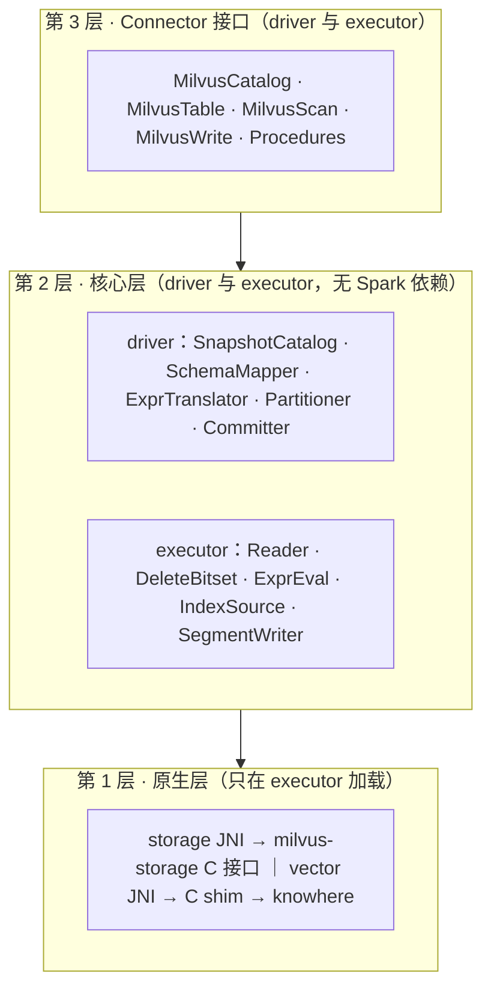
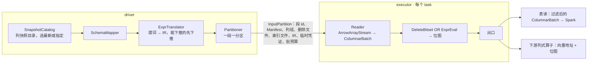

# spark-milvus 2.0 设计（工作稿）

标记：`[草稿]` 未讨论，`[讨论中]` 有分歧，`[已定]` 结论已进第 6 节决策日志。定稿后按章拆成 docs/design/ 下的文件，接口和约定整理成项目 skills。

## 0 结论 `[草稿]`

spark-milvus 2.0 是读写 Milvus Storage 的 Spark Connector：一个 collection 在 Spark 里是一张表，读直接读对象存储上的快照，不经 Milvus 服务；写按 Milvus Storage 格式直接落对象存储，再由 Milvus 的 External Collection refresh 把这些文件登记为段。代码分三层：Connector 接口层只做翻译，核心层做全部计算且不依赖 Spark，原生层封装 milvus-storage 和 knowhere 两个 C++ 库。1.x 在 tag v1.6.0 冻结，2.0 在分支 refactor/v2 上重写。

名词：
1. Milvus Storage：Milvus 的表格式，当前版本 V3，上游代码里也叫 Loon。milvus-storage 是读写它的 C++ 库。
2. knowhere：Milvus 的向量索引库，负责建索引和检索。
3. 段：存储和加载的单位，sealed 段只读，落在对象存储。列组：段的列分成的几个 Parquet 文件。Storage V2 是 2.0 之前的段布局，多列合在一个 Parquet 文件里、没有 Manifest；Storage V3 每段带 Manifest。
4. 快照：etcd 里的段元数据落到对象存储的 JSON 加 Avro，由 Milvus 生成。
5. External Collection：Milvus 登记外部文件为段的机制，refresh 是它的登记动作。
6. backfill：给已有 collection 的段补写新列组的作业，1.x 里是仓库自带的独立应用。
7. 下游列式算子：在同一个 Spark 作业里直接消费 Arrow 列批的向量算子（聚类、去重、相似度 join 一类），不在本仓库。Connector 交给它们的是列批加 knowhere 封装，向量和位图以地址交出。

## 1 1.x 的问题 `[草稿]`

1.x 的七条路径（gRPC 取段元数据和建快照、gRPC Insert 写、Storage V2 读、Storage V3 读、离线快照、backfill、backup）各自带一套入口、配置、凭证和类型处理，没有一层封装 Milvus Storage 的读写。

| 问题 | 事实 |
|---|---|
| 没有分层 | 41 个源文件里 33 个 import org.apache.spark，快照解析、删除日志解码、Manifest 读取、类型映射、路径解析都在 Spark 类里；核心层不能脱离 Spark 复用 |
| 一个文件承担三层 | MilvusDataSource.scala 2879 行：TableProvider、Table、ScanBuilder、Scan，四套读路径规划（live 快路径、legacy、离线快照、backup），Hadoop 配置，桶判定，快照的建和删 |
| 读入口是 option 开关 | `milvus.uri`、`milvus.snapshot.mode`、`milvus.backup.dir` 的有无决定走哪条规划；离线模式要用户把段列表 JSON 塞进 option；没有快照对象 |
| reader 是行式的 | 6 次拷贝，必要的只有 2 次：一个 FloatVector 值从对象存储到 Spark 算子。逐行把 Arrow 装箱成 InternalRow；谓词在 reader 里逐行求值；删除记录以 Map 序列化进每个分区 |
| 原生层是上游的 Java 绑定 | unmanaged jar 引入；Arrow 钉 17.0.0 而 Spark 4 用 18；批大小和线程池不受控 |
| 类型映射四份 | DataTypeUtil 的 Milvus 到 Arrow、Milvus 到 Spark，MilvusSnapshotReader 的快照类型码到 Spark，SchemaUtil 写路径的 Spark 到 Arrow |
| 写路径两套 | `format("milvus")` 到 gRPC Insert：job 级 commit 和 abort 为空，task 级 abort 反而把缓冲刷进 Milvus；按格式写列组的 Loon 写入器只有 backfill 调得到。写完没有提交协议，也没有登记 |
| backfill 是塞在库里的应用 | 近 4900 行，含 24 个 CLI flag、29 个配置参数、自己的凭证链、和云上约定的结果 JSON；靠私有 option 穿透 DataSource 内部 |
| 向量搜索三套 | DataFrame 级暴力搜索、6 个 SQL 距离函数、reader 内嵌的 `vector.search.*`；没有 planner 规则或策略，都不用索引；vector_knn 恒返回 null |
| Milvus 服务调用没有边界 | 读（建删快照、取段元数据）和写（DescribeCollection 加 Insert）两处直接调；backfill 的 client 模式和 import 写入器是无入口的死代码 |
| 配置和凭证各自为政 | 配置键 89 个（MilvusOption 70、Properties 21），`fs.*` 有 camelCase 18 个和 snake_case 21 个两族不互译；凭证三种路径（driver 侧 Hadoop s3a、executor 侧 native 的 fs.*、backfill 自己的 provider chain）；每个分区携带含密钥的完整 option |
| 单模块构建 | 分层没有构建约束 |

## 2 目标设计 `[草稿]`

### 2.1 分层与模块



1. 第 3 层实现 DataSource V2 要的 Catalog、Table、Scan、Write、Procedure，把 Spark 类型换成核心层类型，不做计算。
2. 三条构建约束：核心层源码不出现 org.apache.spark；C 接口头文件不出现 JNI 类型；原生层只在 executor 加载。
3. sbt 模块和目录见 2.8。依赖只能向下。
4. Milvus 服务只在三处被第 3 层调用：DDL、Delete、Procedure。读路径和写文件不经它；写路径的登记也是一个 Procedure（2.4）。

### 2.2 核心层对象模型

读的唯一入口是 Snapshot：1.x 的 live、离线、backup 三条入口都改成选一个快照。

| 类型 | 含义 | 来源 |
|---|---|---|
| Snapshot | 一次读的固定视图：schema、分区、段列表、索引定义、时间戳 | 快照目录的 JSON 加 Avro |
| Segment | 段 id、分区 id、行数、存储版本、Manifest 路径与版本、删除文件、索引文件 | 快照的段列表 |
| Manifest | 一个段的列组文件、删除文件、统计文件 | milvus-storage 的清单文件 |
| ColumnGroup | 一个列组文件及其字段 id 集合 | Manifest |
| DeleteBitset | 快照时间戳之前生效的删除，按行号置位 | 段目录的 `_delta/` 文件 |
| StoragePath | 桶内相对 key、标准 S3、Milvus 格式（`s3://<endpoint>/<bucket>/<key>`）三种形态到 (bucket, key) 的归一 | issue #118 的设计稿，未实现；1.x 现有逻辑是几处前缀替换 |
| SchemaMapper | 字段 id、名字、Milvus 类型、Arrow 类型、Spark 类型的唯一映射 | 快照 schema |
| Expr IR | Spark 谓词和 Milvus 表达式翻成的同一套中间表示 | ExprTranslator |

### 2.3 读路径

读不经 Milvus 服务：driver 从快照定分区和谓词，executor 用列式 reader 出批。快照由 Milvus 生成，2.0 用 CALL 建快照触发；Milvus 做了自动快照后不再需要触发（第 5 节）。



1. 下推两级都依赖第 5 节的统计 ask：主键 bloom filter（段统计文件里的布隆过滤器）剪段；row group 级 min/max 剪枝。目前 milvus-storage 的 Parquet 谓词下推是空实现。
2. 自实现的 ColumnVector 只持地址、length、offset，不搬字节；批用完再释放，处理期间 buffer 不动。
3. DeleteBitset 一段算一次并缓存；ExprEval 在列批上按列求值出位图 `[已定：放核心层]`；删除 OR 谓词合成一张位图，1 表示过滤。
4. 表读的出口是否压缩掉被过滤的行、算不算一次拷贝，待定（决策 12）。按行号取列用 Arrow 的 take。
5. 拷贝次数：Parquet 解码 1 次，聚成 UnsafeRow 1 次；下游是列式算子时只有前一次。

### 2.4 写路径

写不经 Milvus 服务：executor 直接写段目录到暂存前缀，driver 提交作业清单，登记由 Milvus 的 refresh 完成。


1. 作业清单放 `staging/{job}/`，内容是本次作业全部段路径和行数。提交前先写记作业 id 的标记文件，重跑发现标记文件就跳过已提交的段；abort 或失败删暂存前缀。
2. commit 止于作业清单。登记由用户或云上作业发 `CALL milvus.system.refresh`（第 3 层 Procedure），核心层不调 Milvus。refresh 后在线可见；Connector 自己再读要先 CALL 建快照。
3. 写模式：append 写新段；backfill 给已有段追加列组文件，已有列组不重写，段的 Manifest 出新版本。backfill 能否走 refresh 登记取决于决策 3。
4. append 不用 RequiresDistributionAndOrdering；backfill 写模式的按段分布和按行号排序见决策 10。truncate 和 overwrite 只接受全表。

### 2.5 原生层

1. 要写四样：storage JNI；knowhere 没有 C 接口，先写一层 C 函数包它的 C++ 接口（C shim）再包 JNI；索引文件加载链；DiskANN 用的本地 FileManager。
2. 约定：只传地址和长度，Arrow 走 C Data Interface，配置用 JSON；谁分配谁释放，句柄配 destroy，Arrow 靠 release 回调，JVM 用 Cleaner 兜底；错误是返回码加消息。
3. JNI 不用 Panama（JDK 22 才正式的外部函数接口），因为 Spark 4 最低 Java 17。
4. 交给 native 的路径一律是桶内相对 key，桶来自 fs.bucket_name。
5. 索引加载：索引文件在对象存储里按 Milvus binlog 格式切成多片，每片带事件头；加载时从快照的段列表拿路径，去掉事件头，按 SLICE_META（记录切片顺序的元信息）拼回 knowhere 的 BinarySet；DiskANN 先落本地目录。

### 2.6 接口层

| 槽位 | 2.0 |
|---|---|
| Catalog | 三段名 `milvus.db.coll`；loadTable 的 version 和 timestamp 对应快照名和时间点；createTable、dropTable 走 gRPC |
| Table | schema 来自快照；元数据列 segment id、row offset、timestamp（名字见决策 5）；行数字节数来自快照；DeleteV2 只接能翻成 Milvus 表达式的谓词 |
| ScanBuilder | 列裁剪、DataSource V2 谓词、Limit、RuntimeV2Filtering；不实现 V1 Filter |
| 旁路 | Spark 4 用 ProcedureCatalog 的 CALL：建快照、建索引、load、flush、refresh；Spark 3.5 暴露为函数 |

### 2.7 产物与版本

1. 版本 `2.0.0-{branch}-{arch}-SNAPSHOT`，正式版 2.0.0。分支和架构后缀保留到 native jar 改成多平台单 jar 为止。
2. Connector 按 Spark 3.5 和 4.0 各出 jar（3.5 的时间见决策 9）；native jar 跟 Milvus 小版本发布，与 Spark 版本无关。
3. 1.x 已有 linux-x86_64 和 linux-aarch64 的构建链和 `native/linux-{arch}/` 布局（未经 CI 验证）。2.0 新增：native jar 与 Connector jar 分离、macOS 开发用产物、GPU classifier。

### 2.8 目录与模块 `[讨论中]`

不分仓：场景代码、调试工具和遗留路径都留在本仓库，用 sbt 模块隔离，依赖规则保证核心层不被它们污染。适用这条政策的有：backfill、调试工具（ListV2SegmentsApp、ReadSourceOnlyApp）、JVM 向量搜索（暴力搜索、SQL 距离函数、`vector.search.*`）、backup 入口、gRPC Insert 写入器、和云上约定的结果 JSON。

| 模块 | 层 | 包名 | 依赖 | 产物 |
|---|---|---|---|---|
| native-storage | 第 1 层 | `com.zilliz.milvus.native.storage` | milvus-storage C 接口 | jar 内 `native/{os}-{arch}/` 平铺 .so |
| native-vector | 第 1 层 | `com.zilliz.milvus.native.vector` | knowhere C shim | 同上，P2 再建 |
| core | 第 2 层 | `com.zilliz.milvus.storage` | native-storage、native-vector、Arrow | 无 Spark 依赖的 jar |
| client | Milvus 服务客户端 | `com.zilliz.milvus.client` | ScalaPB、gRPC | 只被 spark 和 ops 用：DDL、Delete、Procedure |
| spark | 第 3 层 | `com.zilliz.spark.connector` | core、client；Spark 为 provided | Connector fat jar，坐标沿用 `spark-connector_2.13` |
| ops | 场景与遗留 | `com.zilliz.spark.connector.ops.{backfill,tools,search,legacy}` | spark | 单独的 fat jar，云上作业用它 |
| it | 集成测试 | | spark、ops；需要 MinIO 和 Milvus | 不发布 |

```
spark-milvus/
  build.sbt                 root：聚合，版本，发布
  project/                  插件与依赖版本
  native/
    storage/                第 1 层：Java 绑定 + C JNI 源码 + 打包脚本
    vector/                 第 1 层：C shim + JNI，P2
  core/                     第 2 层：snapshot、segment、manifest、delete、schema、expr、path、reader、writer
  client/                   gRPC 客户端与 Procedure 用到的调用
  spark/
    src/main/scala/         第 3 层：catalog、table、scan、write、procedure
    src/main/scala-spark4/  只有 4.0 有的接口（ProcedureCatalog）
    src/main/scala-spark35/ 3.5 的替代实现，按决策 9 启用
  ops/
    backfill/               场景：backfill 作业、CLI、结果 JSON
    tools/                  调试工具
    search/                 JVM 向量搜索，去留见决策 7
    legacy/                 gRPC Insert 写入器，去留见决策 4
  it/                       集成测试，src/it 迁入
  docs/design/              本文
```

1. 依赖只能向下：ops → spark → client、core → native。core 的构建里没有 Spark，spark 模块的编译期检查用 `org.apache.spark` 的 import 禁令做。
2. Spark 3.5 和 4.0 用一个 spark 模块加版本专属源码目录，不用两个模块：两者的接口差异只有 CALL 和 createTable 重载两处。
3. ops 里的每个目录是一个独立入口（main 类或 SparkSessionExtensions），不互相依赖；删掉任何一个不影响其他。
4. 包名：核心层不再用 `spark` 字样；第 3 层保留 `com.zilliz.spark.connector`，`format("milvus")` 的短名和类名对 1.x 用户不变。

## 3 重点与顺序 `[草稿]`

判据：先做让下游列式算子能接上的部分。读路径是一切的基础，写路径等 Milvus 侧的 refresh 契约，搜索层依赖列式读。顺序只有依赖，没有日期。

| 级别 | 顺序 | 内容 | 理由 |
|---|---|---|---|
| P0 | 1 | sbt 拆 core、native、spark4，依赖规则进构建 | 不拆，后面每一项都在旧结构上打补丁 |
| P0 | 2 | 核心层对象模型与 SnapshotCatalog；SchemaMapper 合并四份映射；StoragePath | 读的唯一入口 |
| P0 | 3 | storage JNI、列式 reader、ColumnVector、DeleteBitset | 拷贝 6 次到 2 次；下游算子能拿到地址 |
| P1 | 4 | Catalog、元数据列、统计、DataSource V2 谓词、Limit | 三段名和回表 |
| P1 | 5 | ExprTranslator、IR、求值器 | 谓词语义对齐 Milvus |
| P1 | 6 | SegmentWriter、Committer、refresh Procedure | 等决策 3 的契约，可与 1 到 3 并行谈 |
| P2 | 7 | knowhere 的 C shim 和 JNI、索引加载、BruteForce；backfill 写模式 | 依赖列式 reader |
| P3 | 8 | native jar 打包、Spark 3.5、CI 矩阵、基准（读吞吐、拷贝次数、写端到端）；macOS 和 GPU 产物 | 打包工作，不影响设计 |
| P3 | 9 | 2.0.0 发布，云上作业切换 | |
| 后续 | | Spark 建的索引写回 Milvus 格式 | 随 Global Index 一起做 `[已定]` |
| 不做 | | TopN、Aggregates 下推；UPDATE、MERGE；text_match 一族；GIS；struct 表达式 | 1.x 也没有，2.0 不承诺 |

## 4 待定决策 `[讨论中]`

| 编号 | 决策 | 选项 | 影响 |
|---|---|---|---|
| 1 | backfill 的模块归属 `[已定]` | 不分仓，留在本仓库的 ops 模块；同一政策适用于 2.8 列出的其他场景与遗留代码 | 见 2.8 |
| 2 | 三种非快照目录入口的去留：Storage V2 packed 段、离线 option 塞段列表、backup（读 milvus-backup 导出目录） | a. 只做 V3 加快照目录；b. 部分保留进核心层 | reader 一条路还是两条；backfill 读原表今天走的是离线 option |
| 3 | refresh 能否登记已有段的新 Manifest 版本 | 向 Milvus 确认 | backfill 写模式能否走 refresh；否则要 Milvus 另给接口 |
| 4 | gRPC Insert | a. 删除；b. 留在 ops/legacy 作小批量兜底 | 无快照、无对象存储凭证时能否写 |
| 5 | 元数据列名 | `_segment_id` 或 1.x 的 `$segment_id`；`partition` 列是否保留 | 1.x 用户的兼容 |
| 6 | 类型映射 | Float16/BFloat16、Int8Vector、稀疏、Array 各选透传还是转换 | 用户可见类型；下游算子拿到的布局 |
| 7 | 现有 JVM 搜索代码 | a. 删除；b. 留作对拍基准，放 ops/search | 按决策 1 不移出仓库；只剩删还是留 |
| 9 | Spark 3.5 是否进 2.0.0 首发 | a. 首发含；b. 2.0.x 跟上 | 交叉构建和 CI 矩阵 |
| 10 | backfill 写模式的按段分布和按行号排序 | a. 实现 RequiresDistributionAndOrdering；b. 场景代码自己 shuffle 后再写 | 写路径接口 |
| 11 | 谁建快照、建前是否先 Flush | a. Connector 的 CALL 建，先 Flush；b. 只用 Milvus 自动快照 | 读延迟；1.x 快路径不 Flush |
| 12 | 表读出口是否压缩掉被过滤的行 | a. 压缩，多一次拷贝；b. 交位图给 Spark 逐行跳过 | 拷贝账；Spark 侧算子的接法 |
| 13 | `_delta/` 删除文件格式 | 两列 Parquet 与旧 binlog 容器格式的共存期 | DeleteBitset 的解析器 |
| 14 | SegmentWriter | a. 复用 1.x 的 Loon 写入器（写侧已零拷贝）；b. 在新 JNI 上重写 | 原生层的工作量 |

## 5 需要 Milvus 侧提供的 `[草稿]`

| 事项 | 影响的设计点 |
|---|---|
| External Collection refresh 登记 Connector 写出的段，保持段的布局；能否登记已有段的新 Manifest 版本 | 2.4 写路径，决策 3 |
| 列级 min/max 统计，row group 统计剪枝；milvus-storage 的 Parquet 谓词下推现在是空实现 | 2.3 下推两级 |
| Milvus 服务把索引文件写进段的 Manifest（milvus-storage 的 add_index_info 接口已有） | 2.5 索引加载 |
| 自动快照加保留策略；快照目录里加 catalog 文件；格式契约文档 | 2.3 读入口，决策 11 |

## 6 决策日志

| 日期 | 决策 | 结论 |
|---|---|---|
| 2026-09-09 | 版本号与分支 | 2.0.0，refactor/v2 |
| 2026-09-09 | 谓词求值位置 | 核心层 |
| 2026-09-09 | Spark 建的索引写回 Milvus 格式 | 不进首版，随 Global Index 一起做 |
| 2026-09-10 | 1.x 冻结点 | tag v1.6.0，main 只收 1.x 修复 |
| 2026-09-10 | backfill 的模块归属 | 不分仓；仓库内用 sbt 模块隔离，场景与遗留代码进 ops 模块，依赖只能向下。同一政策适用于调试工具、JVM 向量搜索、backup 入口、gRPC Insert |
