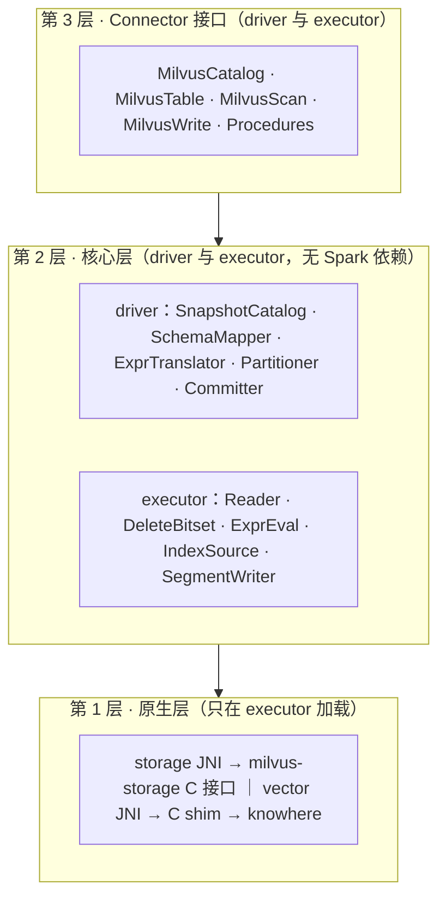
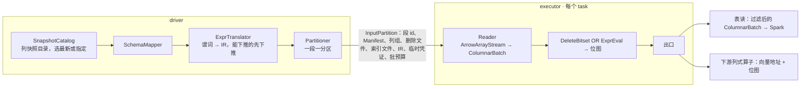

# spark-milvus 2.0 设计（工作稿）

本页保留总体设计、开放问题和决策日志，详细文档按主题分目录。[AGENTS.md](../../AGENTS.md) 说明项目原则与当前状态；进入设计后，按手头的问题选择阅读范围。

| 要解决的问题 | 位置 | 阅读入口 |
|---|---|---|
| 确认功能承诺、优先级和实现位置 | 顶层索引 | [能力规划](capabilities.md) |
| 理解总体结构、确定模块与包的归属 | architecture/ | [架构图解](architecture/overview.html)、[模块与迁移](architecture/modules.md) |
| core 怎么访问对象存储、凭证怎么下发 | architecture/ | [存储访问层](architecture/storage-access.html)（未完待续） |
| 改动对象存储凭证、provider 链、按桶配置 | architecture/ | [对象存储认证](architecture/storage-auth.html) |
| backfill 怎么访问多个桶 | apps/ | [backfill 的多桶存储访问](apps/backfill-storage.html) |
| 审查或修改构建、打包与发布配置 | engineering/ | [sbt 原则与实践](engineering/sbt.html) |
| 对比外部方案、核对设计依据 | research/ | [Lance 分析](research/lance-spark.md)、[对比图解](research/lance-spark.html) |

标记：`[草稿]` 未讨论，`[讨论中]` 有分歧，`[已定]` 结论已进第 6 节决策日志。

## 0 结论 `[草稿]`

spark-milvus 2.0 是读写 Milvus Storage 的 Spark Connector：一个 collection 在 Spark 里是一张表，读直接读对象存储上的快照，不经 Milvus 服务；写按 Milvus Storage 格式直接落对象存储，再由 Milvus 登记：已有段的新 Manifest 版本走 Milvus 现有的 BatchUpdateManifest 接口，新段的登记要 Milvus 新增接口（2.4）。代码分三层：Connector 接口层只做翻译，核心层做全部计算且不依赖 Spark，原生层封装 milvus-storage 和 knowhere 两个 C++ 库。1.x 在 tag v1.6.0 冻结，2.0 在分支 refactor/v2 上重写。

名词：
1. Milvus Storage：Milvus 的表格式，当前版本 V3，上游代码里也叫 Loon。milvus-storage 是读写它的 C++ 库。
2. knowhere：Milvus 的向量索引库，负责建索引和检索。
3. 段：存储和加载的单位，sealed 段只读，落在对象存储。列组：段的列分成的几个 Parquet 文件。Storage V2 是 2.0 之前的段布局，多列合在一个 Parquet 文件里、没有 Manifest；Storage V3 每段带 Manifest。
4. 快照：etcd 里的段元数据落到对象存储的 JSON 加 Avro，由 Milvus 生成。
5. backfill：给已有 collection 的段补写新列组的作业，1.x 里是仓库自带的独立应用。
6. 下游列式算子：在同一个 Spark 作业里直接消费 Arrow 列批的向量算子（聚类、去重、相似度 join 一类），不在本仓库。Connector 交给它们的是列批加 knowhere 封装，向量和位图以地址交出。

## 1 1.x 的问题 `[草稿]`

1.x 的七条路径（gRPC 取段元数据和建快照、gRPC Insert 写、Storage V2 读、Storage V3 读、离线快照、backfill、backup）各自带一套入口、配置、凭证和类型处理，没有一层封装 Milvus Storage 的读写。

| 问题 | 事实 |
|---|---|
| 没有分层 | 41 个源文件里 33 个 import org.apache.spark，快照解析、删除日志解码、Manifest 读取、类型映射、路径解析都在 Spark 类里。后果是这些代码要跟着每条 Spark 线各编一次，而且测它们得先拉起 SparkSession |
| 一个文件承担三层 | MilvusDataSource.scala 2879 行：TableProvider、Table、ScanBuilder、Scan，四套读路径规划（live 快路径、legacy、离线快照、backup），Hadoop 配置，桶判定，快照的建和删 |
| 读入口是 option 开关 | `milvus.uri`、`milvus.snapshot.mode`、`milvus.backup.dir` 的有无决定走哪条规划；离线模式要用户把段列表 JSON 塞进 option；没有快照对象 |
| reader 是行式的 | 6 次拷贝，必要的只有 2 次：一个 FloatVector 值从对象存储到 Spark 算子。逐行把 Arrow 装箱成 InternalRow；谓词在 reader 里逐行求值；删除记录以 Map 序列化进每个分区 |
| 原生层是上游的 Java 绑定 | unmanaged jar 引入；Arrow 钉 17.0.0 而 Spark 4 用 18；批大小和线程池不受控 |
| 类型映射四份 | DataTypeUtil 的 Milvus 到 Arrow、Milvus 到 Spark，MilvusSnapshotReader 的快照类型码到 Spark，SchemaUtil 写路径的 Spark 到 Arrow |
| 写路径两套 | `format("milvus")` 到 gRPC Insert：job 级 commit 和 abort 为空，task 级 abort 反而把缓冲刷进 Milvus；按格式写列组的 Loon 写入器只有 backfill 调得到。写完没有提交协议，也没有登记 |
| backfill 是塞在库里的应用 | 近 4900 行，含 24 个 CLI flag、29 个配置参数、自己的凭证链、和云上约定的结果 JSON；靠私有 option 穿透 DataSource 内部 |
| 向量搜索三套 | DataFrame 级暴力搜索、6 个 SQL 距离函数、reader 内嵌的 `vector.search.*`；没有 planner 规则或策略，都不用索引；vector_knn 恒返回 null |
| Milvus 服务调用没有边界 | 读（建删快照、取段元数据）和写（DescribeCollection 加 Insert）两处直接调；backfill 的 client 模式和 import 写入器是无入口的死代码 |
| 配置和凭证各自为政 | 配置键 89 个（MilvusOption 70、Properties 21），`fs.*` 有 camelCase 18 个和 snake_case 21 个两族不互译；凭证三种路径（driver 侧 Hadoop s3a、executor 侧 native 的 fs.*、backfill 自己的 provider chain）；每个分区携带含密钥的完整 option |
| 单模块构建 | 分层没有构建约束 |

## 2 目标设计 `[草稿]`

### 2.1 分层与模块

1. 第 3 层实现 DataSource V2 要的 Catalog、Table、Scan、Write、Procedure，把 Spark 类型换成核心层类型，不做计算。
2. 三条构建约束：核心层源码不出现 org.apache.spark；C 接口头文件不出现 JNI 类型；原生层只在 executor 加载。
3. sbt 模块和目录见 2.8。依赖只能向下。
4. Milvus 服务只在三处被第 3 层调用：DDL、Delete、Procedure。读路径和写文件不经它；写路径的登记是一个 Procedure，调 2.4 说的登记接口。

### 2.2 核心层对象模型

读的唯一入口是 Snapshot：主路径从快照目录选一个快照，只认 Storage V3；1.x 的三条非标准入口作适配器产出同一个 Snapshot 或 SegmentReader（capabilities.md 的 K1 到 K3）。

| 类型 | 含义 | 来源 |
|---|---|---|
| Snapshot | 一次读的固定视图：schema、分区、段列表、索引定义、时间戳 | 快照目录的 JSON 加 Avro |
| Segment | 段 id、分区 id、行数、存储版本、Manifest 路径与版本、删除文件、索引文件 | 快照的段列表 |
| Manifest | 一个段的列组文件、删除文件、统计文件 | milvus-storage 的清单文件 |
| ColumnGroup | 一个列组文件及其字段 id 集合 | Manifest |
| DeleteBitset | 快照时间戳之前生效的删除，按行号置位 | 段目录的 `_delta/` 文件 |
| StoragePath | 桶内相对 key、标准 S3、Milvus 格式（`s3://<endpoint>/<bucket>/<key>`）三种形态到 (bucket, key) 的归一 | issue #118 的设计稿，未实现；1.x 现有逻辑是几处前缀替换 |
| SchemaMapper | 字段 id、名字、Milvus 类型、Arrow 类型的唯一映射；Spark 类型的映射在 spark 层 | 快照 schema |
| Expr IR | Spark 谓词和 Milvus 表达式翻成的同一套中间表示 | ExprTranslator |

### 2.3 读路径

读不经 Milvus 服务：driver 从快照定分区和谓词，executor 用列式 reader 出批。快照由 Milvus 生成，2.0 用 CALL 建快照触发；Milvus 做了自动快照后不再需要触发（第 5 节）。

1. 下推两级都依赖第 5 节的统计 ask：主键 bloom filter（段统计文件里的布隆过滤器）剪段；row group 级 min/max 剪枝。目前 milvus-storage 的 Parquet 谓词下推是空实现。
2. 自实现的 ColumnVector 只持地址、length、offset，不搬字节；批用完再释放，处理期间 buffer 不动。
3. DeleteBitset 一段算一次并缓存；ExprEval 在列批上按列求值出位图 `[已定：放核心层]`；删除 OR 谓词合成一张位图，1 表示过滤。
4. 表读的出口是否压缩掉被过滤的行、算不算一次拷贝，待定（决策 12）。按行号取列用 Arrow 的 take。
5. 拷贝次数：Parquet 解码 1 次，聚成 UnsafeRow 1 次；下游是列式算子时只有前一次。

### 2.4 写路径

写不经 Milvus 服务：executor 直接写段目录到暂存前缀，driver 提交作业清单，登记由 Milvus 的元数据接口完成。Milvus master（2026-09-10）里两种登记的现状不同：已有段的新 Manifest 版本有接口，新段没有。

1. 作业清单放 `staging/{job}/`，内容是本次作业全部段的路径、Manifest 版本和行数。提交前先写记作业 id 的标记文件，重跑发现标记文件就跳过已提交的段；abort 或失败删暂存前缀。
2. commit 止于作业清单。登记由用户或云上作业发 `CALL milvus.system.register`（第 3 层 Procedure），核心层不调 Milvus。登记后在线可见；Connector 自己再读要先 CALL 建快照。
3. backfill 写模式：给已有段在它现有的 base_path 下追加列组文件，Manifest 出新版本（版本号严格大于当前）；登记走 Milvus 的 gRPC `BatchUpdateManifest`（或管理端口的 `CommitBackfillResult`），二者都只把该段 manifest_path 里的版本号前进，base_path 不变。前提：AddCollectionField 先于登记，否则 QueryNode 重开段时不加载新列；段必须是 Flushed；作业期间 schema 版本不能变。
4. append 写模式：写新段目录。Milvus 今天没有登记外部新段的接口；DataCoord 内部已有 `CommitSegmentManifest` 的 NewSegment 原语，缺的是 RPC、id 分配和 WAL 广播，见第 5 节。
5. 暂存位置要避开 GC：DataCoord 把 `insert_log/{coll}/{part}/{seg}` 下未登记的 V3 段目录在 `dataCoord.gc.missingTolerance`（默认 86400 秒）后回收；暂存前缀放在 `insert_log` 之外，登记时按最终路径写或移动。
6. 索引随段一起写：SegmentWriter 可以在写段的同时用 knowhere 建索引，按 Milvus 的索引文件格式写到段目录旁并登记进该段的 Manifest（2.5 第 6 条）；Global Index 的中心点到桶的映射同样写进 Milvus Storage。作业清单带上索引文件，登记时一并交给 Milvus。
7. append 不用 RequiresDistributionAndOrdering；backfill 写模式的按段分布和按行号排序见决策 10。truncate 和 overwrite 只接受全表。

### 2.5 原生层

1. 要写四样：storage JNI；knowhere 没有 C 接口，先写一层 C 函数包它的 C++ 接口（C shim）再包 JNI；索引文件加载链；DiskANN 用的本地 FileManager。
2. 约定：只传地址和长度，Arrow 走 C Data Interface，配置用 JSON；谁分配谁释放，句柄配 destroy，Arrow 靠 release 回调，JVM 用 Cleaner 兜底；错误是返回码加消息。
3. JNI 不用 Panama（JDK 22 才正式的外部函数接口），因为 Spark 4 最低 Java 17。
4. 交给 native 的路径一律是桶内相对 key，桶来自 fs.bucket_name。
5. 索引加载：索引文件在对象存储里按 Milvus binlog 格式切成多片，每片带事件头；加载时从快照的段列表拿路径，去掉事件头，按 SLICE_META（记录切片顺序的元信息）拼回 knowhere 的 BinarySet；DiskANN 先落本地目录。
6. 索引写出是加载的逆过程：knowhere serialize 出 BinarySet，按 16MB 切片，每片加 binlog 事件头，写 SLICE_META，上传到该段的索引文件路径，用 milvus-storage 的 add_index_info 登记进 Manifest；索引版本按 knowhere 的版本区间标记，供 Milvus 加载时校验。
7. 索引来源三级，由 IndexSource 统一：Milvus 建的（快照段列表里）、Spark 建并按第 6 条写回的、任务内即时建的（只在内存，不写回）。

### 2.6 接口层

| 槽位 | 2.0 |
|---|---|
| Catalog | 三段名 `milvus.db.coll`；loadTable 的 version 和 timestamp 对应快照名和时间点；createTable、dropTable 走 gRPC |
| Table | schema 来自快照；元数据列 segment id、row offset、timestamp（名字见决策 5）；行数字节数来自快照；DeleteV2 只接能翻成 Milvus 表达式的谓词 |
| ScanBuilder | 列裁剪、DataSource V2 谓词、Limit、RuntimeV2Filtering；不实现 V1 Filter |
| 旁路 | Spark 4 用 ProcedureCatalog 的 CALL，Spark 3.5 暴露为同名函数；清单见 capabilities.md 第 4 节 |

### 2.7 产物与版本

1. 版本 `2.0.0-{branch}-{arch}-SNAPSHOT`，正式版 2.0.0。分支和架构后缀保留到 native jar 改成多平台单 jar 为止。
2. 每条维护中的 Spark 线各出一个 Connector jar 和一个 bundle（2.8）；native jar 跟 Milvus 小版本发布，与 Spark 版本无关。
3. 1.x 已有 linux-x86_64 和 linux-aarch64 的构建链和 `native/linux-{arch}/` 布局（未经 CI 验证）。2.0 新增：native jar 与 Connector jar 分离、macOS 开发用产物、GPU classifier。

### 2.8 目录与模块 `[讨论中]`

不分仓：场景代码、调试工具和遗留路径都留在本仓库，用 sbt 模块隔离，依赖规则保证核心层不被它们污染。与总设计冲突、暂时不好判断的非标准功能一律按这条处理：保留，隔离，不进核心层。模块、包、目录和 1.x 到 2.0 的迁移对照见 [modules.md](architecture/modules.md)；功能清单见 [capabilities.md](capabilities.md)。

## 3 重点与顺序 `[草稿]`

不做的功能见 capabilities.md 第 9 节。判据：先做让下游列式算子能接上的部分。读路径是一切的基础，写路径的 append 等 Milvus 侧的登记接口，搜索层依赖列式读。顺序只有依赖，没有日期。

| 级别 | 顺序 | 内容 | 理由 |
|---|---|---|---|
| P0 | 1 | sbt 拆 core、native、spark4，依赖规则进构建 | 不拆，后面每一项都在旧结构上打补丁 |
| P0 | 2 | 核心层对象模型与 SnapshotCatalog；SchemaMapper 合并四份映射；StoragePath | 读的唯一入口 |
| P0 | 3 | storage JNI、列式 reader、ColumnVector、DeleteBitset | 拷贝 6 次到 2 次；下游算子能拿到地址 |
| P1 | 4 | Catalog、元数据列、统计、DataSource V2 谓词、Limit | 三段名和回表 |
| P1 | 5 | ExprTranslator、IR、求值器 | 谓词语义对齐 Milvus |
| P1 | 6 | SegmentWriter、Committer、register Procedure | backfill 登记走 BatchUpdateManifest 可先做；append 等第 5 节的 RPC |
| P2 | 7 | knowhere 的 C shim 和 JNI、索引加载、索引写出与登记、BruteForce；backfill 写模式 | 依赖列式 reader 和写路径 |
| P3 | 8 | native jar 打包、四条 Spark 线的子项目和 CI 矩阵、基准（读吞吐、拷贝次数、写端到端）；macOS 和 GPU 产物 | 打包工作，不影响设计 |
| P3 | 9 | 2.0.0 发布，云上作业切换 | |

## 4 待定决策 `[讨论中]`

只列未定的；定了的行删掉，结论进第 6 节。

| 编号 | 决策 | 选项 | 影响 |
|---|---|---|---|
| 5 | 元数据列名 | `_segment_id` 或 1.x 的 `$segment_id`；`partition` 列是否保留 | 1.x 用户的兼容 |
| 10 | backfill 写模式的按段分布和按行号排序 | a. 实现 RequiresDistributionAndOrdering；b. 场景代码自己 shuffle 后再写 | 写路径接口 |
| 11 | 谁建快照、建前是否先 Flush | a. Connector 的 CALL 建，先 Flush；b. 只用 Milvus 自动快照 | 读延迟；1.x 快路径不 Flush |
| 19 | 按分区报分区（capabilities R19）是否值得做 | a. 做，join 少一次 shuffle；b. 不做，段内主键无序，收益可能被 Milvus 的段分布抵消 | 需要实测 |
| 13 | `_delta/` 删除文件格式 | 两列 Parquet 与旧 binlog 容器格式的共存期 | DeleteBitset 的解析器 |
| 16 | 暴力搜索的形态与位置（能力已定保留，见决策日志） | 入口：DataFrame 方法、SQL 函数、读选项三选几；执行：knowhere 的 BruteForce 在原生层，JVM 实现作参照或兜底；归属：spark 层能力还是 apps 场景 | 能力清单和模块规划一起定 |

## 5 需要 Milvus 侧提供的 `[草稿]`

| 事项 | 现状（master 13cd0e99f） | 缺口 | 影响的设计点 |
|---|---|---|---|
| 登记外部写入的新段 | 无接口 | 新增 RegisterSegments RPC：复用 DataCoord 的 CommitSegmentManifest NewSegment 原语，含段 id 分配、WAL 广播、行数和统计 | 2.4 append |
| 读段当前的 base_path 和 Manifest 版本 | 无公开 API 暴露 manifest_path，只能从快照 metadata 取 | GetPersistentSegmentInfo 或新 RPC 暴露 manifest_path | 2.4 backfill，否则每次 backfill 前都要先打快照 |
| backfill 期间冻结目标段 | 无；BatchUpdateManifest 的 ack 路径不持段级 Manifest 锁，与 compaction、stats、索引、schema 变更竞争 | 段级租约，或把 ack 接到 CommitSegmentManifests 的串行路径 | 2.4 backfill |
| 登记时校验 Manifest 内容 | BatchUpdateManifest 不打开 Manifest 文件，不校验列和行数 | 登记时读 Manifest 校验列组、行数、schema 版本 | 2.4 |
| 列级 min/max 统计，row group 统计剪枝 | milvus-storage 的 Parquet 谓词下推是空实现 | 写统计文件，reader 用统计剪枝 | 2.3 下推两级 |
| Milvus 把索引文件写进段的 Manifest；加载 Connector 写回的索引 | milvus-storage 的 add_index_info 接口已有 | Milvus 服务填写并读取 Manifest 里的索引登记，校验 knowhere 版本区间 | 2.5 索引加载与写出 |
| 自动快照加保留策略；快照目录里加 catalog 文件；格式契约文档 | 快照由 CreateSnapshot 手动建 | | 2.3 读入口，决策 11 |

## 6 决策日志

| 日期 | 决策 | 结论 |
|---|---|---|
| 2026-09-09 | 版本号与分支 | 2.0.0，refactor/v2 |
| 2026-09-09 | 谓词求值位置 | 核心层 |
| 2026-09-09 | Spark 用 knowhere 建的索引是否写回对象存储、按 Milvus 的索引文件格式登记进段清单，让 Milvus 在线也能加载 | 2.0 首版只做反方向（加载 Milvus 建的索引到 knowhere）和任务内即时建索引；写回随 Global Index（底库按中心点重分布、每桶建索引、映射写进格式）一起做，因为它是唯一需要写回的场景 |
| 2026-09-10 | 1.x 冻结点 | tag v1.6.0，main 只收 1.x 修复 |
| 2026-09-10 | backfill 的模块归属 | 不分仓；仓库内用 sbt 模块隔离，场景与遗留代码进 apps 模块，依赖只能向下。同一政策适用于调试工具、JVM 向量搜索、backup 入口、gRPC Insert |
| 2026-09-10 | 支持的 Spark 版本 | 跟 lance-spark 一样：每条维护中的 Spark 线一个子项目、一份源码、各自钉 Spark 和 Arrow、各出产物；首发覆盖 3.5、4.0、4.1、4.2 |
| 2026-09-10 | 索引写回 | 推翻 09-09 那条：Spark 建的索引按 Milvus 索引文件格式写回并登记进 Manifest，是 2.0 的功能之一，与加载链和 Global Index 映射一起做。2.0 是完整设计，不按场景裁剪 |
| 2026-09-10 | 暴力搜索能力 | 保留。1.x 的 JVM 实现先留在 apps/search；正式形态（入口、原生层 BruteForce、归属）在能力规划时一起设计 |
| 2026-09-10 | Scala 版本 | 跟 lance-spark 一样：3.5 线出 2.12 和 2.13，4.x 线只出 2.13；交叉编译范围见 modules.md 第 1 节 |
| 2026-09-10 | 非标准功能的处理原则 | 与总设计冲突、暂时不好判断的功能一律保留并用模块隔离，不进核心层。据此：Storage V2 packed 读、离线 option 塞段列表、backup 三个入口进 compat 模块，作 Snapshot 或 Reader 的适配器；gRPC Insert 进 apps/legacy 作小批量兜底 |
| 2026-09-10 | 写路径的登记接口 | 读 Milvus master 得出：backfill 走现有的 BatchUpdateManifest / CommitBackfillResult（只前进已有段的 Manifest 版本）；append 要 Milvus 新增 RegisterSegments RPC。之前写的「登记走 External Collection refresh」是误判，已从设计里删除。分析见 spark-milvus-design-docs/milvus-registration-analysis-2026-09-10.md |
| 2026-09-10 | 第 4 层的模块名 | 从 ops 改成 apps：内部已有一个叫 OPS 的系统，容易混。四个包都是对外的入口，apps 名副其实 |
| 2026-09-10 | 集成测试模块名 | 从 it 改成 integration：it 来自 sbt 内置的 IntegrationTest 配置，而它 sbt 1.9 起废弃、sbt 2 已删除，2.0 用独立 project 不再依赖它 |
| 2026-09-10 | project 数量 | 21 砍到 11。只有 spark 必须按线拆；fat jar 是 spark-<line> 上的 assembly 任务，不单独成 bundle 模块（那是 Maven 的限制）；apps 和 integration 各只建一个，加线是加一行配置 |
| 2026-09-10 | Spark 与 Arrow 的版本钉法 | Spark 取每条线最低的维护 patch（编译版本就是兼容下限），Arrow 与本线 Spark 自带的对齐；4.2 线的 Arrow 从 18.3.0 改成 19.0.0 |
| 2026-09-10 | CALL 的实现方式 | 走自己的 SQL 语法扩展加逻辑节点加 planner 策略，不用 Spark 4.0 才有的 ProcedureCatalog：后者要为 3.5 再写一套函数入口，同一批动作两份实现 |
| 2026-09-10 | 决策 17 antlr | SQL 扩展的语法放共享目录、每条线各生成一份、运行时用 Spark 自带的；core 里的 Milvus 表达式解析器不用 antlr（core 是跨线单产物，生成码不通用），改手写 |
| 2026-09-10 | catalog 的按线拆分 | 主体进 spark-base，按线只留一个工厂方法 |
| 2026-09-11 | 目录与命名 | 目录全部平铺，不设分组目录（分组目录不是 sbt 模块，在 IDE 里与真模块混同）；模块显示名跟目录一致，发布坐标另设 moduleName；只有一个消费者的共享源码目录不设（apps 与 integration 的 base 删掉），spark-base 有四个消费者保留 |
| 2026-09-11 | 共享源码不做成 project | IDE 里那个合成的 spark-base-sources 模块来自「多个项目声明同一个源码根」，把 spark-base 做成 project 去不掉它，只多一个模块和一次编译；最低线的 API 约束由 spark-3.5 本来就提供 |
| 2026-09-11 | 核心层无 Spark 依赖的理由 | 更正：不是为了给 Ray 复用（Ray 是 Python，依赖不了 JVM 的 jar，它共用的是第 1 层的 C 接口）。理由是四条 Spark 线共用一个产物、测试不拉 SparkSession、边界有编译期检查 |
| 2026-09-11 | core 怎么读对象存储 | core 定一个五方法的 `ObjectStore` 接口，唯一实现走 Hadoop FileSystem 并放在 core 里，`hadoop-common` 标 provided；原生云 SDK 不进 2.0 首版。定接口只有一条理由立得住：换实现时不改 core 的公开签名，而 1.x 已经踩过 Hadoop 的 URI 与 endpoint 坑（#110 的 OSS 路径、`MilvusOption` 里绕开 FileSystem 缓存的补丁）。Iceberg、Trino、Hudi 立同类接口的三条动因在我们身上都不成立：我们只有一个引擎，1.x 早已把 `MilvusOption` 而不是 `Configuration` 放进 InputPartition，Hadoop 的依赖树本来就由 Spark 提供。接口按对象存储描，不照 Hadoop FileSystem 描——Hudi 的 HoodieStorage 照着描，24 个抽象方法里漏出 `getDefaultBlockSize` 这类 HDFS 概念，至今在改 |
| 2026-09-11 | 存量代码的归属 | 先归属后重构：41 个 1.x 源文件按目标模块搬完，src/ 清空，这一轮不改语义。挡路的 6 处反向引用全部是文件放错位置，逐个纠正后归属分组与文档有三处出入：Properties 产出上游 Java 绑定的类型留在第 3 层，暴力搜索在读路径上不是 app，format("milvus") 整条写链要等 W7 的注册表才能下放 apps。明细见 modules.md 第 5 节 |
| 2026-09-11 | 第 2 层的日志 | core 自带 slf4j 的 Logging 门面，不用 Spark 的。六个待迁文件只因为 Spark 的 Logging 才算 Spark 代码，全仓实际日志调用只有 7 处 |
| 2026-09-11 | 存量 Spark 代码放 spark-base 还是单条线 | 放 spark-base。1.x 的 main 与 test 在 3.5.5、4.0.0、4.2.0 上都编得过，四条线各编一遍没有兼容风险，而单条线会让另外三条线一直是空的 |
| 2026-09-11 | 代码与文档的语言 | 代码、注释、构建脚本、README 一律英文；docs/design 的设计文档保持中文 |
| 2026-09-11 | 仓库的入口文档 | 仓库根的 AGENTS.md 是唯一入口，只做路由不放内容。CLAUDE.md 是它的软链，Codex 原生读 AGENTS.md，一份内容两个工具都认。不放 .claude/skills：那个目录在 .gitignore 里，而且只有 Claude 认得 |
| 2026-09-11 | CI 的覆盖面 | 触发分支加上 refactor/v2；CI 跑格式检查、十个模块的编译、integration-4.0 的单独编译、core/compat/client 的 2.12 交叉编译、以及排除两个原生用例后的全部单测。集成测试编译但不跑，它要真的 Milvus 和 MinIO |
| 2026-09-11 | integration-4.0 不进 root 的 aggregate | 迁移后它的用例变成普通 Test 配置，`sbt test` 会把它带上并失败。1.x 里它们在 `it` 配置下不会被带上，移出 aggregate 恢复这个行为；CI 用 integration40/Test/compile 显式编译 |
| 2026-09-11 | 原生库的位置 | 从 `src/main/resources/native` 移到 `native-storage/src/main/resources/native`。Dockerfile、Makefile、两个 demo 脚本、.gitignore、测试的 java.library.path 一起改。fat jar 的 30516 个条目前后零差异 |
| 2026-09-11 | 3.5 线的 Scala 2.12 产物 | 暂时出不来。上游 milvus-storage 的 Java 绑定只发 2.13，3.5 线还依赖它，交叉编译会因为 Scala 签名版本不符而失败。native-storage 替换掉绑定之后解除。core、compat、client 的 2.12 交叉编译已在 CI 里 |
| 2026-09-11 | spark-mllib 的版本 | 按线取，不用 1.x 的默认值。spark-mllib_2.12 在 Spark 4 不存在，3.5 线沿用 4.0.0 会解析失败；而在 2.13 上它会静默地把 Spark 4.0 的 MLlib 拉进 3.5 线 |
| 2026-09-11 | 索引靠什么保持为真 | 能力编号是脊柱：capabilities.md 的行指向包，包的 package.scala 反过来声明编号。新增 `sbt checkCapabilityIndex` 挂进 CI，抓三类漂移：有行没人认领、包声明了不存在的编号、实现位置指向不存在的包。尚未落地的能力写进 capabilities.md 第 11 节，脚本读它，不自己维护名单 |
| 2026-09-11 | AGENTS.md 的分级 | 第一级要披露本级该披露的东西，不是只做目录。补上四层模型（规则一和规则三引用它，缺了就没法执行）、能力编号这条脊柱、工作现在到哪了、明确不做的事，以及维护契约。删掉原来那句「本页不放内容」 |
| 2026-09-11 | 迁移期根产物的 POM | 继续只发布根 assembly；POM 按组织和带 Scala 后缀的产物名移除已打包的 spark40、apps40 内部依赖，保留外部依赖与构建时的模块依赖。仅替换 packageBin 不会改 POM，直接沿用会让消费者解析未发布的模块；暂不为此新增发布 project |
| 2026-09-11 | 构建入口的集成测试任务 | Dockerfile 和 Makefile 与 CI 一致，改用 integration40/Test/compile；旧 IntegrationTest 配置已删除，继续调用会在 assembly 和发布前失败 |
| 2026-09-11 | 3.5 线的 Arrow 基线纠正 | Spark 3.5.5 的官方 POM 指定 12.0.1，原先的 15.0.2 不符合按 Spark 自带版本对齐的约束；修改 Versions.scala、模块约束、可视化与 Lance 对照文档。采用发行版基线，不覆盖 Spark 自带 Arrow；这次修正本身不代表已完成运行兼容验证 |
| 2026-09-11 | sbt 的可维护性 | 保留现有文件、显式 project 声明和按线工厂，不新增 Packaging.scala 或通用构建框架。build.sbt 依次放公共设置、模块、根产物打包发布；库版本集中 Versions，依赖组合放 Dependencies，公共 settings 放 Modules。复用现有 jacksonPin 并集中临时 JNI 路径，模块特有配置仍就近声明；保留现有版本与作用域，根产物沿用的 Arrow 17 明确标为 legacyRootArrow，历史理由留在本日志 |
| 2026-09-11 | 设计原则写进 AGENTS.md | 五条判断力原则排在四条机械约束前面：整体自洽优先于完成任务；从根因解决禁止外围兜底；禁止烟囱式开发；需要重构就重构且永远不评估工时；删除是设计工作但禁止静默删除，必须先说明依据和风险并等人确认。推迟只有三个合法理由——决策没定、依赖没建好、事实没查清；「工作量大」「这是重构不是本次范围」都不算 |
| 2026-09-11 | 设计先行进原则 | 任何能力开工前必须确认四件事：capabilities.md 里有行、它依赖的决策都已出第 4 节、落点包存在且 package.scala 写明职责、governing 的设计已经成文。少一样，那一样就是当前的工作。子系统的设计说不进「能力行 + README 的分层」时，才在 docs/design 下单开一份文件，并挂进 AGENTS.md 的路由表。文档分级本身是为了减少每次会话的预加载：每条事实只写在需要它的那一级，其余级别只链接 |
| 2026-09-11 | sbt 原则与实践成文 | [sbt.html](engineering/sbt.html) 统一维护构建约定，仓库内 skill 引用并执行，AGENTS.md 提供入口。以维护者能否就近看懂配置判断抽象：四条 Spark 线保留工厂，单实例 apps/integration 直接声明；发布开关写在模块处，公共设置名称说明其效果；root 的运行、assembly、发布细节在同一文件按职责命名。不以行数、固定文件数或消除全部重复为目标，保留现有依赖与交付契约 |
| 2026-09-11 | 文档用什么格式写 | 子系统的详细设计写 HTML，不写 md。md 是写起来方便，但现在文档是 agent 写的，方便写不是约束，方便人读才是；HTML 能带图、带撑得住的表格、带锚点互链。md 留在三处：AGENTS.md 这一级、构建会解析的文件（capabilities.md 被 checkCapabilityIndex 读）、以及靠 diff 评审的追加型内容（决策日志）。同一份内容不许两种格式并存 |
| 2026-09-11 | 设计文档按主题分目录 | 详细设计不再平铺在 docs/design 顶层；顶层保留总体入口、决策日志和能力索引，架构与模块边界归 architecture/，构建与开发规范归 engineering/，外部方案对比归 research/。其他主题按实际内容增加，不预建空分类、不逐篇套目录。入口说明各主题的阅读时机，详细规则只维护一份；新增或移动文档同步更新入口、链接及 skill/构建引用。规则见 [docs/writing.md](../writing.md#design-document-layout)，用于降低查找成本并支持按任务逐层阅读 |
| 2026-09-11 | 存量设计文档目录整理 | 五份专题文档移入 architecture/、engineering/、research/；顶层只保留 README.md 和 capabilities.md。总体入口按阅读目的链接到专题，现有文档内容保留，移动后的相对链接、AGENTS.md、skill 和源码中的文档路径同步更新；能力索引路径与解析表格保持不变 |
| 2026-09-11 | 技术解释禁止类比与黑话 | 回答技术问题只描述机制：打开哪个文件、读哪个字段、失败长什么样。类比要求读者再翻译一次，误解就从翻译里进来；临时造的简称同理，它逼读者记一个仓库里不存在的定义。本次会话的实例：解释存储访问层时用了「取字节 / 解释字节」这对当场造的词，问了三遍才给出具体答案——读一张表要物理打开五种文件，JVM 开四种、原生库开第五种。规则适用于解释、代码注释和命名，不限于文档 |
| 2026-09-11 | 存储访问层的方案被推翻 | 原方案是在 Scala 里定 ObjectStore、用 Hadoop FileSystem 实现，前提是「原生层只打开数据文件」。读 milvus-storage 的 C 头文件发现前提不成立：`loon_filesystem_*` 已是一整套文件系统 API（read_file_all、open_reader 加 readat、list_dir、get_file_info、open_writer、create_dir、delete_file、指标），凭证包在 properties 里，后端有 s3/gcp/azure/local；`loon_exttable_read_manifest` 直接返回解析好的列组、删除日志与统计；`loon_transaction_*` 覆盖写侧提交。在它旁边再建一条 Scala 通路是烟囱。路线级决定（统一走 C 的 filesystem 还是保留 JVM 通路）待查清四件事后再定：小文件跨 JNI 开销、无 HDFS 实现的影响、平台注入的 s3a 配置是否被依赖、OSS 走 S3 兼容端点的行为差异。进度记在 [storage-access.html](architecture/storage-access.html)，先做认证 |
| 2026-09-11 | 对象存储认证的机制与取舍 | 先查后定。Hadoop 兼容文件系统屏蔽的是文件访问 API 差异不是认证差异——按 scheme 分发、每个文件系统一个键命名空间、按桶/按账号覆盖、Spark 用 spark.hadoop.* 透传。由此定五条原则：不构造凭证、只写按桶键、不覆盖已设的 provider、不内置默认值、不重复。据此判定现有 provider 链逻辑保留：跨账号双桶（backfill 同时读源桶写 Milvus 桶）、平台已选的 AssumeRole 不可替换、静态密钥要钉住 provider 防遮蔽，三者都是真实场景；显式 IRSA 链是规避 SDK v1 默认链在 EKS 上会拿到节点角色的缺陷。要治的只有六处复制和写死的 a-bucket/localhost:9000/minioadmin。实测：hadoop-aws 3.4.1 的 v1→v2 映射表只有五条，WebIdentityTokenCredentialsProvider 不在其中，靠我们自带的 aws-java-sdk-core 1.12.780 经 AwsV1BindingSupport 实例化才工作——删掉这个依赖会在连接时失败而非编译期。另测得 Milvus 的 storageType 只有 local/remote，本层永不碰 HDFS。见 [storage-auth.html](architecture/storage-auth.html) 与仓库内 skill |
| 2026-09-11 | AWS SDK v1 升 v2 | 必须升，理由是供应链不是技术：v1 已于 2025-12-31 结束支持，不再有安全补丁。全仓对 com.amazonaws 的引用只有五处且全是配置里的类名字符串，没有一处 import，所以不涉及代码迁移。顺序不可颠倒——先换类名、在真实 EKS 上验证、再删 aws-java-sdk-core 依赖；先删依赖会在建 FileSystem 那一刻失败而非编译期。不选 fs.s3a.aws.credentials.provider.mapping，那是给改不了代码的人用的逃生口。顺带发现 MilvusOption.getConf 用的正是 backfill 注释指名在 EKS 上会拿到节点角色的 DefaultAWSCredentialsProviderChain，读路径踩着 backfill 刻意避开的缺陷，要一并改 |
| 2026-09-11 | 多云覆盖的缺口 | Milvus 支持 aws/gcp/gcpnative/azure/aliyun/tencent 六种后端，我们 JVM 侧只有 hadoop-aws 与 hadoop-aliyun，代码只认 s3/s3a/oss/file 四种 scheme。客户的 Milvus 建在 Azure 或 GCS 上时连快照都打不开，读在第一步失败，而原生层有 azure 与 gcp 实现。补齐有两条路：JVM 侧加 hadoop-azure 与 GCS connector 各配一套认证键，或统一走 C 的 filesystem 顺带关掉缺口。这是路线决定多出来的一条理由 |
| 2026-09-11 | 多云的解法已经在 C 层 | milvus-storage 的文件系统建在 arrow::fs::FileSystem 上，cloud_provider 认识七个：aws、aliyun、azure、gcp、huawei、tencent、local。s3/provider/ 下有 AliyunRAMSTSClient、AliyunOIDCAssumeRoleChainProvider（ACK 上对应 IRSA 的那套）、TencentCloudSTSClient、HuaweiCloudSTSClient；azure 有 azurefs.cc 与 SAS 令牌策略，gcp 有独立凭证 provider。我们 JVM 侧只有 S3 与 OSS。在 JVM 侧补齐等于用 Scala 重写这几家的 STS 客户端，是烟囱。这条基本定死了统一走 C filesystem 的路线，剩下的只有性能与部署依赖的核实 |
| 2026-09-11 | 依赖按需声明 | legacyDeps 原本把 17 项一并发给四条 spark 线和 apps-4.0，其中五项那两层没有任何模块 import：parquet-hadoop、avro、grpc-netty、scalapb-runtime-grpc、hadoop-aliyun；而 core、compat、client 各自已经就近声明了自己要的那份。删掉多余的一份。区分两种作用域：provided 的删了不影响产物，只影响编译期可见性与测试 classpath；compile 的会进 fat jar，其中三个 aws sdk 没人 import 但运行时给 provider 类名兜底，删了会在建 FileSystem 那一刻失败，所以不动，绑在 SDK v2 那件事上。改完 fat jar 30516 个条目零差异。过程中编译器抓到一处 grep 漏掉的用法：apps-4.0 的一个测试用全限定名引用 org.apache.hadoop.fs.aliyun.oss.AliyunOSSUtils，所以 hadoop-aliyun 改为只发给 apps-4.0 |
| 2026-09-11 | connector 不再自造 Configuration | 删掉 MilvusOption 的 getConf 与 getFileSystem。前者自己 new 一个 Configuration 从零配 fs.s3a.*，后者自己 new 一个 S3AFileSystem 绕开 FileSystem 缓存，两个方法都没有生产调用方，只有一个测试在断言 getConf 的产物，随之删除。删完 spark-base 对 hadoop-aws 的编译期依赖归零，hadoop-aws 因此也移出 legacyDeps。连接器从此只继承 Spark 给的 Configuration |
| 2026-09-11 | 我们这边的 v1 类名换成 v2 | backfill、ListV2SegmentsApp 与对应测试断言里的 WebIdentityTokenCredentialsProvider 与 EnvironmentVariableCredentialsProvider 换成 software.amazon.awssdk 的对应类；仓库里已无 v1 类名。aws-java-sdk-core 依赖暂不删：删它的前置是查清运行时由谁提供 v1 实现类。已核实的是——云上 SparkCspRuntimeSupport 第 51 行注入 v1 的 DefaultAWSCredentialsProviderChain 作为 assumed.role.credentials.provider，而同仓库的 spark-data-service/pom.xml 自己带 aws-java-sdk-bundle 1.12.262 并用 shade 打包；未核实的是 shade 是否 relocate、两份 v1 谁胜出、开源用户 classpath 上有没有。这件事从构建文件看不出来，要在真实部署上看。见 [storage-auth.html](architecture/storage-auth.html#platform-blocker) |
| 2026-09-11 | sbt 项目声明采用惯用 DSL | 变量名与项目 ID 相同的普通模块使用 project.in(file(...))，root 也统一点号写法；原生模块的带连字符 ID 和 Spark 工厂的动态 ID 保留 Project(id, base)。保持 ID、目录及所有 settings 不变，消除可以简写的显式构造与对应 IDE 提示；规则与示例同步到 [sbt 规范](engineering/sbt.html#modules) |
| 2026-09-11 | sbt 声明的阅读顺序 | 基础默认值与 root 在前，模块按层排列，运行、打包、发布实现随后展开；发布段集中为元数据、仓库策略、root 发布实现三组，共享输入靠近使用处。只移动现有声明并补充分组注释，保持设置值、作用域及模块关系；不增加文件或 helper，避免增加阅读跳转。顺序写入 [sbt 规范](engineering/sbt.html#reading) |
| 2026-09-11 | v2 的 WebIdentity provider 要带 sts 模块 | 换类名时差点引入它本来要防的 bug。v2 的 WebIdentityTokenFileCredentialsProvider 要找 WebIdentityTokenCredentialsProviderFactory 的实现，它在 software.amazon.awssdk:sts 里。缺了它 provider 构造不报错（类里有 loadException 字段存住失败），取凭证时才抛；而在 provider 链里一个抛了就换下一个，落到 IAMInstanceCredentialsProvider 拿到节点角色。改之前我们 jar 里 sts 是 0 个类——hadoopAws 排除了 awssdk:bundle，我们只单加了 s3 与 s3-transfer-manager。已加 sts，验证 StsWebIdentityCredentialsProviderFactory 进了 jar。顺带发现 v1 也一样需要 STS 而我们 jar 里同样没有，它一直靠云上 spark-data-service 带的 aws-java-sdk-bundle：我们的 fat jar 从来不是自足的，开源部署要单独验 |
| 2026-09-11 | backfill 写 provider 链的真实原因 | 不是认证，是一个作业要用不同身份访问多个桶，而 Spark 会话级配置只能表达一套。S3 有按桶覆盖（hadoop-aws 的 propagateBucketOptions 与 fs.s3a.bucket. 前缀），用它是对的；hadoop-aliyun 3.4.1 的 jar 里这两样一处都没有，OSS 只能备份八个全局键、改写、还原，并设 fs.oss.impl.disable.cache=true 防缓存住旧凭证。那是绕过 hadoop-aliyun 的能力缺失，不是设计。另查明：那条显式 provider 链只在 use_iam 为真且该桶没有已配 AssumeRole 时才设，而平台会全局设 AssumedRole provider，所以在云上根本不执行，只在开源部署生效。内容按层拆到 [apps/backfill-storage.html](apps/backfill-storage.html)，architecture 那份只留通用机制与原则 |
| 2026-09-11 | 存储访问层的路线 | 打开文件全部经 milvus-storage 的 C filesystem，JVM 侧走 native-storage 的 JNI，不保留 Hadoop 通路。理由是格式实现与 Milvus 天然一致，milvus-storage 升级时不需要两边再对一遍。由此推翻前一条日志里「平台要为我们接一套显式临时凭证」的判断：查 SparkCspRuntimeSupport.dataRoleConf 得知平台注入的是角色 ARN、会话名和 provider 类名，没有 access key、secret 或 session token；机器身份是 pod 里 IRSA/RRSA 投影的 web identity token。C 层读同一批环境变量、做同样的两步（机器身份换临时凭证，再 AssumeRole 换成客户角色），值因此是可复用的。但可复用说的是值，不是说 core 该去读它们：core 只认一套 fs.*，不认识云也不认识 scheme，按云分派是 C 层的 fs.cloud_provider，aws/aliyun/tencent/huawei/gcp/azure/local 七家一视同仁，支持新的云 core 一行不改；Hadoop 键的翻译（fs.s3a.assumed.role.arn→fs.role_arn 等，全表见设计 3.3）落在产出配置的一方（平台直接注入 fs.*）或第 3 层一个带退出条件的垫片上，都在 core 之外。把翻译放进 core 等于把 Hadoop 按 scheme 分派本来替我们做的事捡回来，还是按云做的。据此「平台侧零改动」作废：存量部署要多一套配置，托管平台那边要排期，这是离开 Hadoop 的真实代价。另外，平台今天只发 aws 和 alicloud 两种 CSP（SparkCspRuntimeSupport 其余一律抛 Unsupported），但那是现状不是设计输入——connector 要支持的是全部七家。另查到 extfs.<名字>.* 是一等的多文件系统注册机制，按 address+bucket 匹配，直接取代 backfill 备份改写还原八个 fs.oss.* 全局键那套。三处对不上：没有 fs.session_token 属性（S3Options::ConfigureAccessKey 第三个参数没人喂），阿里云 STS 端点写死 https://sts.aliyuncs.com/ 且 fs.iam_endpoint 标为 Deprecated 无人使用，阿里云会话时长不可配。AWS C++ SDK 默认链把 web identity 排在实例元数据之前，Java v1 上那个会拿到节点角色的顺序问题在这条路上不存在。决策 20（属性包由谁产出）与 22（身份进不进工厂签名）随之消失：只有一份属性包，身份就在里面；决策 21 不受影响。长作业不会掉凭证：hadoop-aws 的 AssumedRoleCredentialProvider、C 层 AWS 的 STSAssumeRoleCredentialsProvider、C 层阿里云的 AliyunOIDCAssumeRoleChainProvider 都是每个进程各持一个自我刷新的 provider，阿里云那条每次刷新重新读 ALIBABA_CLOUD_OIDC_TOKEN_FILE，kubelet 轮换投影 token 也跟得上；会过期的是 driver 换一次再分发临时凭证那种做法（云上 Lance 那条路），我们不走。没有待定的设计项；要实跑确认的三条在 [storage-access.html](architecture/storage-access.html) 第八节。技能 [spark-milvus-storage-access](../../.agents/skills/spark-milvus-storage-access/SKILL.md) |
| 2026-09-11 | 决策 21：写死的开发默认值 | 删掉，缺一项就启动报错。生产路径上两处：loon/Properties.scala 的 fs.address 缺省 localhost:9000、fs.bucket_name 缺省 a-bucket、两个密钥缺省 minioadmin；write/MilvusLoonWriter.scala 的 generateBasePath 桶名缺省 a-bucket，会把段写到读侧不会去找的路径上。这是对外可见的行为变化：今天漏配一项会连上开发用的 MinIO 并在请求时失败，改完是启动即报错。MilvusOption.scala 的 MilvusS3Option.apply 有同一批默认值，但该类在生产代码里零引用、只被自己的四个测试用，整类删除另提。落点见 [storage-access.html](architecture/storage-access.html) 第六节第 4 条 |
| 2026-09-11 | manifest 由谁解析 | C 层。判断依据统一成一条：格式属于 milvus-storage 就由 C 解析，属于 Milvus 的元数据才由 JVM 解析。milvus-storage 是 Milvus 原生实现，格式以它为准；JVM 侧再写一份等于同一格式两份实现，版本一升要对两遍。据此划线：快照 JSON 归 JVM（它装的是 collection schema、字段类型、段列表、base_path，是 Milvus 的元数据，C 侧只有 iceberg/paimon 的 snapshot id，没有 Milvus 的）；V3 段 manifest、V2 段 manifest、删除文件内容、V2 packed 的 parquet footer 字段 id、列组数据、索引文件全归 C。C 今天缺三项，作为需求提给 milvus-storage 而不是在 Scala 里重写：读 V2 段 manifest（manifest_list 列的是裸 avro 无 OCF 头，现有 BuildLoonColumnGroups 只是 builder 不读文件）、读 V2 packed 的 parquet footer 取字段 id、解析删除文件内容（格式本身是决策 13）。三项落地前 JVM 侧那几份解析器还在跑，退出条件就是这三项。落点见 [storage-access.html](architecture/storage-access.html) 第五节 |
| 2026-09-11 | 三层衔接与 connector 接口对齐 | 四个边界各只许过一种东西：Spark↔第3层 过可序列化的 InputPartition 与 ColumnarBatch；第3层↔core 过 (bucket,key)、fs.* 的 Map、Arrow 批；core↔JNI 过 Map[String,String]、路径、ArrowArray/ArrowSchema；JNI↔C 过 const char* 数组、进程内 handle、ArrowArrayStream。handle 是进程内指针不可序列化，因此 InputPartition 里只装描述（段路径、manifest 版本、列名、fs.* 的 map），executor 上现开现关。逐条对完 Spark DSv2 要的能力，一条要给上游提修复：(1) 谓词下推到 C 对 parquet 无效且静默——FormatReader::set_predicate 基类是空实现直接返回 OK，只有 VortexFormatReader 覆写，而 Vortex 在 capabilities 第 10 节明确不做；判断：这是缺陷不是「还没做」——接受参数、返回成功、忽略参数，正是 AGENTS.md 禁止的那个形状，基类该返回 NotImplemented。两个动作：给 milvus-storage 提这个修复；core.io 根本不暴露 get_filtered_stream，不是记得别调。但修不修都不改设计：R6/R7 在 JVM 侧算是 2026-09-09 定的，理由与空实现无关——R7 要按 Milvus 的 Plan.g4 逐条复刻 JSON/Array/json_contains 语义，C 层没有这套；真正省 I/O 的是 R10 那条统计剪枝。R10 对得上但依赖仓库外的两件事，而且不是新发现：本节第 5 节早有对应行「列级 min/max 统计，row group 统计剪枝」。关键在于 JVM 侧做不了——FFI 里没有任何 row group 入参，loon_segment_reader_open 只收 segment_path/version/schema/needed_columns/config/properties，JVM 读了 footer 算出该跳哪些 row group 也递不进去，剪枝必须发生在读的那一侧。要 Milvus 写统计文件并登记进 manifest 的 stats（那个 map 的键形如 "bloom_filter.100"，值是 {paths, metadata}，R9 的段级布隆过滤器走同一条路），再要 milvus-storage 的 reader 用它剪 row group。另更正：R13 要的是行数和字节数不是列级 min/max，行数从 ColumnGroupFile 的 end_index-start_index 求和或 loon_exttable_get_file_info，字节数从 loon_filesystem_get_file_info 的 size，R13 不缺东西。manifest 里几个易误认的字段：Manifest.stats 是辅助统计文件的路径表不是 min/max；ColumnGroupFile 只有 path/start_index/end_index 加自由 properties；LoonChunkMetadata 只有 number_of_rows 和 estimated_memsz。对得上的：R16 靠 loon_exttable_read_manifest；R4/R17 靠 loon_segment_reader_get_stream 出 ArrowArrayStream 零拷贝；R5 靠 loon_segment_reader_open 的 needed_columns；R14 靠 loon_segment_reader_take；写侧 loon_segment_writer_* 出 LoonSegmentWriteOutput，提交走 loon_transaction_*。C 取凭证只有两条通道——属性包与进程环境，真正的凭证不走属性包（静态密钥例外）；六朵云的托管 K8s 都是投影 web identity token 文件加环境变量指路；fs.storage_type 只有 local/remote，没有 HDFS。全部落在 [storage-access.html](architecture/storage-access.html) 第三、四节，含一张边界图 |
| 2026-09-11 | V2 段格式保留，不做只支持 V3 | 查 Milvus master：存储版本升级 compaction 的目标版本是 targetVersion := storage.StorageV2，只有 common.storage.useLoonFFI 为真才改成 V3，而这个开关 2.6.7 引入、默认 false，云上部署配置里也没有显式打开。所以默认部署的 Milvus 新段写 V2、compaction 也升到 V2，V3 是要显式开的。V2 不是老版本而是当前默认，只支持 V3 等于在默认配置的 Milvus 上一个段都读不了；K1「Storage V2 packed 段」在 capabilities.md 里是 P0。由此保留 V2，对 milvus-storage 的需求里「读 V2 段 manifest」「读 V2 packed 的 parquet footer 取字段 id」两项照提；它们会随 useLoonFFI 默认打开而自然失效，但那个时间点不由我们控制，按要做的排。另外把散在四处的上游需求合并成一张表，放在 [storage-access.html](architecture/storage-access.html) 第七节，共七项；row group 统计剪枝不在其中，它要 Milvus 与 milvus-storage 各做一件事，已在本文件第 5 节 |
| 2026-09-11 | 段 manifest 归属更正，上游需求砍到六项 | 撤回「让 C 读 V2 段 manifest」这项需求：查 Milvus 的 internal/snapshotio/snapshot.go，段 manifest 是 Milvus 自己的格式——用 github.com/hamba/avro/v2 解，内嵌 manifestSchemaV1..V4 四个 schema，SnapshotFormatVersion = 4，milvus-storage 完全不认识它。按「格式属于 milvus-storage 才由 C 解析」这条规则，它归 JVM；让下层去认识上层的元数据格式方向是反的。storage-access.html 第五节那张表相应更正：段 manifest 归 JVM，C 只解 V3 段的 _metadata/manifest-N.avro。剩六项：V2 packed footer 取 field id 的 FFI 出口（C++ 侧 FieldIDList::Make 与 GetFieldIDMapping 已有，只缺出口，50-100 行）、解析删除文件内容（待决策 13 定归属）、set_predicate 基类返回 NotImplemented（1 行，风险在影响面不在代码）、三个 fs.* 属性（session_token 约 20 行、iam_endpoint 约 30 行、阿里云 load_frequency 约 40 行；加一个属性固定碰六处）。提 PR 可行但瓶颈是 review：milvus-io/milvus-storage 最近 80 个提交 jiaqizho 占 58，单一主力维护者，我们 spark 侧零提交记录，六条 CI 含 error-handling-ratchet，229 源文件配 67 测试文件，不带测试过不了。顺序：先提 set_predicate（形态是帮对方发现静默失效，最容易过），再把三个属性打一个 PR，FFI 那项最后。评估写在 [storage-access.html](architecture/storage-access.html) 第六节 |
| 2026-09-11 | 认证文档按「信息—提取—传递」重组，补 local/remote 模式 | storage-auth.html 原来整篇围绕 Hadoop 通路写，重写成一条链三段：Spark 配置里带的是取凭证的参数（角色 ARN、会话名、provider 类名，没有密钥），第 3 层提取并翻成 fs.*，core.credential 校验后原样交给 C。明确那段翻译是垫片不是长期形态，退出条件是平台直接产出 fs.*。查出两个坑：(1) 用户选项有两套键名且只差大小写——MilvusOption 声明了 18 个 camelCase 的 fs.* 常量（fs.bucketName/fs.cloudProvider/fs.useIam…），而 loon/Properties 读的、reference-cn.md 写的、C 认的都是 snake_case，18 个里 17 个零引用，用户照着配不生效也不报错；唯一例外是桶名，MilvusDataSource.connectorS3BucketOption 依次试三个拼法。清这批常量属于删除，要先确认。(2) 同一段提取逻辑五份，core.credential 是空包。新增第四节讲 local 与 remote：--master local[*] 是 Spark 部署模式，fs.storage_type=local 是 C 层存储后端，两者正交，最容易混；三种组合 A（Spark local + storage_type local，不碰认证）、B（Spark local + MinIO，只走静态密钥分支）、C（真集群，AssumeRole 与 token 轮换只能在这里验）。本地环境三个缺口：仓库里没有起 MinIO 的东西（无 docker-compose，端点凭证写死在用例里）、组合 A 没有任何 Spark 用例走过（fs.storage_type=local 只出现在两个本地跑不了的原生用例里）、组合 B 配置不可换。随 core.credential 一起做 |
| 2026-09-12 | macOS 上构建原生库：是我们的 Makefile 有问题，不是平台不支持 | 更正 contributing.md 里「libmilvus-storage-jni 在 Docker 镜像里构建，开发机上没有」这句话——它把一个本地故障写成了既定事实。milvus-storage 支持 macOS 并有 cpp-mac-ci.yml 在 macos-26 上构建（conan 2.25.1、CMake 3.31.10、brew 的 LLVM 18）。从源码读出三处问题，全在本仓库的顶层 Makefile，milvus-storage 那边是对的：(1) MILVUS_STORAGE_BUILD 写死 cpp/build/Release/lib，而填充这个目录的 POST_BUILD 在 cpp/CMakeLists.txt 的 if(NOT APPLE) 里，mac 上不执行，产物在 cpp/build/Release；(2) 存在性检查找 libmilvus-storage.so，而 add_library(... SHARED) 没设 SUFFIX，CMake 在 Apple 上出 .dylib；(3) copy-native-libs 用 cp *.so* 拷到 resources/native/ 根下，既漏 .dylib，又不满足 NativeLibraryLoader.stripPlatformPrefix 要求的 native/<platform>/ 层级——平铺的条目会被整个跳过。另有一处在仓库外：conan profile 的 tools.cmake:cmake_program 指向 /tmp/cmake3venv（CMake 4 被依赖链里的包拒绝，所以要钉 3.x），/tmp 清空后构建在编译任何东西之前就失败。已重建到 ~/.local/cmake3venv 并更新 profile，原 profile 备份为 default.before-cmake3-fix。已修 Makefile：按 uname 推导后缀、构建输出目录和 native/<platform>/ 资源子目录，build-milvus-storage 与 status 的检查一并改掉。实测 macOS 上从零构建成功（EXIT=0，产物 libmilvus-storage-jni.dylib 177K、libmilvus-storage.dylib 481M），make copy-native-libs 放进 native/darwin-aarch64/ 后两个原生用例本地通过，全量单测 263 个全绿（此前排除那两个是 261）。contributing.md 那一节重写为「Building the native library」，不再把本地故障写成平台属性 |
| 2026-09-12 | 原生库尺寸是第 1 层的一个约束 | 实测 libmilvus-storage.dylib 481 MB，JNI 桥只有 177 KB，两个都要进产物。__TEXT 288 MB（arrow 27.8 万符号、rust bridge 4.6 万、parquet 2.9 万、AWS 1.4 万、Azure 0.6 万，整个依赖树静态链入），__LINKEDIT 162 MB（102 万符号，strip -x 后整库降到 315 MB）。静态链接是有意的——JNI 库要能独立加载，otool -L 只剩 folly/glog/protobuf/grpc 是动态依赖。三条后果此前设计里一个字都没提：没有 strip 白背 166 MB（剥离在上游 CMake 还是我们打包做，未定）；NativeLibraryLoader 每次加载要把库解压到临时目录，每个 executor 启动写近 500 MB；多平台 fat jar 按平台各一份。315 MB 仍然很大，再降只能让 arrow 动态链接，那是上游构建策略。资源目录已在 .gitignore 里，产物不会被提交。写在 [storage-access.html](architecture/storage-access.html) 4.2 |
| 2026-09-12 | JNI 在真实环境验过：能读出真实 Milvus 数据 | UAT aws-usw2 取一实例的段 binlog（4133761 字节），本地后端（fs.storage_type=local，文件下载到磁盘）与 AWS S3 后端各读一遍，字节 sha256 完全一致。凭证走 pod 的 IRSA web identity token 从本机 assume-role-with-web-identity 换来（本人 IAM 用户跨账号 assume 不了，也无桶权限，走 pod token 这条）。手工入口 core 的 StorageNativeUatTest，全部环境变量驱动，无凭证时 cancel，不进 CI（CI 无 .so 无凭证）。实证 fs.session_token 缺口（设计 3.7、第七节第 4 项）是真挡路：属性包传 access_key_id+value 无 session token 位置 → HeadObject ACCESS_DENIED；aws cli 同凭证带 token 能读、去 token 403，两相对照坐实 token 被 C 层丢弃；改 fs.use_iam=true 让默认链读环境变量 AWS_SESSION_TOKEN 读通。结论：executor 用临时凭证走 S3 今天只能 use_iam + 环境变量，属性包这条等上游加 fs.session_token。这一实例 useLoonFFI=false。此前据 insert_log 路径推断它写 V1 段是错的：该文件 4133761 字节，偏移 0 与末尾都是 PAR1，中间没有 Milvus event 头，是一个 V2 列组的纯 parquet；insert_log/{coll}/{part}/{seg} 是 Milvus 放段数据的目录，与 storage_version 无关，V3 的 manifest basePath 也在这个目录下 |
| 2026-09-12 | Hadoop 键透传垫片写掉 | spark-base 新增 HadoopStorageConfig：把 spark.hadoop.fs.s3a.* / fs.oss.* 按设计 3.3 的映射表翻成 core.credential 认的 fs.*，纯键名翻译不构造凭证。cloud_provider 从出现键的命名空间推（s3a→aws、oss→aliyun；Hadoop 按 scheme 分文件系统，没有统一的 provider 键），两个命名空间都有则留空让 C 层校验报错。7 个单测含一条端到端（垫片输出直接喂 StorageProperties.from 得到完整 fs.*）。这是迁移期垫片，退出条件是平台直接产出 fs.*。尚未接进 MilvusDataSource 的读取入口——那一步要挑调用点并和 apps 层已有的按桶翻译（BackfillConfig）对齐，避免两套并存 |
| 2026-09-12 | 完整链在真实数据上跑通 | Hadoop 配置 → HadoopStorageConfig 翻译成 fs.* → StorageProperties.from 校验补默认 → JNI → C 库读 UAT 桶真实对象，4133761 字节 sha256 与本地下载一致。中间无一处手写 map，全是代码产出。手工入口 spark-4.0 的 StorageFullChainUatTest，环境变量驱动，无凭证 cancel，不进 CI。临时凭证走 use_iam + 环境变量 AWS_*（本机无 IRSA），pod 上是 IRSA、属性图一样。这证明的是「配置透传到读字节」这条链；格式解析、列组数据读取（仍在上游绑定）、写路径尚未验 |
| 2026-09-12 | 读路径是两条不是三条，executor 侧一步都还没迁 | 照代码核实后写成 [read.html](architecture/read.html)（当时分作 read-path.html 与 read-exec.html 两篇，后合并），并更正本页与设计稿里三处凭空的说法：不存在 MilvusReaderFactoryRouter（分发是 MilvusPartitionReaderFactory.createReader 按 InputPartition 类型模式匹配）；不存在 MilvusBinlogCodec / ParquetPayloadReader / PayloadDecoder，core.codec 下只有 FloatConverter 和 SparseFloatVectorConverter；没有读 V1 逐字段 binlog 的线，storage_version 0/1 在三处被挡（legacy client 的 filter(_.storageVersion >= 2)、按 segment 精确查的报错、工厂的 case _）。实际是两条：MilvusStorageV3InputPartition → MilvusLoonPartitionReader、MilvusPackedV2InputPartition → MilvusPackedV2PartitionReader，两者最后都调同一个上游 io.milvus.storage.MilvusStorageReader.create + openRecordBatchReaderScala，唯一差别是列组清单来源（V3 由原生库读 manifest 得 columnGroupsPtr，V2 由 JVM 用 parquet footer 恢复的字段 id、文件、行数经 MilvusStorageColumnGroups.createFromGroups 拼出）。因此 ObjectStore 迁移的真实进度是：driver 侧四类文件（快照 manifest、V2 段 manifest 与 footer、删除日志、备份元数据）已经走 ObjectStore，但注入点 MilvusScan.storeFor 写死 new HadoopObjectStore(conf, bucket, "s3a")；executor 侧取字节、凭证、Arrow 仍全在上游绑定内，NativeObjectStore 与 HadoopStorageConfig 至今没有生产调用方。带 Milvus event 头的 binlog 只剩删除日志一处，解析在 core.delete.MilvusDeltaLogReader，driver 侧跑，两条线共用 |
| 2026-09-12 | driver 侧统一走 C，core.io.hadoop 删除 | 生产只剩一个 ObjectStore 实现：NativeObjectStore。删掉的是 core 的整个 io.hadoop 包（HadoopObjectStore 与 HadoopIO）——外部对 HadoopObjectStore 的 10 处引用全是构造函数，没有一个方法是它独有的，HadoopObjectStore.Factory 声明了但全仓没人用；HadoopIO 只剩 HadoopObjectStore 和一个测试两个调用方，随之一起删，它那三个自测（URI 包装、致命错误不吞、FileSystem 关闭）测的是被删的类，跟着删。生产注入点换成 NativeObjectStore：spark-base 的 MilvusScan.storeFor（13 个调用点都走它）加 apps 三处（ListV2SegmentsApp、ReadSourceOnlyApp、MilvusBackfill）。storeFor 的属性由两个来源合并，显式优先：连接器自己的 fs.* 选项盖过从 fs.s3a.*/fs.oss.* 翻译出来的键——只靠 Hadoop 配置会缺 fs.address，AWS 上通常不设 fs.s3a.endpoint 而 StorageProperties 对 remote 强制要求它。桶为空时用 fs.storage_type=local，这是 backup 目录那几处的形态。HadoopStorageConfig 补了 IAM 回落：既无静态密钥也无 role_arn 时补 fs.use_iam=true，否则 IRSA/RRSA 部署会卡在 fs.access_key_id must be set——Hadoop 用「没有 access.key」表达用实例角色，C 层要显式的 fs.use_iam 才会走 provider 链。BackupMetaReader 改用桶内相对 key（readMeta 经 StoragePath.parse；footer 读取从 hadoopPaths 换成 nativePaths，两份路径清单合成一份），qualifiedInsertLogPath 因此在生产侧没有调用方，已删除（连同测试里那两条断言）；qualifiedDeltaLogPath 留着，删除日志仍按完整 URI 交给 MilvusDeltaLogReader，由它按桶解析成 key。代价两条：driver 从此要能加载 libmilvus-storage；CI 不建原生库，所以 driver 这条路径在 CI 上没有端到端覆盖。测试改用 core 测试源码里的 LocalObjectStore（java.nio，不需要 .so），compat 因此加了 core % "test->test"。core 的 hadoop-common 依赖保留但换了理由：试删后 clean 构建报 ParquetReader.Builder 里的 org.apache.hadoop.fs.Path 找不到——是 parquet-mr 的签名要它，不是我们的代码。全量 605 个单测通过，3 个 cancel（原生/UAT 门控），integration-4.0 编译通过 |
| 2026-09-12 | 决策 12 原来的问法是错的，重写 | 原文「表读出口是否压缩掉被过滤的行：a 压缩、b 交位图给 Spark 逐行跳过」。三处与代码不符。其一，删除不是行号：MilvusDeletePlan 的接口是 containsLongPk(pk, rowTs) / containsStringPk(pk, rowTs)，按主键加时间戳查，没有现成位图可交；要判断一行删没删，必须读出该行的 PK 列与 timestamp 列（field id 1）再查表，MilvusPackedV2PartitionReader 就是只要 applyDeletes 且计划非空就把 pkFieldId、tsFieldId 强行并入 neededColumnFieldIds，用户一列没选也照读。这份代价 a、b 都要付，所以原文写的「拷贝账」不是主要成本，多读两列加一次 O(行数) 的 JVM 查表才是。其二，b 不存在：Spark 的 ColumnarBatch 没有任何表达行有效性的成员，3.5.5 与 4.1.3 两个版本 javap 过，只有 setNumRows（砍尾部的前缀计数）、numRows、column、getRow，markFiltered 是 Spark 2.x 的 API 早已删除，两个 jar 里也搜不到任何 selection/deletion vector 的类。看似等价的变体——scan 原样交批、靠上面挂一个 Spark Filter 跳行——死于结构原因：DSv2 不允许 Scan 往自己上面插算子，只能靠用户自己写 WHERE，那等于把「删除是否生效」挂在用户写不写过滤条件上。其三，12 不是独立决策而是 R4 的后果：今天两条读线都是行式 PartitionReader[InternalRow]，next() 里 currentRowIndex += 1 跳过删除行即可，不出 ColumnarBatch 就没有这个问题。重写后的问题是「R4 在删除生效时还成不成立」，仍然 open，因为缺的是实测数据不是推理：无删除的段批可原样包成 ColumnarBatch、零拷贝成立，有删除的段被迫多读两列、全行扫描、再物化存活行，零拷贝归零；两条路各占多大比例要测 |
| 2026-09-12 | 读的设计文档按层重切，存储通路单独成篇 | 原来两篇（read-path 现状、read-exec 设计）合并成 architecture/read.html，并把「C 与 JVM 之间怎么交接」抽成 architecture/storage-io.html。按「现状 / 设计」切的问题是读者要同时开两篇互相对照，两篇之间交叉引用 6 次就是证据；按层切之后，storage-io 是第 1 层与第 2 层的契约，read 是第 3 层现状加第 2 层要填的东西。抽出 storage-io 的另一个理由是写也要用它——两个 writer 与两个 reader 共用凭证、加载器和 Arrow 结构体那套代码，留在「读」里面，写侧要么抄一遍要么链到读文档的中间一节。storage-io 立的观点是：跨 JNI 边界的只有小块元数据的字节和大块列数据的地址，列数据本身从不进 JVM；由此第 1 层有两个面，交字节的（loon_filesystem_*，对应 core.io.ObjectStore，readAll 返回 Array[Byte]，driver 上跑）和交地址的（reader/writer，Arrow C Data Interface，executor 上跑）。这条性质也解释了决策 12——物化存活行就是把 C 的内存拷进 JVM。顺带查出 native-storage 的 jni/storage/arrow/package-info.java 写着要封装 ArrowArrayStream，而按 milvus-storage#493 我们一处都不用它，这一句要删 |
| 2026-09-12 | 决策 12 定了：做 R4，列式出口 | 选 a。有删除的批物化存活行，无删除的批零拷贝直通。理由是减少拷贝，而有删除的段在多数情况下是少数，原先要的那个占比实测因此不做了。代价明确写在这里：有删除的段比今天更慢——多读 pk 与 timestamp 两列、全行扫描、再物化存活行，比今天的行式多一次拷贝；换来的是无删除的段整批直通，省掉逐行 arrowToInternalRow。物化这一步无法回避，因为 Spark 的 ColumnarBatch 没有表达行有效性的成员（3.5.5 与 4.1.3 都只有 setNumRows、numRows、column、getRow）。ColumnBatch 的定义据此可以定型，core.read.exec 解除阻塞。见 [storage-io.html](architecture/storage-io.html#cost) |
| 2026-09-12 | 决策 14 定了：writer 的 C 入口我们自己封 | 选 b。决定性的是上游 milvus-storage/java 绑定是 Scala 写的，产物带 _2.13 后缀且只有这一个版本：第 1 层按设计是纯 Java 不带 Scala 版本号（Modules.javaOnly），挂一个 _2.13 的 jar 进去就把第 1 层钉死在一个 Scala 版本上，3.5 线因此出不了 Scala 2.12 产物。这是产品能不能发的问题，不是工程口味。附带三条同向的：它是 unmanaged jar，路径写死在 milvus-storage/java/target/ 下，构建前要先在那个子目录跑 sbt package，CI 里专门有一步；我们自己的 NativeStorageLibrary 第 26 行调 io.milvus.storage.NativeLibraryLoader，第 1 层反过来依赖了要被替换的东西；fat jar 里压着两套 JNI 和两个加载器。代价数清楚了：写侧比读侧多三十来个 C 入口（loon_writer_* 对 MilvusStorageWriter 13 个方法、loon_transaction_* 对 MilvusStorageTransaction 20 个、packed writer 对 MilvusPackedWriter 9 个），按已封的 filesystem 那组 11 个方法 341 行的密度算是千行量级的 C 加对应 Java 层与测试，一次性。维护方向与直觉相反：继续用上游绑定意味着要新入口得等上游发版或去它的子目录改 Scala，自己封则直接对 ffi_c.h 的 extern "C"，那层本来就是给外部调的，比 Scala 封装稳。结论：读写两侧的 C 入口一次封完，封完删掉上游绑定与 legacyJni 四处 |
| 2026-09-12 | 决策 6 定了：向量列默认转成 Spark 原生类型，另给一个不转的读选项 | 先纠正这一行原来的问法：「透传还是转换」里的「透传」不存在。Milvus 把所有向量类型都存成 Arrow 的 FixedSizeBinary（ArrowTypes.scala：FloatVector 是 FixedSizeBinary(dim*4)、Float16/BFloat16 是 dim*2、Int8Vector 是 dim、BinaryVector 是 (dim+7)/8），而 Spark 的 ArrowColumnVector 认的 Arrow 向量类里没有 FixedSizeBinaryVector 也没有 FixedSizeListVector——4.1.3 的 initAccessor 只认 BigInt、Bit、DateDay、Decimal、Duration、Int、IntervalMonthDayNano、IntervalYear、LargeVarBinary、LargeVarChar、Null、SmallInt、TimeNano、TimeStampMicro、TinyInt、VarBinary、VarChar 加 List/Map/Struct。原样塞进去会在 initAccessor 抛不支持的类型，所以容器必然要换，真正要选的是换完是字节还是数值数组。默认选转（FloatVector/Float16/BFloat16 → ArrayType(Float)，Int8Vector → ArrayType(Short)，SparseFloatVector → MapType(Long,Float)，BinaryVector → BinaryType，与 1.x 的 DataTypeUtil 一致）：破坏 1.x 用户的 schema 是产品决定，不该由一个类型映射的技术取舍顺手做掉。代价写清楚——向量列的零拷贝因此不成立（逐元素解），fp16/bf16 内存翻倍（dim=1024 存储里 2KB、Spark 侧 4KB），而 Milvus 表的字节绝大部分是向量，所以决策 12 定下的零拷贝在默认路径上只落在标量列。出口是一个读选项 milvus.read.vector.raw：打开后向量列出 BinaryType，字节不动，零拷贝成立。它服务的是我们自己的批量作业——backfill 与暴力搜索本来就是把字节喂给 knowhere，转成 Array[Float] 再转回字节是纯浪费。两条出口路径各自要测 |
| 2026-09-12 | 上游 milvus-storage Java 绑定从构建中移除，Scala 2.12 解锁 | 四个调用点全切到 native-storage 的 JNI：MilvusPackedV2PartitionReader、MilvusLoonPartitionReader、MilvusV2BinlogWriter、MilvusLoonWriter。凭证四处统一 StorageProperties.from(milvusOption.options)，Properties.fromMilvusOption 删除（FsConfig 那些键名常量保留，它们只是 core.credential 的别名）。分配器新增 spark.serde.ArrowAllocator——Spark 自己的 sql.util.ArrowUtils.rootAllocator 是 private[sql]，用不了。顺带补封三组之前没有的：manifestOpen/manifestDestroy（读 manifest 是 begin→get_read_version→get_manifest→destroy，manifest 本身活下来）、readerNewNative（收 C 分配的 LoonColumnGroups，manifest 与 writer 输出都是这种）、packedWriter*（loon_packed_writer_* 在 ffi_internal 下但是 FFI_EXPORT）、transactionAddColumnGroups。C 侧重复的 helper 抽成 jni_common.h。修掉一个存量漏：MilvusLoonPartitionReader 拿到的 columnGroupsPtr 其实是 LoonManifest*，旧代码从不释放，每个分区漏一个。两个回归测试从上游绑定移植到我们的路径上，都不是形式上的移植——(1) 切片回归（milvus-storage#493）：round-trip 原本只写 5000 行，而 reader.record_batch_max_rows 默认 8192，所以那段 offset 物化代码一次都没跑过；改成 20480 行后跑到了，并且把 C 里的 offset 处理临时关掉验证测试会红（报 0 was not equal to 57344，正是第二批从行 0 重读的症状）。(2) 多文件列组回归（milvus-storage#657）：新增用例当场抓到我自己的 bug——LoonColumnGroupFile 的 start_index/end_index 是每个文件自己的零基范围，不是跨文件累加，我按累加写的，导致 9000 行只读出 3000；packed reader 拿累加值去和每个文件自己的 row group 求交，第二个文件之后交集为空，行静默丢失。结果：legacyJni 四处全摘、project/Modules.scala 里的定义删除、CI 去掉那一步 sbt package 与两个套件的名字过滤，MilvusStorageFFITest 与 MilvusStorageMultiFileGroupTest 随绑定删除。实测 ++2.12.20 下 core、compat、client、spark35 的 main 与 test 全部编过——3.5 线出不了 2.12 产物这件事到此解决。全量 607 个测试通过 |
| 2026-09-12 | core.read.plan 落地：InputSpec、SegmentLayout、DeleteSource、ReadPlan | 第 2 层在读这条路上第一个有实现的包。三个形状上的判断：(1) 段布局的两种来源做成 SegmentLayout 的两个 case（V3 的 manifest 路径加 readVersion、V2 已在 driver 物化的列组），因为那是两条读线唯一的实质差别，其余字段对两者相同，平铺在 InputSpec 里。(2) 删除来源单独建模成 DeleteSource 三个 case：None、Materialized（driver 把主键 map 序列化进每个分区，就是今天的做法，也是 README 第 1 节列的 1.x 代价之一）、Files（只给 delta log 路径与条数，读留给 executor，是要去的方向）。两个都可表达，迁移是换 planner 产出哪一种，不改这个类型；只留 Materialized 等于把今天的妥协固化成唯一形状。(3) expectedRows 与 ReadPlan.totalRows 返回 Option 而不是 0：manifest 布局在 driver 上不开 manifest 就不知道行数，而 expectedRows 是 reader 的短读护栏（读少了必须报错不能返回短 DataFrame），报 0 会把「不知道」变成「空」；同理任一分区说不出行数时整个 plan 的 totalRows 就是 None，部分和会被优化器当成表的大小。Partitioner 暂不写：一段一分区之外没有第二种切法，按分区报分区的价值是决策 19（未定）、段选择是 R16，一个只有单实现且无第二调用方的 trait 是猜。11 个用例，主体是序列化往返——这个类存在的全部理由就是从 driver 发到 executor，带不过去的字段是缺陷。顺带：package.scala 里提 R19 会让 checkCapabilityIndex 判定它已被承载（它在 capabilities 第 11 节声明为未落地），改成指决策 19 的正文位置 |
| 2026-09-12 | 两个 InputPartition 改为携带 InputSpec，存储配置的校验从 executor 移到规划期 | MilvusStorageV3InputPartition 从 12 个字段降到 7 个、MilvusPackedV2InputPartition 从 9 个降到 3 个：段路径、readVersion、列组、schemaBytes、neededColumnFieldIds、applyDeletes、deletePlan、segmentID、partitionID 全部进 spec，留在分区上的只有 spark 侧和向量检索特有的（partitionName 用于元数据列、milvusOption 供非存储选项、topK/queryVector/metricType/vectorColumn、inheritedDeletePlanPartitionId 因为继承计划只能在 executor 侧的 context 里解析）。两个 reader 的构造签名跟着换成收 spec。**行为变化，产品可见**：StorageProperties.from 原来在每个 task 的 reader 构造里跑，现在在 buildSnapshotPartitions 里跑一次，所以存储配置不全的读现在在规划期就失败，而不是每个 task 各失败一次。判断是这样更对——一个读不了的 scan 应该在出分区之前被拒绝，用户拿到一条清晰的错而不是 N 个 task 失败；代价是 8 个只测规划、从不执行的用例原先不配存储也能过，现在要配，scanWithOptions 统一补上 bucket/address/use_iam（调用方自带静态密钥时不补 use_iam，否则 S3A 映射会选错 provider，这一条是被那个 Hadoop 映射用例抓出来的）。顺带去掉三处重复：两个 reader 和工厂原先各自写了一遍「从 DeleteSource 取出计划」，改成 DeleteSource.materializedPlan——Files 这一支在那里抛异常而不是返回空计划，返回空会让读不了 delta log 的 reader 把已删除的行照常返回，不报错不告警，正是删除路径已经犯过一次的错。全量 619 个测试通过 |
