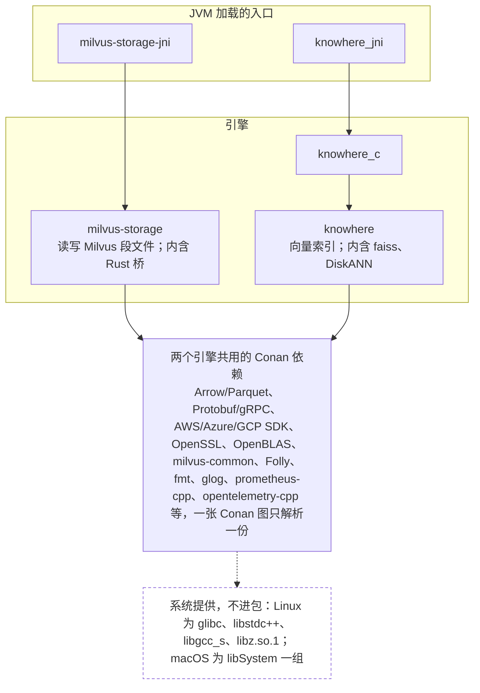

# 依赖库、编译前置条件与构建方案

本页是 [build.html](build.html) 的 Markdown 版，内容相同，供在 GitHub 上直接阅读；图用 Mermaid 画。两份文件要一起改。

Connector 在 executor 里加载两个原生引擎：读写 Milvus 段文件的 milvus-storage 和做向量搜索的 Knowhere。它们共用十几个 C++ 库，所以每个平台只能由一张 Conan 依赖图编成一个原生 JAR `milvus-native-<平台>.jar`；平台是 Linux 与 macOS 乘 x86_64 与 aarch64 四种，编译它有两种方案：Docker 里编，或本机编。构建阶段、打包与发布的执行细节见 [native-build/README.md](../../../native-build/README.md) 和 [contributing.md](../../contributing.md)。

> **2026-09-20 状态。** 当前 gitlink 为 milvus-storage `7eb13578`、Knowhere `29210a33`。四个平台中 linux-x86_64 与 darwin-aarch64 有源码构建 profile 和验收记录。linux-x86_64 完成三次统一构建，Knowhere C API 测试与两种顺序的 JVM 加载都通过，`make test` 为 1,160 项成功、0 项失败、149 项取消；这批结果早于第 5 节的平台适配改造，ELF 的取值原样搬进了 `Elf` 类，之后没有在 Linux 上重跑。darwin-aarch64 收集 221 个库和 203 个别名，两个 JNI 入口在两种加载顺序下都由全新 JVM 加载，Knowhere C API 测试通过，149 MB 平台 JAR 经 `verifyNativeBundle` 校验，带该包的根测试为 1,101 项成功、0 项失败、165 项因缺 UAT 环境取消。linux-aarch64 与 darwin-x86_64 的 profile 未写。尚未做：空 Conan 缓存的 Docker 重建，真实 UAT 实例上的查询复测。

## 1 依赖库有哪些，各自做什么

**每个平台的原生 JAR 分三层：两个 JNI 入口，两个引擎（milvus-storage 一个库，Knowhere 两个），其余是两个引擎共用的 Conan 依赖（linux-x86_64 上 157 个，合计 162 个动态库；darwin-aarch64 上 216 个，合计 221 个）。** 依赖由 `native-build/dependencies.json` 固定的 32 个直接 Conan 包和它们的传递依赖组成，完整清单以该文件和包内 `manifest.properties` 为准，本页不展开。库名在 Linux 是 `libfoo.so.1`，在 macOS 是 `libfoo.1.dylib`；JVM 侧不写后缀，入口库名由清单声明，其余由 `System.mapLibraryName` 推出。



箭头是动态库的依赖关系（Linux 的 DT_NEEDED，macOS 的 LC_LOAD_DYLIB）。

| 库 | 做什么 | 源码来自 |
|---|---|---|
| `milvus-storage` | Milvus 段文件格式（V2 packed、V3 loon）的读写：manifest、列组 Parquet、delete 文件、统计，以及对象存储文件系统。Rust 桥 prsbridge（Lance、Vortex 格式）静态编进它 | gitlink 子模块 `milvus-storage`，上游 main `7eb13578` |
| `milvus-storage-jni` | 上游 Java API `io.milvus.storage` 的 JNI 实现；Arrow C Data Interface 在这里跨越 C 与 JVM | 同上，`cpp/src/jni` |
| `knowhere` | 向量索引的构建、加载和搜索；faiss（HNSW、IVF、暴力搜索）和 DiskANN 以静态库编进它。DiskANN 的对齐读只有 libaio 与 io_uring 实现，macOS 构建关闭它 | gitlink 子模块 `knowhere`，PR #1829 分支 `29210a33` |
| `knowhere_c` | 稳定的 C ABI（SOVERSION 1，隐藏其余符号），JNI 只经它调用引擎 | 同上，`src/c_api` |
| `knowhere_jni` | PR #1829 Java API `io.knowhere` 的 JNI 实现；JNI 头由 `javac -h` 在构建时生成 | 同上，`java/src/main/cpp` |

**两个引擎共用 milvus-common、Folly、gRPC、OpenSSL 等十几个库，这是每个平台只能用一张 Conan 图的原因。** 操作系统的动态加载器按库名和符号解析依赖，Java 包名和 JAR 目录隔离不了它们。分别构建时出现过两种失败：先加载 storage，Knowhere 一侧复用了缺 `gotoblas` 符号的 milvus-common；先加载 Knowhere，storage 的 gRPC 初始化绑定到 Knowhere 静态嵌入的 gRPC 全局对象，进程退出。两个引擎的上游对 fmt、milvus-common、lz4 要求的版本不同，统一取较新者；不追随远程最新版本，不在仓库维护自有 recipe。系统 C 运行库由目标系统提供，不进包；Linux 上 `libz.so.1` 也不进包，因为 JVM 在 Connector 初始化前已加载系统 zlib，包内第二份不能覆盖已绑定的符号。

## 2 编译前置条件

四个平台共用的部分与根目录 `Dockerfile` 的 builder 阶段一致；编译器与二进制工具按操作系统不同。

| 依赖 | Linux（x86_64、aarch64） | macOS（x86_64、aarch64） |
|---|---|---|
| Conan | 2.25.1 | 2.25.1 |
| CMake | 3.27.5 | 3.31.10 |
| Ninja | 随发行版 | Homebrew |
| C/C++ 编译器 | GCC、G++ 12 | Apple Clang 21，另加 Homebrew `libomp` 提供 OpenMP |
| Fortran 编译器（OpenBLAS） | gfortran 12 | Homebrew gfortran |
| Rust、Cargo | rustup stable | rustup stable |
| libclang | 随发行版（Ubuntu `libclang-dev`） | Xcode Command Line Tools 自带 |
| JDK | 21 | 21 |
| Scala、sbt | 2.13.16、1.11.1 | 2.13.16、1.11.1 |
| Python | 3.9 以上 | 3.9 以上 |
| 二进制检视与改写工具 | binutils（`readelf`）、`patchelf` | `otool`、`install_name_tool`、`codesign`（Xcode 自带） |
| 异步 I/O 头文件 | `libaio-dev` | 不需要，DiskANN 关闭 |
| ccache、Git | 随发行版 | Homebrew |

CMake 的版本由平台 profile 的 `[platform_tool_requires]` 声明，`PATH` 上必须先出现这个版本：几个固定的上游 recipe 的 `cmake_minimum_required` 被 CMake 4 拒绝。没有包管理器会在当前版本旁边再装一个 3.x，所以把它装进一份单独的 Python 虚拟环境，构建时把该目录前置到 `PATH`。这份环境属于机器，不放在 `/tmp` 下——系统清空 `/tmp` 时会把工具链一起带走。

```bash
python3 -m venv ~/toolchain/cmake3venv
~/toolchain/cmake3venv/bin/pip install cmake==3.31.10 ninja
PATH=~/toolchain/cmake3venv/bin:$PATH make native-bundle
```

## 3 两种构建方案

**Docker 构建是参考实现，本机构建是它的复制品；两者跑同一份 `build.py`，产物相同。** 构建不做交叉编译，每个平台的 JAR 在同平台机器上编。

| 方案 | 命令 | 前置条件 | 产物与限制 | 用在哪 |
|---|---|---|---|---|
| Docker 构建 | `docker build --build-arg PUBLISH_MAVEN=false -t spark-milvus .` | Docker 与 BuildKit；网络能到 JFrog、GitHub、crates.io。工具链由 Dockerfile 安装，本机无需准备 | 统一包 + assembly。Conan、Cargo、ccache、Coursier、Ivy、sbt 缓存各在一个 `sharing=locked` 的 cache mount 里，失败的 RUN 不丢已完成的依赖。worker 是哪个架构就出哪个架构的包；只有 Linux | Jenkins 发布流水线；验证"空缓存能否完整构建" |
| 本机构建 | `make native-bundle NATIVE_JOBS=50`，然后 `make package` | 第 2 节本平台一列；PATH 上先出现上表的版本 | 同上，产物在 `target/native-build/<平台>/`；`--conan-lock` 复用审核过的 lock，`--no-remote` 只用缓存。输入变化要换新工作目录，缓存仍复用 | 改 storage、Knowhere、依赖版本或 CMake 规则的开发 |

`make package` 今天只在 linux-x86_64 上把统一包接进 assembly：Makefile 的平台选择写死了这个名字，显式传 `NATIVE_BUNDLE` 的分支还要求主机是 Linux。macOS 上先 `make native-bundle` 得到 JAR，再用 `sbt -Dmilvus.native.bundle=<jar>` 打包和跑测试；sbt 一侧按 `NativePlatform.current` 选平台，不限操作系统。

两种方案都有 lock 这个开关：第一次运行解析依赖并写 `provenance/conan.lock`，之后用 `--conan-lock` 传入，传递依赖的 revision 才不随远程变化。`build.py` 会把 `dependencies.json` 生成的 `[replace_requires]` 段写进 host 与 build 两份 profile：消费者的 `force=True` 只固定 host 图，不加这一段时 build 图里的 protoc、grpc 插件会把 zlib、openssl 解析到远程最新 revision，lock 套用后又改写成 `build_requires` 里不存在的 host revision，空缓存的 `conan install --lockfile` 失败（2026-09-20 首次本机全量构建暴露并修复）。

## 4 目录设计

**三处目录，平台名只出现在叶子上：仓库里的构建定义按引擎分文件、按平台分 profile；构建工作目录每平台一棵；JAR 内资源路径带平台段，解压器按运行平台选目录。** 平台名统一为 `<os>-<arch>`：`linux-x86_64`、`linux-aarch64`、`darwin-x86_64`、`darwin-aarch64`，Makefile、build.py、`NativeLibraries.platform()` 三处算法一致。

### 仓库内：`native-build/` 与两个脚本

```
native-build/
├── CMakeLists.txt              唯一原生工程入口：平台、工具链、依赖查找，include 下面两份引擎文件
├── cmake/
│   ├── Storage.cmake           milvus-storage、Rust 桥、milvus-storage-jni 三个目标及链接关系
│   ├── Knowhere.cmake          knowhere、knowhere_c、knowhere_jni 与 C API 测试程序
│   ├── knowhere/Sources.cmake  Knowhere、faiss、DiskANN 的源码清单与指令集分组
│   ├── Install.cmake           安装到 lib/，RPATH 设为相对自身目录
│   └── storage-private-symbols.map   隐藏 Rust 桥内部 LZ4/XXH/ZSTD/aws_lc 符号的链接脚本（ELF）
├── profiles/
│   └── <平台>                  Conan profile，每平台一份；今天有 linux-x86_64 与 darwin-aarch64
├── dependencies.json           32 个直接依赖的 recipe revision、版本冲突策略、排除项
├── conanfile.py                消费者：把 references 以 force=True 放进一张 host 图
├── build.py                    驱动 11 个阶段，平台取自 platforms.host_platform()
├── platforms.py                平台适配层，见第 5 节
├── dependency_versions.py      两份上游 conanfile 与 dependencies.json 的对照
├── stage.py                    收集依赖闭包、别名、查找路径改写、系统库排除，都经适配层
├── jvm_load.py + NativeLoadCheck.java   双向 JVM 加载检查，staging、打包、sbt 共用一份
└── tests/                      Python 单元测试与 DiskANN 验收 fixture
scripts/build-native.sh         入口，exec build.py
scripts/package-native.py       核对 provenance 后打 JAR
```

CMake 文件按引擎分而不按平台分，平台差异用 `CMAKE_SYSTEM_NAME` 条件表达在同一目标内，避免同一个目标有两份定义。`CMakeLists.txt` 开头接受 Linux x86_64、Linux aarch64 和 macOS arm64，其余组合直接报错；Conan profile 和适配实现缺哪一份，由 `build.py` 在到达 CMake 之前报出。

### 构建工作目录：`NATIVE_WORK_DIR`，默认 `target/native-build/<平台>/`

```
target/native-build/<平台>/
├── status.json                 当前阶段与失败详情；.build.lock 防止两个构建写同一目录
├── sources/                    引擎源码快照（storage 复制工作树，Knowhere 隔离 checkout）
├── dependency-input/           conanfile.py 与 dependencies.json 的副本
├── host-profile, build-profile 加了 [replace_requires] 段的两份 profile
├── dependencies/               Conan 生成的 toolchain 与 CMake 依赖文件
├── provenance/                 conan.lock、依赖 graph、工具版本、源码清单、compile_commands、CMake trace
├── cmake-build/                一棵 Ninja 树：Rust 桥、两个引擎、JNI、测试程序
├── install/lib/                引擎与 JNI 的安装副本，staging 的起点
├── bundle-candidates/<时间戳-哈希>/   每次 staging 的候选目录，失败的带诊断留在这里
├── bundle/                     通过 C API 测试与双向 JVM 加载的当前包：lib/、provenance.json、provenance/、licenses/、audit/
├── bundle-history/             被新候选替换下来的旧成功包
├── milvus-native-<平台>.jar   最终产物
└── milvus-native-<平台>.jar.properties   JAR 的 SHA-256，sbt 校验的输入
```

输入（源码、依赖、profile）变了就换新工作目录，Conan 缓存在 `CONAN_HOME` 里不随目录走。每个平台一棵目录，同一台机器不会出现两个平台的产物混在一起。

### JAR 内部与解压目录

```
milvus-native-<平台>.jar
├── native/milvus/1/<平台>/
│   ├── manifest.properties     平台、两个源码 revision、库列表、别名表、每库 SHA-256、入口库名、功能开关
│   └── lib*                    全部动态库；别名不进 JAR，解压时按清单建硬链接
└── META-INF/milvus-native/
    ├── provenance.json         规范化的源码与 package 标识、各类摘要，无构建机绝对路径
    ├── provenance/             源码清单、直接 reference、lock 与 graph 的摘要等证据
    └── licenses/               收集的上游许可证

sbt 校验时的解压目录     target/native-bundle/<jar 哈希>/lib/
运行时的解压目录         每个 JVM 一个进程私有目录，由 native-runtime 的 NativeLibraries 创建
```

资源路径是 `native/<引擎组>/<格式版本>/<平台>/`，`milvus` 表示两个引擎合成一组，`1` 是 `manifest.properties` 的 `format.version`。平台段在路径里，几个平台的 JAR 可以合进同一个 assembly 而不冲突，运行时 `NativeLibraries.platform()` 按当前操作系统和架构选目录；今天 sbt 只接受与构建机同平台的那一个包。旧的仅 storage 路径用 `native/<平台>/`，与统一包路径不重叠，两者不会在一个 assembly 里混用。

## 5 平台适配层

**加一个平台等于加一个 Conan profile、一份 `platforms.py` 适配实现和一份验收记录，其余构建代码不动。** 不动的是源码固定、Conan 依赖锁定、provenance 记录、第 4 节的资源布局、解压与摘要校验，以及结构性校验（条目唯一、路径不越界、清单与 provenance 交叉核对）：它们只处理文件名、摘要和文本，不解释可执行格式。`NativeLibraries.platform()` 本来就返回 `darwin-aarch64`，上游 `io.milvus.storage.NativeLibraryLoader` 三个操作系统族都解析。

解释可执行格式的部分集中在 `native-build/platforms.py` 的一个类里，`Elf` 与 `MachO` 各一份：

| 职责 | Linux（ELF） | macOS（Mach-O） |
|---|---|---|
| 二进制检视：自身名字与依赖列表 | `readelf -dW` 读 SONAME 与 NEEDED | `otool -D` 读 install name，`otool -L` 读依赖；路径落在 `/System/`、`/usr/lib/` 下的按系统提供处理 |
| 运行时查找路径改写 | `patchelf --set-rpath $ORIGIN` | `install_name_tool -add_rpath @loader_path` 与 `-change`，改写后重新 `codesign` |
| 库文件名与版本位置 | `libfoo.so.1`，版本在后缀之后 | `libfoo.1.dylib`，版本在后缀之前；`library_name`、`library_stem`、`library_glob` 三个方法给出匹配规则 |
| 系统库集合，不进包 | 一条正则匹配 glibc 一组、`ld-linux-*`、libstdc++、libgcc_s，加 `libz.so.1` | 一条正则匹配 libSystem.B、libc++、libc++abi、libobjc.A、libresolv.9，加 `libz.1.dylib` |
| JVM 信号链接管 | `$JAVA_HOME/lib/libjsig.so`，由 `LD_PRELOAD` 注入 | `$JAVA_HOME/lib/libjsig.dylib`，由 `DYLD_INSERT_LIBRARIES` 注入 |
| 工具链 | GCC、G++、gfortran 12 | Apple Clang、gfortran，OpenMP 由 Homebrew `libomp` 提供 |

darwin-aarch64 第一次端到端构建后，适配层按同样的形式又接了四项：加载器的回退环境变量和它命名的原点（Linux 是 `LD_LIBRARY_PATH` 与 `$ORIGIN`，macOS 是 `DYLD_FALLBACK_LIBRARY_PATH` 与 `@loader_path`）、Conan 的 `os` 取值、编译器运行库在本机的位置和来源、一次 JNI 加载的等待上限。等待上限是平台的量：221 个库第一次被映射时，macOS 的 Gatekeeper 逐个验证签名，实测 197 秒，同一批文件之后每次加载都在 120 秒以内，所以 Mach-O 取 600 秒、ELF 仍取 120 秒。共用 120 秒时，首次加载在第一种顺序上超时，超时不留标记，下一次重新解压再超时一次。

**三条检查是 ELF 专属的，声明为平台专属，不翻译成 Mach-O 的等价物。** 记录系统 zlib 的最低符号版本要求依赖 ELF 的符号版本化（`readelf -VW` 读出的 `ZLIB_*` 版本名），Mach-O 没有这个机制；GNU_STACK 段和 IFUNC 重定位只在 ELF 上有定义；`ldd -r` 报告未解析符号，macOS 的 `otool -L` 与 `dyld_info` 只给依赖图。`stage.py` 用 `isinstance(FORMAT, platforms.Elf)` 在三处跳过它们。所有平台共同的判据是两个全新 JVM 的双向 `System.load`，加上入口库与 OpenSSL provider 模块的 ctypes 加载；格式检查在 Linux 上也只作诊断，不阻断打包。

排除系统 zlib 不属于这三条。JVM 在 JNI 初始化前已经加载系统 zlib，包内再放一份就无法确定进程用的是哪一份符号（第 1 节）；这条理由与可执行格式无关，规则在所有平台成立，适配层提供的只是这个文件在本平台叫什么。

平台之间的功能差异写在 `manifest.properties` 的功能开关里，`capabilities.md` 保持单一表述。DiskANN 是现成的例子：macOS 关掉它之后，R4、V1、V5 都不依赖它，V5 的精确搜索走 `Knowhere.bruteForce`，所以今天没有能力缺口。`dependencies.json` 的 `platform_scope` 记录 openblas、liburing、libunwind 三个只在 Linux 存在的引用，两个引擎自己的 conanfile 也是这么写的；macOS 上 faiss 的 BLAS 由 Accelerate 提供。`static_on` 记录 opentelemetry-cpp 在 macOS 上只能静态构建，同样来自 storage 的 conanfile。
